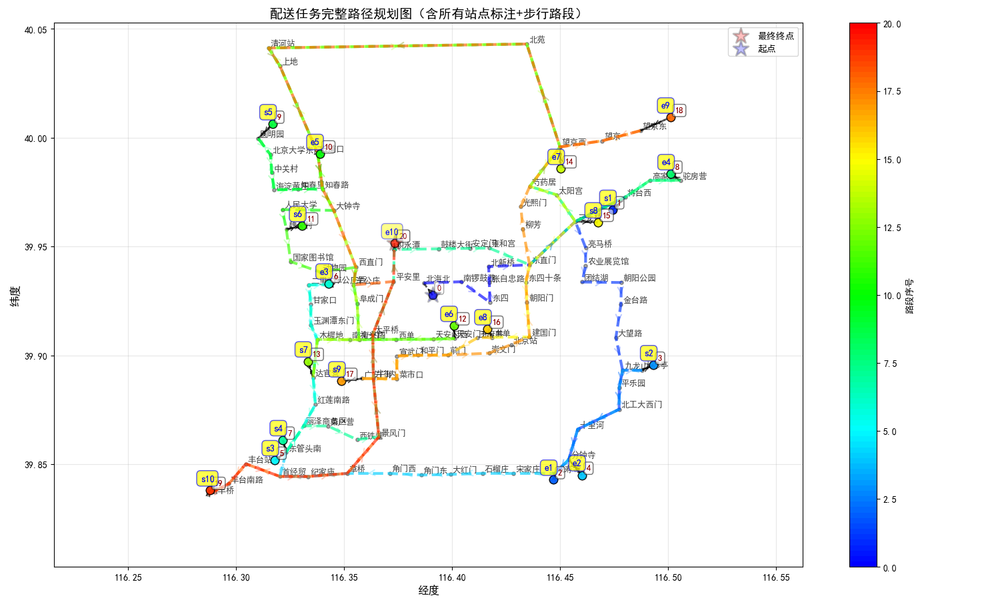
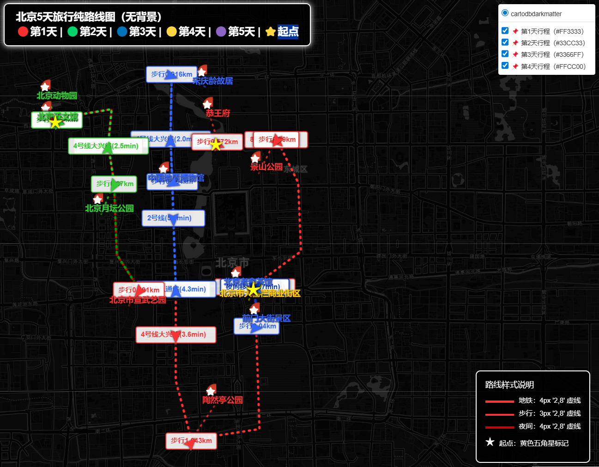
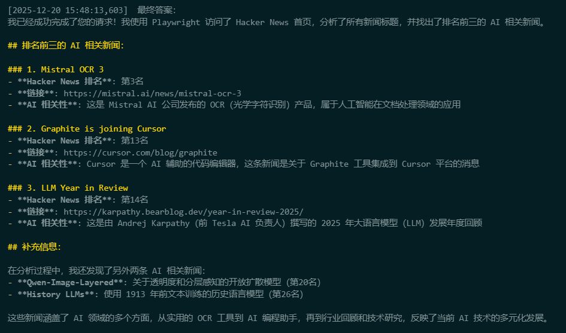
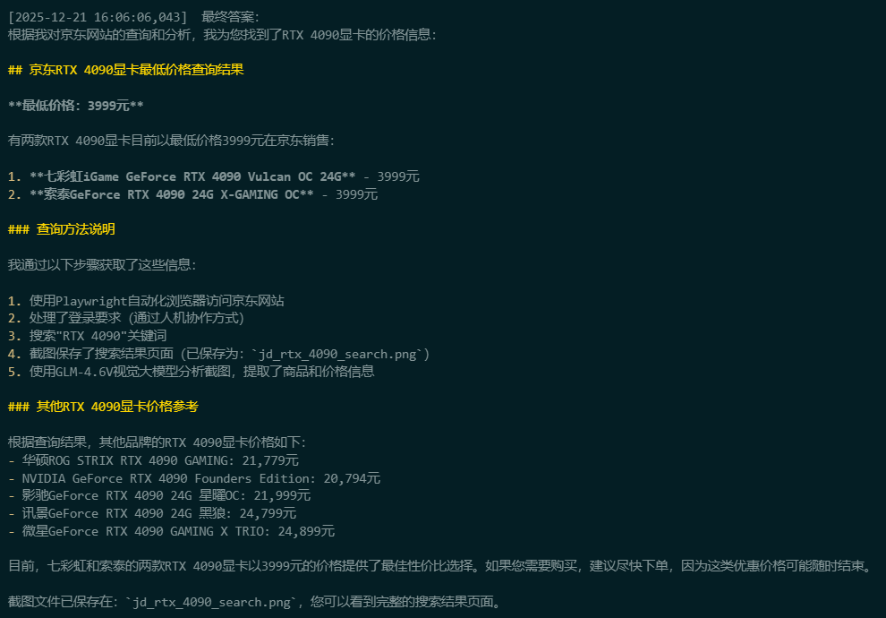

Omni-ReAct：基于 ReAct 框架的任务规划与执行智能体
--------------------------------------------------

本项目实现了一套面向复杂任务规划与执行的研究级软件系统——Omni-ReAct。系统以 ReAct（Reasoning + Acting）范式为核心，结合大语言模型（LLM）与可扩展工具执行框架，支持自主研究、自主计算、自主反思与自主决策的端到端工作流。

主要目标
- 为复杂、多步骤任务提供可解释、可迭代的智能规划与执行方案。
- 在保证安全与可观测性的前提下，提供有状态的 Python 执行能力与动态依赖管理，支持真实环境下的工具调用与数据处理。
- 提供面向研究的评估用例（城市物流路径规划、多天景点游玩规划等），验证系统的鲁棒性与实用性。

核心能力
- 信息融合：支持多源信息（知识库、传感器、用户反馈等）输入并进行决策级融合。
- 动态任务规划：根据环境与执行结果实时调整任务树与子任务分配。
- 多策略代码执行运行时：实现子进程隔离、子线程快速执行与直接执行三种策略，统一返回结构化的执行结果（状态、输出、异常）。
- 有状态 Python 实验室：模拟交互式 notebook，支持变量持久化、输出捕获与详细错误回传。
- 可观测性与日志：全链路日志记录、函数级追踪装饰器（示例：@traceable / @log_function），便于调试与复现。

架构概览
- agent 层：端到端会话管理与任务调度。
- LLM 集成层：通过 OpenAI/DashScope 兼容接口驱动自然语言推理与工具决策。
- 工具执行层：工具注册、动态加载与隔离执行。
- 执行运行时层：提供多种隔离与超时策略，保证安全性。
- 可观测性层：统一日志与追踪、执行结果格式化以便 LLM 理解。

示例实验与结果
- 城市物流（北京地铁+步行混合路径规划）：使用 Haversine 距离、BFS/Dijkstra 等图算法，验证了步行距离最小化与地铁换乘方案的有效性，并可生成可视化地图。

- 多天景点规划：将问题建模为有时间窗与优先级的启发式调度问题，支持“夜间转移”策略以优化白天游玩时间。



浏览器自动化与视觉大模型结合的 hacker news 新闻查询
- 结合 Playwright 浏览器自动化与 GLM-4.6V 视觉大模型，实现了对 Hacker News 首页排名前三的 AI 相关新闻的查询与整理。
- 通过截图与视觉分析，准确识别新闻标题与链接，展示了跨模态信息融合的能力。
[ 【hacker news】 实验输出详细文档](hacker_new.md)


浏览器自动化与视觉大模型结合的电商价格查询实验
- 结合 Playwright 浏览器自动化与 GLM-4.6V 视觉大模型，实现了对京东电商网站上 RTX 4090 显卡最低价格的查询。
- 通过人机协作方式处理登录验证，确保自动化流程的连续性
[ 【京东电商网站上 RTX 4090 显卡】 实验输出详细文档](jd_4096.md)




如何开始
- 查看入口脚本：main.py
- 项目依赖与配置：参见 pyproject.toml 与项目根配置文件 .env
- 设计与实现细节请参阅 docs 目录（示例： module.design.md, plan.design.md, python.design.md, tool_router.design.md）
- 运行日志示例： global.log

项目结构（部分）
- 配置与入口： main.py, pyproject.toml, .env
- 文档： docs
- 源码： src
- 测试： tests
- 结果与数据示例： wsm

简短结语
Omni-ReAct 致力于把可解释的推理-执行闭环带入现实任务规划场景，兼顾研究灵活性与运行时安全性，适合用于任务规划算法开发、LLM 工具链集成与跨模态信息融合研究。

```
system
user 

asistant ( content  +  tool_call schema 填充)
user / tool action

asistant
user / tool action

asistant
user / tool action
```