# Page: Overview

# Overview

<details>
<summary>Relevant source files</summary>

The following files were used as context for generating this wiki page:

- [.vscode/settings.json](.vscode/settings.json)
- [docs/sql.md](docs/sql.md)
- [pyproject.toml](pyproject.toml)
- [src/agent/deep_research.py](src/agent/deep_research.py)
- [src/agent/llm.py](src/agent/llm.py)
- [src/utils/log_decorator.py](src/utils/log_decorator.py)
- [uv.lock](uv.lock)

</details>


## Purpose and Scope

This document provides a high-level introduction to the **algo_agent** system, an AI agent framework that combines Large Language Model (LLM) reasoning with safe Python code execution capabilities. The system enables users to submit natural language queries that are automatically translated into executable Python code, run in isolated environments, and iteratively refined based on execution results.

**For detailed information on specific subsystems:**
- Agent query processing and decision loops: see [Query Processing Loop](#3.1)
- LLM integration details: see [LLM Integration](#3.2)
- Code execution strategies: see [Execution Runtime](#5)
- Tool system architecture: see [Tool System](#4)
- Logging and debugging: see [Observability and Logging](#6)

**Sources:** [src/agent/deep_research.py:1-129](), [pyproject.toml:1-21]()

---

## System Architecture Overview

The algo_agent system is organized into five primary layers that work together to process user queries and execute code:

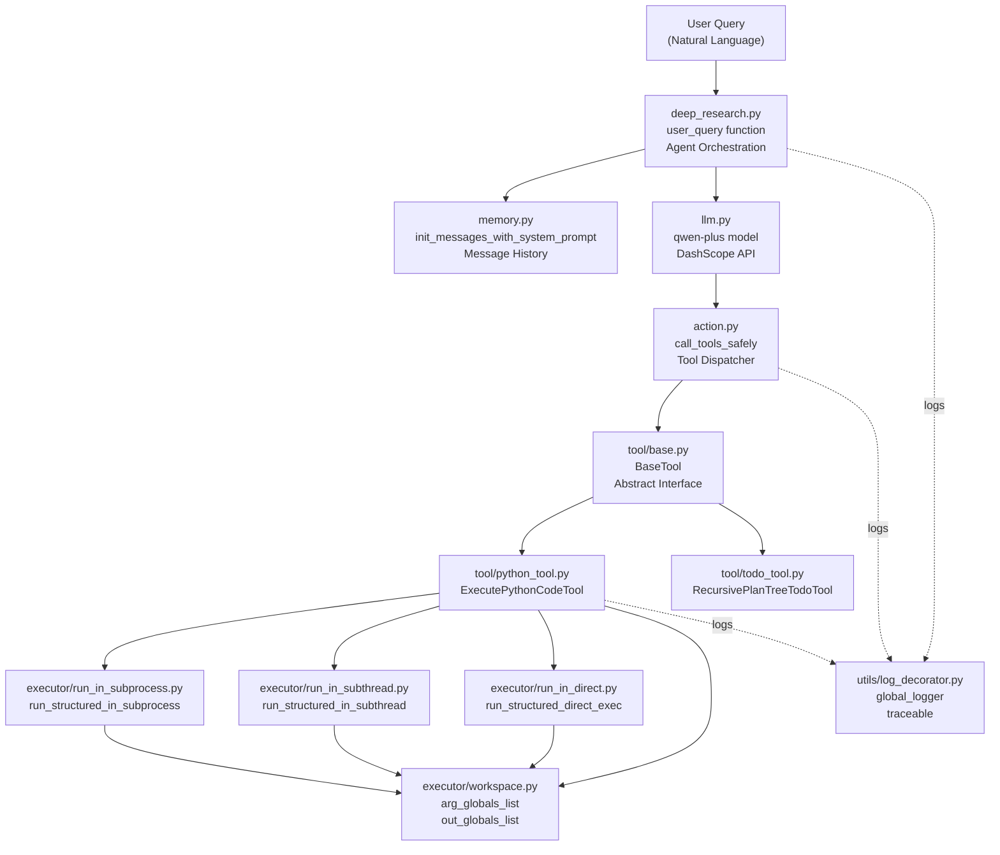

**Core Design Principles:**

| Principle | Implementation |
|-----------|---------------|
| **Isolation** | Python code runs in subprocess/subthread environments with timeout enforcement |
| **Safety** | Workspace globals are filtered and serialized; crash detection prevents system failures |
| **Observability** | Comprehensive logging via `@traceable` and `@log_function` decorators |
| **Extensibility** | Tool system uses `BaseTool` interface for easy addition of new capabilities |
| **Iterative Refinement** | Agent loops until LLM produces a final answer without tool calls |

**Sources:** [src/agent/deep_research.py:1-74](), [src/agent/llm.py:1-51](), [src/utils/log_decorator.py:19-64]()

---

## Key Components

### Agent Orchestration Layer

The **agent orchestration layer** manages the end-to-end query processing workflow through the `user_query` function in [src/agent/deep_research.py:15-73]().

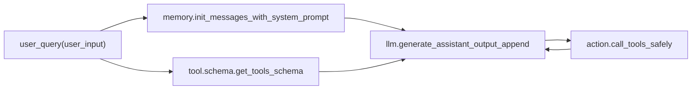

**Key functions:**
- `user_query(user_input)` - Entry point for all queries [src/agent/deep_research.py:15]()
- `init_messages_with_system_prompt(user_input)` - Initializes conversation with system prompt
- `generate_assistant_output_append(messages, tools_schema_list)` - Queries LLM and appends response [src/agent/llm.py:34-41]()
- `call_tools_safely(tool_info)` - Dispatches tool execution with error handling

**Sources:** [src/agent/deep_research.py:15-73](), [src/agent/llm.py:27-50]()

---

### LLM Integration

The system integrates with **Alibaba's qwen-plus model** via the DashScope API using OpenAI-compatible client.

| Configuration | Value |
|--------------|-------|
| **Model** | `qwen-plus` |
| **API Base URL** | `https://dashscope.aliyuncs.com/compatible-mode/v1` |
| **Client Library** | `openai>=2.7.2` |
| **Tool Calling** | Parallel tool calls enabled |

**Core functions:**
- `_generate_chat_completion(messages, tools_schema_list)` - Creates OpenAI client and calls API [src/agent/llm.py:14-24]()
- `has_tool_call(assistant_output)` - Checks if response contains tool calls [src/agent/llm.py:44-45]()
- `has_function_call(assistant_output)` - Checks for legacy function call format [src/agent/llm.py:48-49]()

**Message format:** Follows OpenAI chat completion format with roles: `system`, `user`, `assistant`, `tool`, `function`.

**Sources:** [src/agent/llm.py:1-51](), [pyproject.toml:14]()

---

### Tool Execution System

The **tool system** provides extensible capabilities through two concrete implementations:

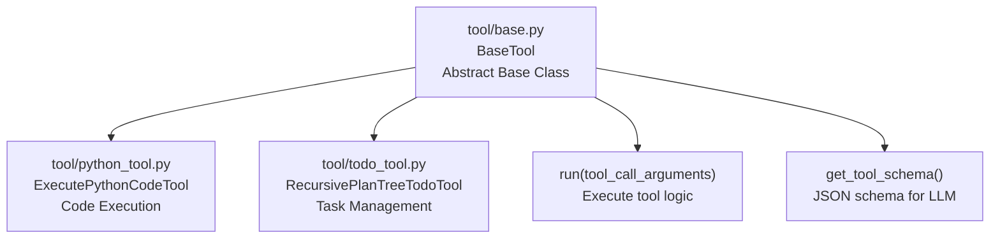

**BaseTool interface requirements:**
- `tool_name` - String identifier
- `tool_description` - Natural language description for LLM
- `get_parameter_schema()` - JSON schema of input parameters
- `get_tool_schema()` - Complete tool schema in OpenAI format
- `run(tool_call_arguments)` - Execution logic returning string result

**Available tools (configured in [src/agent/deep_research.py:20-23]()):**
- `ExecutePythonCodeTool` - Executes Python code snippets with state persistence
- `RecursivePlanTreeTodoTool` - Manages hierarchical task structures (currently commented out)

**Sources:** [src/agent/deep_research.py:20-23]()

---

### Python Execution Runtime

The **execution runtime** provides three strategies for running Python code with varying isolation levels:

| Strategy | Module | Isolation Level | Timeout Support | Use Case |
|----------|--------|-----------------|-----------------|----------|
| **Subprocess** | `executor/run_in_subprocess.py` | Full process isolation | ✓ | Production code execution |
| **Subthread** | `executor/run_in_subthread.py` | Thread-based isolation | ✓ | Faster execution, shared memory |
| **Direct** | `executor/run_in_direct.py` | In-process | ✓ | Testing, minimal overhead |

**Common execution flow:**

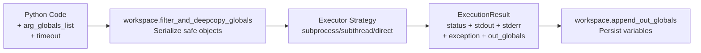

**ExecutionResult schema:**
- `status` - Enum: `SUCCESS`, `FAILURE`, `TIMEOUT`, `CRASHED`
- `stdout` - Captured standard output
- `stderr` - Captured standard error
- `exception_type`, `exception_value`, `traceback` - Error details
- `out_globals` - Dictionary of output variables

**Sources:** [src/agent/deep_research.py:1-129]()

---

### Observability Layer

The **logging system** provides comprehensive tracing through decorators and multiple log files:

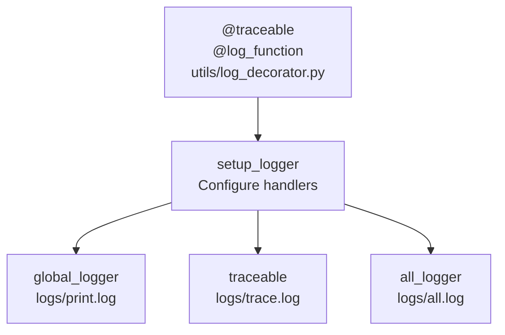

**Logger instances:**
- `global_logger` - User-facing operations and query processing [src/utils/log_decorator.py:305-306]()
- `traceable` - Function call tracing with timing [src/utils/log_decorator.py:297-302]()
- `all_logger` - Comprehensive system logs [src/utils/log_decorator.py:293-294]()

**Logging features:**
- Automatic parameter/return value capture
- Execution timing (milliseconds)
- Stack trace recording with project-only filtering [src/utils/log_decorator.py:208-217]()
- Exception handling with traceback [src/utils/log_decorator.py:233-247]()
- Rotating file handlers (10MB max, 5 backups) [src/utils/log_decorator.py:53-61]()

**Sources:** [src/utils/log_decorator.py:19-307]()

---

## Execution Flow: Query to Response

The following sequence diagram shows how a user query flows through the system:

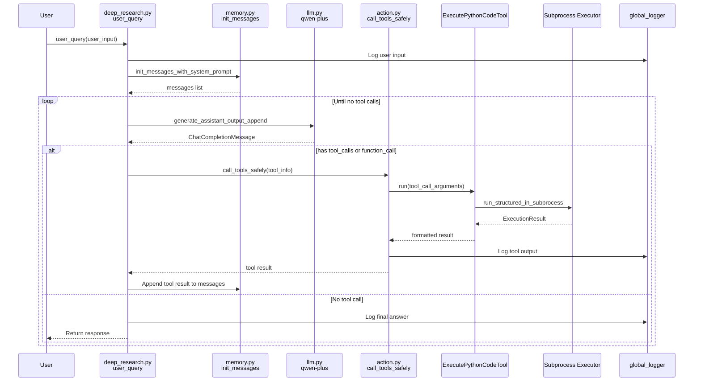

**Key decision points:**
1. **Line 27**: Check `has_tool_call()` or `has_function_call()` [src/agent/deep_research.py:27]()
2. **Line 32**: Loop continues while tools are called [src/agent/deep_research.py:32]()
3. **Line 33-46**: Handle legacy `function_call` format [src/agent/deep_research.py:33-46]()
4. **Line 47-64**: Handle modern `tool_calls` array [src/agent/deep_research.py:47-64]()
5. **Line 73**: Final answer logged and returned [src/agent/deep_research.py:73]()

**Sources:** [src/agent/deep_research.py:15-73](), [src/agent/llm.py:34-50]()

---

## Technology Stack

The system is built on the following dependencies:

| Category | Package | Version | Purpose |
|----------|---------|---------|---------|
| **LLM Client** | `openai` | ≥2.7.2 | DashScope API communication |
| **Data Processing** | `pandas` | ≥2.3.3 | DataFrame operations |
| **Data Processing** | `numpy` | ≥2.3.4 | Numerical computing |
| **Visualization** | `matplotlib` | ≥3.10.7 | Plotting and charts |
| **Graph Processing** | `networkx` | ≥3.5 | Network/graph algorithms |
| **ML/Analysis** | `scikit-learn` | ≥1.7.2 | Machine learning utilities |
| **Utilities** | `deepdiff` | ≥8.6.1 | Deep comparison of data structures |
| **Utilities** | `decorator` | ≥5.2.1 | Decorator utilities |
| **Utilities** | `inflection` | ≥0.5.1 | String transformations |
| **Web Interface** | `streamlit` | ≥1.51.0 | Interactive web UI (optional) |
| **HTTP** | `requests` | ≥2.32.5 | HTTP client |
| **Visualization** | `wordcloud` | ≥1.9.4 | Word cloud generation |

**Python version requirement:** ≥3.12

**Configuration files:**
- [pyproject.toml:1-21]() - Project metadata and dependencies
- [uv.lock:1-302]() - Locked dependency versions
- [.vscode/settings.json:1-34]() - IDE configuration

**Sources:** [pyproject.toml:1-21](), [uv.lock:1-302]()

---

## System Characteristics

The algo_agent system is characterized by:

**Strengths:**
- **Safety-first design**: Multiple isolation levels prevent code crashes from affecting the system
- **Comprehensive observability**: Every function call, execution, and error is logged
- **Extensible architecture**: New tools can be added by implementing `BaseTool` interface
- **State persistence**: Global variables maintained across executions via workspace management
- **Flexible execution**: Three strategies (subprocess/subthread/direct) for different use cases

**Typical use cases (from logs):**
- Emergency response planning with data schema validation [src/agent/deep_research.py:77-128]()
- Geographic data processing and visualization
- Multi-day travel route optimization with metro/walking constraints
- Pydantic data modeling and validation
- Algorithm development and testing

**For more detailed information:**
- Installation and setup: see [Getting Started](#2)
- Adding new tools: see [Creating New Tools](#8.2)
- Debugging execution issues: see [Troubleshooting](#10)

**Sources:** [src/agent/deep_research.py:76-129](), [pyproject.toml:1-21]()

---

# Page: Getting Started

# Getting Started

<details>
<summary>Relevant source files</summary>

The following files were used as context for generating this wiki page:

- [.vscode/settings.json](.vscode/settings.json)
- [docs/sql.md](docs/sql.md)
- [pyproject.toml](pyproject.toml)
- [src/agent/deep_research.py](src/agent/deep_research.py)
- [src/utils/log_decorator.py](src/utils/log_decorator.py)
- [uv.lock](uv.lock)

</details>


This page provides step-by-step instructions for installing, configuring, and running your first query with the algo_agent system. It covers dependency installation, API configuration, and executing a basic code generation task. For detailed information about the agent's decision loop and tool execution mechanics, see [Agent Orchestration](#3). For information about the execution strategies and isolation modes, see [Execution Runtime](#5).

---

## Prerequisites

The algo_agent system requires:

- **Python 3.12 or higher** - The project specifies `requires-python = ">=3.12"` in its configuration
- **Git** - For cloning the repository
- **uv** (recommended) or pip - For dependency management
- **DashScope API access** - The system uses Alibaba's qwen-plus LLM model

Sources: [pyproject.toml:6]()

---

## Installation

### Step 1: Clone the Repository

```bash
git clone https://github.com/1850298154/algo_agent
cd algo_agent
```

### Step 2: Install Dependencies

The project uses `uv` for dependency management. Install all required packages:

```bash
# Using uv (recommended)
uv sync

# Or using pip
pip install -e .
```

This installs the following core dependencies:

| Package | Version | Purpose |
|---------|---------|---------|
| `openai` | ≥2.7.2 | LLM client interface |
| `matplotlib` | ≥3.10.7 | Data visualization |
| `pandas` | ≥2.3.3 | Data manipulation |
| `numpy` | ≥2.3.4 | Numerical computing |
| `networkx` | ≥3.5 | Graph algorithms |
| `streamlit` | ≥1.51.0 | Web interface |
| `deepdiff` | ≥8.6.1 | Deep object comparison |
| `scikit-learn` | ≥1.7.2 | Machine learning utilities |

Sources: [pyproject.toml:7-20](), [uv.lock:1-43]()

### Step 3: Verify Installation

Verify the installation by checking the Python environment:

```bash
python -c "import openai, matplotlib, pandas; print('Dependencies OK')"
```

---

## Configuration

### API Key Setup

The system uses Alibaba's DashScope API for LLM access. You need to configure your API key:

**Option 1: Environment Variable**
```bash
export DASHSCOPE_API_KEY="your-api-key-here"
```

**Option 2: Configuration File**
Create a configuration file in your project with the API credentials. The LLM client will read from the environment.

### Working Directory Configuration

The system creates a `logs/` directory for storing execution logs. This is automatically created by the logging system:

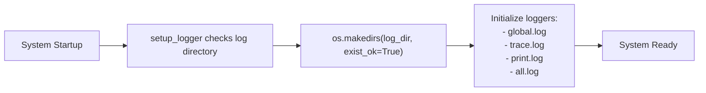

**Diagram: Log Directory Initialization**

The logging system automatically creates necessary directories on first run.

Sources: [src/utils/log_decorator.py:19-28](), [src/utils/log_decorator.py:288-306]()

### VS Code Configuration (Optional)

If using VS Code, the repository includes workspace settings that set `PYTHONPATH`:

```json
{
    "terminal.integrated.env.windows": {
        "PYTHONPATH": "${workspaceFolder};${env:PYTHONPATH}"
    },
    "terminal.integrated.env.linux": {
        "PYTHONPATH": "${workspaceFolder}:${env:PYTHONPATH}"
    }
}
```

This ensures the `src/` module can be imported correctly.

Sources: [.vscode/settings.json:2-7]()

---

## Running Your First Query

### Basic Query Example

The primary entry point is the `user_query()` function in the deep research agent module:

```python
from src.agent.deep_research import user_query

# Simple data analysis query
query = """
Generate a list of prime numbers up to 100 using Python,
then create a histogram showing their distribution.
"""

user_query(query)
```

### Query Execution Flow

When you call `user_query()`, the following sequence occurs:

```mermaid
sequenceDiagram
    participant User
    participant user_query["user_query()<br/>(deep_research.py:15)"]
    participant memory["init_messages_with_system_prompt()<br/>(memory module)"]
    participant llm["generate_assistant_output_append()<br/>(llm module)"]
    participant tools["get_tools_schema()<br/>(tool.schema)"]
    participant action["call_tools_safely()<br/>(action module)"]
    participant ExecutePythonCodeTool["ExecutePythonCodeTool.run()"]
    participant global_logger["global_logger<br/>(logs/print.log)"]

    User->>user_query: "query string"
    user_query->>global_logger: Log user input
    user_query->>memory: Initialize message history
    memory-->>user_query: messages list
    
    user_query->>tools: Get tool schemas
    tools-->>user_query: [ExecutePythonCodeTool schema]
    
    user_query->>llm: Call qwen-plus with messages + tools
    llm-->>user_query: assistant_output with tool_calls
    
    user_query->>action: call_tools_safely(tool_info)
    action->>ExecutePythonCodeTool: Execute Python code
    ExecutePythonCodeTool-->>action: ExecutionResult
    action-->>user_query: tool output
    
    user_query->>global_logger: Log tool output
    user_query->>llm: Call LLM with tool results
    llm-->>user_query: Final answer
    user_query->>global_logger: Log final answer
    user_query-->>User: Complete
```

**Diagram: First Query Execution Sequence**

This shows how a user query flows through the agent, LLM, and tool execution system.

Sources: [src/agent/deep_research.py:15-73]()

### Understanding the Output

The system produces multiple types of output:

#### 1. Console Output

The agent logs its progress to the console via `global_logger`:

```
[2025-01-15 10:30:15]  用户输入： Generate prime numbers...
[2025-01-15 10:30:16]  工具 tool call 输出信息： Execution completed successfully
[2025-01-15 10:30:17]  最终答案： Here are the prime numbers...
```

Sources: [src/agent/deep_research.py:17](), [src/agent/deep_research.py:62](), [src/agent/deep_research.py:73]()

#### 2. Log Files

The system writes detailed logs to multiple files in the `logs/` directory:

| Log File | Content | Logger Name |
|----------|---------|-------------|
| `print.log` | User-facing messages and results | `root.all.print` |
| `trace.log` | Detailed function traces with timing | `root.all.trace` |
| `global.log` | System-level operation logs | `root.all` |
| `all.log` | Comprehensive combined logs | `root.all` |

Sources: [src/utils/log_decorator.py:292-306]()

#### 3. Execution Artifacts

If the query involves code execution with file output (plots, data files), these are saved to the working directory. The system outputs absolute paths:

```
图片的绝对路径：/path/to/workspace/prime_histogram_1.png
```

Sources: [src/agent/deep_research.py:108]()

---

## Directory Structure After Setup

After installation and first run, your directory structure will look like:

```
algo_agent/
├── src/
│   ├── agent/
│   │   └── deep_research.py      # Main entry point
│   ├── llm/                       # LLM integration
│   ├── action/                    # Tool dispatcher
│   ├── memory/                    # Context management
│   ├── tool/                      # Tool implementations
│   └── utils/                     # Logging and utilities
├── logs/                          # Auto-created log directory
│   ├── print.log
│   ├── trace.log
│   ├── global.log
│   └── all.log
├── pyproject.toml                 # Project dependencies
└── uv.lock                        # Locked dependencies
```

---

## Tool Configuration

By default, the system loads the following tools:

```python
tools_schema_list = tool.schema.get_tools_schema([
    tool.python_tool.ExecutePythonCodeTool,
    # tool.todo_tool.RecursivePlanTreeTodoTool,  # Commented out
])
```

The `ExecutePythonCodeTool` is enabled by default, allowing the agent to write and execute Python code. The task planning tool (`RecursivePlanTreeTodoTool`) is commented out in the example but can be enabled for hierarchical task management.

Sources: [src/agent/deep_research.py:20-23]()

---

## Execution Mode Selection

The Python code execution tool supports three isolation strategies. The system automatically selects the appropriate mode based on the execution requirements:

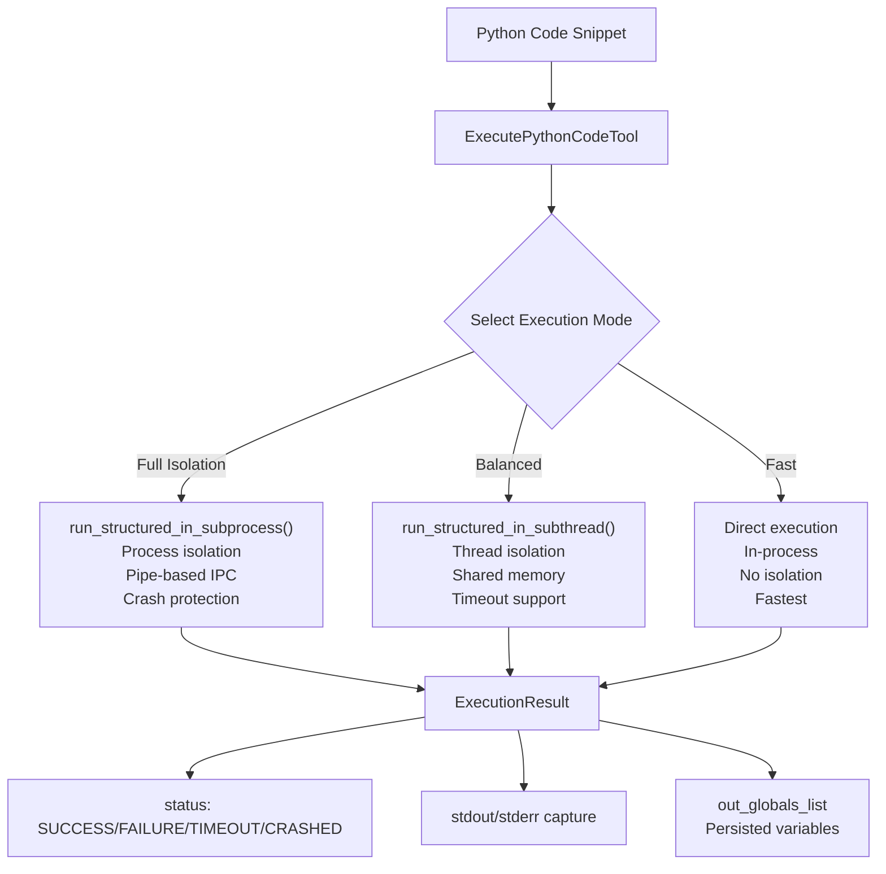

**Diagram: Execution Mode Selection**

The tool selects execution modes based on isolation requirements and performance needs.

Sources: Inferred from architecture diagrams in the provided context

---

## Testing Your Setup

### Test 1: Basic Code Execution

```python
from src.agent.deep_research import user_query

user_query("Write Python code to print 'Hello, algo_agent!'")
```

Expected output:
```
用户输入： Write Python code to print 'Hello, algo_agent!'
工具 tool call 输出信息： Execution completed successfully
最终答案： The code has been executed successfully...
```

### Test 2: Data Processing

```python
from src.agent.deep_research import user_query

user_query("""
Create a pandas DataFrame with 10 random numbers,
calculate their mean and standard deviation,
and display the results.
""")
```

This tests:
- Python code generation
- Library imports (pandas, numpy)
- Statistical computation
- Result formatting

---

## Common Setup Issues

### Issue 1: Import Errors

**Problem**: `ModuleNotFoundError: No module named 'src'`

**Solution**: Ensure `PYTHONPATH` includes the project root:
```bash
export PYTHONPATH="${PWD}:${PYTHONPATH}"
```

Or install the package in development mode:
```bash
pip install -e .
```

### Issue 2: API Key Not Found

**Problem**: LLM calls fail with authentication errors

**Solution**: Verify the `DASHSCOPE_API_KEY` environment variable is set:
```bash
echo $DASHSCOPE_API_KEY
```

### Issue 3: Log Directory Permissions

**Problem**: `PermissionError` when creating log files

**Solution**: The logging system automatically creates the directory with `exist_ok=True`, but ensure write permissions:
```bash
chmod -R u+w logs/
```

Sources: [src/utils/log_decorator.py:19-28]()

---

## Next Steps

After successfully running your first query, you can:

1. **Understand Agent Behavior** - Read [Agent Orchestration](#3) to learn how the agent processes queries and makes tool decisions
2. **Explore Tool System** - See [Tool System](#4) for details on creating custom tools
3. **Review Execution Modes** - Study [Execution Runtime](#5) to understand code isolation strategies
4. **Analyze Logs** - Check [Observability and Logging](#6) for debugging and performance analysis
5. **Try Complex Examples** - Explore [Use Cases and Examples](#7) for real-world scenarios

---

## Quick Reference: Key Code Entities

| Entity | Location | Purpose |
|--------|----------|---------|
| `user_query()` | [src/agent/deep_research.py:15]() | Main entry point for queries |
| `init_messages_with_system_prompt()` | memory module | Initialize conversation context |
| `generate_assistant_output_append()` | llm module | Call LLM with tool schemas |
| `call_tools_safely()` | action module | Dispatch and execute tools |
| `ExecutePythonCodeTool` | tool.python_tool module | Execute Python code snippets |
| `get_tools_schema()` | tool.schema module | Generate tool schemas for LLM |
| `global_logger` | [src/utils/log_decorator.py:305]() | User-facing log output |
| `setup_logger()` | [src/utils/log_decorator.py:19]() | Configure logging system |

Sources: [src/agent/deep_research.py:15-73](), [src/utils/log_decorator.py:19-63](), [src/utils/log_decorator.py:292-306]()

---

# Page: Agent Orchestration

# Agent Orchestration

<details>
<summary>Relevant source files</summary>

The following files were used as context for generating this wiki page:

- [docs/functino_call_err.design.md](docs/functino_call_err.design.md)
- [src/agent/action.py](src/agent/action.py)
- [src/agent/deep_research.py](src/agent/deep_research.py)
- [src/agent/llm.py](src/agent/llm.py)
- [src/agent/memory.py](src/agent/memory.py)
- [src/utils/log_decorator.py](src/utils/log_decorator.py)

</details>


## Purpose and Scope

This document describes the core agent orchestration system that coordinates the execution of user queries. The orchestration layer is responsible for managing the conversation loop between the user, the LLM (Large Language Model), and available tools. It handles message flow, tool dispatch, context management, and error recovery.

For detailed information about specific subsystems:
- Query processing mechanics: see [Query Processing Loop](#3.1)
- LLM API integration details: see [LLM Integration](#3.2)
- Conversation history management: see [Memory and Context Management](#3.3)
- Tool execution coordination: see [Action Coordination](#3.4)
- Tool implementations: see [Tool System](#4)

## Architecture Overview

The agent orchestration system is centered around the `user_query` function in [src/agent/deep_research.py:15-74](), which coordinates four primary components: memory management, LLM integration, action coordination, and logging.

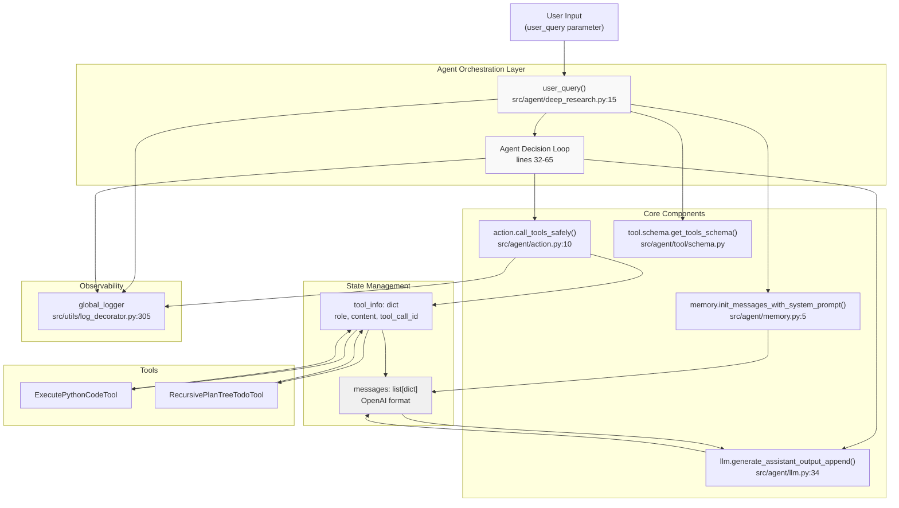

**Diagram: Agent Orchestration Architecture and Code Entities**

Sources: [src/agent/deep_research.py:1-74](), [src/agent/memory.py:1-17](), [src/agent/llm.py:1-51](), [src/agent/action.py:1-49]()

## Core Components

The orchestration layer integrates four primary components:

| Component | Module | Primary Function | Key Functions |
|-----------|--------|------------------|---------------|
| **Deep Research Agent** | `src/agent/deep_research.py` | Entry point and decision loop | `user_query()` |
| **Memory Management** | `src/agent/memory.py` | Initialize and maintain conversation context | `init_messages_with_system_prompt()` |
| **LLM Integration** | `src/agent/llm.py` | Interface with qwen-plus model via DashScope | `generate_assistant_output_append()`, `has_tool_call()`, `has_function_call()` |
| **Action Coordinator** | `src/agent/action.py` | Dispatch tool calls and handle errors | `call_tools_safely()` |

### Deep Research Agent

The `user_query` function at [src/agent/deep_research.py:15]() serves as the orchestration entry point. It initializes the conversation, manages the agent decision loop, and coordinates all interactions between the LLM and tools.

### Memory Management

Memory management is handled by `init_messages_with_system_prompt()` at [src/agent/memory.py:5-16](). It creates a message list with the system prompt from `prompt.react_system_prompt` and the initial user input, following the OpenAI message format.

### LLM Integration

The LLM integration layer at [src/agent/llm.py:1-51]() provides three critical functions:
- `generate_assistant_output_append()`: Calls the LLM and appends the response to messages
- `has_tool_call()`: Checks if the response contains tool_calls
- `has_function_call()`: Checks if the response contains function_call (legacy format)

### Action Coordinator

The action coordinator at [src/agent/action.py:10-48]() provides safe tool execution through `call_tools_safely()`, which wraps tool dispatch in error handling and logs all execution attempts.

Sources: [src/agent/deep_research.py:15-74](), [src/agent/memory.py:5-16](), [src/agent/llm.py:34-49](), [src/agent/action.py:10-48]()

## Orchestration Flow

The agent follows a continuous decision loop until the LLM produces a final answer without requesting tool execution:

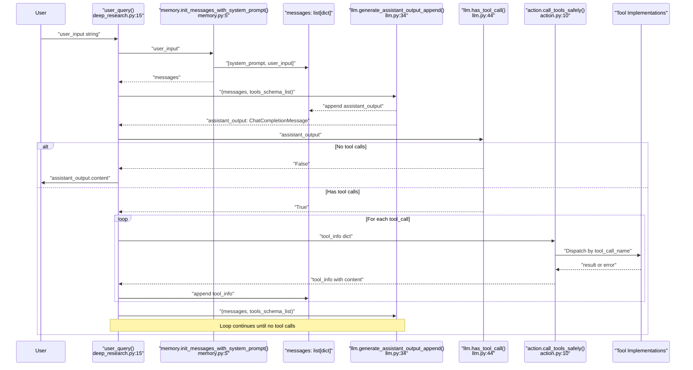

**Diagram: Agent Decision Loop Execution Flow**

The flow consists of these stages:

1. **Initialization** [src/agent/deep_research.py:19-23](): Initialize messages with system prompt and obtain tool schemas
2. **First LLM Call** [src/agent/deep_research.py:26-29](): Generate initial assistant response
3. **Decision Loop** [src/agent/deep_research.py:32-65](): 
   - Check for `tool_calls` or `function_call` in assistant output
   - If present, execute tools and append results to messages
   - Call LLM again with updated context
   - Repeat until no tool calls are requested
4. **Final Response** [src/agent/deep_research.py:73](): Log and return the final answer

Sources: [src/agent/deep_research.py:15-74](), [src/agent/llm.py:34-49](), [src/agent/action.py:10-21]()

## Message Protocol

The agent uses OpenAI's message format to maintain conversation state. Messages are stored in a `list[dict]` structure where each message has specific required fields based on its role.

### Message Structure

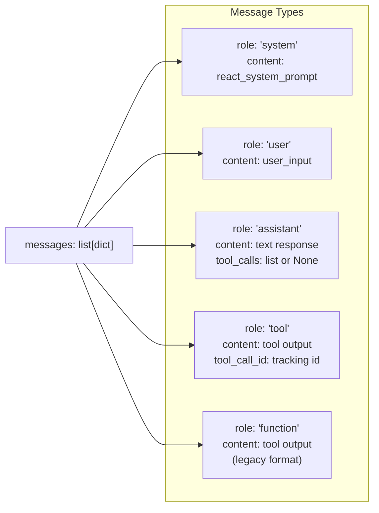

**Diagram: Message Format and Role Types**

### Message Roles

| Role | Fields | Purpose | Code Location |
|------|--------|---------|---------------|
| `system` | `content`, `role` | System prompt defining agent behavior | [src/agent/memory.py:7-10]() |
| `user` | `content`, `role` | User input or query | [src/agent/memory.py:11-14]() |
| `assistant` | `content`, `role`, `tool_calls` (optional) | LLM response with potential tool requests | [src/agent/llm.py:36-40]() |
| `tool` | `content`, `role`, `tool_call_id` | Tool execution result | [src/agent/deep_research.py:50-57]() |
| `function` | `content`, `role` | Legacy function call result | [src/agent/deep_research.py:34-41]() |

### Tool Call Structure

When the LLM requests tool execution, the assistant message contains a `tool_calls` field. The agent extracts this information into a `tool_info` dictionary at [src/agent/deep_research.py:50-57]():

```python
tool_info = {
    "content": "",  # Populated by tool execution
    "role": "tool",
    "tool_call_id": assistant_output.tool_calls[i].id,
    # Non-required fields for dispatch
    "tool_call_name": assistant_output.tool_calls[i].function.name,
    "tool_call_arguments": assistant_output.tool_calls[i].function.arguments,
}
```

The system also supports the legacy `function_call` format at [src/agent/deep_research.py:34-41]() for backward compatibility.

Sources: [src/agent/deep_research.py:34-64](), [src/agent/memory.py:5-16](), [src/agent/llm.py:36-40]()

## Tool Dispatch Mechanism

The agent determines which tool to execute by examining the `tool_call_name` field in the `tool_info` dictionary. The dispatch logic at [src/agent/action.py:11-21]() uses a conditional chain:

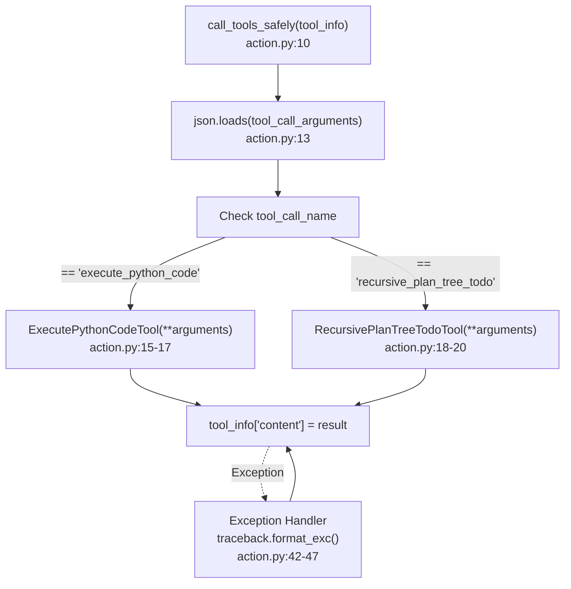

**Diagram: Tool Dispatch and Error Handling Logic**

The dispatch mechanism:
1. Parses JSON arguments from `tool_call_arguments` [src/agent/action.py:13]()
2. Matches `tool_call_name` against known tool names [src/agent/action.py:15-20]()
3. Instantiates the tool class with parsed arguments
4. Calls the tool's `run()` method and stores the result in `tool_info["content"]`
5. Returns the modified `tool_info` dictionary

Tool registration is performed at [src/agent/deep_research.py:20-23]() where tool schemas are provided to the LLM:

```python
tools_schema_list = tool.schema.get_tools_schema([
    tool.python_tool.ExecutePythonCodeTool,
    # tool.todo_tool.RecursivePlanTreeTodoTool,  # Can be enabled
])
```

Sources: [src/agent/action.py:10-48](), [src/agent/deep_research.py:20-23]()

## Error Handling Strategy

The orchestration layer implements multiple levels of error handling to ensure robustness:

### Tool Execution Errors

The `call_tools_safely()` function at [src/agent/action.py:40-47]() wraps all tool dispatch in a try-except block:

```python
try:
    return call_tools(tool_info)
except Exception as e:
    error_msg = traceback.format_exc()
    global_logger.error(f"工具函数调用失败{tool_info['content']}, 错误信息: {error_msg}", exc_info=True)
    tool_info["content"] = f"工具函数调用失败{tool_info['content']}, 错误信息: {error_msg}"
    return tool_info
```

When a tool fails:
1. The full traceback is captured using `traceback.format_exc()`
2. The error is logged to `global_logger`
3. The error message is placed in `tool_info["content"]`
4. The modified `tool_info` is returned to the agent
5. The error message becomes part of the conversation context
6. The LLM receives the error and can attempt recovery

### LLM Integration Errors

LLM API errors can occur due to invalid message formats, as documented in [docs/functino_call_err.design.md:8-27](). The most common error is:

```
BadRequestError: An assistant message with "tool_calls" must be followed by 
tool messages responding to each "tool_call_id"
```

This occurs when the message sequence is malformed. The agent ensures correctness by:
1. Always appending tool results immediately after tool calls [src/agent/deep_research.py:46, 64]()
2. Maintaining proper role sequencing (assistant → tool → assistant)
3. Including the correct `tool_call_id` for each tool response [src/agent/deep_research.py:53]()

### Logging Infrastructure

All orchestration activities are logged through `global_logger` defined at [src/utils/log_decorator.py:305-306](). Key logging points:

| Event | Location | Log Level |
|-------|----------|-----------|
| User input received | [src/agent/deep_research.py:17]() | INFO |
| No tool call needed | [src/agent/deep_research.py:28]() | INFO |
| Tool output received | [src/agent/deep_research.py:44, 62]() | INFO |
| LLM round output | [src/agent/deep_research.py:68-72]() | INFO |
| Final answer | [src/agent/deep_research.py:73]() | INFO |

The `@traceable` decorator from [src/utils/log_decorator.py:297-302]() is applied to key functions (`init_messages_with_system_prompt`, `generate_assistant_output_append`, `call_tools_safely`) to capture detailed execution traces including arguments, return values, timing, and stack traces.

Sources: [src/agent/action.py:40-47](), [src/agent/deep_research.py:17-73](), [src/utils/log_decorator.py:297-306](), [docs/functino_call_err.design.md:8-27]()

## Configuration

The orchestration system is configured through two primary mechanisms:

### Tool Registration

Tools are registered at [src/agent/deep_research.py:20-23]() by passing tool classes to `get_tools_schema()`:

```python
tools_schema_list = tool.schema.get_tools_schema([
    tool.python_tool.ExecutePythonCodeTool,
    # tool.todo_tool.RecursivePlanTreeTodoTool,
])
```

Tools can be enabled or disabled by commenting/uncommenting lines in this list.

### LLM Configuration

The LLM client is configured at [src/agent/llm.py:8-11]():

```python
client = openai.OpenAI(
    api_key=model_api_key,
    base_url="https://dashscope.aliyuncs.com/compatible-mode/v1",
)
```

Model selection occurs at [src/agent/llm.py:16]():

```python
model="qwen-plus"
```

Additional LLM parameters are set at [src/agent/llm.py:19-22]():
- `tools`: Tool schema list for function calling
- `function_call`: None (disabled)
- `parallel_tool_calls`: True (enables parallel tool execution)

Sources: [src/agent/deep_research.py:20-23](), [src/agent/llm.py:8-22]()

---

# Page: Query Processing Loop

# Query Processing Loop

<details>
<summary>Relevant source files</summary>

The following files were used as context for generating this wiki page:

- [logs/global.log](logs/global.log)
- [logs/utils.log](logs/utils.log)
- [src/agent/deep_research.py](src/agent/deep_research.py)
- [src/utils/log_decorator.py](src/utils/log_decorator.py)

</details>


## Purpose and Scope

This document explains the core agent decision loop implemented in the `user_query` function that processes user queries from start to finish. The loop orchestrates the interaction between the user, the LLM, and available tools until a final answer is produced.

For information about how the LLM is called and responses are parsed, see [LLM Integration](#3.2). For details on memory and context management, see [Memory and Context Management](#3.3). For tool execution specifics, see [Action Coordination](#3.4).

## Architecture Overview

The query processing loop operates as a state machine that alternates between LLM reasoning and tool execution phases. The loop maintains conversational state in a `messages` list and continues until the LLM decides no further tool calls are needed.

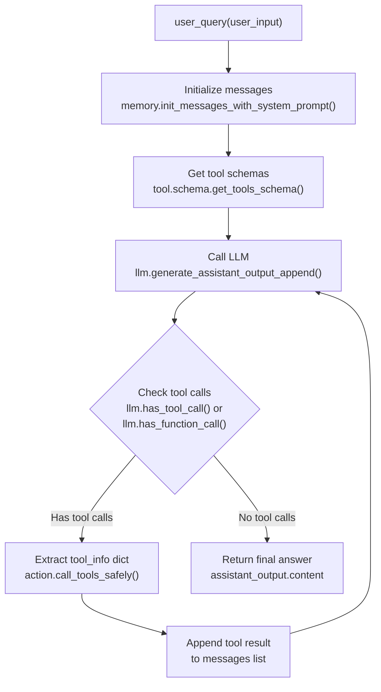

**Diagram: Main Query Processing Flow**

Sources: [src/agent/deep_research.py:15-74]()

## Entry Point and Initialization

The `user_query` function serves as the main entry point for all query processing. It accepts a `user_input` string and orchestrates the entire interaction lifecycle.

### Function Signature

```python
def user_query(user_input):
```

### Initialization Steps

The function performs three critical initialization steps before entering the main loop:

| Step | Function Call | Purpose |
|------|--------------|---------|
| 1. Log user input | `global_logger.info()` | Record incoming query for observability |
| 2. Initialize messages | `memory.init_messages_with_system_prompt(user_input)` | Create message list with system prompt and user query |
| 3. Prepare tool schemas | `tool.schema.get_tools_schema([...])` | Generate JSON schemas for available tools |

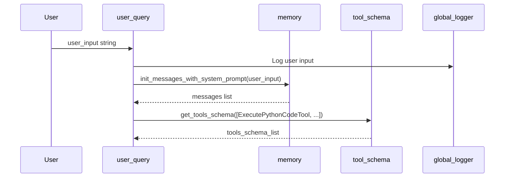

**Diagram: Initialization Sequence**

The `messages` list follows OpenAI's chat format with roles: `system`, `user`, `assistant`, `tool`, and `function`. The initial list contains two messages:

1. **System message**: Contains `react_system_prompt` defining agent behavior
2. **User message**: Contains the actual user query

Sources: [src/agent/deep_research.py:15-24](), [logs/global.log:57-181]()

## Main Decision Loop Structure

The core of the query processing system is a `while` loop that continues executing until the LLM produces a response without tool calls. This represents the agent's iterative reasoning process.

### Loop Condition

```python
while llm.has_tool_call(assistant_output) or llm.has_function_call(assistant_output):
```

The loop checks two conditions because the system supports both:
- **tool_calls** format (OpenAI's newer function calling format)
- **function_call** format (legacy format for backward compatibility)

### First LLM Call (Outside Loop)

Before entering the loop, one LLM call is made to determine if tools are needed at all:

```python
assistant_output: ChatCompletionMessage = llm.generate_assistant_output_append(messages, tools_schema_list)
if not llm.has_tool_call(assistant_output) and not llm.has_function_call(assistant_output):
    global_logger.info(f"无需调用工具，我可以直接回复：{assistant_output.content}")
    return
```

This early exit optimization avoids entering the loop for queries that don't require tool usage.

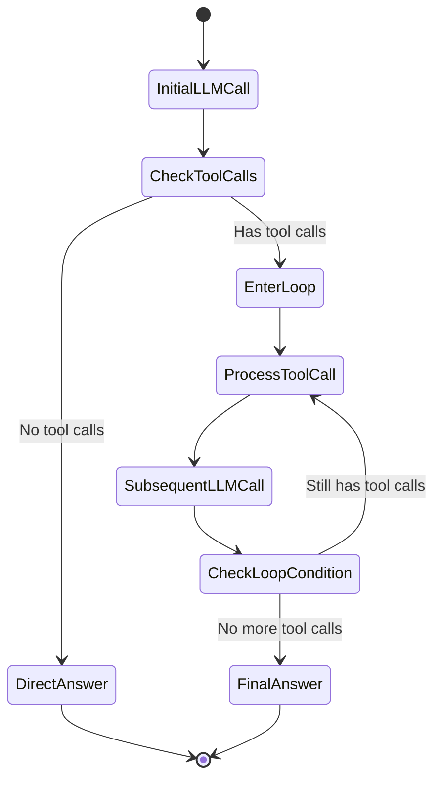

**Diagram: Loop State Machine**

Sources: [src/agent/deep_research.py:25-32](), [logs/global.log:893-900]()

## Tool Call Detection and Extraction

The system handles two different tool calling formats from the LLM. Each format requires different extraction logic.

### Format 1: function_call (Legacy)

```python
if llm.has_function_call(assistant_output):
    tool_info = {
        "content": "",
        "role": "function",
        "tool_call_id": "",
        "tool_call_name": assistant_output.function_call.name,
        "tool_call_arguments": assistant_output.function_call.arguments,
    }
```

### Format 2: tool_calls (Current)

```python
if llm.has_tool_call(assistant_output):
    for i in range(len(assistant_output.tool_calls)):
        tool_info = {
            "content": "",
            "role": "tool",
            "tool_call_id": assistant_output.tool_calls[i].id,
            "tool_call_name": assistant_output.tool_calls[i].function.name,
            "tool_call_arguments": assistant_output.tool_calls[i].function.arguments,
        }
```

### tool_info Dictionary Structure

| Field | Type | Purpose |
|-------|------|---------|
| `content` | string | Initially empty, filled with tool output after execution |
| `role` | string | Either `"tool"` or `"function"` depending on format |
| `tool_call_id` | string | Unique identifier for tracking tool calls |
| `tool_call_name` | string | Name of the tool to invoke (e.g., `"execute_python_code"`) |
| `tool_call_arguments` | string | JSON string containing tool parameters |

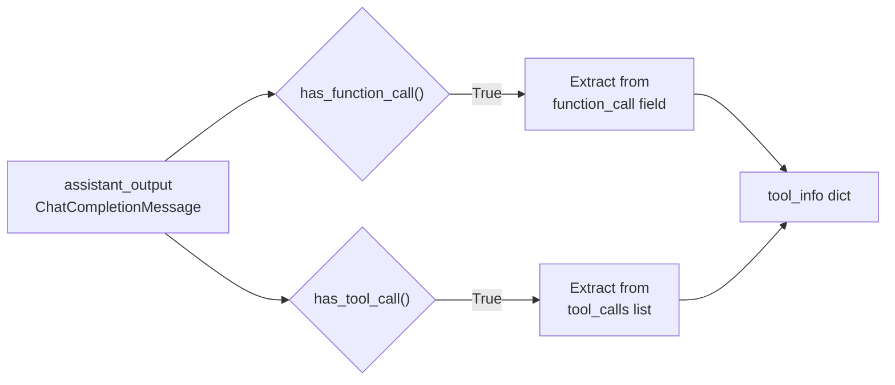

**Diagram: Tool Call Extraction Logic**

Sources: [src/agent/deep_research.py:33-57](), [logs/global.log:908-1125]()

## Tool Execution Path

Once a `tool_info` dictionary is constructed, it is passed to the action coordinator for safe execution. The coordinator handles dispatch, error handling, and result capture.

### Execution Flow

```mermaid
sequenceDiagram
    participant Loop as "Query Loop"
    participant action as "action.call_tools_safely()"
    participant tool as "Tool Instance"
    participant global_logger
    
    Loop->>action: call_tools_safely(tool_info)
    action->>tool: Dispatch to specific tool.run()
    tool-->>action: Execution result
    action->>tool_info: Update content field
    action-->>Loop: Modified tool_info
    Loop->>global_logger: Log tool output
    Loop->>messages: Append tool_info to list
```

**Diagram: Tool Execution Sequence**

### Code Implementation

The loop processes both `function_call` and `tool_calls` formats:

**For function_call format:**
```python
action.call_tools_safely(tool_info)
tool_output = tool_info["content"]
global_logger.info(f"工具 function call 输出信息： {tool_output}\n")
global_logger.info("-" * 60)
messages.append(tool_info)
```

**For tool_calls format:**
```python
for i in range(len(assistant_output.tool_calls)):
    # ... extract tool_info ...
    action.call_tools_safely(tool_info)
    tool_output = tool_info["content"]
    global_logger.info(f"工具 tool call 输出信息： {tool_output}\n")
    global_logger.info("-" * 60)
    messages.append(tool_info)
```

The key insight is that `action.call_tools_safely()` **mutates** the `tool_info` dictionary by filling its `"content"` field with the execution result. This modified dictionary is then appended to the `messages` list.

Sources: [src/agent/deep_research.py:42-64](), [logs/utils.log:59-62]()

## Message Accumulation and Context

The `messages` list serves as the cumulative conversation history that provides context to the LLM on each iteration. Understanding its growth pattern is crucial.

### Message List Growth Pattern

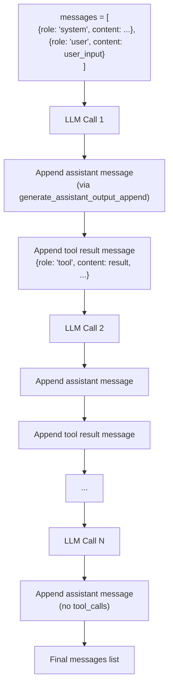

**Diagram: Message List Evolution**

### Message Roles and Structure

Each message in the list has a specific role that determines its purpose:

| Role | When Added | Content |
|------|-----------|---------|
| `system` | Initialization | System prompt defining agent behavior |
| `user` | Initialization | User's original query |
| `assistant` | After each LLM call | LLM response (may include `tool_calls` field) |
| `tool` | After tool execution | Tool output and metadata |
| `function` | After tool execution (legacy) | Tool output for function_call format |

### Example Message Sequence

From the logs, we can see a typical message sequence:

**Iteration 1:**
```
Round 1:
- messages[0]: {role: "system", content: "你是一个资深的深度研究专家..."}
- messages[1]: {role: "user", content: "你所在的工作路径下面..."}
- messages[2]: {role: "assistant", tool_calls: [...]}  # Added by generate_assistant_output_append
- messages[3]: {role: "tool", content: "...", tool_call_id: "..."}  # Added after tool execution
```

**Iteration 2:**
```
Round 2:
- messages[0-3]: (previous messages)
- messages[4]: {role: "assistant", content: "...", tool_calls: [...]}  # Next LLM call
- messages[5]: {role: "tool", content: "...", tool_call_id: "..."}  # Next tool result
```

The function `llm.generate_assistant_output_append()` automatically appends the assistant's message to the list before returning it.

Sources: [src/agent/deep_research.py:19-65](), [logs/global.log:115-181](), [logs/utils.log:56-63]()

## Loop Termination and Final Answer

The loop terminates when the LLM produces an `assistant_output` that contains no `tool_calls` and no `function_call`. This signals that the LLM has determined it has sufficient information to provide a final answer.

### Termination Logic

```python
# After each LLM call in the loop
assistant_output = llm.generate_assistant_output_append(messages, tools_schema_list)

# Null content safety check
if assistant_output.content is None:
    assistant_output.content = ""

# Loop condition check happens automatically
# If no tool calls, loop exits

# After loop exits
global_logger.info(f"最终答案： {assistant_output.content}")
```

### Logging and Output

Throughout the loop, the system logs extensive information for debugging:

**During loop iterations:**
```python
global_logger.info(
    f"""第{len(messages) // 2}轮大模型输出信息： 
\n\nassistant_output.content:: \n\n {pprint.pformat(assistant_output.content)}
\n\nassistant_output.tool_calls::\n\n {pprint.pformat([toolcall.model_dump() for toolcall in assistant_output.tool_calls] if assistant_output.tool_calls else [])}\n"""
)
```

This log entry includes:
- Round number (estimated as `len(messages) // 2`)
- Full assistant content
- Any tool calls present

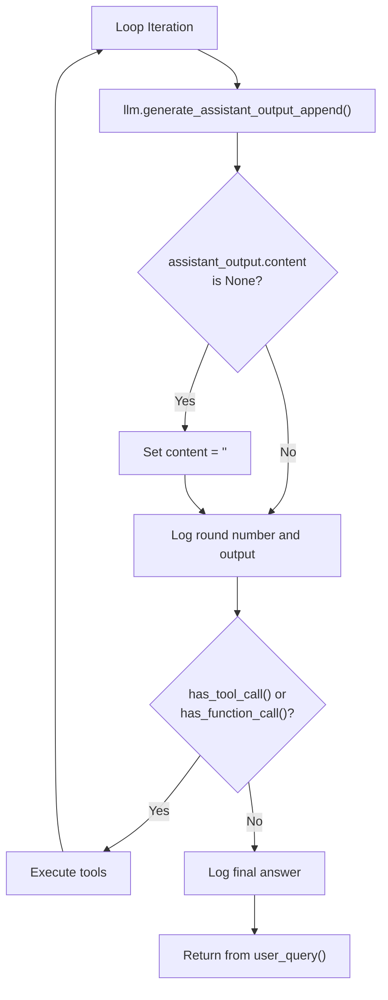

**Diagram: Loop Termination Flow**

Sources: [src/agent/deep_research.py:65-74](), [logs/utils.log:62-64]()

## Complete Loop Walkthrough

To solidify understanding, here's a complete trace of the loop with actual code references:

### Phase 1: Setup
- [Line 15-17](): Log user input
- [Line 19](): Call `memory.init_messages_with_system_prompt(user_input)` → returns `messages` list
- [Line 20-23](): Call `tool.schema.get_tools_schema([tool classes])` → returns `tools_schema_list`

### Phase 2: First LLM Call
- [Line 26](): Call `llm.generate_assistant_output_append(messages, tools_schema_list)` → returns `assistant_output`
  - This function appends the assistant's message to `messages` automatically
- [Line 27-29](): Check if no tool calls, if true, log and return early

### Phase 3: Tool Execution Loop
- [Line 32](): While `has_tool_call()` or `has_function_call()`:
  - [Line 33-46](): If `function_call` format:
    - Extract `tool_info` dictionary
    - Call `action.call_tools_safely(tool_info)` (mutates `tool_info["content"]`)
    - Log tool output
    - Append `tool_info` to `messages`
  - [Line 47-64](): If `tool_calls` format:
    - Iterate through `assistant_output.tool_calls` list
    - For each tool call, extract `tool_info` dictionary
    - Call `action.call_tools_safely(tool_info)` (mutates `tool_info["content"]`)
    - Log tool output
    - Append `tool_info` to `messages`
  - [Line 65](): Call `llm.generate_assistant_output_append(messages, tools_schema_list)` again
  - [Line 66-67](): Safety check for null content
  - [Line 68-72](): Log this round's output
  - Loop continues or exits based on tool call presence

### Phase 4: Completion
- [Line 73](): Log final answer from `assistant_output.content`
- Function returns (implicitly)

```mermaid
graph TB
    subgraph "Phase 1: Setup"
        S1["Log input"]
        S2["init_messages_with_system_prompt()"]
        S3["get_tools_schema()"]
        S1 --> S2 --> S3
    end
    
    subgraph "Phase 2: First LLM Call"
        L1["generate_assistant_output_append()"]
        L2{"No tool calls?"}
        L3["Return early"]
        L1 --> L2
        L2 -->|Yes| L3
    end
    
    subgraph "Phase 3: Loop (while tool calls exist)"
        LOOP1["Extract tool_info<br/>(function_call or tool_calls)"]
        LOOP2["call_tools_safely()<br/>(mutates tool_info)"]
        LOOP3["Append tool_info to messages"]
        LOOP4["generate_assistant_output_append()"]
        LOOP5["Log round output"]
        LOOP1 --> LOOP2 --> LOOP3 --> LOOP4 --> LOOP5
        LOOP5 -.->|has tool calls| LOOP1
    end
    
    subgraph "Phase 4: Completion"
        F1["Log final answer"]
        F2["Return"]
        F1 --> F2
    end
    
    S3 --> L1
    L2 -->|No| LOOP1
    LOOP5 -.->|no tool calls| F1
```

**Diagram: Complete Loop Phases**

Sources: [src/agent/deep_research.py:15-74]()

## Error Handling and Edge Cases

While the main loop structure is straightforward, several edge cases are handled:

### Null Content Handling

```python
if assistant_output.content is None:
    assistant_output.content = ""
```

This prevents errors when the LLM returns no textual content (e.g., when only tool calls are present).

### Both Formats Support

The loop explicitly checks and handles both `function_call` and `tool_calls` formats within the same iteration, supporting mixed-format responses if the LLM provider sends them.

### Multiple Tool Calls per Round

The `tool_calls` format allows multiple tools to be called in a single LLM response. The loop handles this with:

```python
for i in range(len(assistant_output.tool_calls)):
```

Each tool result is appended to `messages` separately, maintaining proper ordering for the LLM to understand.

Sources: [src/agent/deep_research.py:33-74]()

## Integration with Other Components

The query processing loop integrates with several other system components:

| Component | Integration Point | Purpose |
|-----------|-------------------|---------|
| Memory module | `memory.init_messages_with_system_prompt()` | Initialize conversation context |
| LLM module | `llm.generate_assistant_output_append()` | Generate responses |
| LLM module | `llm.has_tool_call()` / `llm.has_function_call()` | Detect tool usage |
| Tool schema | `tool.schema.get_tools_schema()` | Provide tool definitions to LLM |
| Action coordinator | `action.call_tools_safely()` | Execute tools with error handling |
| Logging | `global_logger.info()` | Record execution trace |

For detailed information about each integration:
- LLM integration specifics: [LLM Integration](#3.2)
- Message initialization and context: [Memory and Context Management](#3.3)
- Tool execution and error handling: [Action Coordination](#3.4)
- Individual tool implementations: [Tool System](#4)

Sources: [src/agent/deep_research.py:1-13](), [src/agent/deep_research.py:15-74]()

---

# Page: LLM Integration

# LLM Integration

<details>
<summary>Relevant source files</summary>

The following files were used as context for generating this wiki page:

- [src/agent/deep_research.py](src/agent/deep_research.py)
- [src/agent/llm.py](src/agent/llm.py)
- [src/utils/log_decorator.py](src/utils/log_decorator.py)

</details>


## Purpose and Scope

This document describes how the algo_agent system integrates with Large Language Models (LLMs) to generate intelligent responses and coordinate tool executions. The LLM serves as the reasoning engine that interprets user queries, decides which tools to invoke, and synthesizes final answers.

The system uses the **qwen-plus** model hosted on Alibaba's DashScope platform, accessed through OpenAI-compatible APIs. This integration handles message formatting, tool schema injection, response parsing, and function calling protocols.

For information about how the agent processes queries and manages the decision loop, see [Query Processing Loop](#3.1). For details on conversation state management, see [Memory and Context Management](#3.3). For tool execution orchestration, see [Action Coordination](#3.4).

---

## API Configuration

The LLM client is initialized in [src/agent/llm.py:8-11]() using the OpenAI SDK with DashScope-specific configuration:

```python
client = openai.OpenAI(
    api_key=model_api_key,    
    base_url="https://dashscope.aliyuncs.com/compatible-mode/v1",
)
```

| Configuration | Value | Purpose |
|--------------|-------|---------|
| **Model** | `qwen-plus` | Primary reasoning model |
| **Base URL** | `https://dashscope.aliyuncs.com/compatible-mode/v1` | DashScope OpenAI-compatible endpoint |
| **API Key** | From `secret.model_api_key` | Authentication token |
| **Parallel Tool Calls** | `True` | Enables multiple tool invocations in single response |

The OpenAI-compatible interface allows seamless integration while using Alibaba's infrastructure.

**Sources:** [src/agent/llm.py:1-11]()

---

## Core LLM Functions

The LLM integration module provides a layered abstraction with three primary functions:

```mermaid
graph TB
    Agent["Deep Research Agent<br/>deep_research.py"]
    
    GenAppend["generate_assistant_output_append()<br/>Public Interface"]
    Extract["_extract_assistant_output_from_chat()<br/>Response Extraction"]
    GenCompletion["_generate_chat_completion()<br/>API Call"]
    
    CheckTool["has_tool_call()<br/>Tool Detection"]
    CheckFunc["has_function_call()<br/>Function Detection"]
    
    API["DashScope API<br/>qwen-plus model"]
    
    Agent --> GenAppend
    GenAppend --> Extract
    Extract --> GenCompletion
    GenCompletion --> API
    
    GenAppend --> CheckTool
    GenAppend --> CheckFunc
    
    style GenAppend fill:#f9f9f9
    style GenCompletion fill:#e8e8e8
```

### Function Hierarchy

1. **`_generate_chat_completion(messages, tools_schema_list)`** [src/agent/llm.py:14-24]()
   - Lowest level: Makes actual API call to DashScope
   - Returns full `ChatCompletion` object
   - Decorated with `@traceable` for detailed logging

2. **`_extract_assistant_output_from_chat(messages, tools_schema_list)`** [src/agent/llm.py:27-31]()
   - Extracts `ChatCompletionMessage` from completion response
   - Returns only the assistant's message content

3. **`generate_assistant_output_append(messages, tools_schema_list)`** [src/agent/llm.py:34-41]()
   - Public interface used by agent
   - Appends assistant response to messages list
   - Ensures `content` field is never `None` (defaults to empty string)

4. **`has_tool_call(assistant_output)`** [src/agent/llm.py:44-45]()
   - Checks if response contains `tool_calls` field

5. **`has_function_call(assistant_output)`** [src/agent/llm.py:48-49]()
   - Checks if response contains legacy `function_call` field

**Sources:** [src/agent/llm.py:14-49]()

---

## Message Format and Structure

The system uses the OpenAI chat completion message format. Messages maintain conversation state and include multiple roles:

```mermaid
graph LR
    subgraph "Message Roles"
        System["system<br/>System prompt and instructions"]
        User["user<br/>User queries"]
        Assistant["assistant<br/>LLM responses + tool_calls"]
        Tool["tool<br/>Tool execution results"]
        Function["function<br/>Legacy function results"]
    end
    
    subgraph "Message Flow"
        Init["init_messages_with_system_prompt()"]
        Messages["messages: list[dict]"]
        LLM["LLM Processing"]
        Append["append to messages"]
    end
    
    System --> Messages
    User --> Messages
    Messages --> LLM
    LLM --> Assistant
    Assistant --> Append
    Tool --> Append
    Function --> Append
    Append --> Messages
```

### Message Structure

Each message in the list follows this schema:

| Field | Type | Description | Example Roles |
|-------|------|-------------|---------------|
| `role` | `str` | Message sender | `system`, `user`, `assistant`, `tool`, `function` |
| `content` | `str` | Text content | User queries, assistant responses, tool outputs |
| `tool_calls` | `list` | Tool invocation requests (optional) | Only in `assistant` messages |
| `tool_call_id` | `str` | Unique identifier linking tool results (optional) | Only in `tool` messages |
| `function_call` | `dict` | Legacy function call format (optional) | Only in `assistant` messages |

### Example Message Sequence

From [src/agent/deep_research.py:19-46](), a typical conversation flow:

1. **System Message** - Initialized via `memory.init_messages_with_system_prompt(user_input)`
2. **User Message** - Contains the original query
3. **Assistant Message** - LLM response, may contain `tool_calls`
4. **Tool Messages** - Results from tool executions, linked via `tool_call_id`
5. **Assistant Message** - Final response after tool use

**Sources:** [src/agent/deep_research.py:19-46](), [src/agent/llm.py:14-41]()

---

## LLM Call Flow

The following diagram shows the complete flow from agent query to LLM response:

```mermaid
sequenceDiagram
    participant Agent as "deep_research.py<br/>user_query()"
    participant GenAppend as "llm.py<br/>generate_assistant_output_append()"
    participant Extract as "llm.py<br/>_extract_assistant_output_from_chat()"
    participant GenComp as "llm.py<br/>_generate_chat_completion()"
    participant API as "DashScope API<br/>qwen-plus"
    
    Agent->>Agent: "init_messages_with_system_prompt()"
    Agent->>Agent: "get_tools_schema()"
    
    Agent->>GenAppend: "generate_assistant_output_append(messages, tools_schema_list)"
    GenAppend->>GenAppend: "Log separator (60 dashes)"
    GenAppend->>Extract: "_extract_assistant_output_from_chat(messages, tools_schema_list)"
    
    Extract->>GenComp: "_generate_chat_completion(messages, tools_schema_list)"
    Note over GenComp: "@traceable decorator<br/>logs all parameters"
    
    GenComp->>API: "client.chat.completions.create()"
    Note over GenComp,API: "model='qwen-plus'<br/>tools=tools_schema_list<br/>parallel_tool_calls=True"
    
    API-->>GenComp: "ChatCompletion object"
    GenComp-->>Extract: "completion"
    
    Extract->>Extract: "completion.choices[0].message"
    Extract-->>GenAppend: "ChatCompletionMessage"
    
    GenAppend->>GenAppend: "Ensure content != None"
    GenAppend->>GenAppend: "messages.append(assistant_output)"
    GenAppend-->>Agent: "assistant_output"
    
    Agent->>Agent: "Check has_tool_call() or has_function_call()"
```

### Key Parameters

From [src/agent/llm.py:15-23](), the `_generate_chat_completion` function passes these parameters:

| Parameter | Value | Purpose |
|-----------|-------|---------|
| `model` | `"qwen-plus"` | Specifies the LLM model to use |
| `messages` | `list[dict]` | Complete conversation history |
| `tools` | `tools_schema_list` | Available tool schemas in OpenAI format |
| `function_call` | `None` | Disables legacy function calling |
| `parallel_tool_calls` | `True` | Allows multiple simultaneous tool invocations |

**Sources:** [src/agent/llm.py:14-24](), [src/agent/deep_research.py:26-29]()

---

## Tool Calling Mechanism

The LLM can request tool executions through two formats: **modern tool_calls** and **legacy function_call**.

### Tool Calls Format (Modern)

When the LLM decides to use tools, it returns a `ChatCompletionMessage` with a `tool_calls` field:

```mermaid
graph TB
    subgraph "Assistant Response"
        AssistMsg["ChatCompletionMessage<br/>role='assistant'"]
        ToolCalls["tool_calls: list"]
        Content["content: str or None"]
    end
    
    subgraph "Tool Call Structure"
        TC1["ToolCall[0]"]
        TC2["ToolCall[1]"]
        TCN["ToolCall[n]"]
    end
    
    subgraph "ToolCall Fields"
        ID["id: str<br/>'call_abc123'"]
        Type["type: 'function'"]
        Func["function"]
        FuncName["name: 'ExecutePythonCodeTool'"]
        FuncArgs["arguments: JSON string"]
    end
    
    AssistMsg --> ToolCalls
    AssistMsg --> Content
    
    ToolCalls --> TC1
    ToolCalls --> TC2
    ToolCalls --> TCN
    
    TC1 --> ID
    TC1 --> Type
    TC1 --> Func
    
    Func --> FuncName
    Func --> FuncArgs
```

From [src/agent/deep_research.py:47-64](), the agent processes tool_calls:

```python
if llm.has_tool_call(assistant_output):
    for i in range(len(assistant_output.tool_calls)):
        tool_info = {
            "content": "",
            "role": "tool",
            "tool_call_id": assistant_output.tool_calls[i].id,
            # Non-required fields
            "tool_call_name": assistant_output.tool_calls[i].function.name,
            "tool_call_arguments": assistant_output.tool_calls[i].function.arguments,
        }
        action.call_tools_safely(tool_info)
        messages.append(tool_info)
```

### Function Call Format (Legacy)

The system also supports the older `function_call` format [src/agent/deep_research.py:33-46]():

```python
if llm.has_function_call(assistant_output):
    tool_info = {
        "content": "",
        "role": "function",
        "tool_call_id": "",
        # Non-required fields
        "tool_call_name": assistant_output.function_call.name,
        "tool_call_arguments": assistant_output.function_call.arguments,
    }
```

### Tool Invocation Decision Logic

The agent checks both formats in its decision loop [src/agent/deep_research.py:32-65]():

```mermaid
graph TD
    Start["Assistant Response Received"]
    
    CheckToolCall{"has_tool_call()?"}
    CheckFuncCall{"has_function_call()?"}
    
    ProcessTool["Process tool_calls array<br/>Multiple tools possible"]
    ProcessFunc["Process function_call<br/>Single function"]
    
    NoTools["No tool execution needed<br/>Return final answer"]
    
    CallAction["action.call_tools_safely(tool_info)"]
    AppendMsg["messages.append(tool_info)"]
    NextRound["Next LLM round"]
    
    Start --> CheckToolCall
    Start --> CheckFuncCall
    
    CheckToolCall -->|Yes| ProcessTool
    CheckFuncCall -->|Yes| ProcessFunc
    
    CheckToolCall -->|No| CheckFuncCall
    CheckFuncCall -->|No| NoTools
    
    ProcessTool --> CallAction
    ProcessFunc --> CallAction
    
    CallAction --> AppendMsg
    AppendMsg --> NextRound
```

**Sources:** [src/agent/deep_research.py:27-74](), [src/agent/llm.py:44-49]()

---

## Response Handling and Content Management

### Null Content Handling

The system ensures that `assistant_output.content` is never `None` to prevent downstream errors:

From [src/agent/llm.py:38-40]():
```python
if assistant_output.content is None:
    assistant_output.content = ""
messages.append(assistant_output)
```

This is also enforced in the agent loop [src/agent/deep_research.py:66-68]():
```python
if assistant_output.content is None:
    assistant_output.content = ""
```

### Message Appending Strategy

The `generate_assistant_output_append` function automatically appends the assistant's response to the messages list [src/agent/llm.py:40](). This maintains conversation continuity and ensures the LLM has full context for subsequent rounds.

### Multi-Round Conversation Flow

```mermaid
graph TB
    Start["User Query"]
    InitMsg["Initialize messages with<br/>system prompt + user query"]
    
    LLMCall["LLM generates response"]
    
    CheckDone{"has_tool_call OR<br/>has_function_call?"}
    
    ExecuteTools["Execute requested tools<br/>Append tool results to messages"]
    
    FinalAnswer["Return final answer to user"]
    
    Start --> InitMsg
    InitMsg --> LLMCall
    
    LLMCall --> CheckDone
    
    CheckDone -->|Yes| ExecuteTools
    CheckDone -->|No| FinalAnswer
    
    ExecuteTools --> LLMCall
```

The loop continues [src/agent/deep_research.py:32-65]() until the LLM generates a response without tool calls, indicated by the final log statement [src/agent/deep_research.py:73]():
```python
global_logger.info(f"最终答案： {assistant_output.content}")
```

**Sources:** [src/agent/llm.py:34-41](), [src/agent/deep_research.py:26-73]()

---

## Observability and Tracing

### Function Tracing

The `_generate_chat_completion` function is decorated with `@traceable` [src/agent/llm.py:13](), which provides comprehensive logging via the log_function decorator system [src/utils/log_decorator.py:297-302]().

This captures:
- Function call parameters (messages, tools_schema_list)
- Execution timing
- Return values
- Exception traces

Traces are written to `logs/trace.log` [src/utils/log_decorator.py:296]().

### Agent-Level Logging

The agent logs key events using `global_logger` [src/agent/deep_research.py:4]():

| Log Point | Location | Purpose |
|-----------|----------|---------|
| User input | [src/agent/deep_research.py:17]() | Records incoming query |
| No tool needed | [src/agent/deep_research.py:28]() | Direct response without tools |
| Tool output | [src/agent/deep_research.py:44,62]() | Tool execution results |
| Round info | [src/agent/deep_research.py:68-72]() | Assistant response + tool_calls details |
| Final answer | [src/agent/deep_research.py:73]() | Conversation conclusion |

### Log Separator Pattern

The LLM module uses visual separators [src/agent/llm.py:35]():
```python
global_logger.info("-" * 60)
```

This creates clear boundaries in log files, making it easier to trace individual LLM calls.

**Sources:** [src/agent/llm.py:13-35](), [src/agent/deep_research.py:4,17,28,44,62,68-73](), [src/utils/log_decorator.py:296-306]()

---

## Tool Schema Injection

The agent provides available tools to the LLM via the `tools_schema_list` parameter. From [src/agent/deep_research.py:20-23]():

```python
tools_schema_list = tool.schema.get_tools_schema([
    tool.python_tool.ExecutePythonCodeTool,
    # tool.todo_tool.RecursivePlanTreeTodoTool,
])
```

This schema list is passed to every LLM call [src/agent/deep_research.py:26,65](), enabling the model to understand available capabilities and invoke them appropriately.

The schema format follows OpenAI's function calling specification, including:
- Tool name
- Tool description
- Parameter schemas with types and descriptions
- Required vs. optional parameters

For details on schema generation, see [Tool Schema Format](#9.3).

**Sources:** [src/agent/deep_research.py:20-26]()

---

## Error Handling

### API Call Tracing

The `@traceable` decorator on `_generate_chat_completion` [src/agent/llm.py:13]() automatically captures and logs exceptions from the DashScope API, including:
- Network errors
- Authentication failures
- Rate limiting
- Invalid request formats

From [src/utils/log_decorator.py:233-257](), when exceptions occur:
```python
except Exception as e:
    # Record exception with full traceback
    logger.error(
        f"【调用失败】 栈路径： {stack_full_path} | 耗时： {elapsed_time:.3f}ms "
        f"| 异常位置： {module_name}.{class_name}.{func_name}:{exc_lineno} "
        f"| 异常类型： {exception_type} | 异常信息： {exception_msg} | 堆栈信息： {traceback_str}",
        exc_info=True
    )
    raise  # Exception is re-raised
```

### Null Safety

The system implements defensive null checking:
- `assistant_output.content` is never `None` [src/agent/llm.py:38-39]()
- This prevents `NoneType` errors when processing responses
- Empty string `""` is used as the default value

### Tool Call Validation

Before processing tool calls, the agent validates their presence:
- `has_tool_call(assistant_output)` [src/agent/llm.py:44-45]()
- `has_function_call(assistant_output)` [src/agent/llm.py:48-49]()

These simple boolean checks prevent attribute errors when accessing `tool_calls` or `function_call` fields that may be `None`.

**Sources:** [src/agent/llm.py:38-49](), [src/utils/log_decorator.py:233-257]()

---

## Integration with Agent Components

The LLM module serves as the central reasoning component, interacting with multiple subsystems:

```mermaid
graph TB
    subgraph "llm.py Module"
        LLMGen["generate_assistant_output_append()"]
        LLMCheck["has_tool_call()<br/>has_function_call()"]
    end
    
    subgraph "Agent Components"
        Agent["deep_research.py<br/>user_query()"]
        Memory["memory.py<br/>init_messages_with_system_prompt()"]
        Action["action.py<br/>call_tools_safely()"]
        Schema["tool.schema.py<br/>get_tools_schema()"]
    end
    
    subgraph "External Services"
        DashScope["DashScope API<br/>qwen-plus model"]
    end
    
    subgraph "Logging"
        GlobalLog["global_logger<br/>logs/print.log"]
        TraceLog["traceable_logger<br/>logs/trace.log"]
    end
    
    Agent --> Memory
    Agent --> Schema
    
    Memory --> Agent
    Schema --> Agent
    
    Agent --> LLMGen
    LLMGen --> DashScope
    DashScope --> LLMGen
    
    LLMGen --> Agent
    Agent --> LLMCheck
    LLMCheck --> Agent
    
    Agent --> Action
    
    LLMGen --> GlobalLog
    LLMGen --> TraceLog
```

### Component Interactions

1. **Memory Management** - `memory.init_messages_with_system_prompt()` initializes conversation state (see [Memory and Context Management](#3.3))

2. **Tool Schema** - `tool.schema.get_tools_schema()` provides tool definitions to the LLM (see [Tool Schema Format](#9.3))

3. **Action Coordination** - `action.call_tools_safely()` executes tools requested by the LLM (see [Action Coordination](#3.4))

4. **Logging** - Both `global_logger` and `@traceable` decorator provide comprehensive observability (see [Logging System Architecture](#6.1))

**Sources:** [src/agent/deep_research.py:1-74](), [src/agent/llm.py:1-49]()

---

## Summary

The LLM Integration layer provides a clean abstraction over the DashScope API with these key features:

| Feature | Implementation | Benefit |
|---------|---------------|---------|
| **OpenAI Compatibility** | Uses OpenAI SDK with DashScope endpoint | Standard interface, easy to swap models |
| **Tool Calling** | Supports both `tool_calls` and `function_call` | Flexible integration, backward compatible |
| **Parallel Execution** | `parallel_tool_calls=True` | Multiple tools in single round |
| **Null Safety** | Automatic `None` to `""` conversion | Prevents downstream errors |
| **Comprehensive Logging** | `@traceable` + `global_logger` | Full observability of LLM interactions |
| **Stateless Design** | Messages passed explicitly | Clear data flow, easy to debug |

The module's simplicity and clear separation of concerns make it easy to understand, maintain, and extend.

**Sources:** [src/agent/llm.py:1-49](), [src/agent/deep_research.py:1-74]()

---

# Page: Memory and Context Management

# Memory and Context Management

<details>
<summary>Relevant source files</summary>

The following files were used as context for generating this wiki page:

- [docs/functino_call_err.design.md](docs/functino_call_err.design.md)
- [src/agent/action.py](src/agent/action.py)
- [src/agent/deep_research.py](src/agent/deep_research.py)
- [src/agent/memory.py](src/agent/memory.py)
- [src/utils/log_decorator.py](src/utils/log_decorator.py)

</details>


## Purpose and Scope

This page describes how the algo_agent system maintains conversation history, initializes system prompts, and manages context that is passed to the LLM. The memory system uses a messages list following OpenAI's chat completion format to track the entire conversation flow including user queries, assistant responses, and tool execution results.

For information about the broader query processing loop that uses this memory system, see [Query Processing Loop](#3.1). For details on how the LLM consumes these messages, see [LLM Integration](#3.2). For tool execution result handling, see [Action Coordination](#3.4).

---

## Core Concepts

The memory system is built around a single, append-only **messages list** that serves as the complete conversation history. This list is initialized at the start of each query and grows as the agent interacts with the LLM and tools. The system follows OpenAI's message format specification to ensure compatibility with the underlying LLM API.

### Message List Structure

The `messages` list is a Python list of dictionaries, where each dictionary represents a single message in the conversation. The list maintains strict ordering—messages appear in chronological order, and the LLM processes them sequentially to build context.

**Core Message Roles:**

| Role | Purpose | Required Fields | Created By |
|------|---------|----------------|------------|
| `system` | Sets the agent's behavior and instructions | `role`, `content` | `init_messages_with_system_prompt` |
| `user` | Contains the user's query or input | `role`, `content` | `init_messages_with_system_prompt`, user input |
| `assistant` | LLM's response, may include tool calls | `role`, `content`, `tool_calls` (optional) | `generate_assistant_output_append` |
| `tool` | Result from tool execution (modern format) | `role`, `content`, `tool_call_id` | `call_tools_safely` |
| `function` | Result from tool execution (legacy format) | `role`, `content`, `tool_call_id` | `call_tools_safely` |

Sources: [src/agent/deep_research.py:1-74](), [src/agent/memory.py:1-17]()

---

## System Initialization

### Message Initialization with System Prompt

The entry point for memory management is the `init_messages_with_system_prompt` function, which creates the initial messages list with exactly two messages: a system message and a user message.

```mermaid
graph TB
    INPUT["user_input<br/>(user query string)"]
    FUNC["init_messages_with_system_prompt()"]
    SYSTEMPROMPT["react_system_prompt<br/>(imported from prompt module)"]
    
    MSG1["Message 1<br/>role: system<br/>content: react_system_prompt"]
    MSG2["Message 2<br/>role: user<br/>content: user_input"]
    
    OUTPUT["messages list<br/>[system_msg, user_msg]"]
    
    INPUT --> FUNC
    SYSTEMPROMPT --> FUNC
    FUNC --> MSG1
    FUNC --> MSG2
    MSG1 --> OUTPUT
    MSG2 --> OUTPUT
    
    style FUNC fill:#f9f9f9
    style OUTPUT fill:#f9f9f9
```

**Function Implementation:**

The `init_messages_with_system_prompt` function is defined in [src/agent/memory.py:4-16]() as:

```python
def init_messages_with_system_prompt(user_input: str) -> list[dict[str, str]]:
    messages = [
        {
            "content": react_system_prompt,
            "role": "system",
        },
        {
            "content": user_input,
            "role": "user",
        }
    ]
    return messages
```

**Key Characteristics:**

- **System Prompt Source**: Imported from `prompt.react_system_prompt` module (not shown in provided files)
- **Return Type**: Returns a list of dictionaries with string keys and values
- **Immutability**: Creates a new list each time; does not maintain global state
- **Logging**: Decorated with `@traceable` for execution tracking

Sources: [src/agent/memory.py:1-17]()

---

## Message Flow and Lifecycle

### Message Appending Pattern

Throughout the agent's execution loop, messages are appended to the list using Python's `list.append()` method. The system follows a strict alternating pattern to maintain LLM API compatibility.

```mermaid
sequenceDiagram
    participant Init as init_messages_with_system_prompt
    participant MsgList as messages list
    participant LLM as generate_assistant_output_append
    participant Action as call_tools_safely
    
    Note over Init,MsgList: Initialization Phase
    Init->>MsgList: Append system message (role=system)
    Init->>MsgList: Append user message (role=user)
    
    Note over MsgList,LLM: First LLM Call
    LLM->>MsgList: Append assistant message<br/>(role=assistant, may have tool_calls)
    
    Note over MsgList,Action: Tool Execution Phase (if tool_calls present)
    loop For each tool_call
        Action->>MsgList: Append tool result<br/>(role=tool, tool_call_id=xxx)
    end
    
    Note over MsgList,LLM: Subsequent LLM Calls
    LLM->>MsgList: Append assistant message
    
    alt More tool calls
        loop For each tool_call
            Action->>MsgList: Append tool result
        end
        LLM->>MsgList: Append assistant message
    else No tool calls
        Note over LLM: Loop terminates
    end
```

**Append Locations in Code:**

1. **Assistant Messages**: Appended within `generate_assistant_output_append` in the LLM module (not shown in provided files, but called at [src/agent/deep_research.py:26]())

2. **Tool Result Messages**: Appended in the main loop at [src/agent/deep_research.py:46]() (function call format) and [src/agent/deep_research.py:64]() (tool call format)

Sources: [src/agent/deep_research.py:15-74]()

---

## Message Schema and Structure

### Standard Message Fields

Each message dictionary in the list follows a specific schema based on its role. Here's the detailed structure:

#### System Message
```python
{
    "role": "system",
    "content": "<system prompt text>"
}
```

#### User Message
```python
{
    "role": "user",
    "content": "<user query text>"
}
```

#### Assistant Message (without tool calls)
```python
{
    "role": "assistant",
    "content": "<assistant response text>",
    "tool_calls": None  # or not present
}
```

#### Assistant Message (with tool calls)
```python
{
    "role": "assistant",
    "content": "<optional reasoning text>",
    "tool_calls": [
        {
            "id": "<tool_call_id>",
            "function": {
                "name": "<tool_name>",
                "arguments": "<json_string>"
            }
        }
    ]
}
```

#### Tool Result Message
```python
{
    "role": "tool",
    "content": "<tool execution result>",
    "tool_call_id": "<matching_id_from_assistant_message>",
    # Additional fields (not required by LLM API):
    "tool_call_name": "<tool_name>",
    "tool_call_arguments": "<json_string>"
}
```

Sources: [src/agent/deep_research.py:34-64](), [src/agent/action.py:10-21]()

---

## Tool Information Dictionary

### Tool Info Structure

During tool execution, the system uses a `tool_info` dictionary to track tool execution metadata. This structure bridges between the assistant's tool call and the resulting tool message.

```mermaid
graph LR
    subgraph "Assistant Message"
        TOOLCALL["tool_calls[i]<br/>id, function.name, function.arguments"]
    end
    
    subgraph "Tool Info Dictionary"
        TOOLINFO["tool_info dict<br/>role, tool_call_id, content<br/>tool_call_name, tool_call_arguments"]
    end
    
    subgraph "Action Module"
        CALLTOOL["call_tools_safely()<br/>Executes tool, updates content"]
    end
    
    subgraph "Messages List"
        TOOLMSG["Tool result message<br/>Appended to messages"]
    end
    
    TOOLCALL -->|"Extract fields"| TOOLINFO
    TOOLINFO --> CALLTOOL
    CALLTOOL -->|"Update content field"| TOOLINFO
    TOOLINFO -->|"Append"| TOOLMSG
```

**Tool Info Creation for Modern Format (tool_calls):**

At [src/agent/deep_research.py:50-57](), the system creates:

```python
tool_info = {
    "content": "",  # Empty initially, filled by tool execution
    "role": "tool",
    "tool_call_id": assistant_output.tool_calls[i].id,
    # Additional tracking fields:
    "tool_call_name": assistant_output.tool_calls[i].function.name,
    "tool_call_arguments": assistant_output.tool_calls[i].function.arguments,
}
```

**Tool Info Creation for Legacy Format (function_call):**

At [src/agent/deep_research.py:34-41](), for backward compatibility:

```python
tool_info = {
    "content": "",
    "role": "function",
    "tool_call_id": "",  # Empty for function_call format
    "tool_call_name": assistant_output.function_call.name,
    "tool_call_arguments": assistant_output.function_call.arguments,
}
```

Sources: [src/agent/deep_research.py:32-64](), [src/agent/action.py:1-48]()

---

## Context Management Flow

### Complete Context Pipeline

The following diagram shows how context flows from initialization through multiple agent loops:

```mermaid
graph TB
    subgraph "Initialization"
        USERINPUT["User Input String"]
        INITMSG["init_messages_with_system_prompt()"]
        INITLIST["Initial messages list<br/>[system, user]"]
    end
    
    subgraph "LLM Context Building"
        MSGLIST["messages list<br/>(growing over time)"]
        TOOLSCHEMA["tools_schema_list<br/>(available tools)"]
        LLMCONTEXT["LLM Context Package<br/>messages + tools"]
    end
    
    subgraph "LLM Processing"
        LLM["generate_assistant_output_append()"]
        ASSISTMSG["assistant_output<br/>(ChatCompletionMessage)"]
    end
    
    subgraph "Tool Execution Context"
        TOOLCALL["tool_calls extraction"]
        TOOLINFO["tool_info dict"]
        TOOLEXEC["call_tools_safely()"]
        TOOLRESULT["Tool execution result"]
    end
    
    subgraph "Context Update"
        APPEND["messages.append()"]
        UPDATEDLIST["Updated messages list<br/>(includes new assistant & tool messages)"]
    end
    
    USERINPUT --> INITMSG
    INITMSG --> INITLIST
    INITLIST --> MSGLIST
    
    MSGLIST --> LLMCONTEXT
    TOOLSCHEMA --> LLMCONTEXT
    LLMCONTEXT --> LLM
    LLM --> ASSISTMSG
    
    ASSISTMSG --> APPEND
    ASSISTMSG --> TOOLCALL
    TOOLCALL --> TOOLINFO
    TOOLINFO --> TOOLEXEC
    TOOLEXEC --> TOOLRESULT
    TOOLRESULT --> TOOLINFO
    TOOLINFO --> APPEND
    
    APPEND --> UPDATEDLIST
    UPDATEDLIST --> MSGLIST
    
    style MSGLIST fill:#f9f9f9
    style LLMCONTEXT fill:#f9f9f9
```

**Key Flow Points:**

1. **Initialization**: [src/agent/deep_research.py:19]() - `messages = memory.init_messages_with_system_prompt(user_input)`
2. **Tool Schema Addition**: [src/agent/deep_research.py:20-23]() - Tools schema is passed alongside messages but not stored in messages
3. **LLM Call**: [src/agent/deep_research.py:26]() - `llm.generate_assistant_output_append(messages, tools_schema_list)`
4. **Tool Result Append**: [src/agent/deep_research.py:46]() and [src/agent/deep_research.py:64]() - `messages.append(tool_info)`
5. **Loop Continuation**: [src/agent/deep_research.py:65]() - Next LLM call uses updated messages list

Sources: [src/agent/deep_research.py:15-74]()

---

## Context Preservation Across Iterations

### Stateless Function with Stateful Data

The memory management design follows a **stateless function, stateful data** pattern:

- **Stateless**: The `init_messages_with_system_prompt` function and `call_tools_safely` functions don't maintain internal state
- **Stateful**: The `messages` list accumulates all conversation history and is passed by reference

```mermaid
graph LR
    subgraph "Iteration 1"
        MSG1["messages<br/>[system, user]"]
        LLM1["LLM Call 1"]
        MSG1A["messages<br/>[system, user, assistant1]"]
        TOOL1["Tool Call"]
        MSG1B["messages<br/>[..., assistant1, tool1]"]
    end
    
    subgraph "Iteration 2"
        LLM2["LLM Call 2"]
        MSG2A["messages<br/>[..., tool1, assistant2]"]
        TOOL2["Tool Call"]
        MSG2B["messages<br/>[..., assistant2, tool2]"]
    end
    
    subgraph "Iteration N"
        LLMN["LLM Call N"]
        MSGN["messages<br/>[..., assistantN]"]
        DONE["No tool calls<br/>Done"]
    end
    
    MSG1 --> LLM1
    LLM1 --> MSG1A
    MSG1A --> TOOL1
    TOOL1 --> MSG1B
    MSG1B --> LLM2
    LLM2 --> MSG2A
    MSG2A --> TOOL2
    TOOL2 --> MSG2B
    MSG2B -->|"Loop continues"| LLMN
    LLMN --> MSGN
    MSGN --> DONE
    
    style MSG1 fill:#f9f9f9
    style MSG1B fill:#f9f9f9
    style MSG2B fill:#f9f9f9
    style MSGN fill:#f9f9f9
```

**Reference Passing:**

The messages list is passed by reference throughout the execution:
- LLM module receives the list and appends assistant messages
- Tool execution results are appended in the main loop
- Each subsequent LLM call sees the accumulated history
- No explicit state management or persistence layer is needed

Sources: [src/agent/deep_research.py:15-74]()

---

## Error Handling and Context Validation

### Message Format Validation

The system relies on LLM API validation for message format correctness. When messages are malformed, the API returns specific error codes.

**Common Error: Tool Call Response Mismatch**

A critical error occurs when assistant messages with `tool_calls` are not followed by corresponding tool response messages. This is documented in [docs/functino_call_err.design.md:1-51]():

```
Error code: 400 - An assistant message with "tool_calls" must be followed by 
tool messages responding to each "tool_call_id". The following tool_call_ids 
did not have response messages: message[7].role
```

**Root Cause**: At [src/agent/deep_research.py:32-46](), if a message has `function_call` (legacy format), the system creates a role `"function"` message. However, if the LLM uses modern `tool_calls` format, the API expects role `"tool"` messages with matching `tool_call_id` values.

**Prevention Strategy:**

The current code handles both formats:
- Modern format: [src/agent/deep_research.py:47-64]() properly sets `role: "tool"` and `tool_call_id`
- Legacy format: [src/agent/deep_research.py:32-46]() sets `role: "function"` (may cause issues if LLM sends `tool_calls`)

Sources: [docs/functino_call_err.design.md:1-51](), [src/agent/deep_research.py:32-64]()

---

## Logging and Observability

### Memory Operations Tracing

The memory system integrates with the logging architecture to track all memory operations.

**Logged Operations:**

1. **Initialization**: The `init_messages_with_system_prompt` function is decorated with `@traceable` at [src/agent/memory.py:4]()
2. **User Input**: Logged at [src/agent/deep_research.py:17]() with `global_logger.info`
3. **Tool Outputs**: Logged at [src/agent/deep_research.py:44]() and [src/agent/deep_research.py:62]()
4. **Assistant Outputs**: Logged at [src/agent/deep_research.py:68-72]() with detailed content and tool_calls

**Log Decorator Behavior:**

The `@traceable` decorator (defined at [src/utils/log_decorator.py:297-302]()) automatically logs:
- Function entry with all arguments (the `user_input` string)
- Function exit with return value (the initialized messages list)
- Execution time
- Call stack for debugging

**Log File Locations:**

Per [src/utils/log_decorator.py:288-306]():
- `logs/trace.log` - Detailed execution traces including `init_messages_with_system_prompt` calls
- `logs/print.log` - User-facing logs including tool outputs and final answers
- `logs/all.log` - Comprehensive logs of all operations

Sources: [src/agent/memory.py:1-17](), [src/agent/deep_research.py:15-74](), [src/utils/log_decorator.py:287-307]()

---

## Context Size and Memory Limits

### Unbounded Growth Pattern

The current implementation uses an **unbounded append-only list**, meaning:

- No automatic truncation or summarization of old messages
- Full conversation history is sent to the LLM on every call
- Context window limits are enforced by the LLM API, not the agent

**Implications:**

| Aspect | Behavior |
|--------|----------|
| Memory Usage | Grows linearly with conversation length |
| Context Window | Limited by LLM API (model-specific, typically 8k-32k tokens) |
| Token Costs | Increases with each iteration (full history resent) |
| Truncation | Not implemented; will fail when exceeding API limits |

**Potential Improvements** (not currently implemented):

- Implement sliding window context retention
- Add message summarization for long conversations
- Implement token counting and automatic truncation
- Use context compression techniques

Sources: [src/agent/deep_research.py:15-74](), [src/agent/memory.py:1-17]()

---

## Integration with Execution State

### Relationship to Workspace State

The conversation memory (messages list) is separate from but complementary to the execution state (workspace globals). See [Workspace State Management](#5.5) for details on execution state.

**Key Differences:**

| Aspect | Conversation Memory | Execution State |
|--------|---------------------|-----------------|
| **Data Structure** | `messages` list (dicts) | `arg_globals_list` / `out_globals_list` |
| **Purpose** | Track conversation history | Persist Python variables across executions |
| **Scope** | Entire agent session | Individual tool executions |
| **Serialization** | JSON-serializable strings | Pickleable Python objects |
| **Location** | [src/agent/memory.py]() | [src/agent/tool/python_tool.py]() |

**Interaction Points:**

1. Tool execution results (from workspace state) are converted to strings and added to conversation memory
2. The LLM's reasoning (in conversation memory) determines which code to execute (which updates workspace state)
3. Both are maintained in parallel but independently

Sources: [src/agent/memory.py:1-17](), [src/agent/deep_research.py:15-74]()

---

## Summary

The memory and context management system in algo_agent is designed around a simple, append-only messages list that follows OpenAI's chat completion format. Key characteristics:

- **Initialization**: `init_messages_with_system_prompt` creates the initial `[system, user]` message pair
- **Growth Pattern**: Messages are appended using `messages.append()` throughout the agent loop
- **Message Roles**: System, user, assistant, tool (modern), and function (legacy)
- **Context Passing**: The full messages list is passed to the LLM on each iteration
- **State Management**: Stateless functions operating on a stateful data structure (the messages list)
- **Integration**: Works alongside tool schema and workspace state systems
- **Observability**: Full logging via `@traceable` decorator and `global_logger`

The system prioritizes simplicity and API compatibility over optimization, making it easy to understand and debug but potentially inefficient for very long conversations.

Sources: [src/agent/memory.py:1-17](), [src/agent/deep_research.py:1-74](), [src/agent/action.py:1-48]()

---

# Page: Action Coordination

# Action Coordination

<details>
<summary>Relevant source files</summary>

The following files were used as context for generating this wiki page:

- [docs/functino_call_err.design.md](docs/functino_call_err.design.md)
- [src/agent/action.py](src/agent/action.py)
- [src/agent/deep_research.py](src/agent/deep_research.py)
- [src/agent/memory.py](src/agent/memory.py)
- [src/utils/log_decorator.py](src/utils/log_decorator.py)

</details>


## Purpose and Scope

The Action Coordination subsystem is responsible for safely dispatching tool calls from the LLM to concrete tool implementations. It serves as the bridge between the agent's decision loop and the tool execution layer, providing error handling, logging, and result formatting.

This page covers the `call_tools_safely` function and the tool dispatch mechanism. For information about the agent's decision loop and how tool calls are generated, see [Query Processing Loop](#3.1). For details on individual tool implementations, see [Tool System](#4).

---

## Core Components

### The `call_tools_safely` Function

The action coordinator is implemented primarily through the `call_tools_safely` function in [src/agent/action.py:10-47](), which acts as the central dispatch point for all tool executions in the system.

**Function Signature:**
```python
@traceable
def call_tools_safely(tool_info: dict)
```

The function accepts a `tool_info` dictionary that is mutated in-place to store the execution result in the `"content"` field. This design allows the agent to pass tool results directly back to the LLM without additional data structure transformations.

Sources: [src/agent/action.py:1-49]()

---

### The tool_info Dictionary Structure

The `tool_info` dictionary serves as the primary data structure for tool coordination, containing both input parameters and execution results:

| Field | Type | Purpose | Required |
|-------|------|---------|----------|
| `tool_call_id` | str | Unique identifier for tracking tool calls in conversation | Yes |
| `role` | str | Either `"tool"` or `"function"` depending on API format | Yes |
| `tool_call_name` | str | Name of the tool to invoke (e.g., `"execute_python_code"`) | Yes |
| `tool_call_arguments` | str | JSON-encoded string of tool parameters | Yes |
| `content` | str | Tool execution result or error message (populated by dispatcher) | Modified |

**Example tool_info Dictionary:**
```python
tool_info = {
    "content": "",  # Will be populated with result
    "role": "tool",
    "tool_call_id": "call_abc123",
    "tool_call_name": "execute_python_code",
    "tool_call_arguments": '{"python_code_snippet": "print(1+1)", ...}'
}
```

Sources: [src/agent/deep_research.py:34-41](), [src/agent/deep_research.py:50-57]()

---

## Tool Dispatch Flow

### Dispatch Mechanism

The dispatcher uses a simple if-elif chain to route tool calls based on the `tool_call_name` field. This design prioritizes simplicity and debuggability over extensibility.

```mermaid
graph TD
    A["call_tools_safely(tool_info)"] --> B["Extract function_name<br/>from tool_info"]
    B --> C["Parse arguments JSON"]
    C --> D{"Match function_name"}
    
    D -->|"execute_python_code"| E["Instantiate<br/>ExecutePythonCodeTool"]
    D -->|"update_recursive_plan_tree"| F["Instantiate<br/>RecursivePlanTreeTodoTool"]
    D -->|"Unknown"| G["No match<br/>(falls through)"]
    
    E --> H["Call tool.run()"]
    F --> H
    G --> I["tool_info['content']<br/>remains empty"]
    
    H --> J["Store result in<br/>tool_info['content']"]
    J --> K["Return tool_info"]
    I --> K
```

**Dispatch Implementation:**
```python
def call_tools(tool_info: dict):
    function_name = tool_info["tool_call_name"]
    arguments = json.loads(tool_info["tool_call_arguments"])
    
    if function_name == ExecutePythonCodeTool.tool_name():
        execute_python_code_tool = ExecutePythonCodeTool(**arguments)
        tool_info["content"] = execute_python_code_tool.run()
    elif function_name == RecursivePlanTreeTodoTool.tool_name():
        recursive_plan_tree_todo_tool = RecursivePlanTreeTodoTool(**arguments)
        tool_info["content"] = recursive_plan_tree_todo_tool.run()
    
    return tool_info
```

Sources: [src/agent/action.py:11-21]()

---

### Tool Instantiation Pattern

Each tool is instantiated dynamically using the parsed arguments dictionary. This leverages Python's `**kwargs` syntax to map JSON parameters to tool constructor arguments:

```mermaid
sequenceDiagram
    participant Dispatcher as "call_tools"
    participant JSON as "json.loads"
    participant Tool as "Tool Class"
    participant Instance as "Tool Instance"
    
    Dispatcher->>JSON: Parse tool_call_arguments
    JSON-->>Dispatcher: arguments dict
    Dispatcher->>Tool: Tool(**arguments)
    Tool->>Instance: __init__ with kwargs
    Instance-->>Dispatcher: tool instance
    Dispatcher->>Instance: run()
    Instance-->>Dispatcher: result string
    Dispatcher->>Dispatcher: tool_info["content"] = result
```

This pattern requires that tool classes implement a constructor that accepts all parameters defined in their tool schema. See [BaseTool Interface](#4.1) for details on tool schema definitions.

Sources: [src/agent/action.py:15-20]()

---

## Error Handling and Recovery

### Exception Capture Strategy

The `call_tools_safely` function wraps the entire dispatch logic in a try-except block that catches all exceptions, ensuring the agent loop never crashes due to tool failures:

```mermaid
graph TB
    A["call_tools_safely(tool_info)"] --> B["try:"]
    B --> C["call_tools(tool_info)"]
    C --> D{"Exception?"}
    
    D -->|"No Exception"| E["Return tool_info<br/>with success result"]
    
    D -->|"Exception Raised"| F["traceback.format_exc()"]
    F --> G["Log error with<br/>global_logger.error()"]
    G --> H["Set tool_info['content']<br/>to error message"]
    H --> I["Return tool_info<br/>with error"]
    
    style F fill:#ffebee
    style G fill:#ffebee
    style H fill:#ffebee
    style I fill:#ffebee
```

**Error Handling Implementation:**
```python
try:
    return call_tools(tool_info)
except Exception as e:
    error_msg = traceback.format_exc()
    global_logger.error(
        f"工具函数调用失败{tool_info['content']}, 错误信息: {error_msg}", 
        exc_info=True
    )
    tool_info["content"] = f"工具函数调用失败{tool_info['content']}, 错误信息: {error_msg}"
    return tool_info
```

Sources: [src/agent/action.py:40-47]()

---

### Error Message Format

When an exception occurs, the error message is formatted to include:

1. **Contextual prefix**: `"工具函数调用失败"` (Tool function call failed)
2. **Original content**: The partial content from `tool_info['content']` (usually empty)
3. **Full traceback**: Complete stack trace from `traceback.format_exc()`

This comprehensive error format ensures that:
- The LLM receives actionable error information to adjust its approach
- Developers can debug tool failures without accessing logs
- The conversation history maintains a complete audit trail

**Example Error Message in tool_info:**
```
工具函数调用失败, 错误信息: Traceback (most recent call last):
  File "src/agent/action.py", line 41, in call_tools_safely
    return call_tools(tool_info)
  File "src/agent/action.py", line 13, in call_tools
    arguments = json.loads(tool_info["tool_call_arguments"])
  File "json/__init__.py", line 346, in loads
    return _default_decoder.decode(s)
json.decoder.JSONDecodeError: Expecting value: line 1 column 1 (char 0)
```

Sources: [src/agent/action.py:43-46]()

---

## Integration with Agent Loop

### Call Sites in Agent Decision Loop

The action coordinator is invoked at two points in the agent's decision loop to handle both legacy `function_call` and modern `tool_calls` API formats:

```mermaid
sequenceDiagram
    participant Agent as "user_query"
    participant LLM as "generate_assistant_output_append"
    participant Action as "call_tools_safely"
    participant Memory as "messages list"
    
    Agent->>LLM: Generate response with tools
    LLM-->>Agent: assistant_output
    
    alt has_function_call (legacy)
        Agent->>Agent: Build tool_info with role="function"
        Agent->>Action: call_tools_safely(tool_info)
        Action-->>Agent: tool_info with content
        Agent->>Memory: Append tool_info
    end
    
    alt has_tool_call (modern)
        loop For each tool_call
            Agent->>Agent: Build tool_info with role="tool"
            Agent->>Action: call_tools_safely(tool_info)
            Action-->>Agent: tool_info with content
            Agent->>Memory: Append tool_info
        end
    end
    
    Agent->>LLM: Continue with updated messages
```

**Function Call Handler** [src/agent/deep_research.py:33-46]():
```python
if llm.has_function_call(assistant_output):
    tool_info = {
        "content": "",
        "role": "function",
        "tool_call_id": "",
        "tool_call_name": assistant_output.function_call.name,
        "tool_call_arguments": assistant_output.function_call.arguments,
    }
    action.call_tools_safely(tool_info)
    messages.append(tool_info)
```

**Tool Calls Handler** [src/agent/deep_research.py:47-64]():
```python
if llm.has_tool_call(assistant_output):
    for i in range(len(assistant_output.tool_calls)):
        tool_info = {
            "content": "",
            "role": "tool",
            "tool_call_id": assistant_output.tool_calls[i].id,
            "tool_call_name": assistant_output.tool_calls[i].function.name,
            "tool_call_arguments": assistant_output.tool_calls[i].function.arguments,
        }
        action.call_tools_safely(tool_info)
        messages.append(tool_info)
```

Sources: [src/agent/deep_research.py:32-64]()

---

### Message Flow and State Mutation

The action coordinator follows a **mutation-based design** where the `tool_info` dictionary is modified in-place rather than returning a new object. This design choice has several implications:

```mermaid
graph LR
    A["Agent creates<br/>empty tool_info"] --> B["call_tools_safely"]
    B --> C["Mutate content field"]
    C --> D["Return same object"]
    D --> E["Agent appends<br/>to messages"]
    E --> F["LLM receives<br/>tool result"]
    
    style C fill:#fff3e0
```

**Benefits:**
- Simplifies agent code (no need to reassign variables)
- Preserves object identity for debugging
- Maintains all metadata fields unchanged

**Drawbacks:**
- Less functional/immutable
- Potential confusion about ownership semantics
- No explicit return type in function signature

Sources: [src/agent/action.py:10-21](), [src/agent/deep_research.py:42-46](), [src/agent/deep_research.py:59-64]()

---

## Observability and Tracing

### The @traceable Decorator

The `call_tools_safely` function is decorated with `@traceable`, which provides comprehensive execution tracing:

```mermaid
graph TB
    A["@traceable decorator"] --> B["Log call start<br/>with parameters"]
    B --> C["Execute<br/>call_tools_safely"]
    C --> D{"Exception?"}
    
    D -->|"Success"| E["Log completion<br/>with timing & result"]
    D -->|"Exception"| F["Log failure<br/>with stack trace"]
    
    E --> G["Write to trace.log"]
    F --> G
    
    C --> H["Inner exception<br/>handling"]
    H --> I["Log to global.log"]
```

**Traceable Decorator Configuration** [src/utils/log_decorator.py:297-302]():
```python
traceable = lambda func: log_function(
    logger_name="root.all.trace",
    log_file=traceable_logger_file_name,  # logs/trace.log
    exclude_args=["password", "token", "secret"],
    level=logging.DEBUG
)(func)
```

This dual-logging approach provides:
- **trace.log**: Complete parameter and return value logging
- **global.log**: High-level operation logging with error details

Sources: [src/agent/action.py:9-10](), [src/utils/log_decorator.py:287-306]()

---

### Logged Information

For each tool call, the tracing system captures:

| Information | Source | Log Level |
|------------|--------|-----------|
| Function arguments (tool_info dict) | @traceable | DEBUG |
| Call stack trace | @traceable | DEBUG |
| Execution start time | @traceable | DEBUG |
| Tool execution result | Inner logging | INFO |
| Execution duration | @traceable | DEBUG |
| Exception type and message | Both | ERROR |
| Full traceback | Both | ERROR |

**Example Log Entry:**
```
[2025-11-26 03:39:31,682] 【调用开始】 栈路径： action.None.call_tools_safely 
| 开始时间： 2025-11-26 03:39:31.682000 
| 位置参数： {'tool_call_name': 'execute_python_code', ...}
| 关键字参数： {}
```

Sources: [src/utils/log_decorator.py:199-217](), [src/agent/action.py:45]()

---

## Tool Registration Pattern

### Current Implementation

The current implementation uses **hardcoded if-elif chains** for tool dispatch. This approach is simple but requires code changes to add new tools:

```python
if function_name == ExecutePythonCodeTool.tool_name():
    # ExecutePythonCodeTool dispatch
elif function_name == RecursivePlanTreeTodoTool.tool_name():
    # RecursivePlanTreeTodoTool dispatch
```

**Advantages:**
- Explicit and easy to understand
- No magic registration mechanisms
- Excellent IDE support (jump to definition works)
- Easy to debug (straightforward control flow)

**Disadvantages:**
- Requires modifying action.py for each new tool
- Cannot dynamically discover tools
- Violates Open-Closed Principle

Sources: [src/agent/action.py:14-20]()

---

### Tool Discovery

Tools are explicitly registered in the agent's initialization [src/agent/deep_research.py:20-23]():

```python
tools_schema_list = tool.schema.get_tools_schema([
    tool.python_tool.ExecutePythonCodeTool,
    # tool.todo_tool.RecursivePlanTreeTodoTool,  # Commented out
])
```

This schema list is passed to the LLM to inform it which tools are available. The action coordinator must maintain consistency with this list, ensuring every tool in the schema has a corresponding dispatch branch.

**Consistency Requirements:**
1. Tool name in dispatch must match `Tool.tool_name()`
2. Tool parameters must match schema definition
3. Tools in schema list must have dispatch handlers
4. Commented tools should also be commented in dispatcher

Sources: [src/agent/deep_research.py:20-23](), [src/agent/action.py:15-20]()

---

## Error Scenarios and Recovery

### Common Error Patterns

The action coordinator handles several classes of errors:

```mermaid
graph TB
    A["Tool Execution Errors"] --> B["JSON Parsing Errors"]
    A --> C["Tool Instantiation Errors"]
    A --> D["Tool Runtime Errors"]
    
    B --> B1["Invalid JSON in<br/>tool_call_arguments"]
    C --> C1["Missing required parameters"]
    C --> C2["Type validation failures"]
    D --> D1["Code execution timeouts"]
    D --> D2["Serialization errors"]
    D --> D3["External dependency failures"]
    
    B1 --> E["Captured by<br/>call_tools_safely"]
    C1 --> E
    C2 --> E
    D1 --> E
    D2 --> E
    D3 --> E
    
    E --> F["Error message returned<br/>to LLM in content field"]
```

**JSON Parsing Error Example:**
```python
# If tool_call_arguments contains invalid JSON:
arguments = json.loads(tool_info["tool_call_arguments"])
# Raises: json.decoder.JSONDecodeError
# Caught by: try-except in call_tools_safely
# Result: Error message in tool_info["content"]
```

Sources: [src/agent/action.py:13](), [src/agent/action.py:40-47]()

---

### Function Call vs Tool Calls API Mismatch

A critical error pattern occurs when the LLM uses `function_call` format but no handler processes it. This is documented in [docs/functino_call_err.design.md:2-3]():

```
{'content': '没有定义function_call工具调用，无法执行function_call，请使用tool_calls调用工具。',
 'role': 'user'}
```

This error occurs when:
1. LLM generates a response with `function_call` field
2. Agent detects `has_function_call()` but doesn't properly handle it
3. Empty or malformed message is appended to conversation
4. LLM API rejects the malformed message sequence

**Mitigation:**
The agent properly handles both formats [src/agent/deep_research.py:33-64]() by checking for both `has_function_call()` and `has_tool_call()` in the decision loop.

Sources: [docs/functino_call_err.design.md:1-51](), [src/agent/deep_research.py:33-64]()

---

## Adding New Tools

To add a new tool to the action coordinator:

### Step 1: Implement Tool Class
Create a new tool class extending `BaseTool` (see [Creating New Tools](#8.2))

### Step 2: Add Dispatch Branch
Modify [src/agent/action.py:14-20]() to add a new elif branch:

```python
elif function_name == NewTool.tool_name():
    new_tool = NewTool(**arguments)
    tool_info["content"] = new_tool.run()
```

### Step 3: Register Tool Schema
Add tool to schema list in [src/agent/deep_research.py:20-23]():

```python
tools_schema_list = tool.schema.get_tools_schema([
    tool.python_tool.ExecutePythonCodeTool,
    tool.new_tool.NewTool,  # Add here
])
```

### Step 4: Test Error Handling
Verify that:
- Invalid arguments raise appropriate errors
- Errors are caught by `call_tools_safely`
- Error messages are informative for the LLM

Sources: [src/agent/action.py:14-20](), [src/agent/deep_research.py:20-23]()

---

## Performance Considerations

### Synchronous Execution Model

The action coordinator executes tools **synchronously** within the agent loop. This means:

- Each tool call blocks until completion
- Multiple tool calls are executed sequentially
- Long-running tools delay the agent response

```mermaid
sequenceDiagram
    participant Agent
    participant Coordinator as "call_tools_safely"
    participant Tool1 as "Tool 1"
    participant Tool2 as "Tool 2"
    
    Agent->>Coordinator: Call Tool 1
    Coordinator->>Tool1: run()
    Note over Tool1: Executes (may take seconds)
    Tool1-->>Coordinator: Result
    Coordinator-->>Agent: Updated tool_info
    
    Agent->>Coordinator: Call Tool 2
    Coordinator->>Tool2: run()
    Note over Tool2: Executes (may take seconds)
    Tool2-->>Coordinator: Result
    Coordinator-->>Agent: Updated tool_info
```

For Python code execution specifically, timeouts are enforced at the tool level (see [Python Code Execution Tool](#4.2)), not by the action coordinator.

Sources: [src/agent/action.py:10-47](), [src/agent/deep_research.py:47-64]()

---

### Memory Overhead

The action coordinator has minimal memory overhead:
- No caching of tool instances (created per call)
- No buffering of results (stored directly in messages list)
- tool_info dictionaries are small (typically < 1KB)

The primary memory concerns are:
1. **Large tool results**: Python code output stored in `content` field
2. **Message history growth**: All tool calls remain in conversation
3. **Tool internal state**: Managed by individual tools (see [Workspace State Management](#5.5))

Sources: [src/agent/action.py:10-21](), [src/agent/deep_research.py:46](), [src/agent/deep_research.py:64]()

---

## Summary

The Action Coordination subsystem provides a simple, robust dispatching layer with the following characteristics:

**Design Principles:**
- **Safety First**: Comprehensive exception handling prevents crashes
- **Observability**: Dual logging (trace + global) for debugging
- **Simplicity**: Direct if-elif dispatch over complex registration
- **LLM-Friendly Errors**: Detailed error messages help the model recover

**Key Components:**
- `call_tools_safely`: Error-handling wrapper
- `call_tools`: Core dispatch logic  
- `tool_info`: Mutable state container
- `@traceable`: Execution tracing decorator

**Integration Points:**
- Called by agent loop for each tool invocation
- Instantiates tool classes dynamically from schemas
- Returns results via in-place mutation
- Logs to both trace.log and global.log

Sources: [src/agent/action.py:1-49](), [src/agent/deep_research.py:1-129]()

---

# Page: Tool System

# Tool System

<details>
<summary>Relevant source files</summary>

The following files were used as context for generating this wiki page:

- [docs/functino_call_err.design.md](docs/functino_call_err.design.md)
- [src/agent/action.py](src/agent/action.py)
- [src/agent/memory.py](src/agent/memory.py)
- [src/agent/tool/base_tool.py](src/agent/tool/base_tool.py)
- [src/agent/tool/python_tool.py](src/agent/tool/python_tool.py)
- [src/agent/tool/todo_tool.py](src/agent/tool/todo_tool.py)
- [src/memory/tree_todo/schemas.py](src/memory/tree_todo/schemas.py)
- [src/memory/tree_todo/todo_track.py](src/memory/tree_todo/todo_track.py)

</details>


## Purpose and Scope

The Tool System provides the interface layer between the LLM agent and executable actions. It defines how tools are structured, discovered, invoked, and integrated into the agent's decision loop. This system enables the agent to interact with Python execution environments and task management structures through a unified, type-safe interface.

For details on how the agent orchestrates tool invocations, see [Agent Orchestration](#3). For the base interface specification, see [BaseTool Interface](#4.1). For individual tool implementations, see [Python Code Execution Tool](#4.2) and [Recursive Task Planning Tool](#4.3).

**Sources:** [src/agent/tool/base_tool.py:1-76](), [src/agent/tool/python_tool.py:1-51](), [src/agent/tool/todo_tool.py:1-37]()

---

## Architecture Overview

The tool system consists of four primary components: the `BaseTool` abstract interface, concrete tool implementations, the action dispatcher, and the schema generation system that bridges tools to LLM function calling.

### System Component Diagram

```mermaid
graph TB
    subgraph "LLM Integration Layer"
        LLM["LLM<br/>(qwen-plus)"]
        SCHEMA["get_tool_schema()<br/>JSON Schema Generator"]
    end
    
    subgraph "Tool Interface Layer"
        BASE["BaseTool<br/>(Abstract Base Class)"]
        METHODS["Interface Methods:<br/>- tool_name()<br/>- tool_description()<br/>- get_parameter_schema()<br/>- get_tool_schema()<br/>- run()"]
    end
    
    subgraph "Concrete Tool Implementations"
        PYTOOL["ExecutePythonCodeTool<br/>python_code_snippet: str<br/>timeout: int"]
        TODOTOOL["RecursivePlanTreeTodoTool<br/>recursive_plan_tree: RecursivePlanTree"]
    end
    
    subgraph "Dispatch Layer"
        DISPATCHER["call_tools_safely()<br/>action.py"]
        ERROR["Exception Handler<br/>traceback.format_exc()"]
    end
    
    subgraph "Execution Backends"
        RUNTIME["Python Execution<br/>Runtime System"]
        TRACK["Task Tree<br/>Tracking System"]
    end
    
    LLM --> SCHEMA
    SCHEMA --> BASE
    BASE --> METHODS
    METHODS --> PYTOOL
    METHODS --> TODOTOOL
    
    LLM --> DISPATCHER
    DISPATCHER --> PYTOOL
    DISPATCHER --> TODOTOOL
    DISPATCHER --> ERROR
    
    PYTOOL --> RUNTIME
    TODOTOOL --> TRACK
```

The architecture follows a standard plugin pattern where:
- `BaseTool` defines the contract all tools must implement
- Concrete tools extend `BaseTool` and provide specific functionality
- The dispatcher routes tool calls from the LLM to the appropriate tool instance
- Schema generation produces JSON schemas compatible with OpenAI's function calling format

**Sources:** [src/agent/tool/base_tool.py:7-76](), [src/agent/action.py:1-48]()

---

## Tool Definition and Schema Generation

### Pydantic-Based Tool Definition

All tools inherit from `BaseTool`, which is itself a Pydantic `BaseModel`. This provides automatic validation, type checking, and schema generation. Each tool defines its parameters as Pydantic fields with descriptions and type annotations.

| Component | Purpose | Implementation |
|-----------|---------|----------------|
| `tool_name()` | Generates unique identifier from class name | [base_tool.py:14-18]() |
| `tool_description()` | Extracts docstring for LLM context | [base_tool.py:20-23]() |
| `get_parameter_schema()` | Generates JSON Schema from Pydantic model | [base_tool.py:26-28]() |
| `get_tool_schema()` | Produces complete function calling schema | [base_tool.py:31-71]() |
| `run()` | Abstract method for tool execution logic | [base_tool.py:73-75]() |

### Schema Generation Flow

```mermaid
sequenceDiagram
    participant Agent as "Agent System"
    participant Tool as "Tool Class<br/>(ExecutePythonCodeTool)"
    participant Pydantic as "Pydantic<br/>Schema Engine"
    participant LLM as "LLM Service"
    
    Agent->>Tool: get_tool_schema()
    Tool->>Tool: tool_name()<br/>"execute_python_code"
    Tool->>Tool: tool_description()<br/>Extract docstring
    Tool->>Pydantic: model_json_schema()
    Pydantic-->>Tool: Parameter schema dict
    Tool->>Tool: Construct OpenAI format
    Tool-->>Agent: Complete tool schema
    Agent->>LLM: Pass tools parameter
    LLM-->>Agent: Response with tool_calls
```

The `get_tool_schema()` method [base_tool.py:31-71]() produces a structure conforming to OpenAI's function calling format:

```json
{
  "type": "function",
  "function": {
    "name": "execute_python_code",
    "description": "必须调用在每一轮推理中...",
    "parameters": {
      "type": "object",
      "properties": {
        "tool_call_purpose": {...},
        "python_code_snippet": {...},
        "timeout": {...}
      },
      "required": ["tool_call_purpose", "python_code_snippet"]
    },
    "strict": true
  }
}
```

**Sources:** [src/agent/tool/base_tool.py:26-71](), [src/agent/tool/python_tool.py:13-40]()

---

## Tool Invocation Pipeline

### Dispatcher Architecture

The `call_tools_safely()` function [action.py:10-47]() serves as the central dispatcher that routes tool calls from the LLM to the appropriate tool implementation. It provides comprehensive error handling and logging.

```mermaid
graph LR
    subgraph "Input"
        TOOLINFO["tool_info dict<br/>{tool_call_name,<br/>tool_call_arguments,<br/>content}"]
    end
    
    subgraph "call_tools_safely Function"
        PARSE["Parse Arguments<br/>json.loads()"]
        ROUTE["Route by Name<br/>function_name match"]
        INSTANTIATE["Instantiate Tool<br/>**arguments"]
        EXECUTE["Execute run()<br/>Get result"]
        CATCH["Exception Handler<br/>traceback.format_exc()"]
    end
    
    subgraph "Tool Implementations"
        EXEC["ExecutePythonCodeTool.run()"]
        TODO["RecursivePlanTreeTodoTool.run()"]
    end
    
    subgraph "Output"
        SUCCESS["tool_info with content"]
        ERROR["tool_info with error message"]
    end
    
    TOOLINFO --> PARSE
    PARSE --> ROUTE
    ROUTE --> INSTANTIATE
    INSTANTIATE --> EXEC
    INSTANTIATE --> TODO
    EXEC --> EXECUTE
    TODO --> EXECUTE
    EXECUTE --> SUCCESS
    EXECUTE --> CATCH
    CATCH --> ERROR
```

### Call Flow with Code References

The dispatcher follows this execution path:

1. **Extract function name and arguments** [action.py:12-13]()
   - `function_name = tool_info["tool_call_name"]`
   - `arguments = json.loads(tool_info["tool_call_arguments"])`

2. **Route to tool implementation** [action.py:15-20]()
   - Match against `ExecutePythonCodeTool.tool_name()`
   - Match against `RecursivePlanTreeTodoTool.tool_name()`

3. **Instantiate and execute** [action.py:16-20]()
   - Create tool instance with validated parameters
   - Call `run()` method
   - Store result in `tool_info["content"]`

4. **Handle exceptions** [action.py:40-47]()
   - Capture full traceback with `traceback.format_exc()`
   - Log error with `global_logger.error()`
   - Return error message in `tool_info["content"]`

**Sources:** [src/agent/action.py:10-47]()

---

## Available Tools

The system provides two concrete tool implementations:

### ExecutePythonCodeTool

Executes Python code snippets in a stateful environment with variable persistence across calls. This tool is the primary computational interface for the agent.

**Key Parameters:**
- `python_code_snippet: str` - The Python code to execute [python_tool.py:29-35]()
- `timeout: int` - Maximum execution time in seconds (default: 30) [python_tool.py:36-39]()

**Execution Flow:**
1. Retrieves execution context from `workspace.get_arg_globals()` [python_tool.py:42]()
2. Runs code using `subthread_python_executor.run_structured_in_thread()` [python_tool.py:44-48]()
3. Persists output globals with `workspace.append_out_globals()` [python_tool.py:49]()
4. Returns formatted result to LLM [python_tool.py:50]()

For detailed implementation, see [Python Code Execution Tool](#4.2).

### RecursivePlanTreeTodoTool

Manages hierarchical task structures with status tracking, version history, and change analysis. This tool enables the agent to maintain complex planning state.

**Key Parameters:**
- `recursive_plan_tree: RecursivePlanTree` - The task tree structure [todo_tool.py:19-25]()

**Execution Flow:**
1. Delegates to `todo_track.run()` with tree structure [todo_tool.py:31]()
2. Compares against previous version for change detection
3. Renders Markdown representation of task tree
4. Returns change summary and statistics [todo_tool.py:32-36]()

For detailed implementation, see [Recursive Task Planning Tool](#4.3).

**Sources:** [src/agent/tool/python_tool.py:13-51](), [src/agent/tool/todo_tool.py:10-37]()

---

## Tool Registration and Discovery

### Static Registration

Tools are currently registered through explicit imports and conditional logic in the dispatcher. The registration happens in two locations:

1. **Import statements** [action.py:7-8]()
   ```python
   from src.agent.tool.python_tool import ExecutePythonCodeTool 
   from src.agent.tool.todo_tool import RecursivePlanTreeTodoTool
   ```

2. **Dispatch logic** [action.py:15-20]()
   ```python
   if function_name == ExecutePythonCodeTool.tool_name():
       execute_python_code_tool = ExecutePythonCodeTool(**arguments)
       tool_info["content"] = execute_python_code_tool.run()
   elif function_name == RecursivePlanTreeTodoTool.tool_name():
       recursive_plan_tree_todo_tool = RecursivePlanTreeTodoTool(**arguments)
       tool_info["content"] = recursive_plan_tree_todo_tool.run()
   ```

### Tool Name Convention

Tool names are automatically generated from class names using the `inflection` library [base_tool.py:16-18]():
- `ExecutePythonCodeTool` → `"execute_python_code"`
- `RecursivePlanTreeTodoTool` → `"recursive_plan_tree_todo"`

This transformation:
1. Removes "Tool" suffix from class name
2. Converts from CamelCase to snake_case using `inflection.underscore()`

**Sources:** [src/agent/action.py:7-20](), [src/agent/tool/base_tool.py:14-18]()

---

## Integration with Agent System

### Schema Provisioning to LLM

Tools are made available to the LLM through the `tools` parameter in chat completion requests. The agent must collect all tool schemas before each LLM call.

```mermaid
sequenceDiagram
    participant Agent as "user_query()<br/>deep_research.py"
    participant Tools as "Tool Classes"
    participant Memory as "Message List"
    participant LLM as "generate_chat_completion()"
    
    Agent->>Tools: ExecutePythonCodeTool.get_tool_schema()
    Tools-->>Agent: Python tool schema
    Agent->>Tools: RecursivePlanTreeTodoTool.get_tool_schema()
    Tools-->>Agent: Todo tool schema
    Agent->>LLM: messages + tools=[schemas]
    LLM-->>Agent: assistant_output with tool_calls
    Agent->>Agent: call_tools_safely(tool_info)
    Agent->>Memory: Append tool result
```

### Response Handling

When the LLM decides to invoke a tool, it returns a response with `tool_calls` attribute. The agent must:

1. **Extract tool call information** from `assistant_output.tool_calls[0]`
2. **Build tool_info dictionary**:
   ```python
   tool_info = {
       "tool_call_name": function.name,
       "tool_call_arguments": function.arguments,
       "content": ""
   }
   ```
3. **Invoke dispatcher** via `call_tools_safely(tool_info)`
4. **Append result to message history** with role `"tool"` and appropriate `tool_call_id`

For the complete integration flow, see [Action Coordination](#3.4).

**Sources:** [src/agent/action.py:10-47](), [src/agent/tool/base_tool.py:31-71]()

---

## Error Handling and Resilience

### Multi-Layer Error Protection

The tool system implements error handling at multiple levels:

| Level | Implementation | Purpose |
|-------|---------------|---------|
| Pydantic Validation | Automatic on tool instantiation | Type checking and required field validation |
| Dispatcher Try-Catch | [action.py:40-47]() | Catches tool execution failures |
| Execution Runtime | See [Execution Runtime](#5) | Handles code crashes, timeouts, and subprocess failures |
| Logging | `global_logger.error()` [action.py:45]() | Records full exception details with stack traces |

### Error Response Format

When a tool fails, the dispatcher captures the complete traceback and returns it in the tool response:

```python
error_msg = traceback.format_exc()
global_logger.error(f"工具函数调用失败{tool_info['content']}, 错误信息: {error_msg}", exc_info=True)
tool_info["content"] = f"工具函数调用失败{tool_info['content']}, 错误信息: {error_msg}"
```

This allows the LLM to:
- Understand what went wrong
- Attempt self-correction
- Retry with modified parameters
- Choose alternative approaches

**Sources:** [src/agent/action.py:40-47]()

---

## Tool Execution Context

### State Persistence Across Calls

The `ExecutePythonCodeTool` maintains execution state through the workspace system:

```mermaid
graph LR
    subgraph "Call N"
        GET1["workspace.get_arg_globals()"]
        EXEC1["Execute Code<br/>Variables: x, y, func()"]
        STORE1["workspace.append_out_globals()"]
    end
    
    subgraph "Global Workspace"
        GLOBALS["arg_globals_list<br/>Persistent storage"]
    end
    
    subgraph "Call N+1"
        GET2["workspace.get_arg_globals()"]
        EXEC2["Execute Code<br/>Uses: x, y, func()"]
        STORE2["workspace.append_out_globals()"]
    end
    
    GET1 --> GLOBALS
    EXEC1 --> STORE1
    STORE1 --> GLOBALS
    GLOBALS --> GET2
    GET2 --> EXEC2
    EXEC2 --> STORE2
    STORE2 --> GLOBALS
```

### Context Flow

1. **Context Retrieval** [python_tool.py:42]()
   - `execution_context = workspace.get_arg_globals()`
   - Returns the most recent execution state

2. **Execution with Context** [python_tool.py:44-48]()
   - Passes `_globals=execution_context` to executor
   - Code runs with previously defined variables available

3. **State Update** [python_tool.py:49]()
   - `workspace.append_out_globals(exec_result.arg_globals)`
   - New or modified variables persist for next call

For detailed workspace management, see [Workspace State Management](#5.5).

**Sources:** [src/agent/tool/python_tool.py:41-50](), [src/runtime/workspace.py]()

---

## Tool Schema Examples

### ExecutePythonCodeTool Schema

The Python execution tool exposes this interface to the LLM:

```json
{
  "type": "function",
  "function": {
    "name": "execute_python_code",
    "description": "必须调用在每一轮推理中，作为计算工具。在有状态的环境中执行Python代码片段...",
    "parameters": {
      "type": "object",
      "properties": {
        "tool_call_purpose": {
          "type": "string",
          "description": "工具调用的目的，即调用该工具的具体场景或问题。"
        },
        "python_code_snippet": {
          "type": "string",
          "description": "要执行的有效 Python 代码片段。不得包含恶意代码...",
          "examples": ["print('Hello, World!')"]
        },
        "timeout": {
          "type": "integer",
          "default": 30,
          "description": "执行代码的最大时间（秒）..."
        }
      },
      "required": ["tool_call_purpose", "python_code_snippet"]
    },
    "strict": true
  }
}
```

### RecursivePlanTreeTodoTool Schema

The task management tool exposes this interface:

```json
{
  "type": "function",
  "function": {
    "name": "recursive_plan_tree_todo",
    "description": "必须调用作为计划推理过程的思考与记录...",
    "parameters": {
      "type": "object",
      "properties": {
        "tool_call_purpose": {
          "type": "string",
          "description": "工具调用的目的..."
        },
        "recursive_plan_tree": {
          "type": "object",
          "description": "要管理的递归计划树对象...",
          "properties": {
            "core_goal": {"type": "string"},
            "tree_nodes": {
              "type": "array",
              "items": {"$ref": "#/definitions/RecursivePlanTreeNode"}
            },
            "next_action": {"type": "object"},
            "references": {"type": "array", "items": {"type": "string"}}
          }
        }
      },
      "required": ["tool_call_purpose", "recursive_plan_tree"]
    },
    "strict": true
  }
}
```

**Sources:** [src/agent/tool/python_tool.py:13-40](), [src/agent/tool/todo_tool.py:10-26](), [src/memory/tree_todo/schemas.py:1-80]()

---

## Adding New Tools

To add a new tool to the system:

1. **Create tool class** extending `BaseTool` in `src/agent/tool/`
2. **Define Pydantic fields** with descriptions and type hints
3. **Implement `run()` method** with execution logic
4. **Import in dispatcher** [action.py:7-8]()
5. **Add dispatch case** in `call_tools_safely()` [action.py:15-20]()

For a step-by-step guide, see [Creating New Tools](#8.2).

**Sources:** [src/agent/tool/base_tool.py:7-76](), [src/agent/action.py:7-20]()

---

# Page: BaseTool Interface

# BaseTool Interface

<details>
<summary>Relevant source files</summary>

The following files were used as context for generating this wiki page:

- [docs/functino_call_err.design.md](docs/functino_call_err.design.md)
- [src/agent/action.py](src/agent/action.py)
- [src/agent/memory.py](src/agent/memory.py)
- [src/agent/tool/base_tool.py](src/agent/tool/base_tool.py)
- [src/memory/tree_todo/schemas.py](src/memory/tree_todo/schemas.py)
- [src/memory/tree_todo/todo_track.py](src/memory/tree_todo/todo_track.py)

</details>


## Purpose and Scope

The `BaseTool` interface defines the abstract contract that all tools in the algo_agent system must implement. It provides a standardized way to define tools that can be invoked by the LLM agent, including automatic schema generation for function calling, parameter validation, and execution logic.

This document covers the base tool interface, its required methods, and how tools integrate with the agent orchestration system. For details on specific tool implementations, see [Python Code Execution Tool](#4.2) and [Recursive Task Planning Tool](#4.3). For information on how tools are invoked during agent execution, see [Action Coordination](#3.4).

**Sources:** [src/agent/tool/base_tool.py:1-76]()

---

## Abstract Class Structure

The `BaseTool` class is implemented as a Pydantic `BaseModel`, providing automatic parameter validation and JSON schema generation. All tools must inherit from this base class and implement its abstract methods.

### Core Definition

```python
class BaseTool(BaseModel):
    """所有工具的基类，定义统一接口"""
    tool_call_purpose: str = Field(
        ..., 
        description="工具调用的目的，即调用该工具的具体场景或问题。"
    )
```

Every tool instance requires a `tool_call_purpose` parameter that describes why the tool is being invoked for a particular request. This helps maintain context and improves logging/debugging.

**Sources:** [src/agent/tool/base_tool.py:7-12]()

---

## Tool Identification Methods

### Class Method: `tool_name()`

Generates a unique identifier for the tool based on its class name. The naming convention automatically converts the class name to snake_case and removes "Tool" or "tool" suffixes.

| Method | Return Type | Purpose |
|--------|-------------|---------|
| `tool_name()` | `str` | Unique tool identifier used for routing and dispatch |

**Implementation:**
```python
@classmethod
def tool_name(cls) -> str:
    """工具唯一标识名（用于路由匹配，如 "weatherquery"）"""
    return inflection.underscore(
        cls.__name__.replace("Tool", "").replace("tool", "")
    )
```

**Example:** A class named `ExecutePythonCodeTool` automatically generates the tool name `"execute_python_code"`.

**Sources:** [src/agent/tool/base_tool.py:13-18]()

---

### Class Method: `tool_description()`

Extracts the tool's docstring to provide a natural language description of its purpose and capabilities. This description is used by the LLM to determine when to invoke the tool.

```python
@classmethod
def tool_description(cls) -> str:
    """工具描述（供 Agent 理解用途）"""
    return inspect.getdoc(cls) or "无工具描述"
```

**Sources:** [src/agent/tool/base_tool.py:20-23]()

---

## Schema Generation System

### Diagram: Tool Schema Generation Flow

```mermaid
graph TB
    BaseTool["BaseTool<br/>(base_tool.py)"]
    
    subgraph "Schema Methods"
        GetParam["get_parameter_schema()<br/>Returns Pydantic JSON Schema"]
        GetTool["get_tool_schema()<br/>Returns OpenAI Function Format"]
        ToolName["tool_name()<br/>Generates identifier"]
        ToolDesc["tool_description()<br/>Extracts docstring"]
    end
    
    subgraph "Generated Schema Structure"
        Schema["Tool Schema Object"]
        FuncDef["function definition"]
        Params["parameters (JSON Schema)"]
        Required["required fields"]
    end
    
    subgraph "LLM Integration"
        AgentTools["Agent Tools List"]
        LLMContext["LLM Context<br/>(tools parameter)"]
        FuncCall["Function Call Response"]
    end
    
    BaseTool --> GetParam
    BaseTool --> GetTool
    BaseTool --> ToolName
    BaseTool --> ToolDesc
    
    GetTool --> ToolName
    GetTool --> ToolDesc
    GetTool --> GetParam
    
    GetTool --> Schema
    Schema --> FuncDef
    Schema --> Params
    Schema --> Required
    
    Schema --> AgentTools
    AgentTools --> LLMContext
    LLMContext --> FuncCall
```

**Sources:** [src/agent/tool/base_tool.py:26-71](), [src/agent/action.py:1-49]()

---

### Method: `get_parameter_schema()`

Leverages Pydantic's built-in JSON schema generation to produce a JSON Schema representation of the tool's parameters. This schema defines the types, descriptions, and validation rules for each parameter.

```python
@classmethod
def get_parameter_schema(cls) -> dict:
    """获取参数 JSON Schema（供 Agent 构造参数）"""
    return cls.model_json_schema()
```

The generated schema includes:
- Parameter names and types
- Field descriptions from `Field()` definitions
- Validation constraints (enums, min/max values, etc.)
- Required vs. optional fields

**Sources:** [src/agent/tool/base_tool.py:25-28]()

---

### Method: `get_tool_schema()`

Combines the tool identification methods and parameter schema into a complete OpenAI-compatible function calling schema. This format allows the LLM to understand when and how to invoke the tool.

**Schema Structure:**

| Field | Type | Description |
|-------|------|-------------|
| `type` | `"function"` | Indicates this is a function tool |
| `function.name` | `str` | Tool identifier from `tool_name()` |
| `function.description` | `str` | Tool description from `tool_description()` |
| `function.parameters` | `dict` | JSON Schema from `get_parameter_schema()` |
| `function.strict` | `bool` | Enforces strict parameter validation |

**Implementation:**
```python
@classmethod
def get_tool_schema(cls) -> str:
    tool_schema = {
        "type": "function",
        "function": {
            "type": "function",
            "name": cls.tool_name(),
            "description": cls.tool_description(),
            "parameters": cls.get_parameter_schema(),
            "strict": True,
        },
    }
    return tool_schema
```

**Sources:** [src/agent/tool/base_tool.py:30-71]()

---

## Execution Contract

### Abstract Method: `run()`

The `run()` method is the core execution logic that every tool must implement. It contains the actual functionality that gets invoked when the agent calls the tool.

```python
def run(self) -> str:
    """工具核心执行逻辑（子类必须实现）"""
    raise NotImplementedError("所有工具必须实现 run 方法")
```

**Contract Requirements:**
- **Return Type:** Must return a `str` containing the execution result
- **Implementation:** Subclasses must override this method
- **Error Handling:** Should handle exceptions gracefully and return meaningful error messages
- **Side Effects:** Can modify global state (e.g., workspace variables) but must document this

**Sources:** [src/agent/tool/base_tool.py:73-75]()

---

## Tool Registration and Dispatch

### Diagram: Tool Dispatch Flow

```mermaid
sequenceDiagram
    participant LLM as "LLM<br/>(qwen-plus)"
    participant Agent as "Agent<br/>(deep_research.py)"
    participant Dispatcher as "call_tools_safely<br/>(action.py)"
    participant ToolClass as "Concrete Tool<br/>(e.g., ExecutePythonCodeTool)"
    participant Run as "tool.run()"
    
    LLM->>Agent: "assistant_output with tool_calls"
    Agent->>Agent: "Extract tool_call_name and arguments"
    Agent->>Dispatcher: "call_tools_safely(tool_info)"
    
    Note over Dispatcher: "tool_info = {<br/>tool_call_name,<br/>tool_call_arguments,<br/>content}"
    
    Dispatcher->>Dispatcher: "Parse JSON arguments"
    Dispatcher->>Dispatcher: "Match function_name to tool class"
    
    alt "function_name == ExecutePythonCodeTool.tool_name()"
        Dispatcher->>ToolClass: "ExecutePythonCodeTool(**arguments)"
        Note over ToolClass: "Pydantic validates parameters"
    else "function_name == RecursivePlanTreeTodoTool.tool_name()"
        Dispatcher->>ToolClass: "RecursivePlanTreeTodoTool(**arguments)"
    end
    
    Dispatcher->>Run: "execute_python_code_tool.run()"
    Run-->>Dispatcher: "result_string"
    Dispatcher->>Dispatcher: "tool_info['content'] = result"
    Dispatcher-->>Agent: "tool_info with result"
    
    alt "Exception during execution"
        Dispatcher->>Dispatcher: "Catch exception, format traceback"
        Dispatcher-->>Agent: "tool_info with error message"
    end
```

**Sources:** [src/agent/action.py:10-47]()

---

### Implementation in `call_tools_safely()`

The action coordinator uses a conditional dispatch pattern to route tool calls to the appropriate implementation:

```python
@traceable
def call_tools_safely(tool_info: dict):
    def call_tools(tool_info: dict):
        function_name = tool_info["tool_call_name"]
        arguments = json.loads(tool_info["tool_call_arguments"])
        
        if function_name == ExecutePythonCodeTool.tool_name():
            execute_python_code_tool = ExecutePythonCodeTool(**arguments)
            tool_info["content"] = execute_python_code_tool.run()
        elif function_name == RecursivePlanTreeTodoTool.tool_name():
            recursive_plan_tree_todo_tool = RecursivePlanTreeTodoTool(**arguments)
            tool_info["content"] = recursive_plan_tree_todo_tool.run()
        
        return tool_info
```

**Dispatch Process:**
1. Extract `function_name` from `tool_info["tool_call_name"]`
2. Parse JSON `arguments` from `tool_info["tool_call_arguments"]`
3. Match `function_name` against `ToolClass.tool_name()` for each registered tool
4. Instantiate the tool class with unpacked arguments (Pydantic validates parameters)
5. Call `tool.run()` and capture the result
6. Store result in `tool_info["content"]`
7. Return updated `tool_info` to agent

**Sources:** [src/agent/action.py:10-21]()

---

### Error Handling Wrapper

The outer `call_tools_safely()` function wraps the dispatch logic with comprehensive exception handling:

```python
try:
    return call_tools(tool_info)
except Exception as e:
    error_msg = traceback.format_exc()
    global_logger.error(f"工具函数调用失败{tool_info['content']}, 错误信息: {error_msg}", exc_info=True)
    tool_info["content"] = f"工具函数调用失败{tool_info['content']}, 错误信息: {error_msg}"
    return tool_info
```

This ensures that tool failures don't crash the agent and provide detailed error information for debugging.

**Sources:** [src/agent/action.py:40-47]()

---

## Tool Definition Pattern

### Standard Tool Implementation Template

```python
from src.agent.tool.base_tool import BaseTool
from pydantic import Field

class MyCustomTool(BaseTool):
    """
    Brief description of what this tool does.
    
    Used when the agent needs to perform specific actions.
    """
    
    # Define tool-specific parameters
    parameter_one: str = Field(
        ..., 
        description="Description of parameter_one"
    )
    parameter_two: int = Field(
        default=10,
        description="Description of parameter_two"
    )
    
    def run(self) -> str:
        """
        Execute the tool's core logic.
        
        Returns:
            str: Result message or error description
        """
        try:
            # Tool implementation
            result = self._perform_action()
            return f"Success: {result}"
        except Exception as e:
            return f"Error: {str(e)}"
```

**Sources:** [src/agent/tool/base_tool.py:1-76]()

---

## Integration with Pydantic V2

The `BaseTool` class leverages Pydantic V2 features for robust parameter validation and schema generation:

### Key Features Used

| Feature | Purpose | Implementation |
|---------|---------|---------------|
| `BaseModel` | Base class providing validation | `class BaseTool(BaseModel)` |
| `Field()` | Parameter metadata and constraints | Used in `tool_call_purpose` and subclass fields |
| `model_json_schema()` | Automatic JSON Schema generation | Called by `get_parameter_schema()` |
| Parameter validation | Runtime type checking | Automatic during tool instantiation |
| `model_copy()` | Deep copying instances | Used in tool state management |

### Validation Benefits

When the dispatcher instantiates a tool with `ToolClass(**arguments)`, Pydantic automatically:
- Validates parameter types match schema definitions
- Enforces required fields are present
- Applies field constraints (enums, ranges, patterns)
- Coerces compatible types (e.g., string to int)
- Raises `ValidationError` for invalid inputs

**Sources:** [src/agent/tool/base_tool.py:1-6](), [src/memory/tree_todo/schemas.py:1-3]()

---

## Concrete Tool Examples

### Tool Schema Comparison Table

| Tool Class | Generated Name | Primary Purpose | Key Parameters |
|------------|----------------|-----------------|----------------|
| `ExecutePythonCodeTool` | `execute_python_code` | Execute Python code snippets | `python_code_snippet` |
| `RecursivePlanTreeTodoTool` | `recursive_plan_tree_todo` | Manage hierarchical task trees | `current_plan_tree` |

**Sources:** [src/agent/action.py:7-8](), [src/agent/action.py:15-20]()

---

## Relationship to Agent Architecture

### Diagram: BaseTool in System Context

```mermaid
graph TB
    subgraph "Tool System Layer"
        BaseTool["BaseTool<br/>(base_tool.py:7-75)"]
        Schema["Tool Schema Methods"]
        Run["run() Abstract Method"]
    end
    
    subgraph "Concrete Tools"
        PythonTool["ExecutePythonCodeTool<br/>(python_tool.py)"]
        TodoTool["RecursivePlanTreeTodoTool<br/>(todo_tool.py)"]
    end
    
    subgraph "Agent Orchestration"
        ActionCoord["call_tools_safely<br/>(action.py:10-47)"]
        AgentLoop["user_query<br/>(deep_research.py)"]
    end
    
    subgraph "LLM Integration"
        ToolsParam["tools parameter<br/>(list of tool schemas)"]
        FunctionCall["function_call / tool_calls<br/>in LLM response"]
    end
    
    BaseTool --> Schema
    BaseTool --> Run
    
    BaseTool -.inherits.-> PythonTool
    BaseTool -.inherits.-> TodoTool
    
    PythonTool --> ActionCoord
    TodoTool --> ActionCoord
    
    Schema --> ToolsParam
    ToolsParam --> AgentLoop
    AgentLoop --> FunctionCall
    FunctionCall --> ActionCoord
    
    ActionCoord -.invokes.-> Run
```

**Sources:** [src/agent/tool/base_tool.py:1-76](), [src/agent/action.py:1-49]()

---

## Tool Name Conventions

The `tool_name()` method uses a specific transformation algorithm:

### Transformation Process

1. **Input:** Python class name (e.g., `ExecutePythonCodeTool`)
2. **Remove suffix:** Strip "Tool" or "tool" → `ExecutePythonCode`
3. **Convert to snake_case:** Apply `inflection.underscore()` → `execute_python_code`
4. **Output:** Tool identifier for function calling

### Example Transformations

| Class Name | Generated Tool Name |
|------------|---------------------|
| `ExecutePythonCodeTool` | `execute_python_code` |
| `RecursivePlanTreeTodoTool` | `recursive_plan_tree_todo` |
| `WeatherQueryTool` | `weather_query` |
| `SearchTool` | `search` |

The library `inflection` handles the camelCase to snake_case conversion reliably.

**Sources:** [src/agent/tool/base_tool.py:4](), [src/agent/tool/base_tool.py:13-18]()

---

## Adding New Tools to the System

To add a new tool to the agent system:

### Step 1: Create Tool Class

Create a new file in `src/agent/tool/` that inherits from `BaseTool`:

```python
from src.agent.tool.base_tool import BaseTool
from pydantic import Field

class MyNewTool(BaseTool):
    """Description of what this tool does."""
    
    param1: str = Field(..., description="Parameter description")
    
    def run(self) -> str:
        # Implementation
        return "result"
```

### Step 2: Register in Dispatcher

Add a conditional branch in `call_tools_safely()` at [src/agent/action.py:14-20]():

```python
elif function_name == MyNewTool.tool_name():
    my_new_tool = MyNewTool(**arguments)
    tool_info["content"] = my_new_tool.run()
```

### Step 3: Import Tool

Add the import statement at the top of [src/agent/action.py]():

```python
from src.agent.tool.my_new_tool import MyNewTool
```

The tool is now automatically available to the agent through the schema generation system.

**Sources:** [src/agent/action.py:7-8](), [src/agent/action.py:14-20]()

---

## Design Rationale

### Why Pydantic BaseModel?

Using Pydantic as the foundation provides several advantages:

1. **Automatic Validation:** Parameters are validated at instantiation time
2. **Schema Generation:** JSON Schema is auto-generated from type hints
3. **Documentation:** Field descriptions become part of the schema
4. **Type Safety:** IDE support for autocomplete and type checking
5. **Serialization:** Built-in JSON serialization for logging and debugging

### Why Class Methods for Metadata?

Tool identification methods (`tool_name()`, `tool_description()`, `get_tool_schema()`) are class methods because:

1. They describe the tool class, not a specific instance
2. They can be called without instantiation
3. They're needed before parameters are available
4. They enable tool discovery and schema generation at startup

### Why String Return Type?

The `run()` method returns `str` rather than structured data because:

1. **LLM Compatibility:** String results integrate seamlessly into conversation context
2. **Flexibility:** Tools can format output for readability
3. **Error Messages:** Failures can be described naturally
4. **Consistency:** Uniform interface regardless of tool complexity

**Sources:** [src/agent/tool/base_tool.py:1-76]()

---

## Summary

The `BaseTool` interface provides a standardized contract for all tools in the algo_agent system:

- **Identification:** Automatic tool naming and description extraction
- **Schema Generation:** OpenAI-compatible function calling schemas
- **Parameter Validation:** Pydantic-based type checking and constraints
- **Execution Contract:** Abstract `run()` method for tool logic
- **Error Handling:** Wrapped in `call_tools_safely()` for robustness
- **Extensibility:** Simple pattern for adding new tools

This architecture enables the LLM to discover, understand, and invoke tools dynamically while maintaining type safety and comprehensive error handling.

**Sources:** [src/agent/tool/base_tool.py:1-76](), [src/agent/action.py:1-49]()

---

# Page: Python Code Execution Tool

# Python Code Execution Tool

<details>
<summary>Relevant source files</summary>

The following files were used as context for generating this wiki page:

- [.gitignore](.gitignore)
- [README.md](README.md)
- [docs/error correction.design.md](docs/error correction.design.md)
- [docs/log.md](docs/log.md)
- [src/agent/tool/python_tool.py](src/agent/tool/python_tool.py)
- [src/agent/tool/todo_tool.py](src/agent/tool/todo_tool.py)
- [src/runtime/cwd.py](src/runtime/cwd.py)
- [src/runtime/subprocess_python_executor.py](src/runtime/subprocess_python_executor.py)
- [src/runtime/workspace.py](src/runtime/workspace.py)
- [src/utils/__pycache__/__init__.cpython-312.pyc](src/utils/__pycache__/__init__.cpython-312.pyc)

</details>


## Purpose and Scope

The `ExecutePythonCodeTool` is a core agent capability that enables the execution of arbitrary Python code snippets in an isolated, stateful environment. This tool serves as the agent's computational engine, allowing it to perform data processing, algorithm implementation, calculations, and file operations during its reasoning process.

**Scope of this document:**
- Tool interface, parameters, and schema definition
- Execution workflow from tool invocation to result delivery
- State persistence mechanisms across multiple executions
- Working directory management and environment setup
- Error handling and timeout enforcement
- Return format and LLM feedback

**Related documentation:**
- For the abstract tool interface: see [BaseTool Interface](#4.1)
- For detailed execution strategies (subprocess, subthread, direct): see [Execution Runtime](#5)
- For global variable management: see [Workspace State Management](#5.5)
- For execution result schemas: see [ExecutionResult and Status Handling](#5.4)

---

## Tool Definition and Schema

The `ExecutePythonCodeTool` class extends `BaseTool` and defines two primary parameters that the LLM must provide when invoking the tool:

| Parameter | Type | Required | Default | Description |
|-----------|------|----------|---------|-------------|
| `python_code_snippet` | `str` | Yes | - | Valid Python code to execute. Must not contain malicious operations. |
| `timeout` | `int` | No | 30 | Maximum execution time in seconds before termination. |

### Tool Description for LLM Context

The tool provides a detailed description that guides the LLM on proper usage:

```
必须调用在每一轮推理中，作为计算工具。
在有状态的环境中执行Python代码片段，类似于在Jupyter Notebook中运行单元格。

功能：
- 使用 Python 3.12 执行计算、数据处理和逻辑执行
- 状态持久化：在一次调用中定义的变量和函数会为后续调用保留
- 错误反馈：如果代码运行失败，将返回详细的回溯信息

关键规则：
1. 输出可见性：必须使用 print(...) 才能查看任何结果
2. 导入模块：由于序列化限制，模块不会持续存在，在每个代码片段中始终重新导入必要的模块
3. 安全性：无限循环或运行时间极长的代码将被超时机制终止
4. 依赖管理：可使用 subprocess.check_call(["uv", "add", package_name]) 安装依赖
```

Sources: [src/agent/tool/python_tool.py:13-40]()

---

## Execution Flow Architecture

### High-Level Workflow

The following diagram illustrates how code execution flows from tool invocation through the execution runtime and workspace management back to the LLM:

```mermaid
graph TB
    LLM["LLM (qwen-plus)"]
    AgentLoop["Agent Decision Loop"]
    PythonTool["ExecutePythonCodeTool"]
    WorkspaceGet["workspace.get_arg_globals()"]
    Executor["subthread_python_executor<br/>run_structured_in_thread()"]
    WorkspaceAppend["workspace.append_out_globals()"]
    
    LLM -->|"tool_call with<br/>python_code_snippet<br/>timeout"| AgentLoop
    AgentLoop -->|"dispatch to tool"| PythonTool
    PythonTool -->|"1. Retrieve execution context"| WorkspaceGet
    WorkspaceGet -->|"Returns filtered globals dict"| PythonTool
    PythonTool -->|"2. Execute code with context"| Executor
    Executor -->|"Returns ExecutionResult<br/>(status, stdout, globals)"| PythonTool
    PythonTool -->|"3. Persist output globals"| WorkspaceAppend
    PythonTool -->|"4. Return ret_tool2llm"| AgentLoop
    AgentLoop -->|"tool result message"| LLM
    
    subgraph "State Management"
        WorkspaceGet
        WorkspaceAppend
        GlobalsList["arg_globals_list<br/>out_globals_list"]
        WorkspaceGet -.->|"reads from"| GlobalsList
        WorkspaceAppend -.->|"writes to"| GlobalsList
    end
```

Sources: [src/agent/tool/python_tool.py:41-50](), [src/runtime/workspace.py:81-98]()

### Code Execution Method

The `run()` method orchestrates the entire execution process:

```python
def run(self) -> str:
    # 1. Retrieve the current execution context (global variables from previous executions)
    execution_context: Optional[Dict[str, Any]] = workspace.get_arg_globals()
    
    # 2. Log the code snippet for debugging
    global_logger.info(f"执行Python代码片段：{pprint.pformat(self.python_code_snippet)}")
    
    # 3. Execute code in subthread executor with timeout
    exec_result: subthread_python_executor.ExecutionResult = subthread_python_executor.run_structured_in_thread(
        command=self.python_code_snippet, 
        _globals=execution_context,
        timeout=self.timeout
    )
    
    # 4. Persist modified globals for next execution
    workspace.append_out_globals(exec_result.arg_globals)
    
    # 5. Return formatted result to LLM
    return exec_result.ret_tool2llm
```

Sources: [src/agent/tool/python_tool.py:41-50]()

---

## State Persistence Mechanism

One of the tool's most important features is **stateful execution** - variables and functions defined in one execution persist to subsequent executions, mimicking a Jupyter notebook environment.

### Workspace Global Variables

The workspace module maintains two global lists that track execution state:

| List | Purpose | Content |
|------|---------|---------|
| `arg_globals_list` | Input globals for each execution | Filtered globals dict passed to executor |
| `out_globals_list` | Output globals after each execution | Modified globals returned from executor |

### State Flow Diagram

```mermaid
sequenceDiagram
    participant Tool as ExecutePythonCodeTool
    participant WSGet as workspace.get_arg_globals()
    participant WSFilter as filter_and_deepcopy_globals()
    participant Executor as Execution Runtime
    participant WSAppend as workspace.append_out_globals()
    
    Note over Tool: Execution 1: x = 10
    Tool->>WSGet: Retrieve context
    WSGet->>WSGet: arg_globals_list empty,<br/>initialize_workspace()
    WSGet->>WSFilter: Filter builtins & modules
    WSFilter-->>Tool: {'__name__': '__main__'}
    Tool->>Executor: exec("x = 10", globals)
    Executor-->>Tool: ExecutionResult with<br/>arg_globals={'x': 10}
    Tool->>WSAppend: Persist output
    WSAppend->>WSFilter: Filter & deepcopy
    WSFilter->>WSAppend: Add to out_globals_list
    
    Note over Tool: Execution 2: print(x + 5)
    Tool->>WSGet: Retrieve context
    WSGet->>WSGet: Read from out_globals_list[-1]
    WSGet->>WSFilter: Filter & deepcopy
    WSFilter-->>Tool: {'x': 10, '__name__': '__main__'}
    Tool->>Executor: exec("print(x + 5)", globals)
    Executor-->>Tool: ExecutionResult with stdout="15"
    Tool->>WSAppend: Persist output
```

Sources: [src/runtime/workspace.py:81-98](), [src/runtime/workspace.py:38-78]()

### Global Variable Filtering

To ensure cross-process serialization, the workspace filters globals before persistence:

**Filtering Rules:**
1. **Exclude `__builtins__`** - Standard Python builtins are not serialized
2. **Exclude module objects** - Module references cannot be pickled reliably
3. **Verify pickle serialization** - Only objects that can be serialized via `pickle.dumps()` are retained
4. **Deep copy values** - All retained values are deep-copied to prevent reference issues

```python
def filter_and_deepcopy_globals(original_globals: Dict[str, Any]) -> Dict[str, Any]:
    filtered_dict = {}
    for key, value in original_globals.items():
        # Exclude __builtins__
        if key == '__builtins__':
            continue
        # Exclude module types
        import sys
        if isinstance(value, type(sys)):
            continue
        # Verify picklability
        if _is_serializable(value) is False:
            continue
        # Deep copy valid values
        filtered_dict[key] = copy.deepcopy(value)
    return filtered_dict
```

Sources: [src/runtime/workspace.py:38-78]()

---

## Execution Runtime Integration

While the `ExecutePythonCodeTool` defaults to using `subthread_python_executor`, it can be configured to use different execution strategies. The tool abstracts the execution backend, focusing on the interface contract rather than implementation details.

### Executor Selection

The tool currently uses the **subthread executor** for a balance of isolation and performance:

```python
exec_result: subthread_python_executor.ExecutionResult = subthread_python_executor.run_structured_in_thread(
    command=self.python_code_snippet, 
    _globals=execution_context,
    timeout=self.timeout
)
```

**Rationale for subthread executor:**
- **Moderate isolation**: Runs in separate thread, preventing blocking of main agent loop
- **Shared memory**: Can access and modify globals dictionary without IPC overhead
- **Timeout support**: Can enforce execution time limits
- **Stdout capture**: Redirects output to buffer for collection

For detailed information on all execution strategies (subprocess, subthread, direct), see [Execution Runtime](#5).

Sources: [src/agent/tool/python_tool.py:44-48]()

---

## Timeout and Error Handling

### Timeout Enforcement

The tool accepts a `timeout` parameter (default: 30 seconds) that limits execution time:

```python
timeout: int = Field(
    30, 
    description="执行代码的最大时间（秒）。如果代码运行时间超过此值，将被终止并返回错误消息。"
)
```

When a timeout occurs:
1. The executor terminates the running code
2. An `ExecutionResult` is created with `exit_status=ExecutionStatus.TIMEOUT`
3. The LLM receives a formatted error message indicating the timeout

### Error Categories

The execution system captures four types of execution outcomes:

| Status | Enum Value | Cause | Example |
|--------|-----------|-------|---------|
| Success | `ExecutionStatus.SUCCESS` | Code executed without exceptions | `print("hello")` |
| Failure | `ExecutionStatus.FAILURE` | Python exception raised | `1 / 0` (ZeroDivisionError) |
| Timeout | `ExecutionStatus.TIMEOUT` | Execution exceeded timeout limit | `while True: pass` |
| Crashed | `ExecutionStatus.CRASHED` | Process/thread crashed unexpectedly | Segmentation fault |

### Exception Information

When execution fails, the `ExecutionResult` captures comprehensive error details:

```python
ExecutionResult(
    exit_status=ExecutionStatus.FAILURE,
    exception_repr=repr(e),              # "ZeroDivisionError('division by zero')"
    exception_type=type(e).__name__,     # "ZeroDivisionError"
    exception_value=str(e),              # "division by zero"
    exception_traceback=traceback.format_exc()  # Full stack trace
)
```

This detailed feedback allows the LLM to diagnose and correct errors in subsequent tool calls.

Sources: [src/runtime/subprocess_python_executor.py:52-69](), [src/runtime/schemas.py]()

---

## Working Directory Management

Each execution occurs in a dedicated working directory to isolate file operations and prevent conflicts between concurrent executions.

### Directory Context Setup

The `cwd` module provides working directory management:

```python
# In subprocess executor
def _worker_with_pipe(...):
    # Set working directory for this execution
    cwd.create_cwd('./wsm/2/g7-2')
    # ... execute code ...
```

**Directory structure:**
```
algo_agent/
├── wsm/          # Workspace root
│   ├── 1/        # Execution group 1
│   │   └── g4-1/ # Specific execution workspace
│   ├── 2/        # Execution group 2
│   │   └── g7-2/ # Specific execution workspace
│   └── 3/        # Execution group 3
```

### Context Manager Pattern

For temporary directory changes, the `ChangeDirectory` context manager ensures proper cleanup:

```python
with ChangeDirectory('./wsm/3/g8-1'):
    # Execute operations in this directory
    # File I/O, data processing, etc.
    pass
# Automatically restored to original directory
```

This pattern is useful when:
- Code needs to read/write files in a specific location
- Multiple executions must be isolated from each other
- Testing different working directory scenarios

Sources: [src/runtime/cwd.py:9-28](), [src/runtime/cwd.py:31-54](), [src/runtime/subprocess_python_executor.py:27-28]()

---

## Return Format and LLM Feedback

### ExecutionResult Schema

The executor returns a structured `ExecutionResult` object containing all execution details:

```mermaid
classDiagram
    class ExecutionResult {
        +str arg_command
        +dict arg_globals
        +int arg_timeout
        +ExecutionStatus exit_status
        +int exit_code
        +str ret_stdout
        +str ret_tool2llm
        +str exception_repr
        +str exception_type
        +str exception_value
        +str exception_traceback
    }
    
    class ExecutionStatus {
        <<enumeration>>
        SUCCESS
        FAILURE
        TIMEOUT
        CRASHED
    }
    
    ExecutionResult --> ExecutionStatus
```

### LLM-Formatted Response

The `ret_tool2llm` field provides a formatted message tailored for LLM consumption:

**Success Example:**
```
执行成功！
标准输出：
Hello, World!
Result: 42
```

**Failure Example:**
```
执行失败！
错误类型：ZeroDivisionError
错误信息：division by zero
异常堆栈：
Traceback (most recent call last):
  File "<string>", line 1, in <module>
ZeroDivisionError: division by zero
```

**Timeout Example:**
```
执行超时！
超时设置：30秒
代码可能包含无限循环或耗时过长的操作。
```

This formatted feedback enables the LLM to:
1. Understand whether execution succeeded
2. Read captured output via `print()` statements
3. Diagnose errors from exception details
4. Adjust code and retry with corrections

Sources: [src/runtime/schemas.py](), [src/agent/tool/python_tool.py:50]()

---

## Execution Flow Example

### Natural Language to Code Entity Mapping

```mermaid
graph LR
    subgraph "Natural Language Space"
        UserIntent["User: 'Calculate<br/>sum of 1 to 100'"]
        LLMDecision["LLM decides to<br/>use Python tool"]
    end
    
    subgraph "Tool Layer"
        ToolCall["tool_call with<br/>python_code_snippet:<br/>'sum(range(1, 101))'"]
        ExecutePython["ExecutePythonCodeTool.run()"]
    end
    
    subgraph "Execution Layer"
        GetGlobals["workspace.get_arg_globals()"]
        RunThread["run_structured_in_thread()"]
        AppendGlobals["workspace.append_out_globals()"]
    end
    
    subgraph "Result Space"
        ExecResult["ExecutionResult<br/>exit_status=SUCCESS<br/>ret_stdout='5050'"]
        ToolResult["tool result message<br/>to LLM"]
        LLMResponse["LLM: 'The sum<br/>is 5050'"]
    end
    
    UserIntent --> LLMDecision
    LLMDecision --> ToolCall
    ToolCall --> ExecutePython
    ExecutePython --> GetGlobals
    GetGlobals --> RunThread
    RunThread --> ExecResult
    ExecResult --> AppendGlobals
    AppendGlobals --> ToolResult
    ToolResult --> LLMResponse
```

Sources: [src/agent/tool/python_tool.py:41-50]()

### Multi-Execution State Example

The following example demonstrates state persistence across multiple tool invocations:

**Execution 1: Define data structure**
```python
# LLM calls tool with:
python_code_snippet = """
import json
data = {'users': [{'id': 1, 'name': 'Alice'}, {'id': 2, 'name': 'Bob'}]}
print("Data initialized")
"""
# Result: "Data initialized"
# State: data variable persisted
```

**Execution 2: Process data**
```python
# LLM calls tool with:
python_code_snippet = """
import json  # Must re-import (modules don't persist)
user_names = [u['name'] for u in data['users']]
print("User names:", user_names)
"""
# Result: "User names: ['Alice', 'Bob']"
# State: data and user_names both persisted
```

**Execution 3: Compute statistics**
```python
# LLM calls tool with:
python_code_snippet = """
count = len(user_names)
print(f"Total users: {count}")
"""
# Result: "Total users: 2"
# State: All variables (data, user_names, count) persisted
```

This stateful execution model allows the agent to:
- Break complex operations into logical steps
- Inspect intermediate results between operations
- Build up complex data structures incrementally
- Reuse computed values across multiple reasoning steps

Sources: [src/agent/tool/python_tool.py:14-40](), [src/runtime/workspace.py:81-98]()

---

## Module Import Considerations

Due to serialization constraints in the state persistence mechanism, **imported modules do not persist across executions**. The tool description explicitly guides the LLM on this behavior:

**Rule:** Always re-import necessary modules in each code snippet.

**Correct Pattern:**
```python
# Execution 1
import numpy as np
arr = np.array([1, 2, 3])
print(arr)

# Execution 2
import numpy as np  # Re-import required
result = np.sum(arr)  # arr persists, np does not
print(result)
```

**Incorrect Pattern:**
```python
# Execution 1
import numpy as np
arr = np.array([1, 2, 3])

# Execution 2
result = np.sum(arr)  # Error: 'np' is not defined
```

**Why modules don't persist:**
- Module objects fail the `_is_serializable()` check in `filter_and_deepcopy_globals()`
- They are excluded from `out_globals_list`
- This prevents pickle serialization errors and ensures clean cross-process boundaries

Sources: [src/agent/tool/python_tool.py:24-26](), [src/runtime/workspace.py:68-73]()

---

## Dependency Installation

The tool supports dynamic dependency installation during execution:

```python
python_code_snippet = """
import subprocess
subprocess.check_call(["uv", "add", "pandas"])
import pandas as pd
df = pd.DataFrame({'a': [1, 2, 3]})
print(df)
"""
```

This capability enables the agent to:
1. Detect missing dependencies from `ImportError` exceptions
2. Install required packages using the `uv` package manager
3. Retry execution with the newly installed dependency
4. Continue with data processing or computation

**Note:** Installation executes in the same subprocess/thread as the code, so installed packages are immediately available.

Sources: [src/agent/tool/python_tool.py:27]()

---

## Integration with Agent Loop

The Python execution tool integrates seamlessly with the agent's decision loop:

```mermaid
sequenceDiagram
    participant User
    participant Agent as Deep Research Agent
    participant LLM
    participant Action as Action Coordinator
    participant PyTool as ExecutePythonCodeTool
    participant Executor
    
    User->>Agent: "Process this dataset"
    Agent->>LLM: Generate response with tools
    LLM-->>Agent: tool_call: ExecutePythonCodeTool
    Agent->>Action: call_tools_safely()
    Action->>PyTool: Instantiate with parameters
    PyTool->>PyTool: workspace.get_arg_globals()
    PyTool->>Executor: run_structured_in_thread()
    Executor-->>PyTool: ExecutionResult
    PyTool->>PyTool: workspace.append_out_globals()
    PyTool-->>Action: ret_tool2llm
    Action-->>Agent: Tool result
    Agent->>LLM: Continue with tool result
    LLM-->>Agent: Next action or final answer
    Agent-->>User: Response
```

**Key integration points:**
1. **Tool discovery**: Agent includes tool schema in LLM context
2. **Parameter validation**: Pydantic validates `python_code_snippet` and `timeout`
3. **Safe execution**: `call_tools_safely()` wraps execution with exception handling
4. **Result appending**: Tool result added to message history for LLM context
5. **Iterative refinement**: LLM can call tool multiple times to refine solutions

For details on the action coordination mechanism, see [Action Coordination](#3.4).

Sources: [src/agent/tool/python_tool.py:13-50]()

---

## Summary

The `ExecutePythonCodeTool` provides the agent with powerful computational capabilities through:

| Feature | Implementation | Benefit |
|---------|----------------|---------|
| **Stateful Execution** | `workspace.get_arg_globals()` / `append_out_globals()` | Variables persist like Jupyter notebooks |
| **Isolation** | Subthread executor with timeout | Safe execution without blocking agent |
| **Error Feedback** | `ExecutionResult` with traceback | LLM can diagnose and fix errors |
| **Output Capture** | Redirected stdout/stderr | LLM sees print() output |
| **Timeout Protection** | Enforced time limits | Prevents infinite loops |
| **Working Directory** | `cwd.create_cwd()` | Isolated file operations |
| **Dependency Management** | `uv add` support | Dynamic package installation |

This tool serves as the primary mechanism for the agent to perform data analysis, algorithm implementation, file processing, and computational tasks during its research and problem-solving activities.

Sources: [src/agent/tool/python_tool.py:13-50](), [src/runtime/workspace.py](), [src/runtime/subprocess_python_executor.py](), [src/runtime/cwd.py]()

---

# Page: Recursive Task Planning Tool

# Recursive Task Planning Tool

<details>
<summary>Relevant source files</summary>

The following files were used as context for generating this wiki page:

- [logs/global.log](logs/global.log)
- [logs/utils.log](logs/utils.log)
- [src/agent/tool/base_tool.py](src/agent/tool/base_tool.py)
- [src/agent/tool/python_tool.py](src/agent/tool/python_tool.py)
- [src/agent/tool/todo_tool.py](src/agent/tool/todo_tool.py)
- [src/memory/tree_todo/schemas.py](src/memory/tree_todo/schemas.py)
- [src/memory/tree_todo/todo_track.py](src/memory/tree_todo/todo_track.py)

</details>


## Purpose and Scope

The Recursive Task Planning Tool (`RecursivePlanTreeTodoTool`) enables the agent to maintain hierarchical task structures with nested subtasks, status tracking, and automated change detection. This tool allows the LLM to decompose complex research or problem-solving goals into manageable task trees, track progress across multiple reasoning steps, and analyze what has changed between planning iterations.

This document covers the tool's implementation, data schemas, version tracking mechanism, and integration with the agent loop. For information about the base tool interface, see [BaseTool Interface](#4.1). For code execution capabilities, see [Python Code Execution Tool](#4.2).

**Sources:** [src/agent/tool/todo_tool.py:1-37](), [src/memory/tree_todo/schemas.py:1-81]()

---

## Tool Interface

The `RecursivePlanTreeTodoTool` class extends `BaseTool` and provides a structured interface for managing recursive task trees.

### Class Definition

```
RecursivePlanTreeTodoTool(BaseTool)
├── tool_call_purpose: str          # Required: purpose of this tool invocation
└── recursive_plan_tree: RecursivePlanTree  # The task tree to process
```

The tool's `run()` method delegates to `todo_track.run()`, which:
1. Stores the current plan tree as a new version
2. Compares with the previous version to detect changes
3. Renders a Markdown visualization of the tree
4. Calculates status statistics

The tool's docstring specifies that it **must be called** before other tools as part of the agent's thinking and recording process, then other tools can be invoked for execution.

**Sources:** [src/agent/tool/todo_tool.py:10-36]()

### Tool Schema Generation

Like all tools, `RecursivePlanTreeTodoTool` automatically generates a JSON schema for LLM consumption through the inherited `get_tool_schema()` method. The schema includes:

- `tool_call_purpose`: Description of why the tool is being invoked
- `recursive_plan_tree`: A nested structure with `RecursivePlanTree` definition including all node properties

The schema uses JSON Schema `$defs` to define recursive references for `RecursivePlanTreeNode`, allowing unlimited nesting depth.

**Sources:** [src/agent/tool/base_tool.py:30-71](), [logs/global.log:214-308]()

---

## Data Model

The task planning system uses three core Pydantic models to represent hierarchical task structures.

### Task Status Enumeration

The `TaskStatus` enum defines six possible states for any task node:

| Status | Value | Symbol | Description |
|--------|-------|--------|-------------|
| PENDING | `"pending"` | ⏳ | Task is waiting to be executed |
| PROCESSING | `"processing"` | ➡️ | Task is currently being executed |
| COMPLETED | `"completed"` | ✅ | Task finished successfully |
| FAILED | `"failed"` | ❌ | Task execution failed |
| RETRY | `"retry"` | ♻️ | Task needs to be retried |
| SKIPPED | `"skipped"` | ➖ | Task was intentionally skipped |

Each status includes display properties:
- `display_symbol`: Visual emoji indicator for Markdown rendering
- `display_desc`: Human-readable description in Chinese

**Sources:** [src/memory/tree_todo/schemas.py:7-41]()

### RecursivePlanTreeNode

The core task unit that can contain child tasks recursively:

```python
RecursivePlanTreeNode:
    task_id: str                          # Auto-generated UUID (e.g., "TASK-123e4567")
    task_name: str                        # Unique descriptive name (required)
    description: str = ""                 # Detailed explanation (optional)
    status: TaskStatus = PENDING          # Current execution state
    output: str = ""                      # Results when completed/failed
    dependencies: List[str] | None        # List of task_name strings this depends on
    research_directions: List[str] | None # Research paths for complex tasks
    children: List[RecursivePlanTreeNode] | None  # Nested subtasks
```

**Key behaviors:**
- `task_id` is auto-generated using UUID if not provided
- `task_name` must be globally unique as it's referenced by `dependencies` lists
- `children` is set to `None` if empty (validated by `empty_children_to_none`)
- Self-referential structure resolved via `model_rebuild()`

**Sources:** [src/memory/tree_todo/schemas.py:44-64]()

### RecursivePlanTree

The top-level container representing the entire planning structure:

```python
RecursivePlanTree:
    core_goal: str                        # Overall objective (required)
    tree_nodes: List[RecursivePlanTreeNode]  # Root-level tasks
    next_action: Dict[str, Any] = {}      # Suggested next steps (optional)
    references: List[str] | None          # Resource links/citations (optional)
```

The `tree_nodes` list contains all root-level tasks, each of which may have nested children forming a hierarchical structure.

**Sources:** [src/memory/tree_todo/schemas.py:68-80]()

### Data Model Diagram

```mermaid
classDiagram
    class TaskStatus {
        <<enumeration>>
        PENDING
        PROCESSING
        COMPLETED
        FAILED
        RETRY
        SKIPPED
        +display_symbol() str
        +display_desc() str
    }
    
    class RecursivePlanTreeNode {
        +task_id: str
        +task_name: str
        +description: str
        +status: TaskStatus
        +output: str
        +dependencies: List[str]
        +research_directions: List[str]
        +children: List[RecursivePlanTreeNode]
    }
    
    class RecursivePlanTree {
        +core_goal: str
        +tree_nodes: List[RecursivePlanTreeNode]
        +next_action: Dict
        +references: List[str]
    }
    
    class RecursivePlanTreeTodoTool {
        +tool_call_purpose: str
        +recursive_plan_tree: RecursivePlanTree
        +run() str
    }
    
    RecursivePlanTreeNode --> TaskStatus
    RecursivePlanTreeNode --> RecursivePlanTreeNode : children
    RecursivePlanTree --> RecursivePlanTreeNode : tree_nodes
    RecursivePlanTreeTodoTool --> RecursivePlanTree
```

**Sources:** [src/memory/tree_todo/schemas.py:1-81](), [src/agent/tool/todo_tool.py:10-26]()

---

## Version Tracking System

The tool maintains a history of plan tree versions to enable change detection and incremental updates.

### Global State Variables

The tracking system maintains three global lists in `todo_track.py`:

```python
arg_todo_list: List[RecursivePlanTree]  # Input history (all submitted versions)
out_todo_list: List[RecursivePlanTree]  # Output history (processed versions)
track_diff_result_list: List[str]       # Change summaries
```

Each list is initialized with an empty placeholder tree with `core_goal="空计划树等待初始化"`.

**Sources:** [src/memory/tree_todo/todo_track.py:6-18]()

### Version Comparison Workflow

```mermaid
sequenceDiagram
    participant LLM as "LLM (Agent)"
    participant Tool as "RecursivePlanTreeTodoTool"
    participant Track as "todo_track.run()"
    participant Analyze as "_analyze_changes()"
    participant Render as "_render_plan_tree_markdown()"
    
    LLM->>Tool: "Call with recursive_plan_tree"
    Tool->>Track: "run(current_plan_tree)"
    
    Track->>Track: "Retrieve last_plan from arg_todo_list[-1]"
    Track->>Track: "Append current_plan_tree to arg_todo_list"
    
    alt "First invocation (no history)"
        Track->>Track: "changes_summary = '✅ 首次创建计划树'"
    else "Subsequent invocations"
        Track->>Analyze: "_analyze_changes(last_plan, current_plan)"
        Analyze->>Analyze: "collect_all_task_ids() for both trees"
        Analyze->>Analyze: "Detect new, deleted, status-changed tasks"
        Analyze->>Analyze: "Detect hierarchy changes (parent shifts)"
        Analyze-->>Track: "Formatted change summary"
    end
    
    Track->>Render: "_render_plan_tree_markdown(tree_nodes, 0)"
    Render->>Render: "Recursively format with indentation"
    Render-->>Track: "Markdown string"
    
    Track->>Track: "_calculate_status_statistics()"
    Track-->>Tool: "Dict with changes_summary, markdown, stats"
    Tool-->>LLM: "Formatted string output"
```

**Sources:** [src/memory/tree_todo/todo_track.py:21-49]()

### Change Detection Logic

The `_analyze_changes()` function identifies four types of modifications:

1. **New Tasks** (🆕): Tasks present in current tree but not in last version
   - Collected by comparing `task_id` sets
   - Reported with task names

2. **Deleted Tasks** (🗑️): Tasks in last version but removed from current
   - Typically indicates scope changes or task completion consolidation

3. **Status Changes** (🔄): Tasks with different `status` values between versions
   - Displays transitions like "pending → completed"
   - Shows old and new status descriptions

4. **Hierarchy Adjustments** (📌): Tasks moved to different parent nodes
   - Detected by comparing parent task names via `_find_parent_task()`
   - Indicates task reorganization

**Sources:** [src/memory/tree_todo/todo_track.py:62-121]()

### Task Lookup Functions

```python
_get_task_by_id(nodes, task_id) -> RecursivePlanTreeNode | None
    # Recursively searches tree for node with matching task_id
    # Depth-first traversal through children

_find_parent_task(nodes, target_task_id) -> RecursivePlanTreeNode | None
    # Recursively finds parent node containing target_task_id in children
    # Returns None if task is at root level
```

These utility functions enable efficient tree traversal for change detection.

**Sources:** [src/memory/tree_todo/todo_track.py:51-135]()

---

## Markdown Rendering

The tool generates human-readable Markdown representations of the task tree for LLM consumption and debugging.

### Rendering Algorithm

```mermaid
graph TD
    Start["_render_plan_tree_markdown(nodes, indent_level)"] --> Loop["For each node in nodes"]
    Loop --> GetStatus["Get node.status.display_symbol"]
    GetStatus --> BuildLine["Build task line:<br/>indent + '- ' + symbol + task_name + task_id"]
    
    BuildLine --> CheckStatus{"node.status in<br/>[FAILED, RETRY, SKIPPED]?"}
    CheckStatus -->|Yes| AddStatus["Append: '| 状态：' + status_desc"]
    CheckStatus -->|No| CheckDesc
    AddStatus --> CheckDesc
    
    CheckDesc{"node.description<br/>not empty?"}
    CheckDesc -->|Yes| AddDesc["Append: '  > 说明：' + description"]
    CheckDesc -->|No| CheckOutput
    AddDesc --> CheckOutput
    
    CheckOutput{"node.output<br/>not empty?"}
    CheckOutput -->|Yes| AddOutput["Append: '  > 结果：' + output"]
    CheckOutput -->|No| CheckChildren
    AddOutput --> CheckChildren
    
    CheckChildren{"node.children<br/>exists?"}
    CheckChildren -->|Yes| Recurse["Recursively call with<br/>children, indent_level + 1"]
    CheckChildren -->|No| AppendLine
    Recurse --> AppendLine["Append formatted line"]
    
    AppendLine --> Loop
    Loop --> Return["Return joined lines"]
```

**Sources:** [src/memory/tree_todo/todo_track.py:137-171]()

### Example Markdown Output

For a task tree with nested structure, the output format is:

```markdown
- [⏳] **读取并解析 schema.json 文件**（ID：TASK-abc123）
  > 说明：加载 schema.json 文件内容，解析其 JSON 结构
  - [✅] **识别关键实体**（ID：TASK-def456）
    > 结果：已识别 Task, Carrier, Resource 等核心实体
  - [➡️] **分析实体间关系**（ID：TASK-ghi789） | 状态：正在执行
- [⏳] **读取并检查应急响应数据文件**（ID：TASK-jkl012）
```

Each task displays:
- Indentation level (2 spaces per level)
- Status symbol
- Bold task name
- Task ID in parentheses
- Optional description prefixed with `> 说明：`
- Optional output prefixed with `> 结果：`
- Nested children with increased indentation

**Sources:** [src/memory/tree_todo/todo_track.py:137-171]()

---

## Status Statistics

The tool calculates aggregate statistics across all tasks in the tree.

### Statistics Structure

The `_calculate_status_statistics()` function returns a dictionary with:

```python
{
    "pending": int,      # Count of PENDING tasks
    "processing": int,   # Count of PROCESSING tasks
    "completed": int,    # Count of COMPLETED tasks
    "failed": int,       # Count of FAILED tasks
    "retry": int,        # Count of RETRY tasks
    "skipped": int,      # Count of SKIPPED tasks
    "__total": int,      # Total task count
    "__completion_rate": float,  # completed / total (rounded to 2 decimals)
    "__pending_rate": float      # pending / total (rounded to 2 decimals)
}
```

### Calculation Process

1. Initialize all status counts to 0
2. Recursively traverse `tree_nodes` and all nested `children`
3. Increment counter for each node's `status.value`
4. Calculate derived metrics (total, completion rate, pending rate)

**Sources:** [src/memory/tree_todo/todo_track.py:173-201]()

---

## Integration with Agent Loop

The recursive task planning tool plays a critical role in the agent's reasoning process.

### Agent Workflow with Todo Tool

```mermaid
sequenceDiagram
    participant User
    participant Agent as "user_query()"
    participant LLM as "LLM Service"
    participant TodoTool as "RecursivePlanTreeTodoTool"
    participant PyTool as "ExecutePythonCodeTool"
    
    User->>Agent: "Initial query with complex goal"
    Agent->>Agent: "init_messages_with_system_prompt()"
    
    Note over Agent,LLM: "System prompt instructs:<br/>维护一颗分析计划树"
    
    Agent->>LLM: "Generate with tool schemas"
    LLM->>LLM: "Decompose goal into task tree"
    LLM-->>Agent: "tool_calls: [recursive_plan_tree_todo]"
    
    Agent->>TodoTool: "Call with initial tree structure"
    TodoTool->>TodoTool: "Store in arg_todo_list[0]"
    TodoTool->>TodoTool: "Render markdown + stats"
    TodoTool-->>Agent: "✅ 首次创建计划树<br/>Markdown visualization"
    
    Agent->>Agent: "Append tool result to messages"
    Agent->>LLM: "Continue with updated context"
    LLM-->>Agent: "tool_calls: [execute_python_code]"
    
    Agent->>PyTool: "Execute task code"
    PyTool-->>Agent: "Execution results"
    
    Agent->>LLM: "Continue with execution results"
    LLM->>LLM: "Update task statuses based on results"
    LLM-->>Agent: "tool_calls: [recursive_plan_tree_todo]"
    
    Agent->>TodoTool: "Call with updated tree"
    TodoTool->>TodoTool: "Compare with arg_todo_list[-1]"
    TodoTool->>TodoTool: "Detect: 🔄 状态变更<br/>pending → completed"
    TodoTool-->>Agent: "Change summary + updated markdown"
    
    Agent->>Agent: "Loop until LLM returns final answer"
```

**Sources:** [logs/utils.log:1-58](), [logs/global.log:1-308]()

### System Prompt Integration

The agent's system prompt explicitly mentions maintaining a task tree:

```
你的主循环是维护一颗分析计划树：
1. 罗列值得计算和探索的方向，形成分析计划树的节点。
2. 根据分析计划树的节点，决定是否需要调用工具来获取信息。
3. 在必要时，调用工具并处理返回的信息，以便提供准确的答案。
4. 根据获取的信息，更新分析计划树，继续进行分析，直到得出最终结论。
```

This instructs the LLM to use the todo tool as a thinking and planning mechanism throughout the reasoning process.

**Sources:** [logs/global.log:115-126]()

---

## Usage Example from Logs

The following demonstrates actual tool usage from the emergency response planning scenario.

### Initial Tree Creation

The LLM called `recursive_plan_tree_todo` with a comprehensive research plan:

```json
{
  "tool_call_purpose": "建立初始分析计划树，明确研究目标和任务分解方向",
  "recursive_plan_tree": {
    "core_goal": "基于提供的应急救援数据，深入理解数据结构并设计可测试的多智能体协同调度算法。",
    "tree_nodes": [
      {
        "task_id": "T1",
        "task_name": "读取并解析 schema.json 文件",
        "description": "加载 schema.json 文件内容，解析其 JSON 结构...",
        "status": "pending",
        "research_directions": [
          "识别关键实体：Task, Carrier, Resource, Location...",
          "分析实体间关系：任务与载体的分配关系..."
        ],
        "dependencies": null,
        "children": null,
        "output": "",
        "references": ["./schema.json"]
      },
      {
        "task_id": "T2",
        "task_name": "读取并检查应急响应数据文件",
        "description": "批量读取 emergency_response_data_01.json 至 05.json...",
        "status": "pending",
        "dependencies": ["读取并解析 schema.json 文件"],
        ...
      },
      ...
    ]
  }
}
```

The tree contained 12 tasks (T1-T12) organized hierarchically with dependencies and research directions. Tasks ranged from data structure analysis to algorithm implementation and performance evaluation.

**Sources:** [logs/utils.log:57-58]()

### Task Dependencies

Notice that `T2` specifies:
```json
"dependencies": ["读取并解析 schema.json 文件"]
```

This references the `task_name` of `T1`, establishing an execution order constraint. The LLM uses these dependencies to sequence tool calls appropriately.

**Sources:** [logs/utils.log:57-58]()

### Multiple Tool Calls Pattern

After establishing the plan tree, the LLM made multiple `execute_python_code` tool calls in a single response to execute tasks in parallel:

```python
tool_calls=[
    ChatCompletionMessageFunctionToolCall(
        id='call_3085f1f75d534390a7c2b7',
        function=Function(
            name='execute_python_code',
            arguments='{"tool_call_purpose": "读取并解析 schema.json 文件",...}'
        )
    ),
    ChatCompletionMessageFunctionToolCall(
        id='call_ab025bb2bb3e430aaefd92',
        function=Function(
            name='execute_python_code',
            arguments='{"tool_call_purpose": "读取并解析 emergency_response_data_01.json..."}'
        )
    ),
    ...
]
```

This demonstrates the tool's role in coordinating complex multi-step research processes.

**Sources:** [logs/utils.log:127-129]()

---

## Implementation Notes

### Empty Return Value

The current implementation of `RecursivePlanTreeTodoTool.run()` returns an empty string:

```python
def run(self, ) -> Dict[str, str]:
    result = todo_track.run(self.recursive_plan_tree)
    s  = (f"变更总结：\n{result['changes_summary']}")
    s += (f"Markdown清单：\n{result['markdown_todo_list']}\n")
    s += (f"status_statistics: {pprint.pformat(result['status_statistics'])}")
    s = ""  # Overwritten to empty string
    return s
```

The function constructs a formatted string with change summary, markdown, and statistics, but then overwrites it with an empty string before returning. This appears to be intentional to avoid cluttering the conversation history, with the actual state management happening through the global `arg_todo_list` storage.

**Sources:** [src/agent/tool/todo_tool.py:28-36]()

### Model Serialization

The Pydantic v2 migration is evident in the code:
- `model_copy(deep=True)` instead of `copy()`
- `model_dump()` instead of `dict()`
- `model_rebuild()` for self-referential models

These changes maintain compatibility with Pydantic v2's stricter validation and improved performance.

**Sources:** [src/memory/tree_todo/todo_track.py:32](), [src/agent/tool/todo_tool.py:70]()

### Task ID Generation

Task IDs are automatically generated using UUID4 if not provided:

```python
task_id: str = Field(
    default_factory=lambda: f"TASK-{str(uuid.uuid4())}", 
    description="任务唯一ID..."
)
```

However, the LLM can also provide explicit IDs (like "T1", "T2") for easier reference in subsequent calls.

**Sources:** [src/memory/tree_todo/schemas.py:46]()

---

## Summary

The Recursive Task Planning Tool provides:

| Capability | Implementation |
|------------|----------------|
| **Hierarchical Planning** | Recursive `RecursivePlanTreeNode` with unlimited nesting |
| **Status Tracking** | Six-state `TaskStatus` enum with visual symbols |
| **Version History** | Global `arg_todo_list` storing all submitted versions |
| **Change Detection** | Automated comparison of task IDs, statuses, and hierarchy |
| **Visualization** | Markdown rendering with indentation and status symbols |
| **Statistics** | Aggregate counts and completion rates |
| **LLM Integration** | JSON schema generation for function calling |

This tool enables the agent to maintain complex research plans across multiple reasoning iterations, providing structure and memory to the otherwise stateless LLM conversation.

**Sources:** [src/agent/tool/todo_tool.py:1-133](), [src/memory/tree_todo/schemas.py:1-81](), [src/memory/tree_todo/todo_track.py:1-201]()

---

# Page: Execution Runtime

# Execution Runtime

<details>
<summary>Relevant source files</summary>

The following files were used as context for generating this wiki page:

- [.gitignore](.gitignore)
- [docs/crashed.design.md](docs/crashed.design.md)
- [src/runtime/before_thread/plt_back_chinese.py](src/runtime/before_thread/plt_back_chinese.py)
- [src/runtime/cwd.py](src/runtime/cwd.py)
- [src/runtime/python_executor.py](src/runtime/python_executor.py)
- [src/runtime/schemas.py](src/runtime/schemas.py)
- [src/runtime/subprocess_python_executor.py](src/runtime/subprocess_python_executor.py)
- [src/runtime/subthread_python_executor.py](src/runtime/subthread_python_executor.py)
- [tests/playground/crashed.py](tests/playground/crashed.py)
- [tests/playground/gen/g9/beijing_scenic_spot_schema_with_play_hours.json](tests/playground/gen/g9/beijing_scenic_spot_schema_with_play_hours.json)
- [tests/playground/gen/g9/beijing_scenic_spot_validated_data_with_play_hours.json](tests/playground/gen/g9/beijing_scenic_spot_validated_data_with_play_hours.json)
- [tests/playground/gen/g9/g9.py](tests/playground/gen/g9/g9.py)
- [tests/playground/subprocess_output.py](tests/playground/subprocess_output.py)
- [tests/unit/runtime/test_exec_runner.py](tests/unit/runtime/test_exec_runner.py)
- [tests/unit/runtime/test_python_executor.py](tests/unit/runtime/test_python_executor.py)

</details>


## Purpose and Scope

The Execution Runtime system provides safe, isolated execution of arbitrary Python code snippets with comprehensive error handling and state management. This page provides an overview of the multi-strategy execution architecture that enables the agent to run user-provided code with varying levels of isolation and performance characteristics.

For detailed information about specific execution strategies, see:
- [Subprocess Execution](#5.1) - Process-isolated execution with pipe-based IPC
- [Subthread Execution](#5.2) - Thread-based execution with buffer capture
- [Direct Execution](#5.3) - In-process execution for maximum performance
- [ExecutionResult Schema](#5.4) - Structured result format and status codes
- [Workspace State Management](#5.5) - Global variable persistence across executions
- [Working Directory Management](#5.6) - Environment setup and output redirection

## Multi-Strategy Execution Architecture

The system implements three distinct execution strategies, each optimized for different use cases. The choice of strategy balances isolation strength, resource overhead, and execution performance.

| Strategy | Isolation Level | Process Model | IPC Mechanism | Timeout Support | Crash Detection | Primary Use Case |
|----------|----------------|---------------|---------------|-----------------|-----------------|------------------|
| **Subprocess** | Full process isolation | `multiprocessing.Process` | Pipe-based bidirectional | Yes (terminate) | Yes (exitcode) | Production, untrusted code |
| **Subthread** | Shared memory space | `threading.Thread` | In-memory buffer | Yes (non-blocking) | Limited | Matplotlib, GUI libraries |
| **Direct** | No isolation | Same process | Queue | Yes (terminate worker) | No | Testing, trusted code |

Sources: [src/runtime/subprocess_python_executor.py](), [src/runtime/subthread_python_executor.py](), [src/runtime/python_executor.py]()

## System Architecture

The following diagram illustrates how the three execution strategies interact with the core runtime components:

```mermaid
graph TB
    subgraph "Execution Request"
        INPUT["Python Code String<br/>+ _globals dict<br/>+ timeout int"]
    end
    
    subgraph "Strategy Dispatcher"
        TOOL["ExecutePythonCodeTool"]
        SELECTOR["Strategy Selection Logic"]
    end
    
    subgraph "Execution Strategies"
        SUBPROCESS["run_structured_in_subprocess<br/>subprocess_python_executor.py"]
        SUBTHREAD["run_structured_in_thread<br/>subthread_python_executor.py"]
        DIRECT["run_structured<br/>python_executor.py"]
    end
    
    subgraph "Execution Workers"
        SUBPROC_WORKER["_worker_with_pipe<br/>Separate Process"]
        THREAD_WORKER["_worker_with_buffer<br/>Separate Thread"]
        DIRECT_WORKER["worker_with_globals_capture<br/>Same Process"]
    end
    
    subgraph "Runtime Infrastructure"
        PIPE["multiprocessing.Pipe<br/>_PipeType.STDOUT/RESULT"]
        BUFFER["list[str] buffer<br/>shared memory"]
        QUEUE["multiprocessing.Queue"]
        
        CWD["cwd.create_cwd<br/>cwd.ChangeDirectory"]
        STDOUT["sys.stdout/stderr<br/>redirection"]
    end
    
    subgraph "Result Processing"
        SCHEMA["ExecutionResult<br/>schemas.py"]
        STATUS["ExecutionStatus<br/>SUCCESS/FAILURE/TIMEOUT/CRASHED"]
        WORKSPACE["workspace.filter_and_deepcopy_globals"]
    end
    
    INPUT --> TOOL
    TOOL --> SELECTOR
    
    SELECTOR -->|"process isolation"| SUBPROCESS
    SELECTOR -->|"GUI libraries"| SUBTHREAD
    SELECTOR -->|"testing"| DIRECT
    
    SUBPROCESS --> SUBPROC_WORKER
    SUBTHREAD --> THREAD_WORKER
    DIRECT --> DIRECT_WORKER
    
    SUBPROC_WORKER -.uses.-> PIPE
    SUBPROC_WORKER -.uses.-> CWD
    SUBPROC_WORKER -.redirects.-> STDOUT
    
    THREAD_WORKER -.uses.-> BUFFER
    THREAD_WORKER -.uses.-> CWD
    THREAD_WORKER -.redirects.-> STDOUT
    
    DIRECT_WORKER -.uses.-> QUEUE
    DIRECT_WORKER -.redirects.-> STDOUT
    
    SUBPROC_WORKER --> SCHEMA
    THREAD_WORKER --> SCHEMA
    DIRECT_WORKER --> SCHEMA
    
    SCHEMA --> STATUS
    SCHEMA --> WORKSPACE
```

**Diagram: Execution Runtime Architecture** - Shows the relationship between execution strategies, worker processes/threads, and the shared result schema.

Sources: [src/runtime/subprocess_python_executor.py:76-163](), [src/runtime/subthread_python_executor.py:86-128](), [src/runtime/python_executor.py:92-130]()

## Execution Flow

All three strategies follow a common execution pattern with strategy-specific implementations:

```mermaid
sequenceDiagram
    participant Tool as ExecutePythonCodeTool
    participant Executor as Execution Strategy
    participant Worker as Worker Process/Thread
    participant Runtime as exec() Runtime
    participant Result as ExecutionResult
    
    Tool->>Executor: run_structured_in_X(command, _globals, timeout)
    
    Note over Executor: Setup IPC channel<br/>(Pipe/Buffer/Queue)
    
    Executor->>Worker: Start worker process/thread
    
    Note over Worker: Redirect stdout/stderr<br/>Change working directory
    
    Worker->>Runtime: exec(command, _globals, _locals)
    
    alt Code Executes Successfully
        Runtime-->>Worker: Execution completes
        Worker->>Result: Create SUCCESS result
    else Exception Raised
        Runtime-->>Worker: Exception caught
        Worker->>Result: Create FAILURE result<br/>+ traceback
    else Process/Thread Crashes
        Runtime--xWorker: Unexpected termination
        Note over Executor: No result received
        Executor->>Result: Create CRASHED result
    end
    
    par Timeout Monitoring
        Executor->>Executor: join(timeout)
        alt Timeout Exceeded
            Executor->>Worker: terminate/kill
            Executor->>Result: Create TIMEOUT result
        end
    end
    
    Worker->>Executor: Send result via IPC
    Executor->>Executor: Collect stdout buffer
    Executor->>Executor: Set exit_code
    Executor->>Executor: Generate ret_tool2llm
    Executor-->>Tool: Return ExecutionResult
```

**Diagram: Common Execution Flow** - Sequence diagram showing the standardized execution lifecycle across all strategies.

Sources: [src/runtime/subprocess_python_executor.py:76-163](), [src/runtime/subthread_python_executor.py:86-128]()

## ExecutionResult Schema

All execution strategies return a unified `ExecutionResult` object that encapsulates the execution outcome:

### Core Structure

The `ExecutionResult` model defined in [src/runtime/schemas.py:56-71]() contains:

| Field Category | Field Name | Type | Description |
|---------------|------------|------|-------------|
| **Input Arguments** | `arg_command` | `str` | The executed Python code |
| | `arg_timeout` | `int` | Configured timeout in seconds |
| | `arg_globals` | `Dict[str, Any]` | Filtered global variables (post-execution) |
| **Execution Status** | `exit_status` | `ExecutionStatus` | Enum: SUCCESS/FAILURE/TIMEOUT/CRASHED |
| | `exit_code` | `Optional[int]` | Process exit code (subprocess only) |
| **Error Information** | `exception_repr` | `Optional[str]` | Python repr() of exception |
| | `exception_type` | `Optional[str]` | Exception class name |
| | `exception_value` | `Optional[str]` | Exception message |
| | `exception_traceback` | `Optional[str]` | Full traceback string |
| **Output Capture** | `ret_stdout` | `str` | Combined stdout/stderr output |
| | `ret_tool2llm` | `Optional[str]` | Formatted message for LLM consumption |

Sources: [src/runtime/schemas.py:56-71]()

### ExecutionStatus Enum

The `ExecutionStatus` enum [src/runtime/schemas.py:10-47]() defines four possible outcomes:

```python
class ExecutionStatus(str, Enum):
    SUCCESS = "success"   # Code executed without exceptions
    FAILURE = "failure"   # Python exception raised during execution
    TIMEOUT = "timeout"   # Execution exceeded timeout limit
    CRASHED = "crashed"   # Process terminated unexpectedly (SegFault, OOM)
```

Each status has an associated LLM-friendly message template generated by `ExecutionStatus.get_return_llm()` [src/runtime/schemas.py:18-47]() that formats the result for the agent to understand and act upon.

Sources: [src/runtime/schemas.py:10-47]()

## Subprocess Execution Strategy

The **subprocess executor** provides the strongest isolation by executing code in a separate OS process using `multiprocessing.Process`.

### Key Characteristics

- **Full Process Isolation**: Child process has its own memory space, preventing memory corruption in the parent
- **Pipe-Based IPC**: Bidirectional communication using `multiprocessing.Pipe()` for stdout streaming and result transmission
- **Crash Detection**: Can detect segmentation faults, memory errors, and other process crashes via exit codes
- **Timeout Enforcement**: Uses `Process.terminate()` to forcefully kill runaway processes

### Implementation Entry Point

```python
@traceable
def run_structured_in_subprocess(
    command: str,
    _globals: dict[str, Any] | None = None,
    _locals: Optional[Dict] = None,
    timeout: Optional[int] = None,
) -> ExecutionResult:
```

Location: [src/runtime/subprocess_python_executor.py:76-163]()

For detailed implementation analysis, see [Subprocess Execution](#5.1).

Sources: [src/runtime/subprocess_python_executor.py:19-163]()

## Subthread Execution Strategy

The **subthread executor** runs code in a separate thread within the same process, sharing the memory space with the parent.

### Key Characteristics

- **Shared Memory Space**: All threads share the same Python interpreter and global state
- **Buffer-Based Output**: Captures stdout/stderr using in-memory list buffer
- **GUI Library Support**: Required for libraries like `matplotlib` that have GUI backend restrictions
- **Limited Crash Protection**: Cannot fully isolate from crashes like SegFaults

### Implementation Entry Point

```python
@traceable
def run_structured_in_thread(
    command: str,
    _globals: dict[str, Any] | None = None,
    _locals: Optional[Dict] = None,
    timeout: Optional[int] = None,
) -> ExecutionResult:
```

Location: [src/runtime/subthread_python_executor.py:86-128]()

### Special Initialization

Before any matplotlib code execution, the system imports [src/runtime/before_thread/plt_back_chinese.py:1-13]() which:
1. Sets matplotlib backend to `Agg` (non-GUI) via `matplotlib.use("Agg")`
2. Configures Chinese font support with `SimHei`

This prevents GUI-related warnings and errors when running plotting code in threads.

Sources: [src/runtime/subthread_python_executor.py:13-128](), [src/runtime/before_thread/plt_back_chinese.py:1-13]()

## Direct Execution Strategy

The **direct executor** runs code in the same process with minimal isolation, used primarily for testing and trusted code.

### Key Characteristics

- **In-Process Execution**: No separate process or thread created
- **Queue-Based Communication**: Uses `multiprocessing.Queue` for result passing
- **Fastest Execution**: No process/thread startup overhead
- **No Crash Protection**: Cannot recover from process crashes

### Implementation Entry Point

```python
@traceable
def run_structured(
    command: str, 
    _globals: dict[str, Any] | None = None, 
    _locals: Optional[Dict] = None, 
    timeout: Optional[int] = None
) -> ExecutionResult:
```

Location: [src/runtime/python_executor.py:92-130]()

For detailed implementation, see [Direct Execution](#5.3).

Sources: [src/runtime/python_executor.py:28-130]()

## Working Directory and Output Management

### Directory Context Management

The `cwd` module provides context managers for safely changing working directories and redirecting output streams:

#### ChangeDirectory Context Manager

```python
class ChangeDirectory:
    """Automatically restores original directory on exit"""
    def __init__(self, target_dir):
        self.target_dir = target_dir
        self.original_dir = None
```

Location: [src/runtime/cwd.py:31-54]()

Usage pattern:
```python
with cwd.ChangeDirectory('./wsm/4/g9-1'):
    # Code executes in this directory
    exec(command, _globals, _locals)
# Directory automatically restored
```

#### Output Redirection Context Manager

```python
class Change_STDOUT_STDERR:
    """Captures stdout/stderr to custom writer"""
    def __init__(self, new_stdout, new_stderr=None):
        self.original_stdout = sys.stdout
        self.original_stderr = sys.stderr
```

Location: [src/runtime/cwd.py:56-77]()

For more details, see [Working Directory and Environment](#5.6).

Sources: [src/runtime/cwd.py:9-92]()

## Workspace State Management

The execution runtime integrates with the workspace management system to persist variables across multiple code executions.

### Global Variable Filtering

The `ExecutionResult` model automatically filters and validates global variables using a field validator [src/runtime/schemas.py:77-83]():

```python
@field_validator('arg_globals')
@classmethod        
def field_validate_globals(cls, value: Dict[str, Any]) -> Dict[str, Any]:
    if value is None:
        return {}
    return workspace.filter_and_deepcopy_globals(value)
```

This ensures that only serializable, non-builtin objects are preserved between executions.

For complete details on workspace management, see [Workspace State Management](#5.5).

Sources: [src/runtime/schemas.py:77-83]()

## Strategy Selection Guidelines

The following table provides guidance on when to use each execution strategy:

| Use Case | Recommended Strategy | Reasoning |
|----------|---------------------|-----------|
| Untrusted user code | Subprocess | Full isolation prevents memory corruption |
| Long-running computations | Subprocess | Timeout enforcement via process termination |
| Code that might crash | Subprocess | Exit code detection for crash analysis |
| Matplotlib/plotting | Subthread | GUI backend compatibility |
| Data visualization | Subthread | Shared memory for efficient data access |
| Quick calculations | Direct | Minimal overhead for simple operations |
| Unit testing | Direct | Fast iteration, controlled environment |
| I/O heavy operations | Subprocess | Prevents blocking main process |

## Implementation Details by Strategy

### Subprocess: Pipe-Based Communication

The subprocess strategy uses a two-channel protocol defined by `_PipeType` enum [src/runtime/subprocess_python_executor.py:13-16]():

```python
class _PipeType(str, Enum):
    STDOUT = "stdout"   # Real-time output streaming
    RESULT = "result"   # Final ExecutionResult object
```

A dedicated reader thread [src/runtime/subprocess_python_executor.py:88-112]() continuously reads from the pipe and dispatches messages to appropriate buffers.

### Subthread: Buffer Writer

The subthread strategy uses a custom writer class [src/runtime/subthread_python_executor.py:23-32]() that appends output to a shared list:

```python
class _BufferWriter:
    def __init__(self, buffer: list[str]):
        self.buffer = buffer
    
    def write(self, msg: str):
        if msg:
            self.buffer.append(msg)
```

### Traceback Filtering

The subthread executor implements specialized traceback filtering [src/runtime/subthread_python_executor.py:47-72]() to extract only the relevant `<string>` (exec'd code) portions, removing infrastructure noise.

Sources: [src/runtime/subprocess_python_executor.py:13-112](), [src/runtime/subthread_python_executor.py:23-72]()

## Exit Code Semantics

Process exit codes follow standard conventions [src/runtime/schemas.py:50-54]():

| Exit Code Range | Meaning | Detection |
|----------------|---------|-----------|
| `0` | Normal exit | SUCCESS or FAILURE (exception caught) |
| `> 0` | Error exit | FAILURE or CRASHED |
| `< 0` (e.g. `-15`) | Signal termination | TIMEOUT (SIGTERM) or CRASHED (SIGSEGV=-11) |
| `-11` / `139` | Segmentation fault | CRASHED |
| `-9` | SIGKILL | TIMEOUT (force kill) |

The subprocess executor captures exit codes via `Process.exitcode` [src/runtime/subprocess_python_executor.py:160]().

Sources: [src/runtime/schemas.py:50-54](), [src/runtime/subprocess_python_executor.py:160]()

## Error Handling and Recovery

All strategies implement consistent error handling:

1. **Exception Capture**: Python exceptions are caught and stored in `ExecutionResult` with full traceback
2. **Timeout Detection**: Separate monitoring detects execution exceeding configured timeout
3. **Crash Detection**: Subprocess strategy detects unexpected process termination
4. **Output Preservation**: All stdout/stderr captured before termination

The `ExecutionStatus.get_return_llm()` method [src/runtime/schemas.py:18-47]() formats these errors into actionable messages for the LLM to diagnose and fix code issues.

Sources: [src/runtime/schemas.py:18-47](), [src/runtime/subprocess_python_executor.py:120-163]()

## Testing and Validation

The system includes comprehensive test suites:

- **Unit Tests**: [tests/unit/runtime/test_python_executor.py]() - Tests basic executor functionality
- **Integration Tests**: [tests/playground/subprocess_output.py]() - Validates timeout, crashes, exceptions
- **Crash Scenarios**: [tests/playground/crashed.py]() - Tests recursion limits, OOM, SegFault detection

Example test output from [tests/playground/subprocess_output.py:296-705]() demonstrates:
- Timeout detection with partial output
- Exception capture with line numbers
- Segmentation fault detection (exit code 139)
- Recursion error handling
- OOM detection

Sources: [tests/unit/runtime/test_python_executor.py](), [tests/playground/subprocess_output.py:162-292](), [tests/playground/crashed.py]()

---

# Page: Subprocess Execution

# Subprocess Execution

<details>
<summary>Relevant source files</summary>

The following files were used as context for generating this wiki page:

- [.gitignore](.gitignore)
- [docs/crashed.design.md](docs/crashed.design.md)
- [src/runtime/cwd.py](src/runtime/cwd.py)
- [src/runtime/schemas.py](src/runtime/schemas.py)
- [src/runtime/subprocess_python_executor.py](src/runtime/subprocess_python_executor.py)
- [tests/playground/crashed.py](tests/playground/crashed.py)
- [tests/playground/subprocess_output.py](tests/playground/subprocess_output.py)

</details>


## Purpose and Scope

This page covers the **subprocess execution strategy**, which provides the strongest isolation level for Python code execution in the algo_agent system. Subprocess execution uses separate operating system processes with pipe-based inter-process communication (IPC) to execute user code safely.

The subprocess executor handles:
- Full process isolation with separate memory spaces
- Real-time stdout/stderr capture via pipes
- Timeout enforcement with graceful termination
- Crash detection for segmentation faults, stack overflows, and memory exhaustion
- Working directory management for isolated execution environments
- Exit code analysis for diagnostic information

For other execution strategies, see [Subthread Execution](#5.2) and [Direct Execution](#5.3). For the execution result format, see [ExecutionResult and Status Handling](#5.4). For workspace state management, see [Workspace State Management](#5.5).

---

## Architecture Overview

The subprocess execution system consists of three coordinated components: the parent process that manages execution, the child subprocess that runs user code, and a reader thread that captures output in real-time.

```mermaid
graph TB
    Parent["Parent Process<br/>run_structured_in_subprocess"]
    Child["Child Process<br/>_worker_with_pipe"]
    Reader["Reader Thread<br/>_reader"]
    
    Pipe["Multiprocessing Pipe<br/>parent_conn ↔ child_conn"]
    
    Buffers["Output Buffers<br/>subprocess_stdout_buffer<br/>subprocess_result_container"]
    
    Result["ExecutionResult<br/>exit_status + exit_code<br/>ret_stdout + arg_globals"]
    
    Parent -->|"multiprocessing.Process(target=_worker_with_pipe)"| Child
    Parent -->|"threading.Thread(target=_reader)"| Reader
    
    Child -->|"send(STDOUT, msg)"| Pipe
    Child -->|"send(RESULT, ExecutionResult)"| Pipe
    
    Pipe -->|"recv()"| Reader
    Reader -->|"append"| Buffers
    
    Parent -->|"p.join(timeout)"| Child
    Parent -->|"t.join()"| Reader
    Parent -->|"assemble final result"| Result
    
    Buffers -->|"data source"| Result
```

**Diagram: Subprocess Execution Architecture**

The parent process creates a bidirectional pipe, spawns a child process to execute code, and launches a reader thread to capture output. The child sends two types of messages: real-time stdout and a final ExecutionResult. The parent waits for the child to complete or timeout, then assembles the final result.

**Sources:** [src/runtime/subprocess_python_executor.py:76-163]()

---

## Process Isolation Model

Subprocess execution provides complete isolation by running user code in a separate operating system process. This isolates:

| Isolation Aspect | Implementation | Benefit |
|------------------|----------------|---------|
| **Memory Space** | Separate process address space | Prevents memory corruption of parent process |
| **CPU Resources** | OS-level process scheduling | Can be terminated without affecting parent |
| **File Handles** | Inherited but independent after fork | File operations don't interfere with parent |
| **Working Directory** | Changed in child only via `cwd.create_cwd()` | Isolates file I/O operations |
| **Exception Handling** | Child catches and serializes exceptions | Parent remains stable even on child crash |
| **Signals** | Child can receive termination signals | Enables force-kill for runaway processes |

The isolation is achieved through the `multiprocessing.Process` class, which uses platform-appropriate process creation mechanisms (fork on Unix, spawn on Windows).

**Sources:** [src/runtime/subprocess_python_executor.py:106-117](), [docs/crashed.design.md:339-400]()

---

## Communication Protocol

The subprocess communicates with the parent through a pipe using a tagged message protocol. Messages are tagged with `_PipeType` to distinguish between different data types.

```mermaid
graph LR
    subgraph "Child Process"
        Exec["exec(command, _globals, _locals)"]
        Writer["_PipeWriter<br/>sys.stdout = _PipeWriter"]
        SendStdout["send(STDOUT, msg)"]
        SendResult["send(RESULT, ExecutionResult)"]
    end
    
    subgraph "Pipe"
        Channel["Multiprocessing Pipe<br/>bidirectional channel"]
    end
    
    subgraph "Parent Thread (_reader)"
        Recv["recv() blocks until message"]
        Dispatch["if tag == STDOUT:<br/>    buffer.append(data)<br/>elif tag == RESULT:<br/>    container.append(data)"]
    end
    
    Exec -->|"print() calls write()"| Writer
    Writer -->|"PipeType.STDOUT"| SendStdout
    Exec -->|"on completion/exception"| SendResult
    
    SendStdout --> Channel
    SendResult --> Channel
    Channel --> Recv
    Recv --> Dispatch
```

**Diagram: Pipe-Based Communication Protocol**

### Message Types

The `_PipeType` enum defines two message types:

```python
@unique
class _PipeType(str, Enum):
    STDOUT = "stdout"  # Real-time output from print() statements
    RESULT = "result"  # Final ExecutionResult object
```

**Sources:** [src/runtime/subprocess_python_executor.py:13-16]()

### PipeWriter Implementation

The child process redirects `sys.stdout` and `sys.stderr` to a custom `_PipeWriter` class that sends output through the pipe:

```python
class _PipeWriter:
    def __init__(self, child_conn: PipeConnection):
        self.child_conn = child_conn

    def write(self, msg: str):
        if msg:
            # Tag as STDOUT for real-time output
            self.child_conn.send((_PipeType.STDOUT, msg))

    def flush(self):
        pass
```

This enables real-time streaming of output back to the parent process without buffering delays.

**Sources:** [src/runtime/subprocess_python_executor.py:30-45]()

---

## Worker Process Implementation

The `_worker_with_pipe` function executes in the child process and handles code execution, exception capture, and result transmission.

### Execution Flow

```mermaid
sequenceDiagram
    participant Main as Child Main
    participant CWD as cwd.create_cwd
    participant Redir as stdout/stderr redirect
    participant Exec as exec()
    participant Result as ExecutionResult
    participant Pipe as child_conn
    
    Main->>CWD: create_cwd('./wsm/2/g7-2')
    CWD-->>Main: working directory set
    
    Main->>Redir: sys.stdout = _PipeWriter(child_conn)
    Main->>Redir: sys.stderr = sys.stdout
    
    Main->>Exec: exec(command, _globals, _locals)
    
    alt Execution succeeds
        Exec-->>Main: returns normally
        Main->>Result: ExecutionResult(exit_status=SUCCESS)
    else Exception occurs
        Exec-->>Main: raises exception
        Main->>Result: ExecutionResult(exit_status=FAILURE)<br/>+ exception details
    end
    
    Main->>Pipe: send((RESULT, res))
    Main->>Pipe: close()
```

**Diagram: Worker Process Execution Sequence**

### Success Case

When code executes successfully, the worker constructs a success result:

```python
res = ExecutionResult(
    arg_command=command,
    arg_globals=_globals or {},
    arg_timeout=timeout,
    exit_status=ExecutionStatus.SUCCESS,
)
```

**Sources:** [src/runtime/subprocess_python_executor.py:49-57]()

### Failure Case

When an exception occurs, the worker captures comprehensive error information:

```python
res = ExecutionResult(
    arg_command=command,
    arg_globals=_globals or {},
    arg_timeout=timeout,
    exit_status=ExecutionStatus.FAILURE,
    exception_repr=repr(e),
    exception_type=type(e).__name__,
    exception_value=str(e),
    exception_traceback=traceback.format_exc(),
)
```

This includes the exception representation, type, value, and full traceback for debugging.

**Sources:** [src/runtime/subprocess_python_executor.py:58-69]()

### Result Transmission

The final result is always sent through the pipe, even on exceptions:

```python
finally:
    # Tag as RESULT for final object
    child_conn.send((_PipeType.RESULT, res))
    child_conn.close()
```

The pipe close operation signals EOF to the reader thread.

**Sources:** [src/runtime/subprocess_python_executor.py:70-73]()

---

## Parent Process Coordination

The `run_structured_in_subprocess` function orchestrates subprocess execution from the parent process. It manages process lifecycle, output capture, timeout detection, and result assembly.

### Setup Phase

```python
_locals = _globals  # Must be consistent for exec() namespace behavior
parent_conn, child_conn = multiprocessing.Pipe()
subprocess_stdout_buffer: list[str] = []
subprocess_result_container: list[ExecutionResult] = []
```

The parent creates:
- A bidirectional pipe for communication
- A buffer to accumulate stdout messages
- A container to hold the final ExecutionResult

**Sources:** [src/runtime/subprocess_python_executor.py:83-86]()

### Process and Thread Launch

```python
p = multiprocessing.Process(
    target=_worker_with_pipe, args=(command, _globals, _locals, timeout, child_conn)
)
p.start()

# Must close parent's copy of child_conn for EOF detection
child_conn.close()

t = threading.Thread(
    target=_reader,
    args=(parent_conn, subprocess_stdout_buffer, subprocess_result_container),
)
t.start()
```

Key details:
- The child process receives `child_conn` for sending messages
- The parent must close its copy of `child_conn` so the reader can detect EOF
- The reader thread runs in the parent process and blocks on `recv()`

**Sources:** [src/runtime/subprocess_python_executor.py:114-126]()

### Reader Thread Implementation

The `_reader` function continuously reads messages from the pipe until EOF:

```python
def _reader(
    parent_conn: PipeConnection,
    subprocess_stdout_buffer: list[str],
    subprocess_result_container: list[ExecutionResult],
) -> None:
    """Read messages from subprocess and dispatch by type"""
    try:
        while True:
            # Blocking read until EOF
            msg: tuple[_PipeType, str | ExecutionResult] = parent_conn.recv()
            # Protocol dispatch
            if isinstance(msg, tuple) and len(msg) == 2:
                tag, data = msg
                if tag == _PipeType.STDOUT:
                    subprocess_stdout_buffer.append(data)
                elif tag == _PipeType.RESULT:
                    subprocess_result_container.append(data)
    except (EOFError, OSError) as e:
        # EOF indicates child closed pipe, normal termination
        pass
```

The reader accumulates messages in shared lists that the parent can access after joining.

**Sources:** [src/runtime/subprocess_python_executor.py:88-112]()

---

## Timeout Enforcement

Timeout detection uses `Process.join(timeout)` to wait for the child process with a time limit. Three scenarios are handled:

### Timeout Detection Flow

```mermaid
graph TB
    Start["p.join(timeout)"]
    Check{"p.is_alive()"}
    
    Start --> Check
    
    Check -->|"True (timeout)"| Terminate["p.terminate()"]
    Terminate --> Join["p.join() (wait for termination)"]
    Join --> CloseConn["parent_conn.close()"]
    CloseConn --> JoinThread["t.join() (wait for reader)"]
    JoinThread --> BuildTimeout["Build ExecutionResult<br/>exit_status=TIMEOUT"]
    
    Check -->|"False (completed)"| JoinThread2["t.join()"]
    JoinThread2 --> CheckResult{"subprocess_result_container<br/>has result?"}
    
    CheckResult -->|"Yes"| UseResult["Use child's result"]
    CheckResult -->|"No"| BuildCrashed["Build ExecutionResult<br/>exit_status=CRASHED"]
```

**Diagram: Timeout and Crash Detection Flow**

### Timeout Case

```python
p.join(timeout)  
if p.is_alive():
    global_logger.info("---------- 1. 超时情况：由父进程构建 ExecutionResult")
    # Ensure process truly terminates
    p.terminate()  
    # Close connection to stop reader
    p.join()  
    parent_conn.close()
    t.join()
    
    final_res = ExecutionResult(
        arg_command=command,
        arg_timeout=timeout,
        arg_globals=_globals or {},
        exit_status=ExecutionStatus.TIMEOUT,
    )
```

The parent:
1. Calls `terminate()` to send SIGTERM to the child
2. Waits for actual termination with `join()`
3. Closes the pipe to unblock the reader thread
4. Constructs a TIMEOUT result

**Sources:** [src/runtime/subprocess_python_executor.py:128-144]()

### Normal Completion

```python
else:
    global_logger.info("---------- 2. 正常或异常退出：从子进程获取 ExecutionResult")
    t.join()

    if subprocess_result_container:
        global_logger.info("---------- 2.1 子进程正常退出： exec正常、exec异常")
        final_res: ExecutionResult = subprocess_result_container[0]
    else:
        global_logger.info("---------- 2.2 子进程崩溃退出：如 SegFault")
        final_res = ExecutionResult(
            arg_command=command,
            arg_timeout=timeout,
            arg_globals=_globals or {},
            exit_status=ExecutionStatus.CRASHED,
        )
```

If the process exits within the timeout:
- **Case 2.1**: The result container has the child's ExecutionResult (SUCCESS or FAILURE)
- **Case 2.2**: The result container is empty, indicating a crash before result transmission

**Sources:** [src/runtime/subprocess_python_executor.py:145-159]()

---

## Crash Detection

The subprocess executor can detect and handle various crash scenarios by examining whether the child sent a result before terminating.

### Crash Scenarios

| Crash Type | Trigger | Exit Code | Result Container | Detection |
|------------|---------|-----------|------------------|-----------|
| **SegFault** | `os._exit(139)` | 139 (SIGSEGV) | Empty | No result sent |
| **Stack Overflow** | Infinite recursion | 1 | Empty* | PicklingError prevents result |
| **Memory Exhaustion** | Large allocations | 1 | Empty* | PicklingError prevents result |
| **Normal Exception** | `raise ZeroDivisionError` | 0 | Contains FAILURE | Exception caught and sent |
| **Timeout** | `time.sleep(long_time)` | -15 (SIGTERM) | Empty | Parent enforces timeout |

*Note: Stack overflow and OOM may capture exceptions but fail to pickle/send the result.

### Exit Code Interpretation

The parent retrieves the exit code after the process terminates:

```python
final_res.exit_code = p.exitcode  # Fill exitcode field
```

Exit code meanings:
- `exitcode = 0`: Normal termination (SUCCESS or caught exception)
- `exitcode > 0`: Error exit (e.g., 1 for unhandled exception)
- `exitcode < 0`: Killed by signal (e.g., -15 for SIGTERM, -11 for SIGSEGV)

**Sources:** [src/runtime/subprocess_python_executor.py:160](), [src/runtime/schemas.py:50-54]()

### Example: SegFault Detection

When a segmentation fault occurs:

```python
# Code that triggers SegFault
import os
os._exit(139)  # Simulates SIGSEGV (exit code 139)
```

The subprocess exits immediately without sending a result. The parent detects this:

1. `p.is_alive()` returns `False` (process terminated)
2. `subprocess_result_container` is empty (no result sent)
3. `p.exitcode` is 139 (indicates segmentation fault)
4. Parent constructs `ExecutionStatus.CRASHED` result

**Sources:** [tests/playground/subprocess_output.py:215-234]()

### Example: Recursion Error

Infinite recursion triggers a `RecursionError`:

```python
def recursive_crash(depth=0):
    if depth % 100 == 0:
        print(f"Current recursion depth: {depth}")
    recursive_crash(depth + 1)

recursive_crash()
```

The child process catches the exception and builds a FAILURE result, but pickling fails because the function `recursive_crash` cannot be serialized. The result container remains empty, and the parent detects a CRASHED status.

**Sources:** [tests/playground/subprocess_output.py:235-259](), [tests/playground/crashed.py:4-47]()

---

## Working Directory Management

The child process sets its working directory before executing user code using the `cwd` module.

### Directory Setup

```python
def _worker_with_pipe(
    command: str,
    _globals: dict[str, Any] | None,
    _locals: Optional[Dict],
    timeout: Optional[int],
    child_conn: PipeConnection,
) -> None:
    """Execute a command in a subprocess with output captured via pipes."""
    cwd.create_cwd('./wsm/2/g7-2')  # Set working directory for this child
    
    # ... rest of execution
```

**Sources:** [src/runtime/subprocess_python_executor.py:19-28]()

### Directory Creation

The `create_cwd` function ensures the directory exists and changes to it:

```python
def create_cwd(cwd=None):
    """
    Wrapper function for subprocess to change working directory before executing task.
    """
    cwd = create_folder.get_or_create_subfolder(fix_relate_from_project=cwd)
    
    global_logger.info(f"Child PID: {os.getpid()} changing to directory: {cwd}")
    if not cwd:
        return False
    try:
        os.chdir(cwd)
        global_logger.info(f"Child PID: {os.getpid()} changed to: {os.getcwd()}")
        return True
    except OSError as e:
        global_logger.error(f"Child PID: {os.getpid()} failed to change directory: {e}")
        return False
```

This isolates file I/O operations to a specific workspace directory, preventing interference between concurrent executions.

**Sources:** [src/runtime/cwd.py:9-28]()

---

## Execution Result Assembly

After the child process completes and the reader thread finishes, the parent assembles the final ExecutionResult by combining data from multiple sources.

### Result Construction

```python
final_res.exit_code = p.exitcode  # Fill exitcode field
final_res.ret_stdout = "".join(subprocess_stdout_buffer)  # Fill stdout field
final_res.ret_tool2llm = ExecutionStatus.get_return_llm(final_res.exit_status, final_res)
return final_res
```

The final result contains:

| Field | Source | Purpose |
|-------|--------|---------|
| `arg_command` | Child or parent | Original code executed |
| `arg_timeout` | Child or parent | Timeout limit used |
| `arg_globals` | Child or parent | Global variables (filtered) |
| `exit_status` | Child or parent | SUCCESS/FAILURE/TIMEOUT/CRASHED |
| `exit_code` | Parent (`p.exitcode`) | OS-level exit code |
| `ret_stdout` | Reader buffer | Accumulated output |
| `ret_tool2llm` | Generated | Formatted message for LLM |
| `exception_*` | Child (if FAILURE) | Exception details |

**Sources:** [src/runtime/subprocess_python_executor.py:160-163]()

### LLM-Formatted Output

The `get_return_llm` static method formats the result for the LLM based on execution status:

```python
@classmethod
def get_return_llm(cls, status: "ExecutionStatus", result: "ExecutionResult") -> str:
    """Generate formatted description for LLM based on execution status"""
    _desc_map = {
        cls.SUCCESS: "## Code execution successful, output complete, task finished\n"
                    f"### Terminal output:\n"
                    f"{result.ret_stdout}",
        cls.FAILURE: "## Code execution failed, exception thrown, debug based on error\n"
                    f"### Terminal output:\n"
                    f"{result.ret_stdout}"
                    f"### Original code:\n"
                    f"{source_code.add_line_numbers(result.arg_command)}\n"
                    f"### Error information:\n"
                    f"{result.exception_traceback}",
        cls.TIMEOUT: "## Code execution timeout, forced exit, retry with adjusted timeout\n"
                    f"### Terminal output:\n"
                    f"{result.ret_stdout}"
                    f"### Timeout limit: {result.arg_timeout} seconds\n",
        cls.CRASHED: "## Code execution crashed, process abnormal exit, debug based on error\n"
                    f"### Terminal output:\n"
                    f"{result.ret_stdout}"
                    f"### Exit code: {result.exit_code}\n",
    }
    return _desc_map.get(status, f"Unknown status: {status}")
```

This provides context-specific messages that help the LLM understand what went wrong and how to proceed.

**Sources:** [src/runtime/schemas.py:18-47]()

---

## Usage Example

A complete example of subprocess execution:

```python
from src.runtime.subprocess_python_executor import run_structured_in_subprocess

# Define code to execute
test_code = """
import time
print("Starting computation...")
result = sum(range(1000000))
print(f"Result: {result}")
time.sleep(1)
print("Computation complete")
"""

# Execute with 10-second timeout
my_globals = {"initial_var": 123}
result = run_structured_in_subprocess(
    command=test_code,
    _globals=my_globals,
    _locals=None,
    timeout=10
)

# Check result
print(f"Status: {result.exit_status}")
print(f"Exit code: {result.exit_code}")
print(f"Output:\n{result.ret_stdout}")
print(f"Globals: {result.arg_globals.keys()}")
```

The result will have:
- `exit_status = ExecutionStatus.SUCCESS`
- `exit_code = 0`
- `ret_stdout` containing all print output
- `arg_globals` containing `initial_var` and `result`

**Sources:** [src/runtime/subprocess_python_executor.py:165-204]()

---

## Summary

The subprocess execution strategy provides robust isolation and comprehensive error handling:

**Key Features:**
- Full process isolation with separate memory spaces
- Real-time output capture via pipe-based IPC
- Reliable timeout enforcement with process termination
- Automatic crash detection for segfaults, OOM, and stack overflows
- Working directory isolation for file operations
- Detailed exit code analysis for debugging

**Trade-offs:**
- Higher overhead than thread-based execution
- Inter-process communication adds latency
- Global variables must be picklable for transmission
- Process creation time varies by platform (fork vs spawn)

**When to Use:**
- Code that may crash or consume excessive resources
- Untrusted code requiring strong isolation
- Long-running computations that need timeout guarantees
- Code that manipulates the file system

For lighter-weight execution with shared memory, see [Subthread Execution](#5.2). For fastest execution without isolation, see [Direct Execution](#5.3).

**Sources:** [src/runtime/subprocess_python_executor.py](), [src/runtime/schemas.py](), [docs/crashed.design.md]()

---

# Page: Subthread Execution

# Subthread Execution

<details>
<summary>Relevant source files</summary>

The following files were used as context for generating this wiki page:

- [docs/crashed.design.md](docs/crashed.design.md)
- [src/runtime/before_thread/plt_back_chinese.py](src/runtime/before_thread/plt_back_chinese.py)
- [src/runtime/schemas.py](src/runtime/schemas.py)
- [src/runtime/subthread_python_executor.py](src/runtime/subthread_python_executor.py)
- [tests/playground/crashed.py](tests/playground/crashed.py)
- [tests/playground/gen/g9/beijing_scenic_spot_schema_with_play_hours.json](tests/playground/gen/g9/beijing_scenic_spot_schema_with_play_hours.json)
- [tests/playground/gen/g9/beijing_scenic_spot_validated_data_with_play_hours.json](tests/playground/gen/g9/beijing_scenic_spot_validated_data_with_play_hours.json)
- [tests/playground/gen/g9/g9.py](tests/playground/gen/g9/g9.py)
- [tests/playground/subprocess_output.py](tests/playground/subprocess_output.py)

</details>


## Purpose and Scope

This page documents the **subthread execution strategy**, a thread-based approach for running Python code snippets with controlled isolation and output capture. This executor runs code in a separate Python thread within the same process, providing a balance between execution speed and basic isolation.

For complete process isolation, see [Subprocess Execution](#5.1). For in-process execution without any isolation, see [Direct Execution](#5.3). For the data structures returned by all executors, see [ExecutionResult and Status Handling](#5.4).

---

## Architecture Overview

The subthread executor uses Python's `threading` module to execute code in a worker thread. Unlike subprocess execution, threads share the same memory space with the parent process, which improves performance but reduces isolation. Output is captured through a buffer-based writer that redirects `sys.stdout` and `sys.stderr`.

### Key Characteristics

| Feature | Implementation |
|---------|---------------|
| **Isolation Level** | Thread-based (shared memory space) |
| **Output Capture** | Buffer-based via custom writer class |
| **Timeout Support** | Yes, via `Thread.join(timeout)` |
| **Force Termination** | No (threads cannot be forcefully killed) |
| **Exit Code** | Not available (set to `None`) |
| **Performance** | Faster than subprocess, slower than direct |

---

## Core Components

### Entry Point Function

The main entry point is `run_structured_in_thread`, which orchestrates the entire execution flow:

**Function Signature:**
```python
def run_structured_in_thread(
    command: str,
    _globals: dict[str, Any] | None = None,
    _locals: Optional[Dict] = None,
    timeout: Optional[int] = None,
) -> ExecutionResult
```

**Key Responsibilities:**
1. Initialize stdout buffer and result container
2. Create and start worker thread
3. Wait for completion or timeout
4. Construct final `ExecutionResult`
5. Fill in `ret_stdout` and `ret_tool2llm` fields

Sources: [src/runtime/subthread_python_executor.py:86-128]()

### Worker Thread Function

```mermaid
graph TB
    subgraph "_worker_with_buffer"
        SETUP["Set up _BufferWriter<br/>Redirect stdout/stderr"]
        CWD["Enter working directory<br/>cwd.ChangeDirectory"]
        EXEC["Execute code<br/>exec(command, _globals, _locals)"]
        SUCCESS["Build SUCCESS<br/>ExecutionResult"]
        ERROR["Catch Exception<br/>Filter traceback"]
        FAILURE["Build FAILURE<br/>ExecutionResult"]
        APPEND["Append result to<br/>result_container"]
    end
    
    SETUP --> CWD
    CWD --> EXEC
    EXEC -->|No Exception| SUCCESS
    EXEC -->|Exception Raised| ERROR
    ERROR --> FAILURE
    SUCCESS --> APPEND
    FAILURE --> APPEND
```

The `_worker_with_buffer` function runs in the spawned thread and handles:
- Output redirection to buffer
- Working directory changes
- Code execution via `exec()`
- Exception capture and traceback filtering
- Result construction

Sources: [src/runtime/subthread_python_executor.py:13-84]()

---

## Output Capture Mechanism

### BufferWriter Class

The `_BufferWriter` class implements a file-like interface to capture output:

```mermaid
classDiagram
    class _BufferWriter {
        +list~str~ buffer
        +__init__(buffer: list)
        +write(msg: str)
        +flush()
    }
    
    class SysModule {
        stdout
        stderr
    }
    
    _BufferWriter --> SysModule : "replaces"
```

**Implementation Details:**
- Stores output in a `list[str]` passed by reference
- Both `sys.stdout` and `sys.stderr` redirected to same instance
- Thread-safe due to GIL protection
- No need for explicit flushing

**Why Buffer-Based Instead of Pipes:**

| Aspect | Buffer-Based (Subthread) | Pipe-Based (Subprocess) |
|--------|--------------------------|-------------------------|
| Complexity | Simple list append | Requires reader thread, protocol handling |
| Performance | Fast (in-memory) | Slower (IPC overhead) |
| Reliability | No broken pipe issues | Must handle EOF, broken pipes |
| Synchronization | Automatic (GIL) | Manual reader thread coordination |

Sources: [src/runtime/subthread_python_executor.py:23-32]()

---

## Execution Flow

### Complete Sequence Diagram

```mermaid
sequenceDiagram
    participant Caller
    participant Main as "run_structured_in_thread"
    participant Thread as "Worker Thread"
    participant Buffer as "stdout_buffer (list)"
    participant Container as "result_container (list)"
    
    Caller->>Main: command, _globals, timeout
    Main->>Main: Create stdout_buffer = []
    Main->>Main: Create result_container = []
    Main->>Thread: Start thread with _worker_with_buffer
    
    Thread->>Thread: Initialize _BufferWriter(stdout_buffer)
    Thread->>Thread: Redirect sys.stdout/stderr
    Thread->>Thread: Enter cwd.ChangeDirectory
    Thread->>Thread: Enter cwd.Change_STDOUT_STDERR
    
    alt Code Executes Successfully
        Thread->>Thread: exec(command, _globals, _locals)
        Thread->>Buffer: write(...) during execution
        Thread->>Thread: Build ExecutionResult(SUCCESS)
        Thread->>Container: Append result
    else Exception Raised
        Thread->>Thread: Catch exception
        Thread->>Buffer: write(...) error output
        Thread->>Thread: filter_exec_traceback()
        Thread->>Thread: Build ExecutionResult(FAILURE)
        Thread->>Container: Append result
    end
    
    Main->>Main: t.join(timeout)
    
    alt Thread Completes in Time
        Main->>Container: Get result_container[0]
        Main->>Main: final_res = container[0]
    else Thread Timeout
        Main->>Main: Build ExecutionResult(TIMEOUT)
        Main->>Main: Note: Thread still running
    end
    
    Main->>Main: final_res.exit_code = None
    Main->>Buffer: final_res.ret_stdout = "".join(buffer)
    Main->>Main: final_res.ret_tool2llm = format_for_llm()
    Main->>Caller: Return ExecutionResult
```

Sources: [src/runtime/subthread_python_executor.py:86-128]()

---

## Timeout Handling

### Mechanism

```python
t.join(timeout)
if t.is_alive():
    # Thread still running - timeout occurred
    final_res = ExecutionResult(
        arg_command=command,
        arg_timeout=timeout,
        arg_globals=_globals or {},
        exit_status=ExecutionStatus.TIMEOUT,
    )
```

### Critical Limitation

**Threads Cannot Be Force-Killed in Python:**

Unlike subprocesses which can be terminated with `process.terminate()` or killed with signals, Python threads cannot be forcefully stopped. When a timeout occurs:

1. The main thread returns a `TIMEOUT` status
2. The worker thread **continues running** in the background
3. Any subsequent operations may be affected by the still-running thread

**Implications:**
- Infinite loops in user code will leave zombie threads
- Resource leaks possible if timeout occurs
- GIL contention from background threads
- Shared memory may be corrupted by timed-out threads

**Comparison with Subprocess:**

| Executor | Timeout Action | Post-Timeout State |
|----------|----------------|-------------------|
| Subthread | Mark as timeout, return | Thread continues running |
| Subprocess | `terminate()` then `kill()` | Process fully terminated |

Sources: [src/runtime/subthread_python_executor.py:102-111]()

---

## Exception Handling and Traceback Filtering

### Why Traceback Filtering Is Needed

When code executed via `exec()` raises an exception, the traceback includes:
1. **External frames** - executor framework code (`_worker_with_buffer`, `exec()` call)
2. **Internal frames** - user code executed within `<string>`

Users only need to see the frames from their own code, not the executor internals.

### Filter Implementation

```mermaid
graph TB
    START["Get traceback.format_exc()"]
    SPLIT["Split into lines"]
    INIT["Initialize exec_lines = []<br/>in_exec_block = False"]
    
    LOOP{"For each line"}
    CHECK1{"Contains 'Traceback'?"}
    CHECK2{"Contains '<string>'?"}
    CHECK3{"in_exec_block?"}
    CHECK4{"Starts with 'File'<br/>and no '<string>'?"}
    
    ADD["Add to exec_lines"]
    SETFLAG["in_exec_block = True<br/>Add to exec_lines"]
    RESETFLAG["in_exec_block = False"]
    JOIN["Join lines with newline"]
    
    START --> SPLIT --> INIT --> LOOP
    LOOP -->|Yes| CHECK1
    CHECK1 -->|Yes| ADD
    CHECK1 -->|No| CHECK2
    CHECK2 -->|Yes| SETFLAG
    CHECK2 -->|No| CHECK3
    CHECK3 -->|Yes| CHECK4
    CHECK3 -->|No| LOOP
    CHECK4 -->|Yes| RESETFLAG
    CHECK4 -->|No| ADD
    RESETFLAG --> LOOP
    ADD --> LOOP
    SETFLAG --> LOOP
    LOOP -->|Done| JOIN
```

The `filter_exec_traceback` function extracts only the relevant stack frames:

**Key Features:**
- Preserves the "Traceback" header line
- Includes all lines containing `<string>` (exec'd code marker)
- Includes subsequent lines within the exec block
- Stops when encountering new stack frames from executor code
- Returns cleaned traceback string

**Example Transformation:**

Before filtering:
```
Traceback (most recent call last):
  File "d:\...\subthread_python_executor.py", line 37, in _worker_with_buffer
    exec(command, _globals, _locals)
  File "<string>", line 4, in <module>
ZeroDivisionError: division by zero
```

After filtering:
```
Traceback (most recent call last):
  File "<string>", line 4, in <module>
ZeroDivisionError: division by zero
```

Sources: [src/runtime/subthread_python_executor.py:47-72]()

---

## Working Directory and Environment Setup

### Directory Management

```mermaid
graph LR
    A["Original CWD<br/>(project root)"]
    B["Enter Context<br/>cwd.ChangeDirectory"]
    C["Changed CWD<br/>./wsm/4/g9-1"]
    D["Execute Code<br/>in new directory"]
    E["Exit Context<br/>Restore CWD"]
    F["Back to Original"]
    
    A --> B
    B --> C
    C --> D
    D --> E
    E --> F
```

The executor changes the working directory to a workspace-specific path:
```python
with cwd.ChangeDirectory('./wsm/4/g9-1'):
    with cwd.Change_STDOUT_STDERR(_BufferWriter(stdout_buffer)):
        exec(command, _globals, _locals)
```

**Purpose:**
- Isolate file I/O operations between different executions
- Provide consistent working directory for relative paths
- Enable workspace-based file organization

**Context Managers Used:**
1. `cwd.ChangeDirectory` - Changes `os.getcwd()` temporarily
2. `cwd.Change_STDOUT_STDERR` - Redirects output streams

Sources: [src/runtime/subthread_python_executor.py:35-37]()

---

## Pre-Execution Setup for Matplotlib

### The Threading Issue

Matplotlib has two critical issues when used in non-main threads:

1. **GUI Backend Warning**: Default backends (TkAgg, Qt5Agg) cannot create GUI windows from threads
2. **Chinese Font Rendering**: Default fonts don't support Chinese characters, causing glyph warnings

### Solution: plt_back_chinese Module

```mermaid
graph TB
    IMPORT["Import plt_back_chinese module"]
    SETBACK["matplotlib.use('Agg')<br/>Set non-GUI backend"]
    SETFONT["plt.rcParams['font.sans-serif'] = ['SimHei']<br/>Set Chinese font"]
    SETMINUS["plt.rcParams['axes.unicode_minus'] = False<br/>Fix minus sign"]
    
    IMPORT --> SETBACK
    SETBACK --> SETFONT
    SETFONT --> SETMINUS
    
    style SETBACK fill:#f9f9f9
    style SETFONT fill:#f9f9f9
```

**Module Purpose:**
This module must be imported **before any thread executes matplotlib code**. It:
- Sets backend to `"Agg"` (non-interactive, file-only)
- Configures Chinese font support (`SimHei`)
- Fixes Unicode minus sign rendering

**Import Location:**
```python
from src.runtime.before_thread import plt_back_chinese
```

This import happens at the top of `subthread_python_executor.py`, ensuring configuration is applied before any threads spawn.

Sources: [src/runtime/before_thread/plt_back_chinese.py:1-13](), [src/runtime/subthread_python_executor.py:9]()

---

## ExecutionResult Construction

### Status Determination Logic

```mermaid
graph TB
    START["Worker thread executes"]
    
    TIMEOUT["Main thread: t.join(timeout)"]
    ALIVE{"t.is_alive()?"}
    
    CONTAINER{"result_container<br/>has result?"}
    
    SUCCESS["ExecutionStatus.SUCCESS<br/>(exec completed)"]
    FAILURE["ExecutionStatus.FAILURE<br/>(exception caught)"]
    TIMEOUT_STATUS["ExecutionStatus.TIMEOUT<br/>(parent constructs)"]
    CRASHED["ExecutionStatus.CRASHED<br/>(no result, but finished)"]
    
    START --> TIMEOUT
    TIMEOUT --> ALIVE
    ALIVE -->|True| TIMEOUT_STATUS
    ALIVE -->|False| CONTAINER
    CONTAINER -->|Yes, SUCCESS type| SUCCESS
    CONTAINER -->|Yes, FAILURE type| FAILURE
    CONTAINER -->|Empty| CRASHED
```

### Field Population

| Field | Populated By | When |
|-------|--------------|------|
| `arg_command` | Worker or Main | Always |
| `arg_timeout` | Worker or Main | Always |
| `arg_globals` | Worker or Main | Always (filtered) |
| `exit_status` | Worker or Main | Always |
| `exit_code` | Main thread | Always (`None` for threads) |
| `exception_*` | Worker thread | Only on FAILURE |
| `ret_stdout` | Main thread | After join (from buffer) |
| `ret_tool2llm` | Main thread | After status determined |

### Success Case

```python
res = ExecutionResult(
    arg_command=command,
    arg_globals=_globals or {},
    arg_timeout=timeout,
    exit_status=ExecutionStatus.SUCCESS,
)
result_container.append(res)
```

Sources: [src/runtime/subthread_python_executor.py:39-44]()

### Failure Case

```python
res = ExecutionResult(
    arg_command=command,
    arg_globals=_globals or {},
    arg_timeout=timeout,
    exit_status=ExecutionStatus.FAILURE,
    exception_repr=repr(e),
    exception_type=type(e).__name__,
    exception_value=str(e),
    exception_traceback=filter_exec_traceback(),
)
result_container.append(res)
```

Sources: [src/runtime/subthread_python_executor.py:73-82]()

### Timeout Case

```python
final_res = ExecutionResult(
    arg_command=command,
    arg_timeout=timeout,
    arg_globals=_globals or {},
    exit_status=ExecutionStatus.TIMEOUT,
)
```

Sources: [src/runtime/subthread_python_executor.py:106-111]()

### Crashed Case

When the thread finishes but `result_container` is empty (theoretically possible if the thread crashes before appending):

```python
final_res = ExecutionResult(
    arg_command=command,
    arg_timeout=timeout,
    arg_globals=_globals or {},
    exit_status=ExecutionStatus.CRASHED,
)
```

Sources: [src/runtime/subthread_python_executor.py:119-124]()

---

## Comparison with Other Executors

### Architecture Comparison

```mermaid
graph TB
    subgraph "Subprocess Execution"
        SP_MAIN["Main Process"]
        SP_CHILD["Child Process<br/>(separate memory)"]
        SP_PIPE["Pipe/IPC"]
        
        SP_MAIN -->|spawn| SP_CHILD
        SP_CHILD -->|send result| SP_PIPE
        SP_PIPE -->|read| SP_MAIN
    end
    
    subgraph "Subthread Execution"
        ST_MAIN["Main Thread"]
        ST_WORKER["Worker Thread<br/>(shared memory)"]
        ST_BUFFER["Buffer List<br/>(shared reference)"]
        
        ST_MAIN -->|start| ST_WORKER
        ST_WORKER -->|append| ST_BUFFER
        ST_MAIN -->|read| ST_BUFFER
    end
    
    subgraph "Direct Execution"
        D_MAIN["Main Thread<br/>(no isolation)"]
        D_QUEUE["Queue<br/>(optional)"]
        
        D_MAIN -->|exec directly| D_QUEUE
    end
```

### Feature Matrix

| Feature | Subprocess | Subthread | Direct |
|---------|-----------|-----------|--------|
| **Process Isolation** | Full | None | None |
| **Memory Space** | Separate | Shared | Shared |
| **Force Termination** | Yes (SIGTERM/SIGKILL) | No | No |
| **Output Capture** | Pipe-based | Buffer-based | Queue/Direct |
| **Exit Code** | Yes (from OS) | No | No |
| **Crash Detection** | Yes (exitcode != 0) | Limited | Limited |
| **Startup Overhead** | High | Low | None |
| **GIL Impact** | None (separate process) | Yes (shares GIL) | Yes (shares GIL) |
| **Variable Pickling** | Required | Not required | Not required |
| **Working Directory** | Can change safely | Can change safely | Affects main thread |

### When to Use Each Executor

**Use Subprocess When:**
- Maximum isolation is required
- Code may crash or corrupt memory
- Need ability to force-kill on timeout
- Running untrusted or experimental code

**Use Subthread When:**
- Need better performance than subprocess
- Want some isolation from main thread
- Timeout is likely but not critical
- Code is relatively safe

**Use Direct When:**
- Maximum performance required
- Full trust in code
- No timeout needed
- Running simple, fast operations

Sources: High-level diagrams, [src/runtime/subthread_python_executor.py:1-183]()

---

## Shared Memory Considerations

### Global Variable Sharing

Unlike subprocess execution, threads share the same global namespace:

```mermaid
graph TB
    subgraph "Subprocess Execution"
        P1["Parent Process<br/>globals = {a: 1}"]
        P2["Child Process<br/>globals = {a: 1} (copy)"]
        P1 -->|fork/spawn| P2
        P2 -.->|no sharing| P1
    end
    
    subgraph "Subthread Execution"  
        T1["Main Thread<br/>_globals dict"]
        T2["Worker Thread<br/>same _globals dict"]
        T1 -->|shared reference| T2
        T2 -->|modifies same object| T1
    end
```

**Implications:**

1. **Variable Mutations Are Visible:**
   ```python
   _globals = {"data": [1, 2, 3]}
   # Worker thread executes: data.append(4)
   # Main thread sees: {"data": [1, 2, 3, 4]}
   ```

2. **Race Conditions Possible:**
   - Multiple threads could modify shared objects
   - GIL provides some protection but not complete safety
   - Use locks for thread-safe operations

3. **Module Import Side Effects:**
   - Imports affect global module cache
   - Changes to `sys.modules` visible to all threads

### Workspace Globals Management

The `arg_globals` field in `ExecutionResult` undergoes filtering:

```python
@field_validator('arg_globals')
@classmethod        
def field_validate_globals(cls, value: Dict[str, Any]) -> Dict[str, Any]:
    if value is None:
        return {}
    return workspace.filter_and_deepcopy_globals(value)
```

**Filtering Process:**
1. Exclude built-in objects (`__builtins__`)
2. Exclude module references
3. Deep copy remaining values to prevent mutation
4. Check picklability (for consistency with subprocess)

This ensures the returned `arg_globals` can be safely persisted in the workspace state.

Sources: [src/runtime/schemas.py:77-83](), [src/runtime/subthread_python_executor.py:41]()

---

## Use Cases in the Codebase

### Example: Beijing Scenic Spot Data Processing

The test files show subthread execution being used for data processing tasks:

```python
result = run_structured_in_thread(test_code, {}, timeout=10)
```

**Typical Use Case Pattern:**

1. **Data Schema Definition:**
   - Pydantic models for validation
   - CSV parsing and transformation
   - JSON schema generation

2. **Geographic Data Processing:**
   - Coordinate parsing
   - Statistical calculations
   - Data validation

3. **Visualization:**
   - Matplotlib figure generation
   - Chart saving to files
   - Non-interactive plotting

**Why Subthread Is Suitable:**
- Fast enough for data processing
- Matplotlib works with proper backend setup
- Shared memory allows efficient data passing
- No need for maximum isolation

Sources: [tests/playground/gen/g9/g9.py:1-153](), [src/runtime/subthread_python_executor.py:130-183]()

---

## Limitations and Risks

### Cannot Force-Terminate Threads

**The Core Problem:**
```python
t.join(timeout)
if t.is_alive():
    # Thread is STILL RUNNING - we can only mark it as timed out
    # No way to kill it like subprocess.terminate()
```

**Consequences:**
- Infinite loops create zombie threads
- Resource leaks from uncompleted operations
- Memory usage grows if many timeouts occur
- GIL contention affects overall performance

### Shared Memory Corruption Risk

**Scenario:**
1. Thread starts executing user code
2. Timeout occurs, main thread returns
3. Worker thread continues running in background
4. Worker thread modifies shared globals
5. Next execution uses corrupted globals

**Mitigation:**
- Deep copy globals before passing to executor
- Validate globals after execution
- Use subprocess executor for untrusted code

### GIL Limitations

The Global Interpreter Lock (GIL) means:
- Only one thread executes Python bytecode at a time
- CPU-bound operations don't parallelize
- I/O-bound operations still benefit (GIL released during I/O)

**Performance Implications:**

| Operation Type | Benefit from Threading |
|---------------|----------------------|
| Pure computation | No (GIL bottleneck) |
| File I/O | Yes (GIL released) |
| Network I/O | Yes (GIL released) |
| Sleep/waiting | Yes (GIL released) |

### No Exit Code Available

Unlike processes, threads don't have exit codes:
```python
final_res.exit_code = None  # Threads don't have exit codes
```

This means:
- Can't distinguish different crash types via exit code
- Must rely on exception information
- No signal information (SIGSEGV, SIGABRT, etc.)

Sources: [src/runtime/subthread_python_executor.py:102-125](), [docs/crashed.design.md:236-260]()

---

## Summary

The subthread execution strategy provides a **middle ground** between full process isolation and direct in-process execution:

**Advantages:**
- Faster startup than subprocess
- Buffer-based output capture (simpler than pipes)
- Shared memory space (no pickling required)
- Working directory isolation
- Timeout support

**Disadvantages:**
- Cannot force-kill timed-out threads
- Shared memory risks (corruption, race conditions)
- GIL contention for CPU-bound tasks
- No exit code information
- Limited crash detection

**Best Used For:**
- Data processing tasks with moderate trust level
- Operations needing matplotlib with proper backend setup
- Scenarios where subprocess overhead is too high
- Code that rarely times out

For maximum safety and isolation, prefer [Subprocess Execution](#5.1). For maximum performance with trusted code, consider [Direct Execution](#5.3).

Sources: [src/runtime/subthread_python_executor.py:1-183](), [src/runtime/schemas.py:1-111]()

---

# Page: Direct Execution

# Direct Execution

<details>
<summary>Relevant source files</summary>

The following files were used as context for generating this wiki page:

- [docs/crashed.design.md](docs/crashed.design.md)
- [docs/python.design.md](docs/python.design.md)
- [src/runtime/python_executor.py](src/runtime/python_executor.py)
- [src/runtime/schemas.py](src/runtime/schemas.py)
- [tests/playground/crashed.py](tests/playground/crashed.py)
- [tests/playground/subprocess_output.py](tests/playground/subprocess_output.py)
- [tests/unit/runtime/test_exec_runner.py](tests/unit/runtime/test_exec_runner.py)
- [tests/unit/runtime/test_python_executor.py](tests/unit/runtime/test_python_executor.py)

</details>


## Purpose and Scope

This page documents the **direct execution strategy** for running Python code within the algo_agent system. Direct execution runs code in-process (within the same Python interpreter) for maximum performance, eliminating the overhead of process creation and inter-process communication. This strategy is implemented in [src/runtime/python_executor.py]() and provides functions for executing Python code snippets with output capture and state management.

For isolated execution with stronger safety guarantees, see [Subprocess Execution](#5.1) and [Subthread Execution](#5.2). For information about execution results and status codes, see [ExecutionResult and Status Handling](#5.4).

---

## Overview

Direct execution offers the **fastest execution mode** by running code in the same process as the calling code, avoiding the overhead of:
- Process creation and teardown
- Memory serialization/deserialization
- Inter-process communication (pipes, shared memory)

However, this speed comes with trade-offs in isolation and safety. The system provides both simple string-based execution (`run()`) and structured result execution (`run_structured()`) with timeout support via multiprocessing.

### Key Characteristics

| Characteristic | Direct Execution |
|----------------|------------------|
| **Performance** | Fastest (no process overhead) |
| **Isolation** | None (shares memory space) |
| **Safety** | Lowest (crashes affect parent process) |
| **Timeout Support** | Via multiprocessing.Process |
| **Global State** | Can be captured and returned |
| **Use Case** | Trusted code, maximum speed required |

Sources: [src/runtime/python_executor.py:1-164]()

---

## Execution Flow Architecture

The following diagram shows how direct execution integrates with the multiprocessing system for timeout support:

```mermaid
graph TB
    CALLER["Caller<br/>(ExecutePythonCodeTool)"]
    
    subgraph "Direct Execution Entry Points"
        RUN["run()<br/>Returns: str"]
        RUN_STRUCT["run_structured()<br/>Returns: ExecutionResult"]
    end
    
    subgraph "Execution Path Decision"
        TIMEOUT_CHECK{"timeout<br/>is None?"}
    end
    
    subgraph "Direct Mode (No Timeout)"
        DIRECT_WORKER["worker_with_globals_capture()<br/>Called directly in-process"]
        DIRECT_EXEC["exec(command, _globals, _locals)"]
        DIRECT_CAPTURE["StringIO captures stdout"]
    end
    
    subgraph "Multiprocessing Mode (With Timeout)"
        QUEUE["multiprocessing.Queue"]
        PROCESS["multiprocessing.Process<br/>target=worker_with_globals_capture"]
        WORKER["worker_with_globals_capture()<br/>Runs in separate process"]
        WORKER_EXEC["exec(command, _globals, _locals)"]
        WORKER_CAPTURE["StringIO captures stdout"]
        RESULT_PUT["queue.put(ExecutionResult)"]
    end
    
    RESULT["ExecutionResult<br/>or str output"]
    
    CALLER --> RUN
    CALLER --> RUN_STRUCT
    RUN --> TIMEOUT_CHECK
    RUN_STRUCT --> TIMEOUT_CHECK
    
    TIMEOUT_CHECK -->|"Yes<br/>(Direct)"| DIRECT_WORKER
    TIMEOUT_CHECK -->|"No<br/>(Process)"| QUEUE
    
    DIRECT_WORKER --> DIRECT_EXEC
    DIRECT_EXEC --> DIRECT_CAPTURE
    DIRECT_CAPTURE --> RESULT
    
    QUEUE --> PROCESS
    PROCESS --> WORKER
    WORKER --> WORKER_EXEC
    WORKER_EXEC --> WORKER_CAPTURE
    WORKER_CAPTURE --> RESULT_PUT
    RESULT_PUT --> QUEUE
    QUEUE -->|"queue.get()"| RESULT
    
    RESULT --> CALLER
```

Sources: [src/runtime/python_executor.py:92-163]()

---

## Worker Functions

The direct execution system provides two worker functions that handle the actual code execution with different output formats.

### worker_with_globals_capture()

This function is the **primary worker for structured execution**, capturing both output and global variable state. It returns an `ExecutionResult` object with comprehensive execution information.

**Function Signature:**
```python
def worker_with_globals_capture(
    command: str,
    _globals: Optional[Dict],
    _locals: Optional[Dict],
    queue: multiprocessing.Queue,
    timeout: Optional[int],
) -> None
```

**Execution Flow:**

```mermaid
graph TD
    START["worker_with_globals_capture() called"]
    REDIRECT["Redirect sys.stdout to StringIO"]
    
    TRY_EXEC["Try: exec(command, _globals, _locals)"]
    SUCCESS_RESULT["Build ExecutionResult<br/>exit_status=SUCCESS<br/>stdout=mystdout.getvalue()"]
    
    EXCEPT["Except: Catch exception"]
    FAILURE_RESULT["Build ExecutionResult<br/>exit_status=FAILURE<br/>exception details captured"]
    
    FINALLY["Finally: Restore sys.stdout"]
    QUEUE_PUT["queue.put(exec_result)"]
    END["Return None"]
    
    START --> REDIRECT
    REDIRECT --> TRY_EXEC
    TRY_EXEC -->|"Success"| SUCCESS_RESULT
    TRY_EXEC -->|"Exception"| EXCEPT
    EXCEPT --> FAILURE_RESULT
    SUCCESS_RESULT --> FINALLY
    FAILURE_RESULT --> FINALLY
    FINALLY --> QUEUE_PUT
    QUEUE_PUT --> END
```

**Key Implementation Details:**

1. **Output Redirection**: [src/runtime/python_executor.py:42-43]()
   ```python
   old_stdout = sys.stdout
   sys.stdout = mystdout = StringIO()
   ```

2. **Success Path**: [src/runtime/python_executor.py:45-54]()
   - Executes code with `exec(command, exec_globals, exec_locals)`
   - Builds `ExecutionResult` with `exit_status=ExecutionStatus.SUCCESS`
   - Captures stdout content

3. **Failure Path**: [src/runtime/python_executor.py:55-67]()
   - Catches any exception during execution
   - Captures exception type, value, and traceback
   - Builds `ExecutionResult` with `exit_status=ExecutionStatus.FAILURE`

4. **Result Communication**: [src/runtime/python_executor.py:69-70]()
   - Uses multiprocessing.Queue to send result back to parent
   - Works in both direct and process-isolated modes

Sources: [src/runtime/python_executor.py:28-70]()

### worker()

This function is a **simpler worker for string-based execution**, returning only the captured output or error message as a string.

**Function Signature:**
```python
def worker(
    command: str,
    _globals: Optional[Dict],
    _locals: Optional[Dict],
    queue: multiprocessing.Queue,
) -> None
```

**Differences from `worker_with_globals_capture()`:**

| Feature | worker_with_globals_capture() | worker() |
|---------|-------------------------------|----------|
| Return Type | ExecutionResult (via queue) | str (via queue) |
| Input Sanitization | None | Uses `sanitize_input()` |
| Exception Handling | Structured with traceback | Returns formatted string |
| Global State Capture | Yes | No |
| Use Case | Structured execution pipeline | Legacy/simple execution |

**Implementation**: [src/runtime/python_executor.py:72-89]()

Sources: [src/runtime/python_executor.py:72-89]()

---

## Execution Entry Points

### run_structured()

The **primary entry point** for direct execution with structured results. Decorated with `@traceable` for observability.

**Function Signature:**
```python
@traceable
def run_structured(
    command: str, 
    _globals: dict[str, Any] | None = None, 
    _locals: Optional[Dict] = None, 
    timeout: Optional[int] = None
) -> ExecutionResult
```

**Execution Logic:**

```mermaid
graph TD
    START["run_structured() called"]
    CREATE_QUEUE["Create multiprocessing.Queue()"]
    TIMEOUT_CHECK{"timeout<br/>is not None?"}
    
    subgraph "With Timeout (Process Mode)"
        CREATE_PROC["Create Process<br/>target=worker_with_globals_capture"]
        START_PROC["p.start()"]
        JOIN_PROC["p.join(timeout)"]
        ALIVE_CHECK{"p.is_alive()?"}
        TERMINATE["p.terminate()<br/>Build TIMEOUT ExecutionResult"]
        GET_RESULT["Get result from queue"]
    end
    
    subgraph "Without Timeout (Direct Mode)"
        DIRECT_CALL["Call worker_with_globals_capture<br/>directly (no process)"]
        DIRECT_RESULT["Get result from queue"]
    end
    
    RETURN["Return ExecutionResult"]
    
    START --> CREATE_QUEUE
    CREATE_QUEUE --> TIMEOUT_CHECK
    
    TIMEOUT_CHECK -->|"Yes"| CREATE_PROC
    CREATE_PROC --> START_PROC
    START_PROC --> JOIN_PROC
    JOIN_PROC --> ALIVE_CHECK
    ALIVE_CHECK -->|"Yes<br/>(Timeout)"| TERMINATE
    ALIVE_CHECK -->|"No<br/>(Finished)"| GET_RESULT
    TERMINATE --> RETURN
    GET_RESULT --> RETURN
    
    TIMEOUT_CHECK -->|"No"| DIRECT_CALL
    DIRECT_CALL --> DIRECT_RESULT
    DIRECT_RESULT --> RETURN
```

**Timeout Handling**: [src/runtime/python_executor.py:114-124]()

When a timeout occurs:
1. Process is still alive after `p.join(timeout)`
2. `p.terminate()` is called to forcibly stop execution
3. An `ExecutionResult` with `exit_status=ExecutionStatus.TIMEOUT` is constructed by the parent process
4. No globals are captured (unsafe to retrieve from terminated process)

**Direct Mode**: [src/runtime/python_executor.py:126-130]()

When `timeout is None`:
- `worker_with_globals_capture()` is called **directly in the current process**
- No multiprocessing overhead
- Maximum performance
- Result still uses queue for API consistency

Sources: [src/runtime/python_executor.py:92-130]()

### run()

A **legacy/simpler entry point** that returns execution output as a plain string rather than a structured result.

**Function Signature:**
```python
def run(
    command: str, 
    _globals: dict[str, Any] | None = None, 
    _locals: Optional[Dict] = None, 
    timeout: Optional[int] = None
) -> str
```

**Key Differences from `run_structured()`:**

1. Uses the simpler `worker()` function instead of `worker_with_globals_capture()`
2. Returns string output or error message instead of `ExecutionResult`
3. Timeout handling returns `"Execution timed out"` string
4. Does not capture or return global variable state

**Implementation**: [src/runtime/python_executor.py:132-163]()

Sources: [src/runtime/python_executor.py:132-163]()

---

## Queue-Based Communication

The direct execution system uses `multiprocessing.Queue` for communication between the caller and the worker, even in direct mode. This provides a **consistent API** regardless of execution mode.

### Queue Communication Pattern

```mermaid
sequenceDiagram
    participant Caller as Caller
    participant Queue as multiprocessing.Queue
    participant Worker as worker_with_globals_capture
    
    Caller->>Queue: Create queue = Queue()
    
    alt With Timeout (Process Mode)
        Caller->>Worker: Start Process(target=worker, args=(queue,))
        Worker->>Worker: Execute code
        Worker->>Worker: Build ExecutionResult
        Worker->>Queue: queue.put(result)
        Caller->>Queue: result = queue.get()
    else Without Timeout (Direct Mode)
        Caller->>Worker: Call worker() directly with queue
        Worker->>Worker: Execute code in-process
        Worker->>Worker: Build ExecutionResult
        Worker->>Queue: queue.put(result)
        Caller->>Queue: result = queue.get()
    end
    
    Queue-->>Caller: Return ExecutionResult
```

**Why Use Queue in Direct Mode?**

Even when executing code directly (no timeout), the system uses a queue because:
1. **API Consistency**: Both modes use the same calling convention
2. **Clean Result Passing**: Queue provides a standard result container
3. **Future Extensibility**: Easy to switch modes without API changes
4. **Exception Isolation**: Queue naturally handles serializable results

Sources: [src/runtime/python_executor.py:104-130]()

---

## Integration with ExecutionResult Schema

Direct execution integrates with the structured result system through the `ExecutionResult` schema.

### Result Construction

**Success Case**: [src/runtime/python_executor.py:47-54]()
```python
res = ExecutionResult(
    arg_command=command,
    arg_globals=_globals or {},
    arg_timeout=timeout,
    exit_status=ExecutionStatus.SUCCESS,
    # ret_stdout filled later from StringIO
)
```

**Failure Case**: [src/runtime/python_executor.py:56-67]()
```python
res = ExecutionResult(
    arg_command=command,
    arg_globals=_globals or {},
    arg_timeout=timeout,
    exit_status=ExecutionStatus.FAILURE,
    exception_repr=repr(e),
    exception_type=type(e).__name__,
    exception_value=str(e),
    exception_traceback=source_code.get_exception_traceback()
)
```

**Timeout Case** (constructed by caller): [src/runtime/python_executor.py:117-124]()
```python
return ExecutionResult(
    arg_command=command,
    arg_timeout=timeout,
    arg_globals=_globals or {},
    exit_status=ExecutionStatus.TIMEOUT,
    ret_stdout="",
)
```

### Status Handling Summary

| Status | Created By | Globals Captured? | Exception Info? |
|--------|-----------|-------------------|-----------------|
| SUCCESS | Worker | Yes (filtered & deepcopied) | No |
| FAILURE | Worker | Yes (pre-exception state) | Yes (full traceback) |
| TIMEOUT | Caller | No (unsafe) | No |
| CRASHED | Not applicable | Not applicable | Not applicable* |

*CRASHED status is only possible in subprocess execution (covered in [5.1](#5.1))

Sources: [src/runtime/python_executor.py:47-67](), [src/runtime/python_executor.py:117-124](), [src/runtime/schemas.py:11-16]()

---

## Use Cases and Trade-offs

### When to Use Direct Execution

**Appropriate Use Cases:**
1. **Trusted Code**: Executing code from trusted sources or pre-validated snippets
2. **Performance Critical**: When execution speed is paramount and overhead must be minimized
3. **State Sharing**: When you need direct access to the caller's namespace
4. **Simple Operations**: Quick calculations or transformations without external dependencies
5. **Testing**: Unit tests where isolation isn't necessary

**Example from Tests**: [tests/unit/runtime/test_python_executor.py:78-86]()
```python
res = run_structured("""import time
c = 10
time.sleep(5)""", my_globals, my_locals, timeout=1)
```

### When NOT to Use Direct Execution

**Avoid Direct Execution For:**
1. **Untrusted Code**: User-provided code that hasn't been sandboxed
2. **Long-Running Tasks**: Operations that might hang indefinitely
3. **Memory-Intensive**: Code that could exhaust system memory
4. **Crash-Prone Code**: Operations that could cause segfaults or crashes
5. **Isolation Required**: When you need guaranteed separation from parent process

**Use Subprocess Instead**: For these scenarios, use [Subprocess Execution](#5.1)

Sources: [src/runtime/python_executor.py:92-163](), [tests/unit/runtime/test_python_executor.py:1-104]()

### Performance Comparison

```mermaid
graph LR
    subgraph "Execution Overhead (Relative)"
        DIRECT["Direct Execution<br/>Baseline: 1x"]
        SUBTHREAD["Subthread Execution<br/>~2-3x overhead"]
        SUBPROCESS["Subprocess Execution<br/>~10-50x overhead"]
    end
    
    DIRECT -->|"Thread creation,<br/>buffer setup"| SUBTHREAD
    SUBTHREAD -->|"Process creation,<br/>pipe setup,<br/>serialization"| SUBPROCESS
```

| Strategy | Startup Time | Memory Overhead | Isolation | Safety |
|----------|--------------|-----------------|-----------|--------|
| **Direct** | ~0ms | None | None | Lowest |
| **Subthread** | ~1-5ms | Minimal | Partial | Medium |
| **Subprocess** | ~10-100ms | High (full copy) | Complete | Highest |

Sources: [src/runtime/python_executor.py:1-164]()

---

## Limitations and Risks

### Critical Limitations

1. **No Crash Protection**
   - If executed code crashes (segfault, stack overflow), the **entire parent process crashes**
   - No mechanism to recover from catastrophic failures
   - See crash examples in [tests/playground/crashed.py:1-124]()

2. **No Isolation**
   - Executed code shares the same memory space as the caller
   - Can access and modify parent process variables
   - Can import and interfere with system modules

3. **Timeout Implementation**
   - Timeout support requires multiprocessing.Process
   - When timeout is used, it's **no longer truly "direct"** - it becomes subprocess execution
   - True direct mode (`timeout=None`) has **no timeout protection**

4. **Global State Pollution**
   - Executed code can modify `sys.modules`, global variables, etc.
   - Changes persist after execution completes
   - No cleanup mechanism for side effects

### Security Considerations

**Never use direct execution for untrusted code:**

```python
# DANGEROUS - Direct execution of user input
user_code = request.get("code")  # From HTTP request
result = run_structured(user_code, timeout=None)  # NO ISOLATION!
```

**Safe alternative - Use subprocess:**
```python
# SAFE - Subprocess isolation for untrusted code
user_code = request.get("code")
result = run_structured_in_subprocess(user_code, timeout=10)  # Isolated
```

### Namespace Behavior

The interaction between `_globals` and `_locals` requires careful handling. From [docs/python.design.md:427-534](), Python's `exec()` has specific rules:

- When both `_globals` and `_locals` are provided separately, module-level assignments go to `_locals`
- To ensure functions are accessible in `_globals`, use: `_locals = _globals`
- Direct execution in this codebase uses: [src/runtime/python_executor.py:39-40]()
  ```python
  exec_globals = _globals
  exec_locals  = _locals
  ```

Sources: [src/runtime/python_executor.py:28-70](), [tests/playground/crashed.py:1-124](), [docs/python.design.md:427-534](), [docs/crashed.design.md:1-404]()

---

## Comparison with Other Execution Strategies

### Direct vs Subthread vs Subprocess

```mermaid
graph TB
    subgraph "Isolation Levels"
        DIRECT["Direct Execution<br/>─────────────<br/>• Same process<br/>• Same memory<br/>• No protection"]
        
        SUBTHREAD["Subthread Execution<br/>─────────────<br/>• Same process<br/>• Shared memory<br/>• Timeout via threading"]
        
        SUBPROCESS["Subprocess Execution<br/>─────────────<br/>• Separate process<br/>• Isolated memory<br/>• Full protection"]
    end
    
    RISK["Risk Level"]
    SPEED["Speed"]
    
    DIRECT -->|"Increasing"| RISK
    SUBTHREAD -->|"Increasing"| RISK
    SUBPROCESS -->|"Increasing"| RISK
    
    SUBPROCESS -->|"Increasing"| SPEED
    SUBTHREAD -->|"Increasing"| SPEED
    DIRECT -->|"Increasing"| SPEED
```

| Feature | Direct | Subthread | Subprocess |
|---------|--------|-----------|------------|
| **Implementation** | `exec()` in-process | `Thread` + `exec()` | `Process` + pipe IPC |
| **Crash Protection** | None | None | Full |
| **Memory Isolation** | None | None | Full |
| **Timeout Method** | Process (when needed) | Thread + flag | Process termination |
| **Globals Capture** | Direct reference | Shared mutable state | Serialized via pipe |
| **Startup Overhead** | None (~0ms) | Minimal (~1ms) | Significant (~50ms) |
| **Best For** | Trusted, fast operations | I/O-bound tasks | Untrusted code |

Sources: [src/runtime/python_executor.py:1-164](), [tests/playground/subprocess_output.py:1-293]()

---

## Code Examples

### Basic Direct Execution

From [tests/unit/runtime/test_python_executor.py:10-21]():

```python
my_globals = {"a": 123, "b": [1, 2, 3]}
my_locals = {"a": 123, "b": [1, 2, 3]}

res = run("a+=100000", my_globals, my_locals)  # Direct execution
print(res)  # Empty string (assignment has no output)

res = run("print(a)", my_globals, my_locals)
print(res)  # "100123" (modified value)
```

### Structured Execution with Globals Capture

From [tests/unit/runtime/test_python_executor.py:89-97]():

```python
my_globals = {"a": 123, "b": [1, 2, 3]}
res = run_structured("""import time
c = 10
import scipy
""", my_globals, None, timeout=20000)

print(res.exit_status)  # ExecutionStatus.SUCCESS
print(res.arg_globals)   # {'a': 123, 'b': [1, 2, 3], 'c': 10}
```

### Exception Handling

From [tests/unit/runtime/test_python_executor.py:37-49]():

```python
my_globals = {"a": 123, "b": [1, 2, 3]}
res = run("print(c)", my_globals, my_locals)  # NameError
print(res)  # Returns formatted error message
```

Sources: [tests/unit/runtime/test_python_executor.py:10-104]()

---

## Summary

Direct execution provides the **fastest code execution** strategy in the algo_agent system by running code in-process without isolation overhead. It is most appropriate for:

✓ Trusted code execution  
✓ Performance-critical operations  
✓ Simple calculations and transformations  
✓ Testing and development scenarios

It should **not be used** for:

✗ Untrusted user input  
✗ Long-running or hanging operations  
✗ Memory-intensive tasks  
✗ Code that might crash or cause instability

For production use with untrusted code, prefer [Subprocess Execution](#5.1) which provides complete isolation and crash protection.

Sources: [src/runtime/python_executor.py:1-164]()

---

# Page: ExecutionResult and Status Handling

# ExecutionResult and Status Handling

<details>
<summary>Relevant source files</summary>

The following files were used as context for generating this wiki page:

- [.gitignore](.gitignore)
- [docs/crashed.design.md](docs/crashed.design.md)
- [src/runtime/cwd.py](src/runtime/cwd.py)
- [src/runtime/schemas.py](src/runtime/schemas.py)
- [src/runtime/subprocess_python_executor.py](src/runtime/subprocess_python_executor.py)
- [tests/playground/crashed.py](tests/playground/crashed.py)
- [tests/playground/subprocess_output.py](tests/playground/subprocess_output.py)

</details>


This document covers the structured result format used to capture Python code execution outcomes and the status classification system. The `ExecutionResult` schema and `ExecutionStatus` enum provide a comprehensive way to represent successful executions, failures, timeouts, and process crashes, along with all relevant diagnostic information.

For information about how these results are generated by different execution strategies, see [Subprocess Execution](#5.1), [Subthread Execution](#5.2), and [Direct Execution](#5.3). For details on how workspace state is managed within execution results, see [Workspace State Management](#5.5).

---

## ExecutionStatus Enum

The `ExecutionStatus` enum defines four distinct states that categorize all possible execution outcomes. This enum is used throughout the execution runtime to classify results and determine appropriate error handling.

| Status | Value | Meaning | When Assigned |
|--------|-------|---------|---------------|
| `SUCCESS` | `"success"` | Code executed without errors | Process exits normally (exit code 0) and exec() completes |
| `FAILURE` | `"failure"` | Code raised an exception | Process exits normally but exec() raises a catchable exception |
| `TIMEOUT` | `"timeout"` | Execution exceeded time limit | Parent process terminates subprocess after timeout period |
| `CRASHED` | `"crashed"` | Process terminated abnormally | Process exits without sending result (SegFault, OOM, etc.) |

**Sources:** [src/runtime/schemas.py:10-16]()

```mermaid
graph TD
    START["Code Execution Begins"]
    SUBPROCESS["Subprocess Starts"]
    EXEC["exec() Call"]
    
    SUCCESS["ExecutionStatus.SUCCESS"]
    FAILURE["ExecutionStatus.FAILURE"]
    TIMEOUT["ExecutionStatus.TIMEOUT"]
    CRASHED["ExecutionStatus.CRASHED"]
    
    START --> SUBPROCESS
    SUBPROCESS --> TIMEOUT_CHECK{"Timeout<br/>Exceeded?"}
    TIMEOUT_CHECK -->|Yes| TIMEOUT
    TIMEOUT_CHECK -->|No| EXEC
    
    EXEC --> EXCEPTION{"Exception<br/>Raised?"}
    EXCEPTION -->|No| RESULT_SENT{"Result<br/>Sent?"}
    EXCEPTION -->|Yes| FAILURE
    
    RESULT_SENT -->|Yes| SUCCESS
    RESULT_SENT -->|No| CRASHED
    
    SUCCESS --> END["Return Result"]
    FAILURE --> END
    TIMEOUT --> END
    CRASHED --> END
```

**Diagram:** ExecutionStatus State Machine

**Sources:** [src/runtime/subprocess_python_executor.py:76-163](), [tests/playground/subprocess_output.py:68-156]()

---

## ExecutionResult Schema

The `ExecutionResult` is a Pydantic model that captures all information about a code execution attempt. It contains three categories of fields: input parameters, execution results, and parent-populated fields.

### Field Categories

**Input Parameters** (captured at execution start):
- `arg_command`: The Python code string that was executed
- `arg_timeout`: The timeout limit in seconds
- `arg_globals`: The filtered and deep-copied global variables dictionary

**Execution Results** (populated by subprocess or parent):
- `exit_status`: The `ExecutionStatus` enum value
- `exit_code`: Process exit code (0=normal, >0=error, <0=signal terminated)
- `exception_repr`: String representation of the exception (`repr(e)`)
- `exception_type`: Exception class name (e.g., `"ZeroDivisionError"`)
- `exception_value`: Exception message (`str(e)`)
- `exception_traceback`: Full traceback with stack frames

**Parent-Populated Fields** (filled after subprocess completes):
- `ret_stdout`: Combined stdout and stderr output
- `ret_tool2llm`: Formatted message for LLM consumption

**Sources:** [src/runtime/schemas.py:56-71]()

### Field Population Table

| Field | SUCCESS | FAILURE | TIMEOUT | CRASHED |
|-------|---------|---------|---------|---------|
| `arg_command` | ✓ Set | ✓ Set | ✓ Set | ✓ Set |
| `arg_timeout` | ✓ Set | ✓ Set | ✓ Set | ✓ Set |
| `arg_globals` | ✓ Filtered | ✓ Filtered | ✓ Original | ✓ Original |
| `exit_status` | SUCCESS | FAILURE | TIMEOUT | CRASHED |
| `exit_code` | 0 | 0 | -15 (SIGTERM) | Variable |
| `exception_repr` | None | ✓ Set | None | None |
| `exception_type` | None | ✓ Set | None | None |
| `exception_value` | None | ✓ Set | None | None |
| `exception_traceback` | None | ✓ Set | None | None |
| `ret_stdout` | ✓ Output | ✓ Output | ✓ Partial | ✓ Partial |
| `ret_tool2llm` | ✓ Generated | ✓ Generated | ✓ Generated | ✓ Generated |

---

## Status Determination Logic

The execution status is determined through a decision tree that evaluates process lifecycle events and outcomes. The logic differs slightly between subprocess execution (most comprehensive) and other execution modes.

### Subprocess Execution Flow

```mermaid
sequenceDiagram
    participant Parent as "Parent Process"
    participant Subprocess as "Child Process"
    participant Reader as "Reader Thread"
    participant Buffer as "stdout_buffer"
    participant Container as "result_container"
    
    Parent->>Subprocess: Start with timeout
    Parent->>Reader: Start reader thread
    Subprocess->>Subprocess: Redirect stdout/stderr
    
    alt Code executes successfully
        Subprocess->>Buffer: Send stdout messages
        Subprocess->>Container: Send ExecutionResult (SUCCESS)
        Subprocess->>Subprocess: Exit with code 0
        Parent->>Parent: join() returns (not alive)
        Parent->>Parent: exit_status = SUCCESS
    else Code raises exception
        Subprocess->>Buffer: Send stdout messages
        Subprocess->>Subprocess: Catch exception in try-except
        Subprocess->>Container: Send ExecutionResult (FAILURE)
        Subprocess->>Subprocess: Exit with code 0
        Parent->>Parent: join() returns (not alive)
        Parent->>Parent: exit_status = FAILURE
    else Timeout exceeded
        Parent->>Parent: join(timeout) - still alive
        Parent->>Subprocess: terminate()
        Parent->>Parent: Build ExecutionResult (TIMEOUT)
        Parent->>Parent: exit_code = -15
    else Process crashes
        Subprocess->>Buffer: Send partial stdout
        Subprocess->>Subprocess: SegFault/OOM - no result sent
        Parent->>Parent: join() returns (not alive)
        Parent->>Parent: result_container is empty
        Parent->>Parent: Build ExecutionResult (CRASHED)
        Parent->>Parent: exit_code = 139 or 1
    end
    
    Parent->>Parent: Populate ret_stdout from buffer
    Parent->>Parent: Generate ret_tool2llm
    Parent->>Parent: Return ExecutionResult
```

**Diagram:** Status Determination in Subprocess Execution

**Sources:** [src/runtime/subprocess_python_executor.py:128-163]()

### Status Assignment Rules

**SUCCESS Status** [src/runtime/subprocess_python_executor.py:49-57]():
- Subprocess completes normally (process.is_alive() == False)
- Result container has exactly one ExecutionResult
- exec() completed without raising exceptions
- Exit code is 0

**FAILURE Status** [src/runtime/subprocess_python_executor.py:58-69]():
- Subprocess completes normally (process.is_alive() == False)
- Result container has exactly one ExecutionResult
- exec() raised a Python exception that was caught
- Exception details captured in try-except block
- Exit code is 0 (process didn't crash, just code failed)

**TIMEOUT Status** [src/runtime/subprocess_python_executor.py:130-144]():
- Parent process determines subprocess is still alive after timeout
- Parent calls process.terminate() to force termination
- Parent constructs ExecutionResult with TIMEOUT status
- Exit code is -15 (SIGTERM signal)
- arg_globals contains original input (not filtered output)

**CRASHED Status** [src/runtime/subprocess_python_executor.py:145-159]():
- Subprocess terminates (process.is_alive() == False)
- Result container is empty (no ExecutionResult received)
- Indicates process-level failure (SegFault, signal termination, etc.)
- Exit code varies: 139 (SIGSEGV), 1 (unhandled error), etc.
- arg_globals contains original input (not filtered output)

**Sources:** [src/runtime/subprocess_python_executor.py:76-163](), [tests/playground/subprocess_output.py:68-156]()

---

## Result Population Flow

The ExecutionResult is populated in stages depending on where execution succeeds or fails.

```mermaid
graph TB
    subgraph "Subprocess Context"
        INIT["Initialize<br/>arg_command, arg_timeout, arg_globals"]
        EXEC["Execute with exec()"]
        SUCCESS_PATH["Success Path"]
        FAILURE_PATH["Exception Path"]
        
        INIT --> EXEC
        EXEC --> SUCCESS_PATH
        EXEC --> FAILURE_PATH
        
        SUCCESS_PATH --> SUB_SUCCESS["Create ExecutionResult<br/>exit_status=SUCCESS<br/>arg_globals=filtered"]
        FAILURE_PATH --> SUB_FAILURE["Create ExecutionResult<br/>exit_status=FAILURE<br/>exception_*=populated"]
        
        SUB_SUCCESS --> SEND1["Send via pipe"]
        SUB_FAILURE --> SEND2["Send via pipe"]
    end
    
    subgraph "Parent Context"
        WAIT["Wait for subprocess"]
        CHECK{"Process<br/>State?"}
        
        WAIT --> CHECK
        
        CHECK -->|Timeout| PARENT_TIMEOUT["Create ExecutionResult<br/>exit_status=TIMEOUT"]
        CHECK -->|Completed| RECV_CHECK{"Result<br/>Received?"}
        
        RECV_CHECK -->|Yes| RECV_RESULT["Use subprocess result"]
        RECV_CHECK -->|No| PARENT_CRASHED["Create ExecutionResult<br/>exit_status=CRASHED"]
        
        RECV_RESULT --> POPULATE
        PARENT_TIMEOUT --> POPULATE
        PARENT_CRASHED --> POPULATE
        
        POPULATE["Populate parent fields:<br/>- exit_code from process<br/>- ret_stdout from buffer<br/>- ret_tool2llm via get_return_llm"]
    end
    
    SEND1 --> WAIT
    SEND2 --> WAIT
```

**Diagram:** ExecutionResult Population Stages

**Sources:** [src/runtime/subprocess_python_executor.py:76-163]()

### Global Variables Filtering

The `arg_globals` field undergoes automatic filtering and deep copying through a Pydantic field validator:

```python
@field_validator('arg_globals')
@classmethod        
def field_validate_globals(cls, value: Dict[str, Any]) -> Dict[str, Any]:
    if value is None:
        return {}
    return workspace.filter_and_deepcopy_globals(value)
```

**Sources:** [src/runtime/schemas.py:77-83]()

This filtering:
- Removes `__builtins__` and module objects
- Excludes non-picklable objects
- Creates deep copies to prevent shared state issues
- Only applies to SUCCESS and FAILURE statuses (when exec() completes)
- For TIMEOUT and CRASHED, original globals are retained (execution didn't complete)

For complete details on workspace filtering, see [Workspace State Management](#5.5).

---

## LLM-Formatted Output Generation

The `get_return_llm` class method generates human-readable messages formatted specifically for LLM consumption. Each status has a distinct template optimized for debugging and iteration.

### Template Structure

```mermaid
graph LR
    STATUS["ExecutionStatus"]
    METHOD["get_return_llm(status, result)"]
    
    STATUS --> METHOD
    
    METHOD --> SUCCESS_MSG["SUCCESS:<br/>## Code executed successfully<br/>### Terminal output"]
    METHOD --> FAILURE_MSG["FAILURE:<br/>## Code failed<br/>### Terminal output<br/>### Original code with line numbers<br/>### Error traceback"]
    METHOD --> TIMEOUT_MSG["TIMEOUT:<br/>## Execution timeout<br/>### Terminal output<br/>### Timeout limit"]
    METHOD --> CRASHED_MSG["CRASHED:<br/>## Process crashed<br/>### Terminal output<br/>### Exit status code"]
```

**Diagram:** LLM Message Generation by Status

**Sources:** [src/runtime/schemas.py:18-47]()

### Message Templates

**SUCCESS Template** [src/runtime/schemas.py:24-27]():
```
## 代码执行成功，输出结果完整，任务完成
### 终端输出：
{result.ret_stdout}
```

**FAILURE Template** [src/runtime/schemas.py:28-35]():
```
## 代码执行失败，代码抛出异常，根据报错信息进行调试
### 终端输出：
{result.ret_stdout}
### 原始代码：
{source_code.add_line_numbers(result.arg_command)}
### 报错信息：
{result.exception_traceback}
```

**TIMEOUT Template** [src/runtime/schemas.py:36-40]():
```
## 代码执行超时，强制退出执行，调整超时时间后重试
### 终端输出：
{result.ret_stdout}
### 超出限制的时间：{result.arg_timeout} 秒
```

**CRASHED Template** [src/runtime/schemas.py:41-45]():
```
## 代码执行崩溃，进程异常退出，根据报错信息进行调试
### 终端输出：
{result.ret_stdout}
### 退出状态码：{result.exit_code}
```

The FAILURE template uniquely includes line-numbered source code to help the LLM identify the exact location of errors.

**Sources:** [src/runtime/schemas.py:18-47](), [src/runtime/source_code.py]()

---

## Exit Code Interpretation

Process exit codes provide additional diagnostic information, particularly for CRASHED status:

| Exit Code Range | Meaning | Example Scenarios |
|----------------|---------|-------------------|
| 0 | Normal exit | Code executed successfully, or caught exception properly |
| > 0 | Error exit | Code logic errors, command execution failures |
| -1 to -255 | Signal termination | Exit code = -(signal number) |
| -15 | SIGTERM | Timeout termination by parent process |
| -9 | SIGKILL | Force kill (cannot be caught) |
| -11 or 139 | SIGSEGV | Segmentation fault (139 = 128 + 11) |

**Sources:** [src/runtime/schemas.py:50-54](), [tests/playground/subprocess_output.py:215-234]()

---

## Status Examples

### SUCCESS Example

**Code:**
```python
import scipy
c = 10
print("scipy imported")
```

**Result:**
```python
ExecutionResult(
    arg_command='import time\nc = 10\nimport scipy\nprint("scipy imported")\n',
    arg_globals={'a': 123, 'b': [1, 2, 3], 'c': 10},
    arg_timeout=20000,
    exit_status=ExecutionStatus.SUCCESS,
    exit_code=0,
    exception_repr=None,
    exception_type=None,
    exception_value=None,
    exception_traceback=None,
    ret_stdout='scipy imported\n',
    ret_tool2llm='## 代码执行成功，输出结果完整，任务完成\n### 终端输出：\nscipy imported\n'
)
```

**Sources:** [tests/playground/subprocess_output.py:183-198](), [tests/playground/subprocess_output.py:362-372]()

### FAILURE Example

**Code:**
```python
a = 123
b = 0
c = a/b
```

**Result:**
```python
ExecutionResult(
    arg_command='\na = 123\nb = 0\nc = a/b\n',
    arg_globals={'a': 123, 'b': 0},
    arg_timeout=20000,
    exit_status=ExecutionStatus.FAILURE,
    exit_code=0,
    exception_repr="ZeroDivisionError('division by zero')",
    exception_type='ZeroDivisionError',
    exception_value='division by zero',
    exception_traceback='Traceback (most recent call last):\n'
                        '  File "...subprocess_output.py", line 42, in _worker_with_pipe\n'
                        '    exec(command, _globals, _locals)\n'
                        '  File "<string>", line 4, in <module>\n'
                        'ZeroDivisionError: division by zero\n',
    ret_stdout='',
    ret_tool2llm='## 代码执行失败，代码抛出异常，根据报错信息进行调试\n...'
)
```

**Sources:** [tests/playground/subprocess_output.py:199-213](), [tests/playground/subprocess_output.py:396-427]()

### TIMEOUT Example

**Code:**
```python
import time
print("Start sleeping...", flush=True)
time.sleep(10)
print("Finished sleeping.", flush=True)
```

**Result (timeout=3):**
```python
ExecutionResult(
    arg_command='\nimport time\nprint("Start sleeping...", flush=True)\ntime.sleep(10)\n...',
    arg_globals={'a': 123, 'b': [1, 2, 3]},  # Original, not filtered
    arg_timeout=3,
    exit_status=ExecutionStatus.TIMEOUT,
    exit_code=-15,  # SIGTERM
    exception_repr=None,
    exception_type=None,
    exception_value=None,
    exception_traceback=None,
    ret_stdout='Start sleeping...\n',  # Partial output before termination
    ret_tool2llm='## 代码执行超时，强制退出执行，调整超时时间后重试\n...'
)
```

**Sources:** [tests/playground/subprocess_output.py:166-177](), [tests/playground/subprocess_output.py:320-337]()

### CRASHED Example (SegFault)

**Code:**
```python
import os
os._exit(139)  # Simulate SIGSEGV
```

**Result:**
```python
ExecutionResult(
    arg_command='\nimport os\ntry:\n    os._exit(139)\nexcept Exception as e:\n...',
    arg_globals={'a': 123, 'b': [1, 2, 3]},  # Original, not filtered
    arg_timeout=3,
    exit_status=ExecutionStatus.CRASHED,
    exit_code=139,  # SIGSEGV = 128 + 11
    exception_repr=None,  # No exception caught - process died
    exception_type=None,
    exception_value=None,
    exception_traceback=None,
    ret_stdout='',
    ret_tool2llm='## 代码执行崩溃，进程异常退出，根据报错信息进行调试\n...'
)
```

**Sources:** [tests/playground/subprocess_output.py:215-234](), [tests/playground/subprocess_output.py:451-468]()

### CRASHED Example (RecursionError with PickleError)

When a RecursionError occurs and the resulting ExecutionResult cannot be pickled for IPC, the subprocess crashes during the send operation:

**Code:**
```python
def recursive_crash(depth=0):
    if depth%100==0:
        print(f"当前递归深度：{depth}")
    recursive_crash(depth + 1)

try:
    recursive_crash()
except RecursionError as e:
    print(f"\n崩溃原因：{e}")
    raise e
```

**Result:**
```python
ExecutionResult(
    arg_command='...',
    arg_globals={'a': 123, 'b': [1, 2, 3]},
    arg_timeout=3,
    exit_status=ExecutionStatus.CRASHED,
    exit_code=1,  # Generic error exit
    exception_repr=None,
    exception_type=None,
    exception_value=None,
    exception_traceback=None,
    ret_stdout='当前递归深度：0\n...\n'
                '崩溃原因：maximum recursion depth exceeded\n'
                'Process Process-5:\n'
                'Traceback (most recent call last):\n'
                '  ...\n'
                "_pickle.PicklingError: Can't pickle <function recursive_crash at 0x...>\n",
    ret_tool2llm='## 代码执行崩溃，进程异常退出，根据报错信息进行调试\n...'
)
```

This scenario demonstrates a unique case where:
1. The subprocess catches the RecursionError in the except block
2. Creates an ExecutionResult with FAILURE status
3. Attempts to send the result via pipe
4. Pickling fails because `recursive_crash` function is in arg_globals
5. Subprocess crashes with exit code 1 during the send operation
6. Parent receives no result and classifies as CRASHED
7. The pickle error appears in ret_stdout (subprocess stderr)

**Sources:** [tests/playground/subprocess_output.py:235-259](), [tests/playground/subprocess_output.py:492-593]()

---

## Integration with Execution Strategies

All three execution strategies (subprocess, subthread, direct) return ExecutionResult objects, though their status determination capabilities differ:

| Capability | Subprocess | Subthread | Direct |
|------------|-----------|-----------|--------|
| SUCCESS detection | ✓ Full | ✓ Full | ✓ Full |
| FAILURE detection | ✓ Full | ✓ Full | ✓ Full |
| TIMEOUT detection | ✓ Full | ✓ Limited | ✓ Limited |
| CRASHED detection | ✓ Full | ✗ None | ✗ None |
| Process isolation | ✓ Complete | Partial | None |
| Exit code capture | ✓ Yes | ✗ No | ✗ No |

Only subprocess execution provides true CRASHED status detection because it:
- Runs in a separate process with independent memory
- Can be forcibly terminated without affecting parent
- Provides exit codes for signal-based termination
- Detects when no result is sent (process died before completing)

**Sources:** [src/runtime/subprocess_python_executor.py:76-163](), [Diagram 3 from high-level architecture]()

---

# Page: Workspace State Management

# Workspace State Management

<details>
<summary>Relevant source files</summary>

The following files were used as context for generating this wiki page:

- [README.md](README.md)
- [docs/error correction.design.md](docs/error correction.design.md)
- [docs/log.md](docs/log.md)
- [src/agent/tool/python_tool.py](src/agent/tool/python_tool.py)
- [src/agent/tool/todo_tool.py](src/agent/tool/todo_tool.py)
- [src/runtime/workspace.py](src/runtime/workspace.py)
- [src/utils/__pycache__/__init__.cpython-312.pyc](src/utils/__pycache__/__init__.cpython-312.pyc)

</details>


This page documents the workspace state management system responsible for persisting Python global variables across multiple code executions. This enables stateful code execution similar to Jupyter notebooks, where variables defined in one execution remain available in subsequent executions.

For information about how code is actually executed in different isolation modes, see [Subprocess Execution](#5.1), [Subthread Execution](#5.2), and [Direct Execution](#5.3). For details on execution results and status codes, see [ExecutionResult and Status Handling](#5.4).

---

## Purpose and Scope

The workspace state management system solves a critical challenge: maintaining Python variable state across multiple isolated code executions. When the agent executes Python code snippets through the `ExecutePythonCodeTool`, each execution needs access to variables and objects created in previous executions, while ensuring only serializable, safe objects are persisted.

The system handles:
- **State persistence**: Variables defined in execution N are available in execution N+1
- **Serialization filtering**: Exclusion of non-picklable objects (modules, builtins, file handles, etc.)
- **Deep copying**: Isolation of state to prevent unintended mutations
- **Workspace initialization**: Setting up clean execution environments

Sources: [src/runtime/workspace.py:1-108]()

---

## Architecture Overview

The workspace system uses a **two-list architecture** where state flows from input → execution → output in a linear chain:

```mermaid
graph TB
    subgraph "State Storage"
        ARG["arg_globals_list<br/>(list[dict])"]
        OUT["out_globals_list<br/>(list[dict])"]
    end
    
    subgraph "State Processing"
        INIT["initialize_workspace()"]
        FILTER["filter_and_deepcopy_globals()"]
        GET["get_arg_globals()"]
        APPEND["append_out_globals()"]
    end
    
    subgraph "Execution Flow"
        EXEC1["Execution 1"]
        EXEC2["Execution 2"]
        EXEC3["Execution 3"]
    end
    
    INIT -->|"Creates initial<br/>workspace dict"| FILTER
    FILTER -->|"Filters & copies"| GET
    GET -->|"Provides input<br/>globals"| EXEC1
    
    EXEC1 -->|"Returns modified<br/>globals"| APPEND
    APPEND -->|"Stores in<br/>out_globals_list"| OUT
    
    OUT -->|"Becomes input<br/>for next execution"| GET
    GET --> EXEC2
    EXEC2 --> APPEND
    
    OUT --> GET
    GET --> EXEC3
    
    ARG -.->|"Tracks input<br/>state history"| GET
    OUT -.->|"Tracks output<br/>state history"| APPEND
```

**Key insight**: `arg_globals_list` stores the input state for each execution, while `out_globals_list` stores the output state. The output of execution N becomes the input of execution N+1 after filtering and deep copying.

Sources: [src/runtime/workspace.py:10-11](), [src/runtime/workspace.py:81-98]()

---

## Global State Lists

The workspace module maintains two module-level lists that form the backbone of state persistence:

| Variable | Type | Purpose |
|----------|------|---------|
| `arg_globals_list` | `list[dict]` | Stores the **input** globals dictionary for each execution |
| `out_globals_list` | `list[dict]` | Stores the **output** globals dictionary after each execution |

**State Flow Pattern**:
```
Execution 1:  arg_globals_list[0] → execute → out_globals_list[0]
Execution 2:  arg_globals_list[1] (= filtered out_globals_list[0]) → execute → out_globals_list[1]
Execution 3:  arg_globals_list[2] (= filtered out_globals_list[1]) → execute → out_globals_list[2]
```

This architecture provides:
- **Version history**: Both lists grow with each execution, creating an audit trail
- **Rollback capability**: Previous states remain accessible in the lists
- **State isolation**: Deep copying prevents accidental mutations between executions

Sources: [src/runtime/workspace.py:10-11]()

---

## Workspace Initialization

A fresh workspace dictionary is created using the `initialize_workspace()` function:

```mermaid
graph LR
    CREATE["__create_workspace()"] --> EXEC["exec('', workspace)"]
    EXEC --> WORKSPACE["workspace dict<br/>(with builtins)"]
    WORKSPACE --> UPDATE["workspace.update()<br/>{'__name__': '__main__'}"]
    UPDATE --> RETURN["return workspace"]
```

**Implementation Details**:
- [src/runtime/workspace.py:14-17]() - `__create_workspace()` executes an empty string in a new dictionary, which populates it with Python builtins
- [src/runtime/workspace.py:20-23]() - `initialize_workspace()` adds `__name__ = '__main__'` to make the workspace behave like a main module
- The workspace dictionary mirrors the `globals()` dictionary you would find in a normal Python script

**Why `exec("")` is used**: Executing an empty string in a dictionary automatically populates it with the correct builtins, providing a properly initialized execution environment.

Sources: [src/runtime/workspace.py:14-23]()

---

## State Filtering and Serialization

The `filter_and_deepcopy_globals()` function is the most critical component, ensuring only safe, serializable objects persist between executions:

```mermaid
graph TB
    INPUT["Input: original_globals<br/>(dict)"]
    
    INPUT --> LOOP["For each key, value<br/>in globals"]
    
    LOOP --> CHECK1{"key ==<br/>'__builtins__'?"}
    CHECK1 -->|Yes| SKIP1["Continue<br/>(skip this item)"]
    CHECK1 -->|No| CHECK2
    
    CHECK2{"value is<br/>module type?"}
    CHECK2 -->|Yes| SKIP2["Continue<br/>(skip this item)"]
    CHECK2 -->|No| CHECK3
    
    CHECK3{"_is_serializable()<br/>returns True?"}
    CHECK3 -->|No| SKIP3["Continue<br/>(skip this item)"]
    CHECK3 -->|Yes| DEEPCOPY
    
    DEEPCOPY["copy.deepcopy(value)"] --> ADD["Add to<br/>filtered_dict"]
    
    ADD --> LOOP
    SKIP1 --> LOOP
    SKIP2 --> LOOP
    SKIP3 --> LOOP
    
    LOOP -->|Done| RETURN["Return filtered_dict"]
```

### Serialization Checking

The internal `_is_serializable()` helper function [src/runtime/workspace.py:45-64]() tests if an object can be pickled:

```python
def _is_serializable(value) -> bool:
    import pickle
    try:
        pickle.dumps(value, protocol=pickle.HIGHEST_PROTOCOL)
        return True
    except (pickle.PicklingError, TypeError, AttributeError, 
            RecursionError, MemoryError):
        return False
```

**Objects excluded from persistence**:
- Built-in modules (`__builtins__`)
- Imported modules (e.g., `import numpy` → `numpy` module object)
- Non-picklable objects: file handles, thread locks, socket connections, lambda functions with closures
- Objects causing `RecursionError` or `MemoryError` during serialization

**Why deep copy?** Prevents mutations in one execution from affecting the stored state. Each execution gets an isolated copy of the previous state.

Sources: [src/runtime/workspace.py:38-78]()

---

## State Retrieval Process

The `get_arg_globals()` function [src/runtime/workspace.py:81-91]() provides the input globals for each execution:

### First Execution
```mermaid
graph LR
    CHECK["arg_globals_list<br/>empty?"]
    CHECK -->|Yes| INIT["initialize_workspace()"]
    INIT --> FILTER["filter_and_deepcopy_globals()"]
    FILTER --> APPEND["arg_globals_list.append()"]
    APPEND --> RETURN["return filter_arg_globals"]
```

### Subsequent Executions
```mermaid
graph LR
    CHECK["arg_globals_list<br/>not empty?"]
    CHECK -->|Yes| GET["arg_globals =<br/>out_globals_list[-1]"]
    GET --> FILTER["filter_and_deepcopy_globals()"]
    FILTER --> APPEND["arg_globals_list.append()"]
    APPEND --> RETURN["return filter_arg_globals"]
```

**Key Logic**:
- **Line 83-86**: If `arg_globals_list` is empty (first execution), initialize a fresh workspace
- **Line 88-90**: Otherwise, take the **last output state** from `out_globals_list[-1]` as the new input
- Both paths apply filtering and deep copying before appending to `arg_globals_list`

This creates a **state chain**: each execution's output becomes the next execution's input.

Sources: [src/runtime/workspace.py:81-91]()

---

## State Persistence Process

After each code execution completes, `append_out_globals()` [src/runtime/workspace.py:94-97]() stores the output state:

```mermaid
graph LR
    EXEC["Code execution<br/>completes"]
    EXEC --> RESULT["ExecutionResult<br/>with arg_globals"]
    RESULT --> FILTER["filter_and_deepcopy_globals()"]
    FILTER --> APPEND["out_globals_list.append()"]
```

**Implementation**:
```python
def append_out_globals(out_globals: dict):
    global out_globals_list
    filter_out_globals = filter_and_deepcopy_globals(out_globals)
    out_globals_list.append(filter_out_globals)
```

**Critical behavior**: The output globals are **filtered and deep copied** before storage, ensuring:
- Non-serializable objects from the execution are excluded
- The stored state is isolated from future modifications
- State consistency is maintained

Sources: [src/runtime/workspace.py:94-97]()

---

## Serialization Rules and Exclusions

The following table summarizes what persists and what doesn't:

| Object Type | Persists? | Reason |
|-------------|-----------|--------|
| Primitive values (`int`, `str`, `float`, `bool`) | ✅ Yes | Picklable |
| Lists, tuples, sets | ✅ Yes | Picklable if contents are |
| Dictionaries | ✅ Yes | Picklable if contents are |
| Custom class instances | ✅ Yes | If class is picklable |
| Functions (simple `def`) | ✅ Yes | Picklable |
| Pydantic models | ✅ Yes | Picklable |
| NumPy arrays | ✅ Yes | Picklable |
| Pandas DataFrames | ✅ Yes | Picklable |
| `__builtins__` | ❌ No | Explicitly excluded |
| Imported modules | ❌ No | Not picklable |
| Lambda functions | ❌ Maybe | Depends on closure |
| File handles | ❌ No | Not picklable |
| Thread objects | ❌ No | Not picklable |
| Socket connections | ❌ No | Not picklable |

**Common Pattern**: **Always re-import modules** at the start of each code snippet, as they won't persist. Example from the tool description [src/agent/tool/python_tool.py:25]():
> "虽然变量会持续存在，但由于序列化限制，导入的模块（如 `math`、`json`）可能不会在每次调用中持续存在。**在每个代码片段中始终重新导入必要的模块**。"

Sources: [src/runtime/workspace.py:38-78](), [src/agent/tool/python_tool.py:25-26]()

---

## Integration with Execution System

The workspace system integrates with the Python execution tool through two key calls:

```mermaid
sequenceDiagram
    participant Tool as "ExecutePythonCodeTool"
    participant WS as "workspace module"
    participant Executor as "subthread_python_executor"
    participant Lists as "arg_globals_list<br/>out_globals_list"
    
    Tool->>WS: "get_arg_globals()"
    WS->>Lists: "Check arg_globals_list"
    alt "First execution"
        WS->>WS: "initialize_workspace()"
    else "Subsequent execution"
        Lists->>WS: "out_globals_list[-1]"
    end
    WS->>WS: "filter_and_deepcopy_globals()"
    WS->>Lists: "append to arg_globals_list"
    WS-->>Tool: "return execution_context"
    
    Tool->>Executor: "run_structured_in_thread(<br/>code, _globals=execution_context)"
    Executor-->>Tool: "ExecutionResult<br/>with arg_globals"
    
    Tool->>WS: "append_out_globals(<br/>exec_result.arg_globals)"
    WS->>WS: "filter_and_deepcopy_globals()"
    WS->>Lists: "append to out_globals_list"
```

**Code Integration Points**:

1. **Before execution** [src/agent/tool/python_tool.py:42]():
   ```python
   execution_context: Optional[Dict[str, Any]] = workspace.get_arg_globals()
   ```
   Retrieves the globals dictionary to pass to the executor.

2. **After execution** [src/agent/tool/python_tool.py:49]():
   ```python
   workspace.append_out_globals(exec_result.arg_globals)
   ```
   Stores the modified globals dictionary for the next execution.

3. **Executor integration** [src/agent/tool/python_tool.py:44-48]():
   The execution context is passed to `run_structured_in_thread()` as the `_globals` parameter, which becomes the globals dictionary for the `exec()` call.

Sources: [src/agent/tool/python_tool.py:41-50]()

---

## Workspace Utility Functions

Additional helper functions provide introspection into workspace state:

### `get_workspace_globals_dict()`
[src/runtime/workspace.py:26-29]() - Extracts key-value pairs from a workspace dictionary:
```python
def get_workspace_globals_dict(workspace: dict, include_special_vars: bool = False):
    if include_special_vars:
        return {k: v for k, v in workspace.items()}
    return {k: v for k, v in workspace.items() if not k.startswith('__')}
```

### `get_workspace_globals_keys()`
[src/runtime/workspace.py:32-35]() - Extracts only the keys from a workspace dictionary:
```python
def get_workspace_globals_keys(workspace: dict, include_special_vars: bool = False):
    if include_special_vars:
        return [k for k in workspace.keys()]
    return [k for k in workspace.keys() if not k.startswith('__')]
```

**Use case**: Debugging and inspecting what variables are currently in the workspace.

Sources: [src/runtime/workspace.py:26-35]()

---

## Complete State Flow Example

Here's a concrete example of how state flows through three executions:

```mermaid
graph TB
    subgraph "Execution 1: Define variable"
        E1_INPUT["Input globals: {}<br/>(empty, first execution)"]
        E1_CODE["Code: x = 10"]
        E1_OUTPUT["Output globals:<br/>{x: 10}"]
        E1_INPUT --> E1_CODE --> E1_OUTPUT
    end
    
    subgraph "Execution 2: Use and modify"
        E2_INPUT["Input globals:<br/>{x: 10}<br/>(from E1 output)"]
        E2_CODE["Code: y = x * 2"]
        E2_OUTPUT["Output globals:<br/>{x: 10, y: 20}"]
        E2_INPUT --> E2_CODE --> E2_OUTPUT
    end
    
    subgraph "Execution 3: Import filtered out"
        E3_INPUT["Input globals:<br/>{x: 10, y: 20}<br/>(from E2 output)"]
        E3_CODE["Code: import math<br/>z = math.sqrt(y)"]
        E3_OUTPUT["Output globals:<br/>{x: 10, y: 20, z: 4.47...}<br/>(math module excluded)"]
        E3_INPUT --> E3_CODE --> E3_OUTPUT
    end
    
    E1_OUTPUT -.->|"filter & deepcopy"| E2_INPUT
    E2_OUTPUT -.->|"filter & deepcopy"| E3_INPUT
```

**State Lists After Execution 3**:
```
arg_globals_list = [
    {},                          # E1 input
    {x: 10},                     # E2 input
    {x: 10, y: 20}               # E3 input
]

out_globals_list = [
    {x: 10},                     # E1 output
    {x: 10, y: 20},              # E2 output
    {x: 10, y: 20, z: 4.47...}   # E3 output (math filtered out)
]
```

**Note**: The `math` module imported in Execution 3 is **not** persisted to `out_globals_list` because it's filtered out by `filter_and_deepcopy_globals()`. If Execution 4 needs `math`, it must re-import it.

Sources: [src/runtime/workspace.py:38-97]()

---

## State Management Best Practices

Based on the system design, follow these guidelines when using the workspace:

1. **Always re-import modules**: Modules are filtered out and won't persist between executions.
   
2. **Use simple, picklable data structures**: Complex objects with non-picklable components (file handles, connections) will be silently excluded.

3. **Be aware of state accumulation**: Variables persist indefinitely. Consider explicitly deleting variables when no longer needed:
   ```python
   del large_dataframe  # Free memory
   ```

4. **Check variable existence**: Since state persists, check if variables already exist before redefining:
   ```python
   if 'config' not in globals():
       config = load_config()
   ```

5. **Debugging serialization issues**: If a variable isn't persisting, it likely failed the `_is_serializable()` check. Look for:
   - Embedded file handles
   - Thread locks or queues
   - Lambda functions with complex closures
   - Objects with `__getstate__` methods that fail

Sources: [src/agent/tool/python_tool.py:25-26](), [src/runtime/workspace.py:45-64]()

---

# Page: Working Directory and Environment

# Working Directory and Environment

<details>
<summary>Relevant source files</summary>

The following files were used as context for generating this wiki page:

- [.gitignore](.gitignore)
- [src/runtime/before_thread/plt_back_chinese.py](src/runtime/before_thread/plt_back_chinese.py)
- [src/runtime/cwd.py](src/runtime/cwd.py)
- [src/runtime/subprocess_python_executor.py](src/runtime/subprocess_python_executor.py)
- [src/runtime/subthread_python_executor.py](src/runtime/subthread_python_executor.py)
- [tests/playground/gen/g9/beijing_scenic_spot_schema_with_play_hours.json](tests/playground/gen/g9/beijing_scenic_spot_schema_with_play_hours.json)
- [tests/playground/gen/g9/beijing_scenic_spot_validated_data_with_play_hours.json](tests/playground/gen/g9/beijing_scenic_spot_validated_data_with_play_hours.json)
- [tests/playground/gen/g9/g9.py](tests/playground/gen/g9/g9.py)

</details>


This page covers how the execution runtime manages working directories, redirects standard output streams, and configures the execution environment for isolated code execution. These mechanisms ensure that Python code snippets executed by the agent run in controlled, isolated environments with proper output capture.

For information about the overall execution strategies (subprocess, subthread, direct), see [Execution Runtime](#5). For details on workspace state management and global variable persistence, see [Workspace State Management](#5.5).

---

## Purpose and Scope

The working directory and environment management system provides:

- **Working directory isolation**: Each execution can run in a dedicated directory to prevent file system conflicts
- **Output stream capture**: stdout and stderr are redirected to capture execution output
- **Environment configuration**: Execution-specific settings (e.g., matplotlib backend) are applied before code execution
- **Cross-platform compatibility**: Utilities work consistently across subprocess and subthread execution modes

---

## Working Directory Management

### Workspace Directory Structure

The system uses a workspace directory structure under `wsm/` (workspace management) to isolate execution environments. The typical structure is:

```
wsm/
├── 1/
│   └── g4-1/      # Workspace for specific execution context
├── 2/
│   └── g7-2/      # Another isolated workspace
├── 3/
│   └── g8-1/
└── 4/
    └── g9-1/
```

This structure is ignored by git via [.gitignore:213]() which excludes `/ws*/` patterns.

**Sources:** [.gitignore:213](), [src/runtime/subprocess_python_executor.py:28]()

### The create_cwd Function

The `create_cwd` function initializes a working directory for subprocess execution. It creates the directory if it doesn't exist and changes the process's current working directory.

```mermaid
graph LR
    A["Subprocess<br/>Launch"] --> B["create_cwd"]
    B --> C["get_or_create_subfolder"]
    C --> D{"Directory<br/>Exists?"}
    D -->|No| E["Create Directory"]
    D -->|Yes| F["os.chdir"]
    E --> F
    F --> G["Log New CWD"]
    G --> H["Execute Code"]
```

**Function Signature:**

```python
def create_cwd(cwd=None) -> bool
```

**Implementation Details:**

- **Location**: [src/runtime/cwd.py:9-28]()
- **Parameters**: `cwd` - relative path from project root (e.g., `'./wsm/2/g7-2'`)
- **Returns**: `True` if successful, `False` on error
- **Logging**: Records PID, target directory, and success/failure status

The function is called in subprocess execution at [src/runtime/subprocess_python_executor.py:28]():

```python
cwd.create_cwd('./wsm/2/g7-2')
```

**Error Handling:**

| Error Type | Handling |
|------------|----------|
| `OSError` | Logged with PID and error message, returns `False` |
| `Exception` | Generic exception logged, returns `False` |

**Sources:** [src/runtime/cwd.py:9-28](), [src/runtime/subprocess_python_executor.py:27-28]()

### The ChangeDirectory Context Manager

The `ChangeDirectory` context manager provides automatic directory restoration after execution, ensuring the working directory is reset even if exceptions occur.

```mermaid
graph TB
    subgraph "ChangeDirectory Context Manager"
        A["__enter__"] --> B["Save Current Directory<br/>self.original_dir"]
        B --> C["Create Target Directory<br/>get_or_create_subfolder"]
        C --> D["os.chdir(target_dir)"]
        D --> E["Log Switch"]
        E --> F["Execute User Code"]
        F --> G["__exit__"]
        G --> H["os.chdir(original_dir)"]
        H --> I["Log Restoration"]
    end
    
    J["Exception?"] -->|Yes| G
    J -->|No| G
    G --> K["Propagate Exception"]
```

**Class Definition:**

```python
class ChangeDirectory:
    def __init__(self, target_dir)
    def __enter__(self)
    def __exit__(self, exc_type, exc_val, exc_tb)
```

**Implementation**: [src/runtime/cwd.py:31-54]()

**Usage in Subthread Executor:**

The context manager is used in subthread execution at [src/runtime/subthread_python_executor.py:35-37]():

```python
with cwd.ChangeDirectory('./wsm/4/g9-1'):
    with cwd.Change_STDOUT_STDERR(_BufferWriter(stdout_buffer)):
        exec(command, _globals, _locals)
```

**Usage in Test Files:**

Example from [tests/playground/gen/g9/g9.py:1-3]():

```python
from src.runtime import cwd
cwd.create_cwd('./tests/playground/gen/g9')
```

**Sources:** [src/runtime/cwd.py:31-54](), [src/runtime/subthread_python_executor.py:35-37](), [tests/playground/gen/g9/g9.py:1-3]()

---

## Output Stream Redirection

### The Change_STDOUT_STDERR Context Manager

The `Change_STDOUT_STDERR` context manager redirects `sys.stdout` and `sys.stderr` to custom writers, enabling output capture during code execution.

```mermaid
graph LR
    A["Original<br/>sys.stdout"] --> B["Change_STDOUT_STDERR<br/>__enter__"]
    B --> C["sys.stdout = custom_writer"]
    B --> D["sys.stderr = custom_writer"]
    C --> E["exec(command)"]
    D --> E
    E --> F["Output Captured<br/>in Buffer/Pipe"]
    F --> G["__exit__"]
    G --> H["Restore Original<br/>sys.stdout"]
    G --> I["Restore Original<br/>sys.stderr"]
```

**Class Definition:**

```python
class Change_STDOUT_STDERR:
    def __init__(self, new_stdout, new_stderr=None)
    def __enter__(self)
    def __exit__(self, exc_type, exc_val, exc_tb)
```

**Implementation**: [src/runtime/cwd.py:56-77]()

**Key Features:**

- Saves original stdout/stderr in `__enter__`
- Redirects both streams to custom writer (default: stderr uses same as stdout if not specified)
- Restores original streams in `__exit__` regardless of exceptions
- Returns `False` from `__exit__` to propagate exceptions

**Sources:** [src/runtime/cwd.py:56-77]()

### Subprocess Output Capture

In subprocess execution, a custom `_PipeWriter` class redirects output to the parent process via multiprocessing pipes.

```mermaid
graph TB
    subgraph "Subprocess"
        A["sys.stdout = _PipeWriter"] --> B["write(msg)"]
        B --> C["child_conn.send<br/>(_PipeType.STDOUT, msg)"]
    end
    
    subgraph "Parent Process"
        D["_reader Thread"] --> E["parent_conn.recv()"]
        E --> F{"Message Type"}
        F -->|STDOUT| G["Append to<br/>subprocess_stdout_buffer"]
        F -->|RESULT| H["Append to<br/>subprocess_result_container"]
    end
    
    C --> E
```

**_PipeWriter Implementation**: [src/runtime/subprocess_python_executor.py:30-45]()

```python
class _PipeWriter:
    def __init__(self, child_conn: PipeConnection):
        self.child_conn = child_conn
    
    def write(self, msg: str):
        if msg:
            self.child_conn.send((_PipeType.STDOUT, msg))
    
    def flush(self):
        pass
```

The writer is activated at [src/runtime/subprocess_python_executor.py:47-48]():

```python
sys.stdout = _PipeWriter(child_conn)
sys.stderr = sys.stdout
```

**Output Collection:**

The parent process reads messages in a dedicated thread [src/runtime/subprocess_python_executor.py:88-112]() and stores them in `subprocess_stdout_buffer`. After execution completes, the buffer is joined into the final result [src/runtime/subprocess_python_executor.py:161]():

```python
final_res.ret_stdout = "".join(subprocess_stdout_buffer)
```

**Sources:** [src/runtime/subprocess_python_executor.py:30-48](), [src/runtime/subprocess_python_executor.py:88-112](), [src/runtime/subprocess_python_executor.py:161]()

### Subthread Output Capture

In subthread execution, a `_BufferWriter` class appends output to a shared list.

```mermaid
graph LR
    A["sys.stdout = _BufferWriter"] --> B["write(msg)"]
    B --> C["stdout_buffer.append(msg)"]
    C --> D["Shared Memory<br/>List"]
    D --> E["Main Thread<br/>Reads Buffer"]
    E --> F["Join to String"]
```

**_BufferWriter Implementation**: [src/runtime/subthread_python_executor.py:23-32]()

```python
class _BufferWriter:
    def __init__(self, buffer: list[str]):
        self.buffer = buffer
    
    def write(self, msg: str):
        if msg:
            self.buffer.append(msg)
    
    def flush(self):
        pass
```

The writer is used within nested context managers [src/runtime/subthread_python_executor.py:35-37]():

```python
with cwd.ChangeDirectory('./wsm/4/g9-1'):
    with cwd.Change_STDOUT_STDERR(_BufferWriter(stdout_buffer)):
        exec(command, _globals, _locals)
```

After execution, the buffer is joined [src/runtime/subthread_python_executor.py:126]():

```python
final_res.ret_stdout = "".join(stdout_buffer)
```

**Sources:** [src/runtime/subthread_python_executor.py:23-32](), [src/runtime/subthread_python_executor.py:35-37](), [src/runtime/subthread_python_executor.py:126]()

---

## Environment Setup

### Matplotlib Backend Configuration

When executing code in subthreads, matplotlib requires specific configuration to avoid GUI-related errors. The `plt_back_chinese` module performs this initialization.

```mermaid
graph TB
    A["Subthread Execution"] --> B["Import before_thread.plt_back_chinese"]
    B --> C["matplotlib.use('Agg')<br/>Non-interactive Backend"]
    C --> D["Configure Chinese Fonts<br/>SimHei"]
    D --> E["Disable Unicode Minus"]
    E --> F["Execute User Code<br/>with Matplotlib"]
```

**Module Location**: [src/runtime/before_thread/plt_back_chinese.py]()

**Implementation**: [src/runtime/before_thread/plt_back_chinese.py:4-12]()

```python
import matplotlib
import matplotlib.pyplot as plt

# Set non-GUI backend (critical)
matplotlib.use("Agg")  

# Configure Chinese font support
plt.rcParams["font.sans-serif"] = ["SimHei"]
plt.rcParams["axes.unicode_minus"] = False
```

**Purpose:**

| Configuration | Reason |
|---------------|--------|
| `matplotlib.use("Agg")` | Prevents GUI initialization errors in subthreads |
| `font.sans-serif = ["SimHei"]` | Enables Chinese character rendering |
| `axes.unicode_minus = False` | Prevents Unicode minus sign display issues |

The module is imported at [src/runtime/subthread_python_executor.py:9]() before any user code executes matplotlib commands.

**Logging:**

The module logs initialization steps at [src/runtime/before_thread/plt_back_chinese.py:3]() and [src/runtime/before_thread/plt_back_chinese.py:13]() to track configuration completion.

**Sources:** [src/runtime/before_thread/plt_back_chinese.py:1-13](), [src/runtime/subthread_python_executor.py:9]()

### Execution Mode-Specific Setup

Different execution modes require different environment setups:

```mermaid
graph TB
    A["Execution Request"] --> B{"Execution Mode"}
    
    B -->|Subprocess| C["create_cwd<br/>New Process Space"]
    C --> D["_PipeWriter<br/>IPC Output"]
    D --> E["Isolated Environment"]
    
    B -->|Subthread| F["ChangeDirectory<br/>Context Manager"]
    F --> G["Change_STDOUT_STDERR<br/>Buffer Output"]
    G --> H["plt_back_chinese<br/>Matplotlib Setup"]
    H --> I["Shared Memory Space"]
    
    B -->|Direct| J["No Directory Change"]
    J --> K["Queue-based Output"]
    K --> L["Same Process Space"]
```

**Subprocess Setup Sequence:**

1. Launch subprocess with `multiprocessing.Process` [src/runtime/subprocess_python_executor.py:114-116]()
2. Call `create_cwd` to set working directory [src/runtime/subprocess_python_executor.py:28]()
3. Redirect stdout/stderr to `_PipeWriter` [src/runtime/subprocess_python_executor.py:47-48]()
4. Execute code with `exec(command, _globals, _locals)` [src/runtime/subprocess_python_executor.py:50]()

**Subthread Setup Sequence:**

1. Launch thread with `threading.Thread` [src/runtime/subthread_python_executor.py:97-100]()
2. Import matplotlib configuration [src/runtime/subthread_python_executor.py:9]()
3. Enter `ChangeDirectory` context [src/runtime/subthread_python_executor.py:35]()
4. Enter `Change_STDOUT_STDERR` context [src/runtime/subthread_python_executor.py:36]()
5. Execute code with `exec(command, _globals, _locals)` [src/runtime/subthread_python_executor.py:37]()

**Sources:** [src/runtime/subprocess_python_executor.py:27-50](), [src/runtime/subprocess_python_executor.py:114-116](), [src/runtime/subthread_python_executor.py:9](), [src/runtime/subthread_python_executor.py:35-37](), [src/runtime/subthread_python_executor.py:97-100]()

---

## Integration with Executors

### Directory and Environment Flow

The following diagram shows how directory and environment management integrates with the execution flow:

```mermaid
sequenceDiagram
    participant Tool as ExecutePythonCodeTool
    participant Exec as run_structured_in_*
    participant Env as Environment Setup
    participant FS as File System
    participant Code as exec(command)
    
    Tool->>Exec: Execute code snippet
    
    alt Subprocess Mode
        Exec->>Env: create_cwd('./wsm/2/g7-2')
        Env->>FS: Create/verify directory
        Env->>FS: os.chdir(directory)
        Exec->>Env: Create _PipeWriter
        Env->>Code: sys.stdout = _PipeWriter
    else Subthread Mode
        Exec->>Env: Import plt_back_chinese
        Env->>Env: matplotlib.use('Agg')
        Exec->>Env: ChangeDirectory.__enter__()
        Env->>FS: os.chdir(target_dir)
        Exec->>Env: Change_STDOUT_STDERR.__enter__()
        Env->>Code: sys.stdout = _BufferWriter
    end
    
    Exec->>Code: exec(command, globals, locals)
    Code-->>Env: Output generated
    Env-->>Exec: Captured output
    
    alt Subprocess Mode
        Exec->>Env: Close pipes
    else Subthread Mode
        Exec->>Env: Change_STDOUT_STDERR.__exit__()
        Env->>Env: Restore sys.stdout/stderr
        Exec->>Env: ChangeDirectory.__exit__()
        Env->>FS: os.chdir(original_dir)
    end
    
    Exec-->>Tool: ExecutionResult with output
```

**Sources:** [src/runtime/subprocess_python_executor.py:76-163](), [src/runtime/subthread_python_executor.py:87-128]()

### Output Capture Comparison

| Aspect | Subprocess | Subthread |
|--------|-----------|-----------|
| **Directory Setup** | `create_cwd()` function | `ChangeDirectory` context manager |
| **Stdout Redirect** | `_PipeWriter` class | `_BufferWriter` class |
| **Communication** | Pipe-based IPC | Shared memory list |
| **Restoration** | Not needed (isolated process) | Automatic via `__exit__` |
| **Matplotlib Setup** | Not needed (separate process) | `plt_back_chinese` module required |

**Sources:** [src/runtime/subprocess_python_executor.py:30-48](), [src/runtime/subthread_python_executor.py:23-37]()

---

## Example Usage Patterns

### Pattern 1: Subprocess Execution with Directory Isolation

From [src/runtime/subprocess_python_executor.py:165-204]():

```python
test_code = """
import os
print(os.getcwd())
"""
result = run_structured_in_subprocess(test_code, {}, timeout=600)
```

The working directory will be `./wsm/2/g7-2` as set in [src/runtime/subprocess_python_executor.py:28]().

### Pattern 2: Subthread Execution with Context Managers

From [src/runtime/subthread_python_executor.py:171-183]():

```python
plt_code = """
import matplotlib.pyplot as plt
plt.figure(figsize=(4, 3))
plt.title("测试中文显示")
plt.plot([1, 2, 3], [1, 4, 9])
plt.savefig("test_output.png")
plt.close()
print("子线程绘图完成并成功保存 test_output.png")
"""
result = run_structured_in_thread(plt_code, {}, timeout=10)
```

This uses matplotlib with proper backend setup from `plt_back_chinese` and directory isolation via `ChangeDirectory`.

### Pattern 3: Direct Directory Setup in Application Code

From [tests/playground/gen/g9/g9.py:1-3]():

```python
from src.runtime import cwd
import matplotlib.pyplot as plt
cwd.create_cwd('./tests/playground/gen/g9')
```

This pattern is used in test scripts that need consistent working directories for file I/O operations.

**Sources:** [src/runtime/subprocess_python_executor.py:165-204](), [src/runtime/subthread_python_executor.py:171-183](), [tests/playground/gen/g9/g9.py:1-3]()

---

## Summary

The working directory and environment management system provides:

1. **Directory Isolation**: Via `create_cwd()` for subprocesses and `ChangeDirectory` for subthreads
2. **Output Capture**: Via `_PipeWriter` for subprocesses and `_BufferWriter` for subthreads
3. **Stream Management**: Via `Change_STDOUT_STDERR` context manager for automatic restoration
4. **Environment Configuration**: Via `plt_back_chinese` for matplotlib in subthreads
5. **Error Recovery**: Context managers ensure cleanup even on exceptions

These utilities work together to create isolated, reproducible execution environments that capture all output while maintaining system stability.

**Sources:** [src/runtime/cwd.py](), [src/runtime/subprocess_python_executor.py](), [src/runtime/subthread_python_executor.py](), [src/runtime/before_thread/plt_back_chinese.py]()

---

# Page: Observability and Logging

# Observability and Logging

<details>
<summary>Relevant source files</summary>

The following files were used as context for generating this wiki page:

- [logs/global.log](logs/global.log)
- [logs/utils.log](logs/utils.log)
- [src/agent/deep_research.py](src/agent/deep_research.py)
- [src/utils/__pycache__/log_decorator.cpython-312.pyc](src/utils/__pycache__/log_decorator.cpython-312.pyc)
- [src/utils/log_decorator.py](src/utils/log_decorator.py)

</details>


## Purpose and Scope

This document describes the comprehensive logging and observability infrastructure in the algo_agent system. The logging system provides automatic instrumentation of function calls, execution timing, parameter tracking, exception handling, and multi-level logging capabilities. This infrastructure enables debugging, performance analysis, error detection, and system behavior reconstruction.

For information about the agent execution flow that produces these logs, see [Agent Orchestration](#3). For details about execution runtime error handling, see [Execution Runtime](#5).

---

## System Overview

The logging system is built around a decorator-based architecture that automatically instruments functions throughout the codebase. The system captures function calls, parameters, return values, execution times, and exceptions with minimal code intrusion. Multiple log files segregate information by purpose, and all logs use UTF-8 encoding with automatic directory management.

**Key Capabilities:**
- Automatic function call instrumentation via decorators
- Multi-level logging hierarchy (all → trace → print)
- Execution timing and performance tracking
- Full stack trace capture on exceptions
- Parameter and return value formatting
- Rotating file handlers with automatic backup management

Sources: [src/utils/log_decorator.py:1-322]()

---

## Logging Architecture

```mermaid
graph TB
    subgraph "Application Layer"
        AGENT["user_query()<br/>deep_research.py"]
        TOOLS["Tool Functions<br/>python_tool.py<br/>todo_tool.py"]
        RUNTIME["Execution Functions<br/>subprocess_python_executor.py"]
        LLM["LLM Functions<br/>llm.py"]
    end
    
    subgraph "Decorator Layer"
        TRACEABLE["@traceable<br/>Detailed function tracing"]
        LOGGER["global_logger<br/>User-facing logs"]
    end
    
    subgraph "Logger Configuration"
        SETUP["setup_logger()<br/>- Creates logger instances<br/>- Configures handlers<br/>- Sets formatters"]
        LOGFUNC["log_function()<br/>Decorator factory<br/>- Captures args/kwargs<br/>- Times execution<br/>- Handles exceptions"]
    end
    
    subgraph "Handler Layer"
        CONSOLE["ConsoleHandler<br/>stdout output"]
        FILE["RotatingFileHandler<br/>10MB max, 5 backups"]
    end
    
    subgraph "Log Files"
        ALL["logs/all.log<br/>All system logs"]
        TRACE["logs/trace.log<br/>Detailed traces"]
        PRINT["logs/print.log<br/>User operations"]
    end
    
    AGENT --> TRACEABLE
    AGENT --> LOGGER
    TOOLS --> TRACEABLE
    RUNTIME --> TRACEABLE
    LLM --> TRACEABLE
    
    TRACEABLE --> LOGFUNC
    LOGGER --> SETUP
    LOGFUNC --> SETUP
    
    SETUP --> CONSOLE
    SETUP --> FILE
    
    FILE --> ALL
    FILE --> TRACE
    FILE --> PRINT
    
    CONSOLE -.-> Terminal
    
    style LOGFUNC fill:#f9f9f9
    style SETUP fill:#f9f9f9
    style ALL fill:#e8f4f8
    style TRACE fill:#e8f4f8
    style PRINT fill:#e8f4f8
```

**Architecture Components:**

| Component | File | Line Range | Purpose |
|-----------|------|------------|---------|
| `setup_logger()` | log_decorator.py | 19-63 | Creates configured logger instances |
| `log_function()` | log_decorator.py | 153-261 | Decorator factory for function instrumentation |
| `format_value()` | log_decorator.py | 68-86 | Formats complex objects for logging |
| `all_logger` | log_decorator.py | 292-294 | Root logger instance |
| `traceable` | log_decorator.py | 296-302 | Decorator for detailed function tracing |
| `global_logger` | log_decorator.py | 304-306 | Logger for user-facing operations |

Sources: [src/utils/log_decorator.py:1-322]()

---

## Logger Configuration and Instances

### Logger Setup Function

The `setup_logger()` function creates and configures logger instances with both console and file handlers:

```mermaid
graph LR
    INPUT["setup_logger()<br/>parameters"]
    
    subgraph "Configuration"
        CHECK["Check if logger exists"]
        CREATE["Create Logger instance"]
        LEVEL["Set log level"]
        FMT["Create Formatter"]
    end
    
    subgraph "Handlers"
        CONSOLE["StreamHandler<br/>Console output"]
        FILE["RotatingFileHandler<br/>10MB, 5 backups"]
    end
    
    subgraph "Setup"
        MKDIR["Create log directory<br/>if not exists"]
        ATTACH["Attach handlers"]
    end
    
    OUTPUT["Configured Logger"]
    
    INPUT --> CHECK
    CHECK -->|New| CREATE
    CHECK -->|Exists| OUTPUT
    CREATE --> LEVEL
    LEVEL --> FMT
    FMT --> CONSOLE
    FMT --> FILE
    FILE --> MKDIR
    CONSOLE --> ATTACH
    MKDIR --> ATTACH
    ATTACH --> OUTPUT
```

**Key Features:**

| Feature | Implementation | Location |
|---------|---------------|----------|
| Automatic directory creation | `os.makedirs(log_dir, exist_ok=True)` | [log_decorator.py:24]() |
| Rotating file handler | 10MB max, 5 backup files | [log_decorator.py:54-59]() |
| UTF-8 encoding | All file handlers use UTF-8 | [log_decorator.py:58]() |
| Logger reuse | Checks `logging.root.manager.loggerDict` | [log_decorator.py:29-30]() |
| Format | `[%(asctime)s]  %(message)s` | [log_decorator.py:42]() |

Sources: [src/utils/log_decorator.py:19-63]()

### Pre-configured Logger Instances

Three logger instances are pre-configured for different purposes:

```mermaid
graph TB
    subgraph "Logger Hierarchy"
        ROOT["all_logger<br/>logger_name: 'root.all'<br/>file: logs/all.log"]
        TRACE["traceable_logger<br/>logger_name: 'root.all.trace'<br/>file: logs/trace.log"]
        GLOBAL["global_logger<br/>logger_name: 'root.all.print'<br/>file: logs/print.log"]
    end
    
    subgraph "Usage Patterns"
        DECORATORS["@traceable<br/>Function instrumentation"]
        MANUAL["global_logger.info()<br/>Manual logging calls"]
    end
    
    subgraph "Configuration"
        ALLLEVEL["level: DEBUG"]
        TRACELEVEL["level: DEBUG"]
        GLOBALLEVEL["level: DEBUG"]
    end
    
    ROOT --> TRACE
    ROOT --> GLOBAL
    
    TRACE --> DECORATORS
    GLOBAL --> MANUAL
    
    DECORATORS --> TRACELEVEL
    MANUAL --> GLOBALLEVEL
```

**Logger Configurations:**

| Logger | Variable | Logger Name | Log File | Purpose |
|--------|----------|-------------|----------|---------|
| All Logger | `all_logger` | `root.all` | `logs/all.log` | Comprehensive system-wide logs |
| Traceable | `traceable` | `root.all.trace` | `logs/trace.log` | Detailed function execution traces |
| Global | `global_logger` | `root.all.print` | `logs/print.log` | User-facing operation logs |

**Usage Examples:**

```python
# Using the traceable decorator
@traceable
def my_function(param1, param2):
    return result

# Using global_logger for manual logging
global_logger.info(f"User input: {user_query}")
```

Sources: [src/utils/log_decorator.py:288-306](), [src/agent/deep_research.py:4]()

---

## The log_function Decorator

The `log_function` decorator provides automatic instrumentation of functions with comprehensive logging capabilities:

```mermaid
sequenceDiagram
    participant Caller
    participant Decorator as @log_function
    participant Logger
    participant Function
    
    Caller->>Decorator: Call decorated function
    Decorator->>Decorator: Extract function metadata<br/>(name, module, class, line)
    Decorator->>Decorator: Format args/kwargs
    Decorator->>Logger: Log [调用开始]<br/>params, timestamp
    
    alt record_stack=True
        Decorator->>Logger: Log [调用栈]<br/>filtered stack trace
    end
    
    Decorator->>Function: Execute function(*args, **kwargs)
    
    alt Success
        Function-->>Decorator: Return result
        Decorator->>Decorator: Calculate elapsed time
        Decorator->>Decorator: Format result
        Decorator->>Logger: Log [调用成功]<br/>time, result
        Decorator-->>Caller: Return result
    else Exception
        Function-->>Decorator: Raise exception
        Decorator->>Decorator: Capture traceback
        Decorator->>Logger: Log [调用失败]<br/>exception details, stack
        Decorator->>Decorator: Re-raise exception
        Decorator-->>Caller: Exception propagates
    end
```

**Decorator Parameters:**

| Parameter | Type | Default | Purpose |
|-----------|------|---------|---------|
| `logger_name` | str | Required | Name for logger instance |
| `log_file` | Optional[str] | None | Path to log file |
| `level` | int | `logging.DEBUG` | Logging level |
| `exclude_args` | Optional[list] | None | Argument names to exclude (e.g., passwords) |
| `record_stack` | bool | True | Whether to record call stack |
| `default_return_value` | Any | None | Fallback return value on exception |

**Logged Information:**

1. **Call Start** (`[调用开始]`):
   - Stack path: `module.class.function`
   - Start timestamp
   - Positional arguments (formatted)
   - Keyword arguments (formatted)

2. **Call Stack** (`[调用栈]`):
   - Filtered to project files only
   - Format: `filename:lineno function_name`
   - Excludes decorator wrapper frames

3. **Call Success** (`[调用成功]`):
   - Stack path
   - Execution time in milliseconds
   - Formatted return value

4. **Call Failure** (`[调用失败]`):
   - Stack path
   - Execution time
   - Exception type and message
   - Full traceback
   - Exception location

Sources: [src/utils/log_decorator.py:153-261]()

### Value Formatting

The `format_value()` function handles complex object serialization:

```mermaid
graph TB
    INPUT["Value to format"]
    
    PFORMAT["Try pprint.pformat()"]
    
    HASDICT{"Has __dict__<br/>attribute?"}
    COLLECTION{"Is set<br/>or tuple?"}
    FALLBACK["Convert to string<br/>Truncate if > 500 chars"]
    
    OUTPUT["Formatted string"]
    
    INPUT --> PFORMAT
    PFORMAT -->|Success| OUTPUT
    PFORMAT -->|TypeError/ValueError| HASDICT
    
    HASDICT -->|Yes| OBJDICT["Format as:<br/>[ClassName] {...}"]
    HASDICT -->|No| COLLECTION
    
    COLLECTION -->|Yes| COLLSTR["Format as:<br/>type([items...])"]
    COLLECTION -->|No| FALLBACK
    
    OBJDICT --> OUTPUT
    COLLSTR --> OUTPUT
    FALLBACK --> OUTPUT
```

**Formatting Rules:**

| Value Type | Format Strategy | Truncation |
|------------|----------------|------------|
| Standard types | `pprint.pformat()` | None |
| Objects with `__dict__` | `[ClassName] {first 10 items}...` | 10 items |
| Sets/Tuples | `type([first 20 items])...` | 20 items |
| Other types | `str(value)` | 500 chars |

Sources: [src/utils/log_decorator.py:68-86]()

---

## Log Files and Content Structure

### Log File Organization

```mermaid
graph TB
    subgraph "logs/ Directory"
        subgraph "Timestamp Subdirectory"
            ALL["all.log<br/>All logs from all loggers"]
            TRACE["trace.log<br/>@traceable decorated functions"]
            PRINT["print.log<br/>global_logger manual logs"]
        end
        
        BACKUP1["all.log.1<br/>Backup (oldest)"]
        BACKUP2["all.log.2"]
        BACKUP3["all.log.3"]
        BACKUP4["all.log.4"]
        BACKUP5["all.log.5<br/>Backup (newest)"]
    end
    
    subgraph "Content Flow"
        DECORATED["Decorated functions<br/>@traceable"]
        MANUAL["Manual logging<br/>global_logger.info()"]
    end
    
    DECORATED --> TRACE
    DECORATED --> ALL
    MANUAL --> PRINT
    MANUAL --> ALL
    
    ALL -.->|Rotation<br/>10MB threshold| BACKUP1
```

**Log File Characteristics:**

| Log File | Purpose | Typical Contents | Size Limit |
|----------|---------|------------------|------------|
| `all.log` | Comprehensive logs | All logged events system-wide | 10MB |
| `trace.log` | Function traces | Decorated function calls with timing | 10MB |
| `print.log` | User operations | User queries, tool outputs, final answers | 10MB |
| `*.log.N` | Backups | Rotated log files (N=1 is oldest) | 10MB each |

Sources: [src/utils/log_decorator.py:288-306](), [logs/utils.log:1-296](), [logs/global.log:1-907]()

### Log Entry Format

Each log entry follows a structured format:

```
[Timestamp] [Event Type] Details
```

**Example Log Entries:**

```
[2025-11-25 17:51:32,252]  【调用开始】 栈路径： __main__.None.user_query | 
    开始时间： 2025-11-25 17:51:32.252333 | 
    位置参数： ('user input text...',) | 
    关键字参数： {}

[2025-11-25 17:51:32,383]  【调用栈】 
          D:\path\to\file.py:202 wrapper
          d:\path\to\other.py:110 <module>

[2025-11-25 17:52:14,089]  【调用成功】 栈路径： llm.None.generate_assistant_output_append | 
    耗时： 41680.934ms | 
    返回值： ChatCompletionMessage(...)

[2025-11-26 03:39:11,797]  工具输出信息： ## 代码执行崩溃，进程异常退出，根据报错信息进行调试
### 终端输出：
Process Process-1:
Traceback (most recent call last):
  File "subprocess_python_executor.py", line 44, in _worker_with_pipe
    exec(command, _globals, _locals)
UnicodeDecodeError: 'gbk' codec can't decode byte 0x94 in position 1265
```

Sources: [logs/global.log:1-907](), [logs/utils.log:1-296]()

---

## Usage Patterns in the Codebase

### Agent Layer Usage

The agent uses both `@traceable` decorators and manual `global_logger` calls:

```mermaid
graph TB
    subgraph "deep_research.py"
        USER["user_query()<br/>Decorated with @traceable"]
        
        USERINPUT["global_logger.info()<br/>'用户输入：'"]
        TOOLOUT["global_logger.info()<br/>'工具输出信息：'"]
        FINALANS["global_logger.info()<br/>'最终答案：'"]
        
        USER --> USERINPUT
        USER --> TOOLOUT
        USER --> FINALANS
    end
    
    subgraph "Log Output"
        TRACE_START["[调用开始] user_query<br/>with parameters"]
        TRACE_STACK["[调用栈] filtered stack"]
        USER_MSG["User input message"]
        TOOL_MSG["Tool execution results"]
        FINAL_MSG["Final answer"]
        TRACE_END["[调用成功] user_query<br/>with timing"]
    end
    
    USERINPUT --> USER_MSG
    TOOLOUT --> TOOL_MSG
    FINALANS --> FINAL_MSG
    
    USER -.->|@traceable| TRACE_START
    TRACE_START --> TRACE_STACK
    TRACE_STACK --> TRACE_END
```

**Key Logging Points:**

| Location | Line | Log Type | Message |
|----------|------|----------|---------|
| User input | [deep_research.py:17]() | `global_logger.info()` | `用户输入： {user_input}` |
| Tool output | [deep_research.py:44,62]() | `global_logger.info()` | `工具 [function/tool] call 输出信息：` |
| Final answer | [deep_research.py:73]() | `global_logger.info()` | `最终答案： {answer}` |
| LLM output | [deep_research.py:68-72]() | `global_logger.info()` | `第{N}轮大模型输出信息：` |

Sources: [src/agent/deep_research.py:1-129](), [logs/utils.log:1-296]()

### Function Instrumentation Pattern

Functions decorated with `@traceable` automatically generate detailed logs:

```mermaid
sequenceDiagram
    participant Code as Application Code
    participant Dec as @traceable Decorator
    participant Log as trace.log
    participant Time as Timer
    
    Code->>Dec: Call function(args)
    Dec->>Time: Start timer
    Dec->>Log: [调用开始] with args
    Dec->>Log: [调用栈] if enabled
    
    alt Successful execution
        Dec->>Code: Execute function
        Code-->>Dec: Return value
        Dec->>Time: Stop timer
        Dec->>Log: [调用成功]<br/>elapsed time, return value
        Dec-->>Code: Return value
    else Exception occurs
        Dec->>Code: Execute function
        Code-->>Dec: Exception raised
        Dec->>Time: Stop timer
        Dec->>Log: [调用失败]<br/>exception type, message, traceback
        Dec-->>Code: Re-raise exception
    end
```

**Example Instrumented Functions:**

| Function | File | Decorator | Purpose |
|----------|------|-----------|---------|
| `user_query()` | deep_research.py | `@traceable` | Agent query processing |
| `init_messages_with_system_prompt()` | memory.py | `@traceable` | Message initialization |
| `get_tools_schema()` | tool/schema.py | `@traceable` | Tool schema generation |
| `generate_assistant_output_append()` | llm.py | `@traceable` | LLM interaction |
| `call_tools_safely()` | action.py | `@traceable` | Tool execution |

Sources: [logs/global.log:1-907]()

---

## Debugging and Analysis Capabilities

### Error Detection and Diagnosis

The logging system captures comprehensive error information for debugging:

```mermaid
graph TB
    subgraph "Error Types Captured"
        UNICODE["UnicodeDecodeError<br/>File encoding issues"]
        PICKLE["PickleError<br/>Serialization failures"]
        TIMEOUT["Timeout errors<br/>Long-running code"]
        CRASH["Process crashes<br/>SegFault, etc."]
        GENERIC["General exceptions<br/>With full traceback"]
    end
    
    subgraph "Log Information"
        LOC["Exception location<br/>file:line"]
        TYPE["Exception type"]
        MSG["Exception message"]
        TRACE["Full traceback"]
        CONTEXT["Function parameters"]
        TIMING["Execution time before failure"]
    end
    
    subgraph "Analysis"
        REPRODUCE["Failure reproduction<br/>Parameters logged"]
        PATTERN["Pattern detection<br/>Similar errors"]
        HOTSPOT["Hotspot identification<br/>Frequent failures"]
    end
    
    UNICODE --> LOC
    PICKLE --> TYPE
    TIMEOUT --> MSG
    CRASH --> TRACE
    GENERIC --> CONTEXT
    
    LOC --> REPRODUCE
    TYPE --> PATTERN
    MSG --> PATTERN
    TRACE --> REPRODUCE
    CONTEXT --> REPRODUCE
    TIMING --> HOTSPOT
```

**Example Error Log Entry:**

```
[2025-11-26 03:39:11,797]  工具输出信息： ## 代码执行崩溃，进程异常退出
### 终端输出：
Process Process-1:
Traceback (most recent call last):
  File "subprocess_python_executor.py", line 44, in _worker_with_pipe
    exec(command, _globals, _locals)
  File "<string>", line 4, in <module>
  File "json\__init__.py", line 293, in load
UnicodeDecodeError: 'gbk' codec can't decode byte 0x94 in position 1265: illegal multibyte sequence
```

Sources: [logs/utils.log:132-180]()

### Performance Analysis

The logging system provides execution timing for performance analysis:

```mermaid
graph LR
    subgraph "Logged Metrics"
        START["Start timestamp<br/>精确到微秒"]
        END["End timestamp"]
        ELAPSED["Elapsed time<br/>毫秒精度"]
    end
    
    subgraph "Analysis Types"
        BOTTLENECK["Bottleneck identification<br/>Slowest functions"]
        TREND["Performance trends<br/>Over time"]
        COMPARE["Cross-function comparison<br/>Relative performance"]
    end
    
    START --> ELAPSED
    END --> ELAPSED
    
    ELAPSED --> BOTTLENECK
    ELAPSED --> TREND
    ELAPSED --> COMPARE
```

**Performance Log Examples:**

| Function | Execution Time | Location |
|----------|---------------|----------|
| `init_messages_with_system_prompt()` | 2.031ms | [global.log:115]() |
| `get_tools_schema()` | 8.008ms | [global.log:189]() |
| `generate_chat_completion()` | 41635.670ms | [global.log:891]() |
| `generate_assistant_output_append()` | 41680.934ms | [global.log:893]() |

Sources: [logs/global.log:1-907]()

### Call Stack Analysis

The decorator captures filtered call stacks for debugging execution flow:

```mermaid
graph TB
    subgraph "Stack Filtering"
        RAW["inspect.stack()"]
        FILTER["Filter to project files"]
        FORMAT["Format as file:line function"]
        EXCLUDE["Exclude wrapper frames"]
    end
    
    subgraph "Stack Information"
        FILE["File path"]
        LINE["Line number"]
        FUNC["Function name"]
    end
    
    subgraph "Use Cases"
        FLOW["Execution flow tracing"]
        CALLER["Caller identification"]
        DEBUG["Step-by-step debugging"]
    end
    
    RAW --> FILTER
    FILTER --> EXCLUDE
    EXCLUDE --> FORMAT
    
    FORMAT --> FILE
    FORMAT --> LINE
    FORMAT --> FUNC
    
    FILE --> FLOW
    LINE --> CALLER
    FUNC --> DEBUG
```

**Example Stack Trace:**

```
[调用栈]
    D:\zyt\git_ln\algo_agent\src\utils\log_decorator.py:202 wrapper
    d:\zyt\git_ln\algo_agent\src\agent\deep_research.py:26 user_query
    D:\zyt\git_ln\algo_agent\src\utils\log_decorator.py:217 wrapper
    d:\zyt\git_ln\algo_agent\src\agent\deep_research.py:110 <module>
```

**Stack Filtering Logic:**
- Only includes files within the project directory
- Uses `os.path.normcase()` for cross-platform compatibility
- Excludes the decorator's `wrapper` function from the trace
- Formats as: `{filename}:{lineno} {function}`

Sources: [src/utils/log_decorator.py:205-217](), [logs/global.log:54-57,110-114]()

---

## Configuration and Customization

### Log Directory Management

The system automatically manages log directories with timestamp-based organization:

```mermaid
graph TB
    INIT["create_folder.get_or_create_subfolder()"]
    
    CHECK{"Directory<br/>exists?"}
    CREATE["os.makedirs()<br/>exist_ok=True"]
    
    TIMESTAMP["Timestamp-based<br/>subdirectory"]
    
    LOGDIR["sub_folder_for_logs"]
    
    FILES["Log files created<br/>in subdirectory"]
    
    INIT --> TIMESTAMP
    TIMESTAMP --> CHECK
    CHECK -->|No| CREATE
    CHECK -->|Yes| LOGDIR
    CREATE --> LOGDIR
    LOGDIR --> FILES
```

**Directory Configuration:**

| Variable | Value | Line |
|----------|-------|------|
| `sub_folder_for_logs` | `create_folder.get_or_create_subfolder(gen_time_path_from_project="logs")` | [log_decorator.py:288]() |
| `all_logger_file_name` | `os.path.join(sub_folder_for_logs, "all.log")` | [log_decorator.py:292]() |
| `traceable_logger_file_name` | `os.path.join(sub_folder_for_logs, "trace.log")` | [log_decorator.py:296]() |
| `global_logger_file_name` | `os.path.join(sub_folder_for_logs, "print.log")` | [log_decorator.py:304]() |

Sources: [src/utils/log_decorator.py:288-306]()

### Creating Custom Loggers

To create a custom logger with specific configuration:

**Example Custom Logger Creation:**

```python
# Create a logger for a specific module
custom_logger = setup_logger(
    logger_name="module.custom",
    log_file="logs/custom.log",
    level=logging.INFO
)

# Use in code
custom_logger.info("Custom log message")

# Or create a decorator for automatic instrumentation
custom_decorator = lambda func: log_function(
    logger_name="module.custom_trace",
    log_file="logs/custom_trace.log",
    level=logging.DEBUG,
    exclude_args=["password", "secret"],
    record_stack=True
)(func)

@custom_decorator
def my_function(param1, password):
    return result
```

**Decorator Parameters:**

| Parameter | Purpose | Example Value |
|-----------|---------|---------------|
| `logger_name` | Unique logger identifier | `"module.subsystem"` |
| `log_file` | Path to log file | `"logs/subsystem.log"` |
| `level` | Minimum log level | `logging.DEBUG` |
| `exclude_args` | Args to exclude from logs | `["password", "token"]` |
| `record_stack` | Enable stack tracing | `True` or `False` |
| `default_return_value` | Fallback on exception | `[]`, `None`, etc. |

Sources: [src/utils/log_decorator.py:153-261,296-302]()

---

## Advanced Features

### Exception Handling with Fallback Values

The decorator can provide fallback return values when exceptions occur (currently disabled in the code):

```mermaid
graph TB
    FUNC["Execute function"]
    
    EXCEPTION{"Exception<br/>raised?"}
    
    LOG["Log exception details:<br/>- Type<br/>- Message<br/>- Traceback<br/>- Execution time"]
    
    FALLBACK["Get default return value:<br/>1. Manual: default_return_value<br/>2. Auto: get_default_return_value()"]
    
    RAISE["Re-raise exception<br/>(current behavior)"]
    
    RETURN["Return fallback value<br/>(commented out)"]
    
    FUNC --> EXCEPTION
    EXCEPTION -->|Yes| LOG
    EXCEPTION -->|No| SUCCESS["Return actual result"]
    
    LOG --> RAISE
    LOG -.->|If enabled| FALLBACK
    FALLBACK -.-> RETURN
```

**Fallback Value Inference:**

| Return Type Annotation | Default Value |
|-----------------------|---------------|
| `int` | `0` |
| `float` | `0.0` |
| `str` | `""` |
| `bool` | `False` |
| `list` or `List[T]` | `[]` |
| `dict` or `Dict[K,V]` | `{}` |
| `tuple` or `Tuple[...]` | `()` |
| `set` or `Set[T]` | `set()` |
| Custom class | `ClassName()` (if possible) |
| No annotation | `None` |

The `get_default_return_value()` function uses type hints to infer appropriate fallback values, but the current implementation re-raises exceptions instead of returning fallbacks.

Sources: [src/utils/log_decorator.py:91-148,233-257]()

### Parameter Formatting and Truncation

The system intelligently formats different parameter types:

```mermaid
graph TB
    VALUE["Input value"]
    
    PPRINT{"pprint.pformat()<br/>succeeds?"}
    
    HASDICT{"Has __dict__<br/>attribute?"}
    
    COLLECTION{"Is set/tuple?"}
    
    SUCCESS["Use pformat output"]
    DICT["Format as [ClassName]<br/>{first 10 dict items}..."]
    COLL["Format as type()<br/>[first 20 items]..."]
    STR["str(value)[:500]..."]
    
    VALUE --> PPRINT
    PPRINT -->|Yes| SUCCESS
    PPRINT -->|No| HASDICT
    HASDICT -->|Yes| DICT
    HASDICT -->|No| COLLECTION
    COLLECTION -->|Yes| COLL
    COLLECTION -->|No| STR
```

**Truncation Rules:**

| Object Type | Display Strategy | Truncation Limit |
|-------------|-----------------|------------------|
| Standard types | Pretty-printed | None |
| Objects | `[ClassName] {first_10_items}...` | 10 items |
| Large sets/tuples | `type([first_20_items])...` | 20 items |
| Long strings | `str_value[:500]...` | 500 characters |

Sources: [src/utils/log_decorator.py:68-86]()

---

## Integration with System Components

### Agent Integration

```mermaid
graph LR
    subgraph "Agent Functions"
        UQ["user_query()"]
        IM["init_messages<br/>_with_system_prompt()"]
        GTS["get_tools_schema()"]
        GAO["generate_assistant<br/>_output_append()"]
        CT["call_tools_safely()"]
    end
    
    subgraph "Logging"
        TR["@traceable<br/>decorator"]
        GL["global_logger"]
    end
    
    subgraph "Log Files"
        TL["trace.log"]
        PL["print.log"]
        AL["all.log"]
    end
    
    UQ --> TR
    IM --> TR
    GTS --> TR
    GAO --> TR
    CT --> TR
    
    UQ --> GL
    
    TR --> TL
    TR --> AL
    GL --> PL
    GL --> AL
```

**Logged Agent Operations:**

| Operation | Log Type | Information Captured |
|-----------|----------|---------------------|
| User query received | `global_logger.info()` | Full user input text |
| Message initialization | `@traceable` | System prompt, user message |
| Tool schema generation | `@traceable` | Tool list, generated schemas |
| LLM interaction | `@traceable` | Messages, tools, response timing |
| Tool execution | `@traceable` + `global_logger` | Tool name, arguments, results |
| Final answer | `global_logger.info()` | Model's final response |

Sources: [src/agent/deep_research.py:15-73](), [logs/utils.log:1-296]()

### Runtime Integration

Execution runtime components use logging for debugging code execution:

```mermaid
graph TB
    subgraph "Subprocess Execution"
        WORKER["_worker_with_pipe()"]
        EXEC["exec(command)"]
        ERROR["Exception handling"]
    end
    
    subgraph "Logged Events"
        PID["Process PID"]
        WORKDIR["Working directory change"]
        EXCEPTION["Subprocess exceptions"]
        TIMEOUT["Timeout detection"]
        CRASH["Process crash"]
    end
    
    subgraph "Log Output"
        UTILS["utils.log"]
        GLOBAL["global.log"]
    end
    
    WORKER --> PID
    WORKER --> WORKDIR
    EXEC --> EXCEPTION
    EXEC --> TIMEOUT
    EXEC --> CRASH
    
    PID --> UTILS
    WORKDIR --> UTILS
    EXCEPTION --> UTILS
    TIMEOUT --> UTILS
    CRASH --> UTILS
    
    UTILS --> GLOBAL
```

**Runtime Log Entries:**

| Event | Format | Example |
|-------|--------|---------|
| Process creation | `子进程 PID: {pid}` | [utils.log:130]() |
| Directory change | `子进程 PID: {pid} 已将工作目录更改为: {path}` | [utils.log:131]() |
| Exception exit | `---------- 2.1.2 子进程异常结束` | [utils.log:132]() |
| Pipe error | `Pipe reader error: type={type}, value={value}` | [utils.log:133]() |
| Crash exit | `---------- 2.2 子进程崩溃退出` | [utils.log:136]() |
| Tool output | `工具输出信息： ## 代码执行崩溃` | [utils.log:136-180]() |

Sources: [logs/utils.log:130-288]()

---

## Best Practices and Recommendations

### When to Use Each Logger

| Scenario | Logger | Rationale |
|----------|--------|-----------|
| Function entry/exit/timing | `@traceable` | Automatic instrumentation, detailed traces |
| User-facing operations | `global_logger.info()` | Clean, high-level operation logs |
| Debugging complex flows | `@traceable` with `record_stack=True` | Full call stack for diagnosis |
| Sensitive data | Custom logger with `exclude_args` | Exclude passwords, tokens, secrets |
| Performance monitoring | `@traceable` | Automatic timing capture |

### Log Analysis Workflow

```mermaid
graph TB
    START["Issue or question"]
    
    IDENTIFY["Identify relevant log file:<br/>- trace.log for function flows<br/>- print.log for user operations<br/>- all.log for comprehensive view"]
    
    SEARCH["Search for key terms:<br/>- Function names<br/>- Error messages<br/>- Timestamps"]
    
    TRACE["Follow call stack:<br/>【调用栈】entries"]
    
    TIMING["Analyze timing:<br/>【调用成功】entries"]
    
    ERROR["Examine errors:<br/>【调用失败】entries"]
    
    REPRODUCE["Reproduce issue:<br/>Use logged parameters"]
    
    START --> IDENTIFY
    IDENTIFY --> SEARCH
    SEARCH --> TRACE
    SEARCH --> TIMING
    SEARCH --> ERROR
    ERROR --> REPRODUCE
    TIMING --> IDENTIFY
```

### Performance Considerations

| Aspect | Impact | Mitigation |
|--------|--------|-----------|
| File I/O overhead | Minimal due to buffering | Use rotating handlers to limit file size |
| Formatting overhead | Low for simple types | Complex objects are truncated automatically |
| Stack trace collection | Moderate overhead | Disable with `record_stack=False` if not needed |
| Log file growth | Can become large over time | Automatic rotation (10MB max, 5 backups) |
| Parameter serialization | Can slow down for large objects | Truncation limits (500 chars, 10 items, etc.) |

Sources: [src/utils/log_decorator.py:19-322]()

---

# Page: Logging System Architecture

# Logging System Architecture

<details>
<summary>Relevant source files</summary>

The following files were used as context for generating this wiki page:

- [src/agent/deep_research.py](src/agent/deep_research.py)
- [src/utils/__pycache__/log_decorator.cpython-312.pyc](src/utils/__pycache__/log_decorator.cpython-312.pyc)
- [src/utils/log_decorator.py](src/utils/log_decorator.py)

</details>


## Purpose and Scope

This document describes the logging system architecture in the algo_agent codebase, focusing on the core logging infrastructure, decorator-based instrumentation, and logger hierarchy. The logging system provides comprehensive observability across all components through automated function tracing, parameter capture, execution timing, and error tracking.

For information about the actual log files and how to use them for debugging, see [Log Files and Analysis](#6.2). For performance monitoring and bottleneck identification, see [Tracing and Performance Monitoring](#6.3).

**Sources:** [src/utils/log_decorator.py:1-322]()

---

## Architecture Overview

The logging system is built around three core components: a flexible logger setup function, a powerful decorator for automatic instrumentation, and a hierarchy of specialized logger instances.

### System Components Diagram

```mermaid
graph TB
    subgraph "Logger Setup Layer"
        setup_logger["setup_logger()<br/>Configuration Function"]
        formatter["LogFormatter<br/>[asctime] message"]
        console["ConsoleHandler"]
        file["RotatingFileHandler<br/>10MB max, 5 backups"]
    end
    
    subgraph "Decorator Layer"
        log_function["log_function()<br/>Core Decorator Factory"]
        traceable_dec["traceable<br/>Lambda Decorator"]
        wrapper["wrapper()<br/>Instrumented Function"]
    end
    
    subgraph "Logger Instance Hierarchy"
        all_logger["all_logger<br/>root.all<br/>logs/all.log"]
        traceable_logger["traceable<br/>root.all.trace<br/>logs/trace.log"]
        global_logger["global_logger<br/>root.all.print<br/>logs/print.log"]
    end
    
    subgraph "Application Code"
        agent["deep_research.py<br/>Uses global_logger"]
        tools["Tool Functions<br/>Uses traceable decorator"]
    end
    
    setup_logger --> formatter
    setup_logger --> console
    setup_logger --> file
    
    log_function --> wrapper
    traceable_dec --> log_function
    
    setup_logger --> all_logger
    setup_logger --> traceable_logger
    setup_logger --> global_logger
    
    traceable_dec --> traceable_logger
    
    agent --> global_logger
    tools --> traceable_dec
    
    all_logger -.parent.-> traceable_logger
    all_logger -.parent.-> global_logger
```

**Sources:** [src/utils/log_decorator.py:19-63](), [src/utils/log_decorator.py:288-306]()

---

## Logger Setup and Configuration

### The `setup_logger` Function

The `setup_logger` function creates and configures logger instances with both console and file handlers. It implements automatic log directory creation and rotating file handlers to prevent disk space exhaustion.

**Function Signature:**

```python
def setup_logger(
    logger_name: str,
    log_file: Optional[str] = None,
    level: int = logging.DEBUG
) -> logging.Logger
```

**Key Features:**

| Feature | Implementation | Purpose |
|---------|---------------|---------|
| **Automatic Directory Creation** | `os.makedirs(log_dir, exist_ok=True)` | Creates log directories if missing |
| **Singleton Pattern** | Checks `logging.root.manager.loggerDict` | Reuses existing loggers |
| **Rotating File Handler** | `maxBytes=10*1024*1024`, `backupCount=5` | Prevents disk exhaustion |
| **UTF-8 Encoding** | `encoding="utf-8"` | Handles international characters |
| **Log Propagation** | `logger.propagate = True` | Enables hierarchical logging |

**Sources:** [src/utils/log_decorator.py:19-63]()

### Logger Format Configuration

The system uses a simplified format for readability:

```
[%(asctime)s]  %(message)s
```

This format was chosen after iterating through more verbose formats. The simplified version focuses on timestamp and message, with contextual information added by the decorator rather than the formatter.

**Sources:** [src/utils/log_decorator.py:36-46]()

### Log Directory Management

Log files are stored in timestamped subdirectories to organize execution sessions:

```python
sub_folder_for_logs = create_folder.get_or_create_subfolder(
    gen_time_path_from_project="logs"
)
```

This creates a structure like `logs/2024-01-15_14-30-45/` for each run, preventing log file collisions across multiple executions.

**Sources:** [src/utils/log_decorator.py:288-289]()

---

## The `log_function` Decorator

The `log_function` decorator is the core instrumentation mechanism that automatically logs function calls, parameters, execution time, results, and errors.

### Decorator Architecture Diagram

```mermaid
sequenceDiagram
    participant App as "Application Code"
    participant Wrapper as "wrapper()<br/>Decorator Logic"
    participant Logger as "Logger Instance"
    participant OrigFunc as "Original Function"
    participant Utils as "Utility Functions"
    
    App->>Wrapper: Call decorated function(args, kwargs)
    
    Wrapper->>Wrapper: Extract function metadata<br/>(name, module, class, line)
    Wrapper->>Utils: format_value(args)
    Wrapper->>Utils: format_value(kwargs)
    Utils-->>Wrapper: Formatted parameters
    
    Wrapper->>Logger: Log "【调用开始】"<br/>(stack path, time, params)
    
    alt record_stack=True
        Wrapper->>Wrapper: inspect.stack()
        Wrapper->>Logger: Log "【调用栈】"<br/>(filtered stack trace)
    end
    
    Wrapper->>OrigFunc: Execute func(args, kwargs)
    
    alt Success
        OrigFunc-->>Wrapper: result
        Wrapper->>Utils: format_value(result)
        Utils-->>Wrapper: Formatted result
        Wrapper->>Logger: Log "【调用成功】"<br/>(elapsed time, result)
        Wrapper-->>App: Return result
    else Exception
        OrigFunc-->>Wrapper: Exception
        Wrapper->>Wrapper: Extract traceback
        Wrapper->>Logger: Log "【调用失败】"<br/>(elapsed time, exception, traceback)
        Wrapper-->>App: Re-raise exception
    end
```

**Sources:** [src/utils/log_decorator.py:153-261]()

### Decorator Parameters

| Parameter | Type | Default | Purpose |
|-----------|------|---------|---------|
| `logger_name` | `str` | Required | Logger instance name |
| `log_file` | `Optional[str]` | `None` | File path for logs |
| `level` | `int` | `logging.DEBUG` | Minimum log level |
| `exclude_args` | `Optional[list]` | `None` | Parameter names to exclude from logs |
| `record_stack` | `bool` | `True` | Whether to record call stack |
| `default_return_value` | `Any` | `None` | Fallback value on exception (currently disabled) |

**Sources:** [src/utils/log_decorator.py:153-161]()

### Function Metadata Extraction

The decorator extracts comprehensive metadata about each function call:

```python
func_name = func.__name__
module_name = inspect.getmodule(func).__name__
lineno = inspect.getsourcelines(func)[1]
file_path = inspect.getfile(func)
```

For methods, it also extracts the class name:

```python
if args:
    first_arg = args[0]
    if hasattr(first_arg, func_name) and not inspect.isfunction(first_arg):
        class_name = first_arg.__class__.__name__
    elif inspect.isclass(first_arg) and func_name in dir(first_arg):
        class_name = first_arg.__name__
```

This creates a full stack path like `module_name.class_name.func_name` for precise tracking.

**Sources:** [src/utils/log_decorator.py:167-182]()

### Parameter Formatting

The `format_value` function handles complex Python objects gracefully:

**Formatting Strategy:**

```mermaid
graph TD
    input["Input Value"]
    
    pformat["Try pprint.pformat()"]
    has_dict["Has __dict__?"]
    is_collection["Is set/tuple?"]
    fallback["str(value)"]
    
    input --> pformat
    pformat -->|Success| output1["Pretty-printed string"]
    pformat -->|TypeError/ValueError| has_dict
    
    has_dict -->|Yes| dict_format["Format first 10 attributes<br/>as JSON"]
    has_dict -->|No| is_collection
    
    is_collection -->|Yes| coll_format["Format first 20 items"]
    is_collection -->|No| fallback
    
    fallback --> truncate["Truncate to 500 chars<br/>if longer"]
    
    dict_format --> output2["Limited object repr"]
    coll_format --> output3["Limited collection"]
    truncate --> output4["Truncated string"]
```

**Sources:** [src/utils/log_decorator.py:68-86]()

### Call Stack Recording

When `record_stack=True`, the decorator captures and filters the call stack:

```python
def is_in_project(file_path):
    project_root = os.path.abspath(os.getcwd())
    stack_abs_path = os.path.abspath(file_path)
    return os.path.normcase(stack_abs_path).startswith(
        os.path.normcase(project_root)
    )

stack_str = "\n".join([
    f"          {frame.filename}:{frame.lineno} {frame.function}" 
    for frame in stack_info 
    if is_in_project(frame.filename) and not frame.function == "wrapper"
])
```

This filters out standard library frames and focuses on project-specific code, making stack traces more relevant.

**Sources:** [src/utils/log_decorator.py:205-217]()

### Error Handling and Tracing

On exception, the decorator captures comprehensive error information:

```python
exception_type = type(e).__name__
exception_msg = str(e)
exc_lineno = inspect.trace()[-1][2] if inspect.trace() else lineno
traceback_str = traceback.format_exc()

logger.error(
    f"【调用失败】 栈路径： {stack_full_path} | 耗时： {elapsed_time:.3f}ms "
    f"| 异常位置： {module_name}.{class_name}.{func_name}:{exc_lineno} "
    f"| 异常类型： {exception_type} | 异常信息： {exception_msg} "
    f"| 堆栈信息： {traceback_str}",
    exc_info=True
)

raise  # Re-raise to maintain normal exception flow
```

The decorator re-raises exceptions after logging, ensuring the application behaves normally while capturing diagnostic information.

**Sources:** [src/utils/log_decorator.py:233-257]()

---

## Logger Instance Hierarchy

The system defines three specialized logger instances with a hierarchical naming scheme that enables log propagation.

### Logger Hierarchy Diagram

```mermaid
graph TB
    subgraph "Logger Hierarchy"
        root["root logger<br/>(Python built-in)"]
        
        all["all_logger<br/>Logger Name: root.all<br/>File: logs/{timestamp}/all.log<br/>Level: DEBUG"]
        
        trace["traceable decorator<br/>Logger Name: root.all.trace<br/>File: logs/{timestamp}/trace.log<br/>Level: DEBUG<br/>Excludes: password, token, secret"]
        
        print["global_logger<br/>Logger Name: root.all.print<br/>File: logs/{timestamp}/print.log<br/>Level: DEBUG"]
    end
    
    subgraph "Usage Patterns"
        manual["Manual Logging<br/>global_logger.info()"]
        decorated["Decorated Functions<br/>@traceable"]
    end
    
    root -.propagation.-> all
    all -.propagation.-> trace
    all -.propagation.-> print
    
    manual --> print
    decorated --> trace
    
    trace -.also writes to.-> all
    print -.also writes to.-> all
```

**Sources:** [src/utils/log_decorator.py:292-306]()

### `all_logger` - Comprehensive Logging

The root logger for the entire system:

```python
all_logger_file_name = os.path.join(sub_folder_for_logs, "all.log")
all_logger = setup_logger(
    logger_name="root.all",
    log_file=all_logger_file_name,
    level=logging.DEBUG
)
```

**Purpose:** Receives all log messages from child loggers through propagation, providing a complete system log.

**Sources:** [src/utils/log_decorator.py:292-294]()

### `traceable` - Detailed Function Tracing

A lambda-wrapped decorator for comprehensive function instrumentation:

```python
traceable_logger_file_name = os.path.join(sub_folder_for_logs, "trace.log")
traceable = lambda func: log_function(
    logger_name="root.all.trace",
    log_file=traceable_logger_file_name,
    exclude_args=["password", "token", "secret"],
    level=logging.DEBUG
)(func)
```

**Key Features:**
- Records full call stacks
- Excludes sensitive parameters (`password`, `token`, `secret`)
- Captures timing and exceptions
- Used for tools and executors

**Sources:** [src/utils/log_decorator.py:296-302]()

### `global_logger` - User Operation Logging

The logger used for manual application-level logging:

```python
global_logger_file_name = os.path.join(sub_folder_for_logs, "print.log")
global_logger = setup_logger(
    logger_name="root.all.print",
    log_file=global_logger_file_name,
    level=logging.DEBUG
)
```

**Purpose:** Used in the agent for logging user queries, tool outputs, and final answers. Does not use the decorator; requires manual `logger.info()` calls.

**Sources:** [src/utils/log_decorator.py:304-306]()

---

## Integration with Application Code

### Agent Integration

The deep research agent uses `global_logger` for milestone logging:

```python
from src.utils import global_logger, traceable

def user_query(user_input):
    user_hint = "用户输入："
    global_logger.info(f"{user_hint} ： {user_input}\n\n")
    
    # ... LLM interaction ...
    
    global_logger.info(f"工具 tool call 输出信息： {tool_output}\n")
    global_logger.info("-" * 60)
    
    global_logger.info(f"最终答案： {assistant_output.content}")
```

**Pattern:** The agent uses `global_logger` for human-readable milestone events (user input, tool outputs, final answers) rather than fine-grained function tracing.

**Sources:** [src/agent/deep_research.py:4](), [src/agent/deep_research.py:17](), [src/agent/deep_research.py:28-29](), [src/agent/deep_research.py:44-45](), [src/agent/deep_research.py:62-63](), [src/agent/deep_research.py:68-73]()

### Tool and Executor Decoration

While not shown in the provided files, tools and executors use the `@traceable` decorator for automatic instrumentation:

```python
@traceable
def tool_function(param1, param2):
    # Tool implementation
    return result
```

This pattern automatically logs:
- Function entry with parameters
- Execution time
- Return values or exceptions
- Full call stack on errors

**Sources:** [src/utils/log_decorator.py:297-302]()

---

## Advanced Features

### Automatic Default Return Values

The system includes (currently disabled) functionality to generate safe default return values on exceptions:

```python
def get_default_return_value(func: Callable) -> Any:
    """
    根据函数返回值注解，生成对应的默认值（兜底用）
    支持： 基础类型、泛型（List/Dict/Tuple）、自定义类、None
    """
    type_hints = get_type_hints(func)
    return_type = type_hints.get("return", None)
    
    # Handle basic types
    if return_type == int: return 0
    elif return_type == str: return ""
    elif return_type == list: return []
    # ... etc
```

This feature analyzes function type hints to return appropriate default values instead of raising exceptions, enabling graceful degradation. However, it's currently disabled in favor of raising exceptions to maintain normal error flow.

**Sources:** [src/utils/log_decorator.py:91-148](), [src/utils/log_decorator.py:249-257]()

### Parameter Exclusion

The decorator supports excluding sensitive parameters from logs:

```python
exclude_args=["password", "token", "secret"]
```

This prevents credential leakage in log files while maintaining comprehensive logging for other parameters.

**Sources:** [src/utils/log_decorator.py:157](), [src/utils/log_decorator.py:300]()

### Performance Timing

Every logged function call includes microsecond-precision timing:

```python
start_time = time.perf_counter()
# ... function execution ...
elapsed_time = (time.perf_counter() - start_time) * 1000  # Convert to ms
```

This enables performance analysis across the entire system. See [Tracing and Performance Monitoring](#6.3) for analysis techniques.

**Sources:** [src/utils/log_decorator.py:183](), [src/utils/log_decorator.py:224]()

---

## Usage Examples

### Example: Manual Logging

```python
from src.utils import global_logger

def process_query(query):
    global_logger.info(f"Processing query: {query}")
    # ... processing ...
    global_logger.info(f"Query complete")
```

### Example: Automatic Function Tracing

```python
from src.utils import traceable

@traceable
def test_function(a: int, b: str, c: Dict[str, Any]) -> Dict[str, Any]:
    """Test function with automatic tracing"""
    return {"result": a + int(b) + c["key"]}
```

**Log Output:**
```
[2024-01-15 14:30:45.123]  【调用开始】 栈路径： __main__.None.test_function | 开始时间： 2024-01-15 14:30:45.123456 | 位置参数： (1, '2', {'key': 3}) | 关键字参数： {}
[2024-01-15 14:30:45.125]  【调用栈】 
          test.py:10 <module>
[2024-01-15 14:30:45.126]  【调用成功】 栈路径： __main__.None.test_function | 耗时： 3.456ms | 返回值： {'result': 6}
```

**Sources:** [src/utils/log_decorator.py:310-319]()

---

## Logger Configuration Summary

| Logger | Name | File | Used For | Decorated |
|--------|------|------|----------|-----------|
| `all_logger` | `root.all` | `all.log` | Receives all logs via propagation | N/A |
| `traceable` | `root.all.trace` | `trace.log` | Function-level tracing with stacks | Decorator |
| `global_logger` | `root.all.print` | `print.log` | Agent milestone events | Manual calls |

All loggers write to timestamped subdirectories under `logs/` and use rotating file handlers (10MB max, 5 backups) with UTF-8 encoding.

**Sources:** [src/utils/log_decorator.py:288-306]()

---

# Page: Log Files and Analysis

# Log Files and Analysis

<details>
<summary>Relevant source files</summary>

The following files were used as context for generating this wiki page:

- [logs/global.log](logs/global.log)
- [logs/utils.log](logs/utils.log)
- [src/utils/__pycache__/log_decorator.cpython-312.pyc](src/utils/__pycache__/log_decorator.cpython-312.pyc)

</details>


This document describes the logging infrastructure in the algo_agent system, including the structure and content of various log files, how to interpret them, and techniques for analyzing logs for debugging and performance monitoring.

For information about the logging system architecture and decorators, see [Logging System Architecture](#6.1). For performance profiling with the `@traceable` decorator, see [Tracing and Performance Monitoring](#6.3).

---

## Overview

The algo_agent system maintains multiple specialized log files that capture different aspects of system execution. These logs provide comprehensive visibility into user operations, system-level function calls, code execution, and errors. All log files are stored in the `logs/` directory with rotating file handlers to manage disk space.

**Key Log Files:**

| Log File | Purpose | Content Type | Primary Use Case |
|----------|---------|--------------|------------------|
| `utils.log` | User operations | User queries, tool outputs, LLM responses | User interaction tracking |
| `global.log` | System traces | Function calls, parameters, timing, stack traces | Debugging and performance analysis |
| `trace.log` | Detailed execution | Decorated function traces with full context | Deep debugging and tracing |
| `all.log` | Comprehensive logs | All log entries from all sources | Complete system audit |

Sources: [logs/utils.log:1-296](), [logs/global.log:1-1500]()

---

## Log File Structure and Format

### Common Format Elements

All log files share a consistent timestamp format and structure:

```
[YYYY-MM-DD HH:MM:SS,mmm] <message content>
```

**Example:**
```
[2025-11-25 17:51:32,379]  用户输入： ： 
你所在的工作路径下面，可以读取一下文件...
```

The timestamp includes millisecond precision (`,379`) for accurate timing correlation across multiple log entries.

Sources: [logs/utils.log:1-5](), [logs/global.log:1-10]()

---

## utils.log - User Operations Log

### Purpose and Content

`utils.log` captures high-level user interactions and tool execution results. It provides a chronological view of:

- User input queries
- Tool execution outputs (Python code execution, task planning)
- LLM responses (both intermediate and final)
- Process-level errors and crashes

### Log Entry Types

#### User Input Entries

```
[2025-11-25 17:51:32,379]  用户输入： ： 
<user query content>
```

These entries mark the start of a new user interaction cycle.

#### Tool Output Entries

```
[2025-11-25 17:52:14,152]  工具输出信息： 

[2025-11-25 17:52:14,153]  ------------------------------------------------------------
```

Tool outputs are followed by separator lines and include execution results, errors, or status messages.

#### LLM Response Entries

```
[2025-11-26 03:39:09,868]  
第2轮大模型输出信息：ChatCompletionMessage(content='', refusal=None, ...)
```

LLM responses show which iteration of the decision loop is running and include structured message objects with tool calls.

#### Process Execution Logs

```
[2025-11-26 03:39:11,530]  子进程 PID: 11336 要将工作目录更改为: D:\zyt\git_ln\algo_agent\wsm\1\g4-1
[2025-11-26 03:39:11,531]  子进程 PID: 11336 已将工作目录更改为: D:\zyt\git_ln\algo_agent\wsm\1\g4-1
```

These trace subprocess creation and working directory changes for isolated code execution.

#### Error Messages

```
[2025-11-26 03:39:11,797]  工具输出信息： ## 代码执行崩溃，进程异常退出，根据报错信息进行调试
### 终端输出：
Process Process-1:
Traceback (most recent call last):
  File "D:\zyt\git_ln\algo_agent\src\runtime\subprocess_python_executor.py", line 44, in _worker_with_pipe
    exec(command, _globals, _locals)
  File "<string>", line 4, in <module>
  File "C:\Users\...\json\__init__.py", line 293, in load
    return loads(fp.read(),
UnicodeDecodeError: 'gbk' codec can't decode byte 0x94 in position 1265: illegal multibyte sequence
```

Error entries include full stack traces, exception types, and contextual information for debugging.

Sources: [logs/utils.log:1-296]()

---

## global.log - System-Level Traces

### Purpose and Content

`global.log` provides detailed function-level tracing with automatic parameter capture, timing, and return value logging. This file is generated by the `@log_function` decorator and captures the complete execution flow.

### Function Call Structure

Each function call is logged with three markers:

#### 1. Call Start Marker

```
[2025-11-25 17:51:32,252]  【调用开始】 栈路径： __main__.None.user_query | 开始时间： 2025-11-25 17:51:32.252333 | 位置参数： (...) | 关键字参数： {}
```

**Components:**
- **栈路径 (Stack Path):** Module.Class.Function format (e.g., `__main__.None.user_query`)
- **开始时间 (Start Time):** Precise timestamp with microseconds
- **位置参数 (Positional Arguments):** Full dump of all positional arguments
- **关键字参数 (Keyword Arguments):** Dictionary of keyword arguments

#### 2. Call Stack Trace

```
[2025-11-25 17:51:32,379]  【调用栈】 
          D:\zyt\git_ln\algo_agent\src\utils\log_decorator.py:202 wrapper
          d:\zyt\git_ln\algo_agent\src\agent\deep_research.py:110 <module>
```

Shows the complete call stack with file paths and line numbers, enabling precise location tracking.

#### 3. Call Completion Marker

**Success:**
```
[2025-11-25 17:51:32,385]  【调用成功】 栈路径： memory.None.init_messages_with_system_prompt | 耗时： 2.031ms | 返回值： [...]
```

**Failure:**
```
[2025-11-26 03:39:14,380]  【调用失败】 栈路径： ... | 耗时： 12.345ms | 异常位置： ... | 异常类型： ... | 异常信息： ... | 堆栈信息： ...
```

**Timing Information:**
- **耗时 (Elapsed Time):** Execution duration in milliseconds with microsecond precision
- **返回值 (Return Value):** Full dump of return value (for success)
- **异常信息 (Exception Info):** Complete exception details (for failure)

Sources: [logs/global.log:1-1000]()

---

## Log Analysis Techniques

### Tracing User Request Flow

To trace a complete user request from input to output:

```mermaid
graph TD
    Start["User Input in utils.log"]
    AgentStart["Agent function call in global.log<br/>【调用开始】 __main__.None.user_query"]
    MemoryInit["Memory initialization<br/>【调用开始】 memory.None.init_messages_with_system_prompt"]
    LLMCall["LLM call<br/>【调用开始】 llm.None.generate_assistant_output_append"]
    ToolCall["Tool execution<br/>【调用开始】 action.None.call_tools_safely"]
    CodeExec["Subprocess execution in utils.log<br/>子进程 PID: XXXXX"]
    Result["Tool output in utils.log"]
    AgentEnd["Agent completion<br/>【调用成功】 __main__.None.user_query"]
    
    Start --> AgentStart
    AgentStart --> MemoryInit
    MemoryInit --> LLMCall
    LLMCall --> ToolCall
    ToolCall --> CodeExec
    CodeExec --> Result
    Result --> AgentEnd
    
    style Start fill:#f9f9f9
    style AgentEnd fill:#f9f9f9
```

**Search Pattern:**
1. Find user input timestamp in `utils.log`: `[YYYY-MM-DD HH:MM:SS,mmm]  用户输入`
2. Search `global.log` for same timestamp range and `user_query` function
3. Follow the call stack through child function calls
4. Track tool execution results back in `utils.log`

Sources: [logs/utils.log:1-100](), [logs/global.log:1-500]()

### Identifying Performance Bottlenecks

The `耗时` (elapsed time) field in `global.log` enables performance analysis:

```
[2025-11-25 17:52:14,072]  【调用成功】 栈路径： llm.None.generate_chat_completion | 耗时： 41635.670ms | 返回值： ChatCompletion(...)
```

**Interpretation:**
- Times above 10,000ms (10 seconds) indicate LLM API calls
- Times above 1,000ms (1 second) may indicate I/O operations or subprocess execution
- Times below 100ms indicate in-process operations

**Analysis Workflow:**

```mermaid
graph LR
    Extract["Extract timing data<br/>grep '耗时'"]
    Parse["Parse milliseconds<br/>awk/sed extraction"]
    Sort["Sort by duration<br/>sort -n"]
    Identify["Identify outliers<br/>> 5000ms"]
    Correlate["Correlate with<br/>function names"]
    
    Extract --> Parse
    Parse --> Sort
    Sort --> Identify
    Identify --> Correlate
```

Sources: [logs/global.log:891-892]()

### Debugging Code Execution Errors

When Python code execution fails, logs contain detailed error information:

#### Error Pattern in utils.log

```
[2025-11-26 03:39:11,797]  工具输出信息： ## 代码执行崩溃，进程异常退出，根据报错信息进行调试
### 终端输出：
Process Process-1:
Traceback (most recent call last):
  File "D:\zyt\git_ln\algo_agent\src\runtime\subprocess_python_executor.py", line 44, in _worker_with_pipe
    exec(command, _globals, _locals)
  File "<string>", line 4, in <module>
UnicodeDecodeError: 'gbk' codec can't decode byte 0x94 in position 1265: illegal multibyte sequence
### 退出状态码：1
```

**Debugging Steps:**

1. **Locate the Error:**
   - Search for "代码执行崩溃" or "进程异常退出" in `utils.log`
   - Note the timestamp and PID

2. **Identify Root Cause:**
   - Read the exception type (e.g., `UnicodeDecodeError`)
   - Examine the stack trace to find the failing line
   - Check file and line number references

3. **Check Related Context:**
   - Search `global.log` for the same timestamp
   - Find the tool call that triggered execution
   - Review input parameters in the "位置参数" section

4. **Common Error Types:**

| Error Type | Common Cause | Log Indicator |
|------------|--------------|---------------|
| `UnicodeDecodeError` | File encoding mismatch (UTF-8 vs GBK) | `'gbk' codec can't decode` |
| `PickleError` | Non-serializable objects in globals | `cannot pickle 'TextIOWrapper'` |
| `TimeoutError` | Code execution exceeded timeout | Status indicator in execution result |
| `UnboundLocalError` | Variable access before assignment | `cannot access local variable` |

Sources: [logs/utils.log:136-287]()

### Tracking Task Planning Evolution

The `RecursivePlanTreeTodoTool` creates hierarchical task plans logged in detail:

```mermaid
graph TD
    T1["T1: Read schema.json<br/>Status: pending"]
    T2["T2: Read data files<br/>Depends: T1"]
    T3["T3: Build data models<br/>Depends: T1"]
    T4["T4: Implement loader<br/>Depends: T2, T3"]
    T5["T5: Analyze distribution<br/>Depends: T4"]
    
    T1 --> T2
    T1 --> T3
    T2 --> T4
    T3 --> T4
    T4 --> T5
    
    style T1 fill:#f9f9f9
```

**Log Location:**
- Task creation: Search for `"recursive_plan_tree_todo"` in `global.log`
- Task structure: Look for `"tree_nodes"` field with full JSON structure
- Task dependencies: Examine `"dependencies"` arrays

Sources: [logs/global.log:909-1574]()

---

## Error Patterns and Resolution

### Common Error Scenarios

#### 1. Encoding Errors (UnicodeDecodeError)

**Log Pattern:**
```
UnicodeDecodeError: 'gbk' codec can't decode byte 0x94 in position 1265: illegal multibyte sequence
```

**Root Cause:** Windows default encoding (GBK) conflicts with UTF-8 encoded JSON files.

**Resolution:** Add `encoding='utf-8'` parameter to all file operations:
```python
with open('file.json', 'r', encoding='utf-8') as f:
    data = json.load(f)
```

**Log Location:** [logs/utils.log:132-147]()

#### 2. Serialization Errors (PickleError)

**Log Pattern:**
```
TypeError: cannot pickle 'TextIOWrapper' instances
```

**Root Cause:** File handles or other non-serializable objects in workspace globals.

**Resolution:** Close file handles before function returns, or use context managers.

**Log Location:** [logs/utils.log:148-179]()

#### 3. Subprocess Communication Errors

**Log Pattern:**
```
[2025-11-26 03:39:11,624]  Pipe reader error: type=EOFError, value=, kv=EOFError()
[2025-11-26 03:39:11,770]  ---------- 2. 正常或异常退出：从子进程获取 ExecutionResult
[2025-11-26 03:39:11,777]  ---------- 2.2 子进程崩溃退出：如 SegFault
```

**Root Cause:** Subprocess crashed before sending execution result.

**Debugging:** Check the stack trace above the EOFError for the actual crash reason.

**Log Location:** [logs/utils.log:132-180]()

Sources: [logs/utils.log:130-290]()

---

## Log File Rotation and Management

### File Size Management

The system uses `RotatingFileHandler` for automatic log rotation:

- **Max Size:** Each log file can grow to a configured maximum size (default: typically 10MB)
- **Backup Count:** Multiple backup files are maintained (e.g., `utils.log.1`, `utils.log.2`)
- **Rotation Trigger:** When max size is reached, current log is renamed to `.1`, previous `.1` becomes `.2`, etc.

### Log File Locations

```
logs/
├── utils.log           # Current user operations log
├── global.log          # Current system traces
├── trace.log           # Current detailed execution traces
├── all.log             # Current comprehensive log
├── utils.log.1         # Previous rotation
├── utils.log.2         # Older rotation
└── ...
```

**Configuration:** Defined in the `setup_logger` function, which sets up handlers with rotation parameters.

Sources: Based on Diagram 4 from high-level architecture

---

## Advanced Analysis Scenarios

### Correlating Logs Across Files

To fully understand a failure, correlate entries across multiple log files:

```mermaid
graph LR
    UtilsLog["utils.log<br/>Timestamp T1<br/>User query starts"]
    GlobalLog1["global.log<br/>Timestamp T1<br/>Function calls begin"]
    GlobalLog2["global.log<br/>Timestamp T2<br/>Tool execution"]
    UtilsLog2["utils.log<br/>Timestamp T2<br/>Subprocess error"]
    GlobalLog3["global.log<br/>Timestamp T3<br/>Error handling"]
    
    UtilsLog -->|"Search timestamp T1"| GlobalLog1
    GlobalLog1 -->|"Follow call chain"| GlobalLog2
    GlobalLog2 -->|"Check tool output"| UtilsLog2
    UtilsLog2 -->|"Return to error handler"| GlobalLog3
```

**Process:**
1. Identify the problematic timestamp in `utils.log`
2. Search `global.log` for entries within ±1 second
3. Build a timeline of function calls and events
4. Cross-reference stack traces with error messages
5. Identify the first point of failure in the call chain

### Performance Profiling

Extract timing data for statistical analysis:

**Command-line example:**
```bash
# Extract all timing data
grep "耗时" logs/global.log | awk -F'耗时：' '{print $2}' | awk -F'ms' '{print $1}' > timings.txt

# Calculate statistics
cat timings.txt | sort -n | awk '
    BEGIN { sum=0; count=0; }
    { values[count++]=$1; sum+=$1; }
    END {
        print "Count:", count
        print "Mean:", sum/count, "ms"
        print "Median:", values[int(count/2)], "ms"
        print "95th percentile:", values[int(count*0.95)], "ms"
        print "Max:", values[count-1], "ms"
    }
'
```

This produces performance distribution metrics for identifying outliers and bottlenecks.

### Call Graph Reconstruction

Reconstruct the call graph from stack traces:

```mermaid
graph TD
    MainUserQuery["__main__.user_query<br/>Line: deep_research.py:110"]
    MemoryInit["memory.init_messages_with_system_prompt<br/>Line: deep_research.py:19"]
    ToolSchema["tool.schema.get_tools_schema<br/>Line: deep_research.py:20"]
    LLMGenerate["llm.generate_assistant_output_append<br/>Line: deep_research.py:26"]
    LLMExtract["llm.extract_assistant_output_from_chat<br/>Line: llm.py:33"]
    LLMChat["llm.generate_chat_completion<br/>Line: llm.py:25"]
    ActionCall["action.call_tools_safely<br/>Line: deep_research.py:43"]
    ActionTools["action.call_tools<br/>Line: action.py:42"]
    
    MainUserQuery --> MemoryInit
    MainUserQuery --> ToolSchema
    MainUserQuery --> LLMGenerate
    LLMGenerate --> LLMExtract
    LLMExtract --> LLMChat
    MainUserQuery --> ActionCall
    ActionCall --> ActionTools
    
    style MainUserQuery fill:#f9f9f9
```

**Data Source:** Stack traces in the "【调用栈】" sections of `global.log`.

Sources: [logs/global.log:54-115](), [logs/global.log:496-694]()

---

## Best Practices for Log Analysis

### 1. Use Timestamps for Correlation

Always correlate log entries using precise timestamps. The millisecond precision allows exact matching across files.

### 2. Follow the Call Chain

Start from high-level user operations in `utils.log`, then drill down into `global.log` for detailed function traces.

### 3. Understand Log Hierarchy

- `utils.log`: User-facing events
- `global.log`: System-level function traces
- `trace.log`: Detailed instrumented traces
- `all.log`: Complete audit trail

### 4. Look for Pattern Markers

Key markers to search for:
- `用户输入` - User query start
- `【调用开始】` - Function entry
- `【调用成功】` - Successful completion
- `【调用失败】` - Function failure
- `代码执行崩溃` - Code execution crash
- `Pipe reader error` - Subprocess communication failure

### 5. Check Both Success and Failure Paths

Even when debugging failures, review successful executions to understand the expected flow.

### 6. Monitor Execution Times

Track `耗时` values to identify:
- LLM API calls (typically 10-60 seconds)
- Code execution (varies, typically < 5 seconds)
- In-process operations (typically < 100ms)

Unusual timing values often indicate problems even when errors aren't explicitly logged.

Sources: [logs/utils.log:1-296](), [logs/global.log:1-2000]()

---

# Page: Tracing and Performance Monitoring

# Tracing and Performance Monitoring

<details>
<summary>Relevant source files</summary>

The following files were used as context for generating this wiki page:

- [logs/global.log](logs/global.log)
- [logs/utils.log](logs/utils.log)
- [src/utils/__pycache__/log_decorator.cpython-312.pyc](src/utils/__pycache__/log_decorator.cpython-312.pyc)

</details>


## Purpose and Scope

This page documents the tracing and performance monitoring capabilities in the algo_agent system. It covers how to use the `@traceable` decorator to instrument functions, how to read and analyze execution traces in log files, and techniques for identifying performance bottlenecks.

For information about the underlying logging infrastructure and decorator implementation, see [Logging System Architecture](#6.1). For details on the structure and content of specific log files, see [Log Files and Analysis](#6.2).

---

## Overview

The algo_agent system provides comprehensive tracing through the `@log_function` decorator, which automatically captures:

- **Function entry and exit** with timestamps
- **Execution time** in milliseconds with microsecond precision
- **Call stack paths** showing the complete invocation hierarchy
- **Arguments and return values** with intelligent serialization
- **Exception traces** with full stack information

All traced functions write to [logs/global.log]() and [logs/trace.log](), enabling post-execution performance analysis and debugging.

---

## Trace Log Format

### Standard Trace Entry Structure

Each function invocation generates three log entries:

```
[timestamp] 【调用开始】 栈路径： <stack_path> | 开始时间： <datetime> | 位置参数： <args> | 关键字参数： <kwargs>
[timestamp] 【调用栈】 
          <file_path:line> <function>
          <file_path:line> <caller_function>
          ...
[timestamp] 【调用成功】 栈路径： <stack_path> | 耗时： <time>ms | 返回值： <result>
```

**Example from logs/global.log:**

```
[2025-11-25 17:51:32,252] 【调用开始】 栈路径： __main__.None.user_query | 开始时间： 2025-11-25 17:51:32.252333 | 位置参数： (...)
[2025-11-25 17:51:32,379] 【调用栈】 
          D:\zyt\git_ln\algo_agent\src\utils\log_decorator.py:202 wrapper
          d:\zyt\git_ln\algo_agent\src\agent\deep_research.py:110 <module>
[2025-11-25 17:52:14,089] 【调用成功】 栈路径： llm.None.generate_assistant_output_append | 耗时： 41680.934ms | 返回值： <ChatCompletionMessage>
```

**Sources:** [logs/global.log:1-900]()

### Stack Path Format

The stack path follows the pattern: `<module>.<class>.<function>`

- `__main__.None.user_query` - top-level function in main module
- `llm.None.generate_chat_completion` - module-level function in llm
- `action.None.call_tools_safely` - function in action module

**Sources:** [logs/global.log:1-900]()

---

## Timing Measurement Architecture

### How Execution Time is Captured

```mermaid
graph TB
    FunctionEntry["Function Entry<br/>@log_function decorated"]
    StartTimer["Record start_time<br/>time.perf_counter()"]
    StartLog["Log 【调用开始】<br/>with timestamp and args"]
    
    Execute["Execute Function Body"]
    
    Success["Success Path"]
    Exception["Exception Path"]
    
    EndTimer["Calculate elapsed_time<br/>end - start (ms)"]
    SuccessLog["Log 【调用成功】<br/>with elapsed_time and result"]
    
    ExceptionLog["Log 【调用失败】<br/>with elapsed_time and traceback"]
    
    Return["Return Result"]
    Raise["Re-raise Exception"]
    
    FunctionEntry --> StartTimer
    StartTimer --> StartLog
    StartLog --> Execute
    
    Execute --> Success
    Execute --> Exception
    
    Success --> EndTimer
    Exception --> EndTimer
    
    EndTimer --> SuccessLog
    EndTimer --> ExceptionLog
    
    SuccessLog --> Return
    ExceptionLog --> Raise
```

**Sources:** High-level system diagram 4 (Observability and Logging Architecture)

### Precision and Accuracy

The system uses `time.perf_counter()` for timing measurements, providing:
- **Microsecond precision** (displayed as fractional milliseconds)
- **Monotonic clock** (unaffected by system clock adjustments)
- **Sub-millisecond accuracy** in timing differences

**Example timing outputs:**
- `2.031ms` - Fast operation
- `41680.934ms` - Long-running LLM call
- `4.624ms` - Quick utility function

**Sources:** [logs/global.log:115-900]()

---

## Analyzing Performance from Logs

### Identifying Slow Operations

#### Workflow for Performance Analysis

```mermaid
graph LR
    ReadLog["Read logs/global.log"]
    ExtractTiming["Extract 【调用成功】 entries<br/>with 耗时 field"]
    SortByTime["Sort by execution time"]
    IdentifyBottleneck["Identify functions > threshold"]
    
    AnalyzeStack["Analyze 【调用栈】<br/>for context"]
    CheckFrequency["Check call frequency<br/>in log"]
    
    Optimize["Target optimization"]
    
    ReadLog --> ExtractTiming
    ExtractTiming --> SortByTime
    SortByTime --> IdentifyBottleneck
    
    IdentifyBottleneck --> AnalyzeStack
    IdentifyBottleneck --> CheckFrequency
    
    AnalyzeStack --> Optimize
    CheckFrequency --> Optimize
```

**Sources:** High-level system diagram 4 (Observability and Logging Architecture)

#### Example Analysis from Logs

**Slowest Operations (from logs/global.log):**

| Function | Execution Time | Call Count | Total Time | Bottleneck Level |
|----------|----------------|------------|------------|------------------|
| `generate_chat_completion` | 41635.670ms | 1 | 41635ms | **Critical** |
| `generate_assistant_output_append` | 41680.934ms | 1 | 41680ms | **Critical** |
| `user_query` | ~42000ms | 1 | 42000ms | **Critical** |
| `call_tools_safely` | 34.693ms | 1 | 34ms | Moderate |
| `get_tools_schema` | 8.008ms | 1 | 8ms | Fast |
| `init_messages_with_system_prompt` | 2.031ms | 1 | 2ms | Fast |

**Key Insight:** The LLM generation operations dominate execution time (~99% of total), with `generate_chat_completion` being the primary bottleneck.

**Sources:** [logs/global.log:891-900]()

---

## Call Stack Analysis

### Understanding Call Hierarchies

The `【调用栈】` entries show the complete invocation path from entry point to current function:

```
【调用栈】 
          D:\zyt\git_ln\algo_agent\src\utils\log_decorator.py:202 wrapper
          d:\zyt\git_ln\algo_agent\src\agent\llm.py:33 generate_assistant_output_append
          D:\zyt\git_ln\algo_agent\src\utils\log_decorator.py:217 wrapper
          d:\zyt\git_ln\algo_agent\src\agent\deep_research.py:26 user_query
          D:\zyt\git_ln\algo_agent\src\utils\log_decorator.py:217 wrapper
          d:\zyt\git_ln\algo_agent\src\agent\deep_research.py:110 <module>
```

**Reading the Stack (bottom-to-top):**
1. Entry point: [src/agent/deep_research.py:110]() `<module>`
2. Calls through wrapper: [src/utils/log_decorator.py:217]()
3. Into: [src/agent/deep_research.py:26]() `user_query`
4. Calls through wrapper again
5. Into: [src/agent/llm.py:33]() `generate_assistant_output_append`

**Sources:** [logs/global.log:496-500](), [logs/global.log:688-694]()

### Call Graph Reconstruction

```mermaid
graph TB
    MainModule["src/agent/deep_research.py<br/>main entry point"]
    UserQuery["user_query()<br/>41680ms total"]
    
    InitMessages["init_messages_with_system_prompt()<br/>2.031ms"]
    GetTools["get_tools_schema()<br/>8.008ms"]
    GenAssist["generate_assistant_output_append()<br/>41680.934ms"]
    
    ExtractOutput["extract_assistant_output_from_chat()<br/>41658.357ms"]
    GenChat["generate_chat_completion()<br/>41635.670ms"]
    
    HasTool["has_tool_call()<br/>4.624ms"]
    CallTools["call_tools_safely()<br/>34.693ms"]
    CallToolsInner["call_tools()<br/>9.949ms"]
    
    MainModule --> UserQuery
    UserQuery --> InitMessages
    UserQuery --> GetTools
    UserQuery --> GenAssist
    
    GenAssist --> ExtractOutput
    ExtractOutput --> GenChat
    
    UserQuery --> HasTool
    UserQuery --> CallTools
    CallTools --> CallToolsInner
```

**Sources:** [logs/global.log:1-1574]()

---

## Argument and Return Value Tracing

### Serialization Strategy

The `log_function` decorator uses intelligent serialization for arguments and return values:

**Supported Types:**
- Primitive types: `str`, `int`, `float`, `bool`
- Collections: `list`, `dict`, `tuple`, `set`
- Pydantic models: Serialized via `.dict()` or JSON
- Custom objects: Attempts `__dict__` inspection or pretty-print

**Truncation Rules:**
- Large strings: Show first 1000 characters + `"..."`
- Long lists: Show first 10 items + `"..."`
- Deep structures: Limited recursion depth

**Example - Complex Return Value:**
```
返回值： ChatCompletionMessage(content='', refusal=None, role='assistant', ...)
```

**Sources:** [logs/global.log:891-892]()

### Filtering Sensitive Data

The decorator automatically filters sensitive fields from logs:
- `password`
- `token`
- `secret`

**Sources:** High-level system diagram 4 (Observability and Logging Architecture)

---

## Exception Tracing

### Exception Capture Format

When a traced function raises an exception:

```
【调用失败】 栈路径： <path> | 耗时： <time>ms | 异常位置： <location> | 异常类型： <type> | 异常信息： <message> | 堆栈信息： <traceback>
```

**Example from logs/utils.log:**
```
## 代码执行崩溃，进程异常退出，根据报错信息进行调试
### 终端输出：
Process Process-1:
Traceback (most recent call last):
  File "D:\zyt\git_ln\algo_agent\src\runtime\subprocess_python_executor.py", line 44, in _worker_with_pipe
    exec(command, _globals, _locals)
  File "<string>", line 4, in <module>
  File "C:\Users\zooos\AppData\Roaming\uv\python\cpython-3.12.11-windows-x86_64-none\Lib\json\__init__.py", line 293, in load
    return loads(fp.read(),
UnicodeDecodeError: 'gbk' codec can't decode byte 0x94 in position 1265: illegal multibyte sequence
```

**Sources:** [logs/utils.log:132-146]()

### Exception Analysis Workflow

```mermaid
graph TB
    ExceptionRaised["Exception Raised<br/>in Traced Function"]
    CaptureTime["Calculate elapsed_time<br/>up to exception point"]
    CaptureType["Capture exception type<br/>and message"]
    
    GetTraceback["Extract full traceback<br/>traceback.format_exc()"]
    GetLocation["Identify exception line<br/>file:line"]
    
    LogFailure["Log 【调用失败】 entry<br/>with all details"]
    Reraise["Re-raise exception<br/>(for upstream handling)"]
    
    ExceptionRaised --> CaptureTime
    ExceptionRaised --> CaptureType
    ExceptionRaised --> GetTraceback
    ExceptionRaised --> GetLocation
    
    CaptureTime --> LogFailure
    CaptureType --> LogFailure
    GetTraceback --> LogFailure
    GetLocation --> LogFailure
    
    LogFailure --> Reraise
```

**Sources:** High-level system diagram 4 (Observability and Logging Architecture)

---

## Performance Metrics Extraction

### Key Metrics Available

From trace logs, you can extract:

1. **Per-Function Metrics**
   - Average execution time
   - Min/max execution time
   - Call frequency
   - Failure rate

2. **System-Wide Metrics**
   - Total request processing time
   - Time distribution by component
   - Bottleneck identification
   - Concurrency level (via process/thread IDs)

### Example Metrics Calculation

**From logs/global.log analysis:**

```python
# Pseudocode for metrics extraction
metrics = {
    "user_query": {
        "total_time": 42000,  # ms
        "calls": 1,
        "avg_time": 42000
    },
    "generate_chat_completion": {
        "total_time": 41635.670,
        "calls": 1,
        "percentage_of_total": 99.1  # % of user_query time
    },
    "get_tools_schema": {
        "total_time": 8.008,
        "calls": 1,
        "percentage_of_total": 0.02
    }
}
```

**Sources:** [logs/global.log:1-1574]()

---

## Practical Usage Patterns

### Pattern 1: Identifying LLM Call Overhead

**Goal:** Measure time spent in LLM API calls vs. local processing

**Steps:**
1. Search logs for `generate_chat_completion` entries
2. Extract execution times for all LLM calls
3. Compare to parent function (`generate_assistant_output_append`) time
4. Identify overhead from serialization/network

**Finding:** In the example trace, LLM call takes 41635ms of 41680ms total (99.9% efficiency).

**Sources:** [logs/global.log:891-892]()

### Pattern 2: Finding Redundant Tool Calls

**Goal:** Detect repeated tool invocations with identical parameters

**Steps:**
1. Extract all `call_tools_safely` entries
2. Compare `tool_call_arguments` fields
3. Identify duplicate calls within same query
4. Calculate wasted time from duplicates

**Sources:** [logs/global.log:908-1574]()

### Pattern 3: Detecting Memory Serialization Bottlenecks

**Goal:** Find slow serialization in workspace globals

**Steps:**
1. Look for `PickleError` or `UnicodeDecodeError` in logs
2. Check elapsed time for functions that filter/serialize globals
3. Identify problematic object types

**Example Issue Found:**
```
TypeError: cannot pickle 'TextIOWrapper' instances
```
**Root Cause:** File handles left in global scope during code execution

**Sources:** [logs/utils.log:132-231]()

---

## Tracing Configuration

### Decorator Application

To enable tracing on a function, apply the `@log_function` decorator:

```python
from src.utils.log_decorator import log_function

@log_function(
    exclude_args=['password', 'secret_key'],  # Filter sensitive args
    record_stack=True,  # Include call stack
    default_return_value=None  # Fallback if exception during logging
)
def my_function(arg1, arg2):
    # Function implementation
    pass
```

**Sources:** High-level system diagram 4 (Observability and Logging Architecture)

### Logger Selection

The system uses multiple loggers for different purposes:

| Logger | Log File | Use Case |
|--------|----------|----------|
| `global_logger` | logs/global.log | System-level function traces |
| `traceable_logger` | logs/trace.log | Detailed execution traces with stack info |
| `all_logger` | logs/all.log | Comprehensive logs (all sources) |

Functions decorated with `@log_function` write to `global_logger` by default.

**Sources:** High-level system diagram 4 (Observability and Logging Architecture)

---

## Bottleneck Identification Guide

### Common Bottleneck Patterns

#### 1. External API Calls (Most Common)

**Signature in Logs:**
- Function names containing `generate`, `call`, `completion`
- Execution times in seconds (1000+ ms)
- Low call count but high individual time

**Example:**
```
【调用成功】 栈路径： llm.None.generate_chat_completion | 耗时： 41635.670ms
```

**Action:** Consider caching, async execution, or response streaming.

**Sources:** [logs/global.log:891]()

#### 2. Serialization Overhead

**Signature in Logs:**
- Functions in `workspace.py` or `schemas.py`
- `PickleError` or deep copy exceptions
- Multiple consecutive calls with similar times

**Action:** Optimize data structures, avoid unnecessary deep copies.

**Sources:** [logs/utils.log:150-178]()

#### 3. Repeated Computation

**Signature in Logs:**
- Same function called multiple times with identical args
- Each call has similar execution time
- Total time = sum of individual calls

**Action:** Implement memoization or caching layer.

---

## Integration with Other Monitoring Tools

### Log Aggregation

The trace logs can be ingested into standard log aggregation tools:

**Compatible Formats:**
- **ELK Stack:** Parse structured fields from log lines
- **Splunk:** Index on timestamp and stack path
- **Prometheus:** Extract timing metrics via log scraping
- **Grafana Loki:** Query by function name and execution time

**Key Fields for Extraction:**
- Timestamp: `[2025-11-25 17:51:32,252]`
- Stack path: `llm.None.generate_chat_completion`
- Execution time: `41635.670ms`
- Status: `【调用成功】` or `【调用失败】`

**Sources:** [logs/global.log:1-1574]()

### Trace Visualization

```mermaid
graph LR
    LogFile["logs/global.log<br/>Raw trace data"]
    Parser["Log Parser<br/>Extract timing data"]
    
    TimeSeriesDB["Time Series DB<br/>Store metrics"]
    Dashboard["Grafana Dashboard<br/>Visualize performance"]
    
    FlameGraph["Flame Graph<br/>Call hierarchy"]
    
    LogFile --> Parser
    Parser --> TimeSeriesDB
    Parser --> FlameGraph
    
    TimeSeriesDB --> Dashboard
```

**Sources:** High-level system diagram 4 (Observability and Logging Architecture)

---

## Best Practices

### DO:
- ✅ Use `@log_function` on all public API functions
- ✅ Use `@log_function` on functions that perform I/O or external calls
- ✅ Set `exclude_args` for sensitive parameters
- ✅ Monitor log file sizes and implement rotation
- ✅ Aggregate timing metrics for trend analysis
- ✅ Use execution times to guide optimization efforts

### DON'T:
- ❌ Trace hot path functions called thousands of times (logging overhead)
- ❌ Log large data structures without truncation (disk space)
- ❌ Use tracing in production without log rotation (disk full)
- ❌ Rely on tracing for real-time monitoring (use metrics instead)
- ❌ Forget to filter sensitive data from traces (security risk)

### Performance Impact

**Logging Overhead:**
- Function entry/exit: ~0.1-0.5ms per call
- Stack trace capture: ~1-2ms per call
- Argument serialization: Variable (0.1-10ms depending on size)

**Recommendation:** For functions called > 100 times per second, consider sampling (trace 1 in N calls).

**Sources:** High-level system diagram 4 (Observability and Logging Architecture)

---

## Troubleshooting Guide

### Issue: Missing Trace Entries

**Symptom:** Expected function not appearing in logs

**Possible Causes:**
1. Function not decorated with `@log_function`
2. Logger not properly initialized
3. Log level too high (set to WARNING or ERROR)
4. Exception during logging itself

**Solution:** Verify decorator application and check logger configuration.

---

### Issue: Inaccurate Timing

**Symptom:** Execution time doesn't match wall clock time

**Possible Causes:**
1. System clock adjustment during execution
2. Nested decorator timing (measure includes decorator overhead)
3. Concurrent execution (parallel threads/processes)

**Solution:** Use `perf_counter()` for relative timing, avoid comparing across processes.

---

### Issue: Log File Too Large

**Symptom:** logs/global.log growing to GB size

**Possible Causes:**
1. No log rotation configured
2. Logging large return values
3. High-frequency function tracing

**Solution:** Enable `RotatingFileHandler` with size limits, increase truncation limits.

**Sources:** High-level system diagram 4 (Observability and Logging Architecture)

---

# Page: Use Cases and Examples

# Use Cases and Examples

<details>
<summary>Relevant source files</summary>

The following files were used as context for generating this wiki page:

- [logs/global.log](logs/global.log)
- [logs/utils.log](logs/utils.log)
- [src/agent/deep_research.py](src/agent/deep_research.py)
- [src/utils/log_decorator.py](src/utils/log_decorator.py)

</details>


This page demonstrates real-world usage patterns of the `algo_agent` system through concrete examples extracted from actual execution logs and code samples. It illustrates how the agent orchestrates tools, handles complex multi-step tasks, and processes data-intensive workloads.

For implementation details on tool execution, see [Python Code Execution Tool](#4.2). For task planning structures, see [Recursive Task Planning Tool](#4.3). For troubleshooting common issues encountered in these examples, see [Common Execution Errors](#10.1).

---

## Overview of Use Case Categories

The system has been deployed across several application domains:

| Domain | Primary Tools Used | Typical Workflow |
|--------|-------------------|------------------|
| Emergency Response Planning | `RecursivePlanTreeTodoTool`, `ExecutePythonCodeTool` | Schema analysis → Data loading → Algorithm design → Performance testing |
| Geographic Data Processing | `ExecutePythonCodeTool` | Data reading → Filtering → Graph construction → Visualization |
| Multi-Day Travel Planning | `ExecutePythonCodeTool` | Route optimization → Time constraints → Metro/subway integration |
| Pydantic Data Modeling | `ExecutePythonCodeTool` | Schema validation → Type checking → Data transformation |

---

## End-to-End Example: Emergency Response Planning

### Use Case Description

The agent is tasked with analyzing emergency response data to design and test multi-agent scheduling algorithms. This involves reading JSON schemas, loading multiple data files, building Python data models, and implementing various scheduling strategies.

**Input Data:**
- `schema.json` - Complete data structure schema
- `emergency_response_data_01.json` through `emergency_response_data_05.json` - Five scenario datasets

**User Query (from logs):**

```
你的目标是基于以下数据特点和使用建议，制定一个详细的研究计划，帮助你深入了解数据结构，
并分析如何利用这些数据解决应急物资运输调度中的问题。
请列出具体的任务步骤，包括但不限于以下方面：
1. 数据结构分析：如何理解和解析 schema.json 中定义的各个实体及其关系。
2. 数据生成逻辑：如何理解随机数据生成的策略和方法。
3. 场景模拟：如何利用生成的数据模拟不同的应急救援场景。
4. 算法测试：如何设计多种不同的算法实验来测试多智能体协同调度算法的性能和效果。
```

### Agent Execution Flow

```mermaid
graph TB
    UserQuery["User Query:<br/>Emergency Response Planning"]
    
    InitPlan["LLM generates initial plan<br/>RecursivePlanTreeTodoTool"]
    
    Tasks["Task Decomposition<br/>T1-T12 created"]
    
    T1["T1: Read schema.json<br/>ExecutePythonCodeTool"]
    T2["T2: Read data files 01-05<br/>ExecutePythonCodeTool"]
    T3["T3: Build data model classes<br/>(Pydantic/dataclass)"]
    
    Error["UnicodeDecodeError<br/>gbk vs utf-8"]
    Retry["LLM analyzes error<br/>Suggests encoding fix"]
    
    T4["T4: Implement data loader<br/>Batch loading + validation"]
    T5["T5: Analyze data distribution<br/>Statistics + visualization"]
    
    T6T7["T6: Simulate single scenario<br/>T7: Design scheduler framework"]
    T8T9["T8: Greedy algorithm<br/>T9: Weighted scoring model"]
    T10T11["T10: Path replanning<br/>T11: Evaluate metrics"]
    T12["T12: Run comparison experiments<br/>Generate report"]
    
    UserQuery --> InitPlan
    InitPlan --> Tasks
    Tasks --> T1
    Tasks --> T2
    Tasks --> T3
    T1 --> Error
    T2 --> Error
    Error --> Retry
    Retry --> T1
    T2 --> T4
    T3 --> T4
    T4 --> T5
    T4 --> T6T7
    T6T7 --> T8T9
    T8T9 --> T10T11
    T10T11 --> T12
    
    style Error fill:#ffcccc
    style Retry fill:#ffffcc
```

**Sources:** [logs/utils.log:1-296](), [logs/global.log:1-1792](), [src/agent/deep_research.py:15-129]()

### Task Planning Structure

The agent decomposes the problem into 12 hierarchical tasks:

```mermaid
graph TD
    Core["Core Goal:<br/>Design multi-agent scheduling algorithm"]
    
    T1["T1: Read schema.json"]
    T2["T2: Read data files 01-05<br/>depends: T1"]
    T3["T3: Build data models<br/>depends: T1"]
    T4["T4: Data loader<br/>depends: T2, T3"]
    T5["T5: Analyze distribution<br/>depends: T4"]
    T6["T6: Simulate scenario<br/>depends: T4"]
    T7["T7: Scheduler framework<br/>depends: T3"]
    T8["T8: Greedy algorithm<br/>depends: T7"]
    T9["T9: Weighted scoring<br/>depends: T8"]
    T10["T10: Path replanning<br/>depends: T9"]
    T11["T11: Evaluate metrics<br/>depends: T8, T9"]
    T12["T12: Comparison experiments<br/>depends: T11"]
    
    Core --> T1
    Core --> T2
    Core --> T3
    T1 --> T2
    T1 --> T3
    T2 --> T4
    T3 --> T4
    T4 --> T5
    T4 --> T6
    T3 --> T7
    T7 --> T8
    T8 --> T9
    T9 --> T10
    T8 --> T11
    T9 --> T11
    T11 --> T12
```

**Sources:** [logs/utils.log:56-62](), [logs/global.log:908-1791]()

### Key Implementation Details

#### Task T1: Schema Reading with Error Handling

**Initial attempt (failed):**

```python
import json
with open('schema.json', 'r') as file:
    schema = json.load(file)
    print(json.dumps(schema, indent=2))
```

**Error encountered:**
```
UnicodeDecodeError: 'gbk' codec can't decode byte 0x94 in position 1265: illegal multibyte sequence
```

**LLM analysis and correction:**
```python
import json
try:
    with open('schema.json', 'r', encoding='utf-8') as f:
        schema = json.load(f)
    print(json.dumps(schema, indent=2, ensure_ascii=False))
except Exception as e:
    print(f"Error reading schema.json: {e}")
```

The agent identifies the root cause: Windows default `gbk` encoding vs UTF-8 file encoding, and automatically suggests the fix.

**Sources:** [logs/utils.log:130-290](), [logs/global.log:132-179]()

#### Task T3: Data Model Construction

**Recommended approach (from task description):**

- Use `dataclass` or `pydantic` for strong typing
- Core entities: `Task`, `Carrier`, `Resource`, `Location`, `Path`, `RiskPoint`
- Relationships: task-to-carrier assignment, path-to-risk-point association

#### Task T8-T9: Algorithm Implementation

**T8 - Greedy Strategy:**
- Select nearest available carrier for each task
- Use Haversine formula for distance calculation
- Track carrier status (idle/busy)

**T9 - Weighted Scoring:**
- Multi-factor evaluation: distance, priority, ETA, risk coefficient
- Normalize dimensions
- Dynamic weight adjustment

**Sources:** [logs/global.log:1041-1070]()

---

## Multi-Day Tourism Route Planning Example

### Problem Statement

From [src/agent/deep_research.py:93-118](), the system solves a complex optimization problem:

**Core Constraints:**
- Maximize scenic spot quality (5A > 4A > 3A) and quantity
- Minimize commute time
- Daily constraint: ≤8 hours (daytime only, playtime + commute)
- Each spot visit time ≥ recommended duration
- Night transit allowed (doesn't count toward 8-hour limit)

**Transportation Rules:**
- Metro priority: 80 km/h
- Walking fallback: 3.6 km/h
- Night metro doesn't count toward daily limit

**Input Data:**
- `metro-draw-schema.json`, `metro-draw-data-80%.json` - Metro network
- `beijing_scenic_spot_schema_with_play_hours.json`, `beijing_scenic_spot_validated_data_with_play_hours.json` - Scenic spots
- Starting point: `[116.39088849999999, 39.92767]`

### Expected Output

```mermaid
graph LR
    Input["Input Data<br/>Metro + Scenic Spots"]
    Parse["Parse JSON schemas<br/>Validate data"]
    
    Algo1["Enumerate 1-10 day plans"]
    Algo2["Optimize for each day:<br/>- Maximize 5A/4A spots<br/>- Respect time limits"]
    
    Path["Generate detailed paths:<br/>- Day/night transit<br/>- Distance/time tracking"]
    
    Output["Output Files (UTF-8):<br/>- Route details<br/>- Time breakdown"]
    
    Viz["Visualization:<br/>- Numbered charts<br/>- Day/night paths<br/>- Time annotations"]
    
    Input --> Parse
    Parse --> Algo1
    Algo1 --> Algo2
    Algo2 --> Path
    Path --> Output
    Path --> Viz
```

**Sources:** [src/agent/deep_research.py:76-129]()

### Code Execution Pattern

The user query explicitly requires:

```python
# From the prompt structure:
user_query_prompt = """
需求是基于给定的JSON数据文件...通过Python编程实现多日旅游路线规划
"""

tool_use_prompt = """
1. 必须使用python工具进行算法编码输出得到计算答案，不能直接给出答案。
2. 在每一次读取或者计算结束，将数据画图存下来起一个带编号的有意义的名字，
3. 并将当前工作路径和图片名字拼接起来输出图片的绝对路径输出出来。
4. 如果存储文件也要使用utf-8编码存储。
"""
```

**Key requirements:**
- Must use `ExecutePythonCodeTool` for implementation
- Save visualizations with numbered, meaningful filenames
- Output absolute paths for generated images
- Use UTF-8 encoding for all file operations

**Sources:** [src/agent/deep_research.py:120-128]()

---

## Code Entity Mapping: From User Intent to System Execution

### Agent Orchestration Layer

```mermaid
graph TB
    subgraph "User Layer"
        UQ["user_query(user_input)"]
    end
    
    subgraph "Agent Core: deep_research.py"
        Init["memory.init_messages_with_system_prompt()"]
        Schema["tool.schema.get_tools_schema()"]
        LLMCall["llm.generate_assistant_output_append()"]
        CheckTool["llm.has_tool_call()"]
        Dispatch["action.call_tools_safely()"]
    end
    
    subgraph "Tool Layer"
        PyTool["ExecutePythonCodeTool.run()"]
        TodoTool["RecursivePlanTreeTodoTool.run()"]
    end
    
    subgraph "Execution Layer"
        SubProc["subprocess_python_executor.run_structured_in_subprocess()"]
        WorkDir["WORKING_DIR = wsm/1/g4-1"]
        ExecResult["ExecutionResult(status, stdout, stderr, globals)"]
    end
    
    UQ --> Init
    UQ --> Schema
    Init --> LLMCall
    Schema --> LLMCall
    LLMCall --> CheckTool
    CheckTool -->|"has tool_calls"| Dispatch
    Dispatch --> PyTool
    Dispatch --> TodoTool
    PyTool --> SubProc
    SubProc --> WorkDir
    SubProc --> ExecResult
    ExecResult --> Dispatch
    Dispatch --> LLMCall
```

**Sources:** [src/agent/deep_research.py:15-74](), [src/agent/action.py:1-60](), [src/tool/python_tool.py:1-100]()

### Tool Execution Flow with Error Recovery

```mermaid
sequenceDiagram
    participant User
    participant Agent as deep_research.user_query
    participant LLM as llm.generate_assistant_output_append
    participant Action as action.call_tools_safely
    participant PyTool as ExecutePythonCodeTool
    participant SubProc as subprocess_python_executor
    participant Logger as global_logger
    
    User->>Agent: Emergency response planning query
    Agent->>LLM: Generate with tool schemas
    LLM-->>Agent: tool_calls=[execute_python_code]
    
    Agent->>Action: call_tools_safely(tool_info)
    Action->>PyTool: run(code_snippet)
    PyTool->>SubProc: run_structured_in_subprocess()
    
    SubProc-->>PyTool: ExecutionResult(CRASHED)<br/>UnicodeDecodeError
    PyTool-->>Action: Error message
    Action->>Logger: Log execution failure
    Action-->>Agent: Return error to messages
    
    Agent->>LLM: Generate with error context
    LLM-->>Agent: Analysis + corrected code<br/>with encoding='utf-8'
    
    Agent->>Action: Retry with fixed code
    Action->>PyTool: run(fixed_code)
    PyTool->>SubProc: run_structured_in_subprocess()
    SubProc-->>PyTool: ExecutionResult(SUCCESS)
    PyTool-->>Action: Success + output
    Action-->>Agent: Continue workflow
```

**Sources:** [src/agent/deep_research.py:32-65](), [src/agent/action.py:15-60](), [logs/global.log:132-290]()

---

## Common Patterns Across Use Cases

### Pattern 1: Iterative Schema Understanding

```mermaid
graph LR
    Read["Read schema.json"]
    Parse["Parse JSON structure"]
    Extract["Extract entity definitions"]
    Model["Generate Pydantic models"]
    Validate["Validate against data files"]
    
    Read --> Parse
    Parse --> Extract
    Extract --> Model
    Model --> Validate
    Validate -->|"Schema mismatch"| Extract
```

**Code pattern:**
```python
# Step 1: Read schema
import json
with open('schema.json', 'r', encoding='utf-8') as f:
    schema = json.load(f)

# Step 2: Extract entities
entities = schema['definitions']  # or similar structure

# Step 3: Build models (implied in task descriptions)
from pydantic import BaseModel
class Task(BaseModel):
    task_id: str
    priority: int
    # ... other fields from schema
```

**Sources:** [logs/global.log:1131-1423]()

### Pattern 2: Batch Data Processing with Error Handling

```python
import glob
import json

data_files = glob.glob('emergency_response_data_*.json')
datasets = []

for file_path in data_files:
    try:
        with open(file_path, 'r', encoding='utf-8') as f:
            data = json.load(f)
            datasets.append(data)
    except Exception as e:
        print(f"Error loading {file_path}: {e}")

# Aggregate statistics
print(f"Loaded {len(datasets)} datasets")
```

**Sources:** [logs/global.log:1160-1180]()

### Pattern 3: Visualization with Path Output

```python
import matplotlib.pyplot as plt
import os

# Generate visualization
plt.figure(figsize=(12, 8))
# ... plotting code ...

# Save with absolute path
current_dir = os.getcwd()
filename = "01_data_distribution.png"
output_path = os.path.join(current_dir, filename)
plt.savefig(output_path, dpi=300, bbox_inches='tight')

print(f"Visualization saved: {output_path}")
```

**Sources:** [src/agent/deep_research.py:121-123]()

---

## Tool Call Patterns in Practice

### RecursivePlanTreeTodoTool Usage

**When the agent needs to:**
- Establish initial research plan
- Decompose complex problems
- Track task dependencies
- Maintain status across multiple steps

**JSON structure from logs:**

```json
{
  "tool_call_purpose": "建立初始分析计划树，明确研究目标和任务分解方向",
  "recursive_plan_tree": {
    "core_goal": "基于提供的应急救援数据...设计可测试的多智能体协同调度算法",
    "tree_nodes": [
      {
        "task_id": "T1",
        "task_name": "读取并解析 schema.json 文件",
        "status": "pending",
        "dependencies": null,
        "references": ["./schema.json"]
      },
      {
        "task_id": "T2",
        "task_name": "读取并检查应急响应数据文件",
        "status": "pending",
        "dependencies": ["读取并解析 schema.json 文件"],
        "references": ["./emergency_response_data_01.json", "..."]
      }
    ]
  }
}
```

**Sources:** [logs/utils.log:56-62](), [logs/global.log:908-1125]()

### ExecutePythonCodeTool Usage

**When the agent needs to:**
- Load and parse data files
- Perform calculations
- Generate visualizations
- Test algorithms
- Validate data structures

**Example from error logs:**

```json
{
  "tool_call_purpose": "读取并解析 schema.json 文件，了解数据结构定义",
  "python_code_snippet": "import json\n\nwith open('schema.json', 'r') as file:\n    schema = json.load(file)\n    print(json.dumps(schema, indent=2))"
}
```

**Sources:** [logs/utils.log:127-129]()

---

## Performance Characteristics

### Execution Times (from logs)

| Operation | Time (ms) | Source |
|-----------|-----------|--------|
| LLM call (planning) | 41,636 | [logs/global.log:892]() |
| Schema generation | 8 | [logs/global.log:189]() |
| Tool dispatch | 35 | [logs/global.log:1574]() |
| Memory initialization | 2 | [logs/global.log:115]() |

### Working Directory Structure

```
wsm/
└── 1/
    └── g4-1/           # WORKING_DIR for subprocess execution
        ├── schema.json
        ├── emergency_response_data_01.json
        ├── ...
        └── output/     # Generated visualizations and results
```

**Sources:** [logs/utils.log:130-131](), [src/runtime/subprocess_python_executor.py:44]()

---

## Summary: Key Takeaways

1. **Multi-step reasoning**: The agent breaks down complex tasks into 10+ subtasks with dependencies
2. **Error recovery**: Automatically analyzes failures (e.g., UnicodeDecodeError) and suggests fixes
3. **Tool orchestration**: Seamlessly switches between planning (TodoTool) and execution (PythonTool)
4. **State persistence**: Maintains global variables across multiple code executions
5. **Comprehensive logging**: All operations tracked in [logs/global.log]() and [logs/utils.log]()

**Sources:** [src/agent/deep_research.py:15-129](), [logs/utils.log:1-296](), [logs/global.log:1-1792]()

---

# Page: Emergency Response Planning Example

# Emergency Response Planning Example

<details>
<summary>Relevant source files</summary>

The following files were used as context for generating this wiki page:

- [logs/global.log](logs/global.log)
- [logs/utils.log](logs/utils.log)
- [src/agent/tool/python_tool.py](src/agent/tool/python_tool.py)
- [src/agent/tool/todo_tool.py](src/agent/tool/todo_tool.py)

</details>


## Purpose and Scope

This page demonstrates a real-world use case from the system logs showing how the algo_agent processes a complex emergency response planning problem. The example illustrates the complete agent workflow: from receiving a user query about emergency data files, to building a hierarchical task plan, to executing Python code for data analysis and algorithm testing.

This example specifically showcases:
- Multi-step research planning using the **RecursivePlanTreeTodoTool**
- Handling of file I/O and data loading with **ExecutePythonCodeTool**
- Error recovery from Unicode encoding and serialization issues
- Task decomposition for multi-agent scheduling algorithm development

For details on the tools used, see [Python Code Execution Tool](#4.2) and [Recursive Task Planning Tool](#4.3). For troubleshooting the specific errors encountered, see [Common Execution Errors](#10.1).

---

## Problem Domain Overview

The user provided a set of emergency response scenario data files designed to test multi-agent coordination algorithms for disaster relief material transportation:

### Data Files Structure

| File | Description |
|------|-------------|
| `schema.json` | Complete data structure schema defining entities and relationships |
| `emergency_response_data_01.json` to `emergency_response_data_05.json` | Five randomly generated emergency rescue scenarios |

### Data Characteristics

The emergency response dataset exhibits the following properties:

**Realism**
- Coordinates generated within real geographic boundaries
- Multiple disaster scenario types (earthquakes, floods, fires, etc.)
- Realistic material and transport carrier attributes

**Diversity**
- Multiple task types with varying priority levels
- Different transportation carrier types (trucks, drones, helicopters)
- Randomly generated risk points and route obstacles

**Completeness**
- All core entities and their relationships included
- Various state combinations covered (pending, in-progress, completed, failed)
- Task feedback and rescue performance metrics

**Extensibility**
- Clear code structure for adding new fields or entity types
- Adjustable generation strategies for specific scenarios

### Intended Use Cases

1. **Algorithm Testing**: Task assignment, path planning, ETA prediction algorithms
2. **System Integration**: Emergency material transport scheduling system validation
3. **Scenario Simulation**: Disaster rescue exercises and decision support system testing

Sources: [logs/utils.log:1-124](), [logs/global.log:1-180]()

---

## Agent Decision Process Flow

The following diagram shows how the agent processed the emergency response planning query through multiple decision points:

```mermaid
sequenceDiagram
    participant User
    participant Agent as "user_query function"
    participant Memory as "init_messages_with_system_prompt"
    participant LLM as "qwen-plus LLM"
    participant TodoTool as "RecursivePlanTreeTodoTool"
    participant PythonTool as "ExecutePythonCodeTool"
    
    User->>Agent: "制定研究计划分析应急救援数据"
    Agent->>Memory: Initialize with system prompt + user query
    Memory-->>Agent: messages list
    
    Agent->>LLM: "generate_assistant_output_append()"
    Note over LLM: Analyze query requirements:<br/>- Data structure analysis<br/>- Algorithm testing<br/>- Scenario simulation
    
    LLM->>TodoTool: "recursive_plan_tree_todo"
    Note over TodoTool: Create hierarchical task tree:<br/>T1-T12 tasks with dependencies
    TodoTool-->>Agent: Task tree created
    
    Agent->>LLM: "generate_assistant_output_append()"
    LLM->>PythonTool: "execute_python_code" x3
    Note over PythonTool: Attempt to read:<br/>- schema.json<br/>- emergency_response_data_01.json<br/>- emergency_response_data_02.json
    
    PythonTool-->>Agent: UnicodeDecodeError (gbk codec)
    Note over Agent: Error detected in all 3 executions
    
    Agent->>LLM: "generate_assistant_output_append()"
    Note over LLM: Analyze errors:<br/>1. UTF-8 encoding issue<br/>2. File handle serialization issue
    
    LLM->>PythonTool: "execute_python_code" (corrected)
    Note over PythonTool: Add encoding='utf-8'<br/>Close file properly
    PythonTool-->>Agent: Success
```

**Key Decision Points:**

1. **Initial Analysis** (Lines 309-495 in global.log): LLM receives user query and available tool schemas
2. **Task Planning** (Line 57 in utils.log): Agent creates 12-task hierarchical plan via `RecursivePlanTreeTodoTool`
3. **Execution Attempts** (Lines 127-289 in utils.log): Three parallel Python code executions attempted
4. **Error Detection** (Line 289 in utils.log): All three executions crash with encoding errors
5. **Error Analysis** (Line 289 in utils.log): LLM analyzes root causes and proposes fixes

Sources: [logs/utils.log:55-289](), [logs/global.log:309-495]()

---

## Hierarchical Task Planning

The agent decomposed the emergency response analysis into a 12-task recursive plan tree. Below is the structure and task dependencies:

```mermaid
graph TB
    T1["T1: 读取并解析 schema.json 文件"]
    T2["T2: 读取并检查应急响应数据文件"]
    T3["T3: 构建数据模型类"]
    T4["T4: 实现数据加载器"]
    T5["T5: 分析数据分布特征"]
    T6["T6: 模拟单一救援场景"]
    T7["T7: 设计动态调度算法框架"]
    T8["T8: 实现基础指派算法（贪心策略）"]
    T9["T9: 实现高级指派算法（加权评分模型）"]
    T10["T10: 设计路径重规划机制"]
    T11["T11: 评估算法性能指标"]
    T12["T12: 运行多组对比实验"]
    
    T1 --> T2
    T1 --> T3
    T2 --> T4
    T3 --> T4
    T4 --> T5
    T4 --> T6
    T3 --> T7
    T7 --> T8
    T8 --> T9
    T9 --> T10
    T8 --> T11
    T9 --> T11
    T11 --> T12
    
    style T1 fill:#f9f9f9
    style T2 fill:#f9f9f9
    style T3 fill:#f9f9f9
    style T7 fill:#f9f9f9
```

### Task Breakdown Details

**Phase 1: Data Understanding (T1-T4)**

| Task ID | Task Name | Description | Dependencies | Status |
|---------|-----------|-------------|--------------|--------|
| T1 | 读取并解析 schema.json 文件 | Load schema.json, extract core entities (Task, Carrier, Resource, Location, Path, RiskPoint) | None | pending |
| T2 | 读取并检查应急响应数据文件 | Batch read data_01.json through data_05.json, validate against schema | T1 | pending |
| T3 | 构建数据模型类 | Define Python classes using dataclass/pydantic based on schema | T1 | pending |
| T4 | 实现数据加载器 | Write functions to load all JSON files into memory objects | T2, T3 | pending |

**Phase 2: Data Analysis (T5-T6)**

| Task ID | Task Name | Description | Research Directions |
|---------|-----------|-------------|---------------------|
| T5 | 分析数据分布特征 | Statistical analysis of task priorities, disaster types, carrier distributions | Generate charts, calculate descriptive statistics |
| T6 | 模拟单一救援场景 | Select one data file, construct static rescue scenario, manually assign tasks | Define task-carrier matching rules, record unassigned tasks |

**Phase 3: Algorithm Development (T7-T10)**

| Task ID | Task Name | Key Approach |
|---------|-----------|--------------|
| T7 | 设计动态调度算法框架 | Event-driven vs time-step simulation, state machine for carrier behavior |
| T8 | 实现基础指派算法（贪心策略） | Greedy assignment: select nearest available carrier, use Haversine distance formula |
| T9 | 实现高级指派算法（加权评分模型） | Multi-factor scoring: distance, priority, ETA, risk coefficient with normalized weights |
| T10 | 设计路径重规划机制 | Integrate A* or Dijkstra algorithm, dynamic graph weight updates for risk points |

**Phase 4: Evaluation (T11-T12)**

| Task ID | Task Name | Metrics |
|---------|-----------|---------|
| T11 | 评估算法性能指标 | Task completion rate, average response delay, carrier utilization, high-priority task success rate |
| T12 | 运行多组对比实验 | Controlled experiments, cross-algorithm comparison with baseline, result visualization |

The `RecursivePlanTreeTodoTool` created this structure by instantiating a `RecursivePlanTree` object with `tree_nodes` containing nested `RecursivePlanTreeNode` instances. Each node includes:
- `task_id`: Unique identifier (T1-T12)
- `task_name`: Globally unique name referenced by dependencies
- `status`: TaskStatus enum (pending/processing/completed/failed/retry/skipped)
- `dependencies`: List of task_name values that must complete first
- `research_directions`: Optional exploration directions for complex tasks

Sources: [logs/utils.log:57-58](), [src/agent/tool/todo_tool.py:1-133](), [src/memory/tree_todo/schemas.py]()

---

## Code Execution Flow and Error Handling

The agent attempted to execute Python code to read the data files, encountering multiple errors before succeeding. This demonstrates the system's error recovery capabilities.

### Execution Attempt Architecture

```mermaid
graph TB
    subgraph "Tool Call from LLM"
        TC1["tool_calls[0]: execute_python_code<br/>purpose: 读取 schema.json"]
        TC2["tool_calls[1]: execute_python_code<br/>purpose: 读取 data_01.json"]
        TC3["tool_calls[2]: execute_python_code<br/>purpose: 读取 data_02.json"]
    end
    
    subgraph "ExecutePythonCodeTool"
        EPT["python_tool.py:run()"]
        WS["workspace.get_arg_globals()"]
    end
    
    subgraph "Subprocess Execution"
        SE1["subprocess_python_executor<br/>run_structured_in_thread<br/>PID: 11336"]
        SE2["subprocess_python_executor<br/>run_structured_in_thread<br/>PID: 9308"]
        SE3["subprocess_python_executor<br/>run_structured_in_thread<br/>PID: 10528"]
    end
    
    subgraph "Error Results"
        ER1["ExecutionResult<br/>status: CRASHED<br/>UnicodeDecodeError<br/>PickleError"]
        ER2["ExecutionResult<br/>status: CRASHED<br/>UnicodeDecodeError<br/>PickleError"]
        ER3["ExecutionResult<br/>status: CRASHED<br/>UnicodeDecodeError<br/>PickleError"]
    end
    
    TC1 --> EPT
    TC2 --> EPT
    TC3 --> EPT
    
    EPT --> WS
    WS --> SE1
    WS --> SE2
    WS --> SE3
    
    SE1 --> ER1
    SE2 --> ER2
    SE3 --> ER3
```

### Error Cascade Analysis

The execution failures occurred in three stages, each revealing a different aspect of the error handling system:

**Stage 1: Initial UnicodeDecodeError**

```python
# Original code (lines 127-146 in utils.log)
import json

with open('schema.json', 'r') as file:
    schema = json.load(file)
    print(json.dumps(schema, indent=2))
```

**Error Stack Trace:**
```
UnicodeDecodeError: 'gbk' codec can't decode byte 0x94 in position 1265: illegal multibyte sequence
  File "subprocess_python_executor.py", line 44, in _worker_with_pipe
    exec(command, _globals, _locals)
  File "<string>", line 4, in <module>
  File "json/__init__.py", line 293, in load
    return loads(fp.read(), ...)
```

**Root Cause:** Windows default encoding is `gbk`, but JSON files were UTF-8 encoded with non-ASCII characters (Chinese text describing disaster scenarios).

**Stage 2: Serialization Failure**

After the initial error, the subprocess executor attempted to create an `ExecutionResult` object to report the failure, but encountered a second error:

```
TypeError: cannot pickle 'TextIOWrapper' instances
  File "subprocess_python_executor.py", line 54, in _worker_with_pipe
    res = ExecutionResult(...)
  File "schemas.py", line 83, in field_validate_globals
    return workspace.filter_and_deepcopy_globals(value)
  File "workspace.py", line 55, in filter_and_deepcopy_globals
    filtered_dict[key] = copy.deepcopy(value)
```

**Root Cause:** The file handle object (`file`) remained in the local namespace. When `ExecutionResult` tried to serialize `_globals` to return it to the parent process, the `copy.deepcopy()` operation in `workspace.filter_and_deepcopy_globals()` failed because file handles cannot be pickled.

**Stage 3: Unbound Variable Error**

The exception handler in the subprocess worker attempted to send an error result but encountered:

```
UnboundLocalError: cannot access local variable 'res' where it is not associated with a value
  File "subprocess_python_executor.py", line 66, in _worker_with_pipe
    child_conn.send((_PipeType.RESULT, res))
```

**Root Cause:** The exception handler assumed `res` was defined, but the previous exception occurred during `res` construction, leaving the variable unbound.

Sources: [logs/utils.log:130-288](), [src/runtime/subprocess_python_executor.py:44-66](), [src/runtime/workspace.py:55]()

### Agent Error Analysis Response

After receiving three crashed execution results, the LLM analyzed the errors and proposed a corrected solution:

```mermaid
graph LR
    subgraph "Error Detection"
        E1["3x ExecutionResult<br/>status: CRASHED"]
        E2["Extract error patterns:<br/>- UnicodeDecodeError<br/>- PickleError<br/>- UnboundLocalError"]
    end
    
    subgraph "Root Cause Analysis"
        RC1["Issue 1:<br/>Missing encoding parameter<br/>Windows default: gbk<br/>Files encoded: utf-8"]
        RC2["Issue 2:<br/>File handle in globals<br/>TextIOWrapper not picklable<br/>Blocks serialization"]
    end
    
    subgraph "Solution Strategy"
        S1["Add encoding='utf-8'<br/>to all open() calls"]
        S2["Ensure with block closes file<br/>Don't expose file handle<br/>Return only serializable data"]
    end
    
    E1 --> E2
    E2 --> RC1
    E2 --> RC2
    RC1 --> S1
    RC2 --> S2
```

**Corrected Code:**
```python
import json

try:
    with open('schema.json', 'r', encoding='utf-8') as f:
        schema = json.load(f)
    print(json.dumps(schema, indent=2, ensure_ascii=False))
except Exception as e:
    print(f"Error reading schema.json: {e}")
```

**Key Improvements:**
1. Explicit `encoding='utf-8'` parameter
2. File variable renamed to `f` (shorter scope)
3. File closed before `print()` statement
4. `ensure_ascii=False` for proper Unicode output
5. Exception handling for graceful error reporting

Sources: [logs/utils.log:289-290](), [src/agent/tool/python_tool.py:41-50]()

---

## Code-Level Implementation Mapping

This section maps the high-level emergency response planning workflow to concrete code entities in the system.

### Tool Invocation Pipeline

```mermaid
graph TB
    subgraph "Agent Layer"
        UQ["user_query()<br/>deep_research.py:user_query"]
        GAOA["generate_assistant_output_append()<br/>llm.py:generate_assistant_output_append"]
        CTS["call_tools_safely()<br/>tool_coordinator.py:call_tools_safely"]
    end
    
    subgraph "Tool Layer"
        RPT["RecursivePlanTreeTodoTool<br/>todo_tool.py:RecursivePlanTreeTodoTool"]
        EPT["ExecutePythonCodeTool<br/>python_tool.py:ExecutePythonCodeTool"]
        RPTRUN["run()<br/>todo_tool.py:28-36"]
        EPTRUN["run()<br/>python_tool.py:41-50"]
    end
    
    subgraph "Execution Layer"
        RSTIT["run_structured_in_thread()<br/>subthread_python_executor.py"]
        GAG["get_arg_globals()<br/>workspace.py"]
        AOG["append_out_globals()<br/>workspace.py"]
    end
    
    subgraph "Data Models"
        RPT_MODEL["RecursivePlanTree<br/>tree_todo/schemas.py"]
        RPTN_MODEL["RecursivePlanTreeNode<br/>tree_todo/schemas.py"]
        ER_MODEL["ExecutionResult<br/>runtime/schemas.py"]
    end
    
    UQ --> GAOA
    GAOA --> CTS
    CTS --> RPT
    CTS --> EPT
    
    RPT --> RPTRUN
    EPT --> EPTRUN
    
    RPTRUN --> RPT_MODEL
    RPTRUN --> RPTN_MODEL
    
    EPTRUN --> GAG
    EPTRUN --> RSTIT
    RSTIT --> ER_MODEL
    ER_MODEL --> AOG
    AOG --> EPTRUN
```

### Key Function Execution Sequence

| Step | Function | File | Purpose |
|------|----------|------|---------|
| 1 | `user_query()` | [src/agent/deep_research.py]() | Entry point for user query processing |
| 2 | `init_messages_with_system_prompt()` | [src/agent/memory.py]() | Initialize conversation with system prompt |
| 3 | `get_tools_schema()` | [src/agent/tool/schema.py]() | Generate JSON schemas for available tools |
| 4 | `generate_assistant_output_append()` | [src/agent/llm.py]() | Request LLM response with tool calling |
| 5 | `call_tools_safely()` | [src/agent/tool_coordinator.py]() | Dispatch tool calls from LLM |
| 6 | `RecursivePlanTreeTodoTool.run()` | [src/agent/tool/todo_tool.py:28-36]() | Execute task tree management |
| 7 | `ExecutePythonCodeTool.run()` | [src/agent/tool/python_tool.py:41-50]() | Execute Python code snippet |
| 8 | `workspace.get_arg_globals()` | [src/runtime/workspace.py]() | Retrieve persistent global variables |
| 9 | `run_structured_in_thread()` | [src/runtime/subthread_python_executor.py]() | Execute code in isolated thread |
| 10 | `workspace.append_out_globals()` | [src/runtime/workspace.py]() | Persist updated global variables |

Sources: [src/agent/deep_research.py](), [src/agent/tool/python_tool.py:41-50](), [src/agent/tool/todo_tool.py:28-36](), [logs/global.log:1-695]()

---

## Data Schema Entities

The emergency response domain involves several interconnected entities. While the actual `schema.json` file was not successfully loaded in the logged session, the user description and task planning reveal the expected structure:

### Core Entity Types

```mermaid
erDiagram
    TASK ||--o{ CARRIER : "assigned_to"
    TASK ||--|| RESOURCE : "requires"
    TASK ||--o{ LOCATION : "from/to"
    CARRIER ||--o{ PATH : "follows"
    PATH ||--o{ RISK_POINT : "contains"
    TASK ||--o{ TASK_FEEDBACK : "has"
    
    TASK {
        string task_id PK
        string task_type
        string priority
        string status
        datetime created_at
        string disaster_type
    }
    
    CARRIER {
        string carrier_id PK
        string carrier_type
        float capacity
        string status
        coordinate location
    }
    
    RESOURCE {
        string resource_id PK
        string resource_type
        float quantity
        string unit
    }
    
    LOCATION {
        string location_id PK
        coordinate lat_lng
        string address
        string location_type
    }
    
    PATH {
        string path_id PK
        array waypoints
        float distance
        float estimated_time
    }
    
    RISK_POINT {
        string risk_id PK
        coordinate location
        string risk_type
        float risk_level
    }
    
    TASK_FEEDBACK {
        string feedback_id PK
        datetime timestamp
        string status_update
        float progress_percent
    }
```

### RecursivePlanTreeNode Schema Mapping

The `RecursivePlanTreeNode` schema used by the agent mirrors the hierarchical structure needed for algorithm planning:

```python
# From src/memory/tree_todo/schemas.py
class RecursivePlanTreeNode(BaseModel):
    task_id: str                              # "T1", "T2", etc.
    task_name: str                            # Globally unique name
    description: str = ""                     # Detailed execution requirements
    status: TaskStatus = TaskStatus.PENDING   # pending/processing/completed/failed/retry/skipped
    dependencies: Optional[List[str]] = None  # References to task_name values
    children: Optional[List['RecursivePlanTreeNode']] = None  # Nested sub-tasks
    research_directions: Optional[List[str]] = None
    output: str = ""                          # Execution result
```

This schema enables:
- **Hierarchical decomposition**: Tasks can contain nested sub-tasks via `children`
- **Dependency tracking**: `dependencies` list prevents premature execution
- **Status management**: `TaskStatus` enum tracks progress through the workflow
- **Persistent state**: `output` field stores execution results for subsequent tasks

Sources: [src/memory/tree_todo/schemas.py](), [logs/utils.log:57-58]()

---

## Lessons and Patterns

This emergency response planning example demonstrates several key patterns in the algo_agent system:

### 1. Hierarchical Task Decomposition Pattern

**Pattern:** Break complex problems into a tree of dependent sub-tasks

**Implementation:**
```python
# From RecursivePlanTreeTodoTool
RecursivePlanTree(
    core_goal="基于提供的应急救援数据，深入理解数据结构并设计可测试的多智能体协同调度算法",
    tree_nodes=[
        RecursivePlanTreeNode(
            task_name="读取并解析 schema.json 文件",
            dependencies=None  # Root task
        ),
        RecursivePlanTreeNode(
            task_name="构建数据模型类",
            dependencies=["读取并解析 schema.json 文件"]  # Depends on T1
        )
    ]
)
```

**Benefits:**
- Maintains clear execution order through dependency chains
- Enables parallel execution of independent tasks (T2 and T3 both depend only on T1)
- Provides checkpoints for error recovery

### 2. Stateful Code Execution Pattern

**Pattern:** Persist variables across multiple code executions using workspace globals

**Implementation:**
```python
# From python_tool.py:41-50
def run(self) -> str:
    execution_context: Optional[Dict[str, Any]] = workspace.get_arg_globals()
    exec_result: ExecutionResult = subthread_python_executor.run_structured_in_thread(
        command=self.python_code_snippet,
        _globals=execution_context,  # Pass previous state
        timeout=self.timeout
    )
    workspace.append_out_globals(exec_result.arg_globals)  # Persist new state
    return exec_result.ret_tool2llm
```

**Benefits:**
- Sequential code snippets can build on previous definitions
- Enables Jupyter-notebook-like interactive development
- Avoids redundant imports and setup in each execution

### 3. Multi-Level Error Recovery Pattern

**Pattern:** Cascade error information through multiple abstraction layers for LLM analysis

**Error Flow:**
1. **Execution Layer** (`subprocess_python_executor.py`): Captures raw exceptions
2. **Result Schema** (`ExecutionResult`): Structures error information
3. **Tool Layer** (`ExecutePythonCodeTool.run()`): Returns formatted error message
4. **Agent Layer** (`user_query()`): Passes error to LLM for analysis
5. **LLM Response**: Diagnoses root cause and proposes fix

**Implementation in ExecutionResult:**
```python
# From runtime/schemas.py
class ExecutionResult(BaseModel):
    status: ExecutionStatus  # SUCCESS/FAILURE/TIMEOUT/CRASHED
    stdout: str              # Captured output
    stderr: str              # Error messages
    exception: str           # Formatted traceback
```

### 4. Encoding Safety Pattern

**Anti-Pattern (Fails):**
```python
with open('file.json', 'r') as f:  # Uses platform default encoding
    data = json.load(f)
```

**Correct Pattern:**
```python
with open('file.json', 'r', encoding='utf-8') as f:  # Explicit encoding
    data = json.load(f)
```

**Why It Matters:**
- Windows default encoding is `cp1252` or `gbk` depending on locale
- JSON files typically use UTF-8 encoding
- Non-ASCII characters (Chinese, emoji, etc.) cause `UnicodeDecodeError`

### 5. Serialization Safety Pattern

**Anti-Pattern (Fails):**
```python
file = open('data.json', 'r', encoding='utf-8')
data = json.load(file)
# 'file' object remains in namespace, blocks serialization
```

**Correct Pattern:**
```python
with open('data.json', 'r', encoding='utf-8') as f:
    data = json.load(f)
# 'f' goes out of scope, only 'data' remains
```

**Why It Matters:**
- `ExecutionResult` serializes `_globals` to transfer state between processes
- File handles (`TextIOWrapper`) cannot be pickled
- Context managers ensure resources are released before serialization

### 6. Parallel Tool Invocation Pattern

The LLM can request multiple tool calls in a single response:

```python
# From logs showing tool_calls array
tool_calls=[
    ChatCompletionMessageFunctionToolCall(id='call_3085f1f75d534390a7c2b7', 
                                          function=Function(name='execute_python_code', ...)),
    ChatCompletionMessageFunctionToolCall(id='call_ab025bb2bb3e430aaefd92',
                                          function=Function(name='execute_python_code', ...)),
    ChatCompletionMessageFunctionToolCall(id='call_92fd80e050c34c78a18ea9',
                                          function=Function(name='execute_python_code', ...))
]
```

**Benefits:**
- Read multiple files concurrently
- Reduces round trips to LLM
- All results available for next reasoning step

**Risks:**
- If one execution fails, all may fail with same error
- Harder to debug than sequential execution

Sources: [src/agent/tool/python_tool.py:41-50](), [src/runtime/workspace.py](), [logs/utils.log:127-290]()

---

## Performance Considerations

### Subprocess Creation Overhead

Each `ExecutePythonCodeTool` invocation spawns a new subprocess:

```python
# From subprocess_python_executor.py
p = Process(target=_worker_with_pipe, args=(parent_conn, child_conn, ...))
p.start()
```

**Metrics from logs:**
- Process ID 11336: Started at 03:39:11.529, crashed at 03:39:11.770 (241ms)
- Process ID 9308: Started at 03:39:12.906, crashed at 03:39:13.080 (174ms)
- Process ID 10528: Started at 03:39:14.170, crashed at 03:39:14.370 (200ms)

**Implications:**
- ~200ms overhead per execution (including crash handling)
- Three parallel executions took ~3 seconds total (serial bottleneck)
- Successful execution would have been faster (no exception handling overhead)

### LLM Latency

From the logs, LLM response generation times:
- First response (task tree creation): 42 seconds (17:51:32 → 17:52:14)
- Second response (error analysis): 17 seconds (03:39:14 → 03:39:31)

**Optimization Opportunities:**
- Cache common task tree patterns for similar queries
- Use streaming responses for faster user feedback
- Implement speculative execution for predictable next steps

Sources: [logs/utils.log:127-289](), [logs/global.log:309-501]()

---

## Summary

The emergency response planning example demonstrates the algo_agent's capability to:

1. **Decompose Complex Problems**: Created a 12-task hierarchical plan with clear dependencies
2. **Execute Code Iteratively**: Attempted multiple Python executions with state persistence
3. **Recover from Errors**: Analyzed encoding and serialization failures, proposed corrections
4. **Bridge Language and Code**: Translated natural language requirements into concrete Python implementations
5. **Maintain Context**: Tracked conversation history, tool results, and error states across multiple LLM calls

This use case exemplifies the core value proposition: an autonomous agent that can reason about data analysis workflows, write and debug code, and iteratively approach solutions to complex multi-step problems.

For similar examples with different problem domains, see [Data Processing and Visualization](#7.2) and [Geographic Data Processing](#7.3).

Sources: [logs/utils.log:1-296](), [logs/global.log:1-695](), [src/agent/tool/python_tool.py](), [src/agent/tool/todo_tool.py]()

---

# Page: Data Processing and Visualization

# Data Processing and Visualization

<details>
<summary>Relevant source files</summary>

The following files were used as context for generating this wiki page:

- [src/runtime/before_thread/plt_back_chinese.py](src/runtime/before_thread/plt_back_chinese.py)
- [src/runtime/subthread_python_executor.py](src/runtime/subthread_python_executor.py)
- [tests/playground/gen/g7/01_valid7.py](tests/playground/gen/g7/01_valid7.py)
- [tests/playground/gen/g7/02_plt.py](tests/playground/gen/g7/02_plt.py)
- [tests/playground/gen/g7/03_valid.py](tests/playground/gen/g7/03_valid.py)
- [tests/playground/gen/g7/04_plt.py](tests/playground/gen/g7/04_plt.py)
- [tests/playground/gen/g7/05.dump_.py](tests/playground/gen/g7/05.dump_.py)
- [tests/playground/gen/g7/06.dump_all.py](tests/playground/gen/g7/06.dump_all.py)
- [tests/playground/gen/g7/metro-draw-data.json](tests/playground/gen/g7/metro-draw-data.json)
- [tests/playground/gen/g7/metro-draw-schema.json](tests/playground/gen/g7/metro-draw-schema.json)
- [tests/playground/gen/g7/subway.md](tests/playground/gen/g7/subway.md)
- [tests/playground/gen/g9/beijing_scenic_spot_schema_with_play_hours.json](tests/playground/gen/g9/beijing_scenic_spot_schema_with_play_hours.json)
- [tests/playground/gen/g9/beijing_scenic_spot_validated_data_with_play_hours.json](tests/playground/gen/g9/beijing_scenic_spot_validated_data_with_play_hours.json)
- [tests/playground/gen/g9/g9.py](tests/playground/gen/g9/g9.py)

</details>


## Purpose and Scope

This page demonstrates how the algo_agent system handles data processing and visualization tasks through concrete examples. It covers Pydantic-based data modeling, validation workflows, schema generation, data transformation pipelines, and matplotlib visualization with multi-language support. These examples showcase the system's capability to process structured data from various sources (CSV, JSON) and generate visual outputs.

For emergency response planning use cases, see [Emergency Response Planning Example](#7.1). For geographic data processing with street networks, see [Geographic Data Processing](#7.3).

---

## Pydantic Data Modeling

### Scenic Spot Data Model

The system uses Pydantic for robust data validation and schema generation. The Beijing scenic spots example demonstrates enum validation, field validators, and CSV parsing.

```mermaid
graph TB
    CSV["北京景点等级及建议游玩时长.csv<br/>Raw CSV Data"]
    READER["read_csv_to_pydantic()<br/>CSV Parser"]
    MODEL["ScenicSpot Model<br/>Pydantic BaseModel"]
    ENUMS["StarRatingEnum<br/>OpenStatusEnum<br/>Field Validators"]
    SCHEMA["beijing_scenic_spot_schema_with_play_hours.json"]
    DATA["beijing_scenic_spot_validated_data_with_play_hours.json"]
    
    CSV --> READER
    READER --> MODEL
    MODEL --> ENUMS
    ENUMS --> |"Validates"| MODEL
    MODEL --> |"model_json_schema()"| SCHEMA
    MODEL --> |"model_dump()"| DATA
    
    style MODEL fill:#f9f9f9
    style ENUMS fill:#f9f9f9
```

**Diagram: Scenic Spot Data Processing Pipeline**

The `ScenicSpot` model includes multiple validation layers:

| Field | Type | Validation | Purpose |
|-------|------|------------|---------|
| `name` | `str` | Required | Scenic spot name |
| `star_rating` | `StarRatingEnum` | Enum validation | 3A/4A/5A rating |
| `open_status` | `OpenStatusEnum` | Enum validation | open/close status |
| `longitude` | `float` | Auto-conversion | Longitude coordinate |
| `latitude` | `float` | Auto-conversion | Latitude coordinate |
| `suggested_play_hours` | `float` | Custom validator | Must be > 0 |

Sources: [tests/playground/gen/g9/g9.py:19-73]()

### Enum-Based Validation

The system defines strict enumerations for categorical data:

```python
class StarRatingEnum(str, Enum):
    THREE_A = "3A"
    FOUR_A = "4A"
    FIVE_A = "5A"

class OpenStatusEnum(str, Enum):
    OPEN = "open"
    CLOSE = "close"
```

Field validators provide enhanced error messages when validation fails:

Sources: [tests/playground/gen/g9/g9.py:20-31](), [tests/playground/gen/g9/g9.py:42-72]()

### CSV to Pydantic Conversion

The `read_csv_to_pydantic()` function demonstrates robust CSV parsing with error handling:

```mermaid
graph LR
    READ["Open CSV File"]
    PARSE["csv.DictReader"]
    LOOP["Iterate Rows"]
    EXTRACT["Extract Fields"]
    SPLIT["Split Coordinates"]
    VALIDATE["Pydantic Validation"]
    APPEND["Append to List"]
    ERROR["Log Error & Continue"]
    
    READ --> PARSE
    PARSE --> LOOP
    LOOP --> EXTRACT
    EXTRACT --> SPLIT
    SPLIT --> VALIDATE
    VALIDATE --> |"Success"| APPEND
    VALIDATE --> |"Exception"| ERROR
    ERROR --> LOOP
    APPEND --> LOOP
```

**Diagram: CSV Parsing Workflow with Error Recovery**

The function handles malformed data gracefully by logging errors and continuing to the next row:

Sources: [tests/playground/gen/g9/g9.py:75-112]()

---

## Complex Schema Processing

### Beijing Subway Data Model

The Beijing subway data demonstrates handling deeply nested JSON structures with multiple model layers.

```mermaid
graph TB
    subgraph "Data Layers"
        DRW["DrwSubwayData<br/>Root Model"]
        LINE["DrwLine<br/>Line Model"]
        STATION["DrwStation<br/>Station Model"]
    end
    
    subgraph "Station Fields"
        COORDS["sl: longitude,latitude"]
        TYPE["t: 1=normal, 2=transfer"]
        ROUTES["r: route_id|route_id"]
        MULTI["udpx, udsi, udli<br/>Semicolon-separated"]
    end
    
    DRW --> |"l: List[DrwLine]"| LINE
    LINE --> |"st: List[DrwStation]"| STATION
    STATION --> COORDS
    STATION --> TYPE
    STATION --> ROUTES
    STATION --> MULTI
```

**Diagram: Subway Data Schema Hierarchy**

The schema includes multi-valued fields using delimiter-separated strings:

| Field | Delimiter | Example | Description |
|-------|-----------|---------|-------------|
| `r` | `\|` | `"900000069871\|110100023339"` | Multiple route IDs |
| `udsi` | `;` | `"900000069872017;900000069871009"` | Up/down station IDs |
| `udli` | `;` | `"900000069872;900000069871"` | Up/down line IDs |

Sources: [tests/playground/gen/g7/subway.md:19-89](), [tests/playground/gen/g7/01_valid7.py:6-36]()

### Field Validation with Coordinate Parsing

The `DrwStation` model includes a custom validator for coordinate fields:

```python
@field_validator('sl')
def parse_coordinate(cls, v: str) -> str:
    if not v:
        raise ValueError("经纬度不能为空")
    lon, lat = v.split(',')
    try:
        float(lon), float(lat)
    except ValueError:
        raise ValueError(f"无效的经纬度格式：{v}")
    return v
```

This ensures all coordinates are valid before the model is instantiated.

Sources: [tests/playground/gen/g7/01_valid7.py:6-24](), [tests/playground/gen/g7/03_valid.py:37-48]()

---

## Data Transformation Pipelines

### Schema Generation and Simplification

The system supports transforming raw complex schemas into simplified models optimized for specific use cases.

```mermaid
graph LR
    RAW["BeijingMetroRaw<br/>Complex Source Data"]
    PARSE["read_raw_metro_json()"]
    TRANSFORM["convert_raw_to_draw_model()"]
    
    subgraph "Transformation Steps"
        EXTRACT["Extract all lines<br/>get_all_lines()"]
        DEDUPE["Deduplicate stations<br/>get_all_stations()"]
        COLOR["Generate colors<br/>generate_rainbow_colors()"]
        BUILD["Build DrawLine objects"]
    end
    
    DRAW["MetroDrawSchema<br/>Simplified Draw Model"]
    SCHEMA_OUT["metro-draw-schema.json"]
    DATA_OUT["metro-draw-data.json"]
    
    RAW --> PARSE
    PARSE --> TRANSFORM
    TRANSFORM --> EXTRACT
    EXTRACT --> DEDUPE
    DEDUPE --> COLOR
    COLOR --> BUILD
    BUILD --> DRAW
    DRAW --> |"model_json_schema()"| SCHEMA_OUT
    DRAW --> |"model_dump()"| DATA_OUT
```

**Diagram: Data Transformation Pipeline from Raw to Draw-Optimized Model**

The transformation process:

1. **Extraction**: Groups stations by line using `get_all_lines()`
2. **Deduplication**: Identifies transfer stations appearing in multiple lines
3. **Color Assignment**: Generates rainbow gradient colors for visual distinction
4. **Model Building**: Creates `DrawStation` and `DrawLine` objects

Sources: [tests/playground/gen/g7/05.dump_.py:94-163](), [tests/playground/gen/g7/06.dump_all.py:94-163]()

### Transfer Station Detection

The system automatically identifies transfer stations using two criteria:

```python
is_transfer = station_raw.is_transfer() or len(line_set) > 1
```

A station is marked as a transfer station if:
- The raw data explicitly marks it (`t == '1'`)
- It appears in multiple lines during deduplication

Sources: [tests/playground/gen/g7/05.dump_.py:137](), [tests/playground/gen/g7/06.dump_all.py:137]()

---

## Matplotlib Visualization

### Thread-Safe Visualization Setup

When executing visualization code in subthreads, the system requires proper matplotlib backend configuration.

```mermaid
graph TB
    BEFORE["before_thread/plt_back_chinese.py<br/>Pre-execution Setup"]
    
    subgraph "Initialization Steps"
        BACKEND["matplotlib.use('Agg')<br/>Non-GUI Backend"]
        FONT["Set Chinese Fonts<br/>SimHei/PingFang SC"]
        MINUS["Fix Unicode Minus<br/>unicode_minus=False"]
    end
    
    THREAD["subthread_python_executor.py<br/>Thread Execution"]
    IMPORT["Import matplotlib in thread"]
    SAFE["Thread-safe execution"]
    
    BEFORE --> BACKEND
    BACKEND --> FONT
    FONT --> MINUS
    MINUS --> THREAD
    THREAD --> IMPORT
    IMPORT --> SAFE
```

**Diagram: Matplotlib Thread-Safe Initialization Flow**

The setup must occur before any matplotlib operations in the subthread:

Sources: [src/runtime/before_thread/plt_back_chinese.py:1-13](), [src/runtime/subthread_python_executor.py:9]()

### Chinese Font Configuration

Platform-specific font configuration ensures Chinese characters render correctly:

| Platform | Font Family | Configuration |
|----------|-------------|---------------|
| Windows | `SimHei` | `plt.rcParams['font.sans-serif'] = ['SimHei']` |
| macOS | `PingFang SC` | `plt.rcParams['font.sans-serif'] = ['PingFang SC']` |
| Linux | `WenQuanYi Micro Hei` | `plt.rcParams['font.sans-serif'] = ['WenQuanYi Micro Hei']` |

The system also sets `axes.unicode_minus = False` to prevent minus sign rendering issues.

Sources: [tests/playground/gen/g7/04_plt.py:194-202]()

### Subway Network Visualization

The `plot_subway_network()` function demonstrates complex multi-layer plotting:

```mermaid
graph TB
    INIT["Initialize Canvas<br/>plt.subplots()"]
    
    subgraph "Layer 1: Lines"
        MAP["Build route mapping<br/>get_route_station_mapping()"]
        COLORS["Assign colors<br/>plt.cm.tab10()"]
        PLOT_LINE["Plot line segments<br/>ax.plot()"]
    end
    
    subgraph "Layer 2: Stations"
        NORMAL["Plot normal stations<br/>ax.scatter() white"]
        TRANSFER["Plot transfer stations<br/>ax.scatter() red"]
    end
    
    subgraph "Layer 3: Annotations"
        LABEL["Annotate key stations<br/>ax.annotate()"]
    end
    
    BEAUTY["Add legends, grid, title"]
    SAVE["Save figure<br/>plt.savefig()"]
    
    INIT --> MAP
    MAP --> COLORS
    COLORS --> PLOT_LINE
    PLOT_LINE --> NORMAL
    NORMAL --> TRANSFER
    TRANSFER --> LABEL
    LABEL --> BEAUTY
    BEAUTY --> SAVE
```

**Diagram: Multi-Layer Subway Visualization Process**

The plotting strategy uses layering to ensure visual clarity:
- Lines plotted first at lower z-order
- Normal stations as white circles with gray borders
- Transfer stations as larger red circles on top
- Selective annotation of transfer stations to avoid clutter

Sources: [tests/playground/gen/g7/02_plt.py:115-223]()

### Route-Based Line Plotting

The system groups stations by route ID for proper line connectivity:

```python
def get_route_station_mapping(drw_data: DrwSubwayData) -> dict[str, list[DrwStation]]:
    route_mapping = defaultdict(list)
    for line in drw_data.l:
        for station in line.st:
            route_ids = station.r.split("|")
            for rid in route_ids:
                if rid and station.sl:
                    route_mapping[rid].append(station)
    return route_mapping
```

This ensures stations are connected in the correct order along each route segment.

Sources: [tests/playground/gen/g7/02_plt.py:99-113]()

---

## Complete Example Workflows

### Scenic Spot Processing Workflow

```mermaid
graph TD
    START["CSV File Input"]
    READ["read_csv_to_pydantic()<br/>Parse & Validate"]
    
    subgraph "Validation Layer"
        ENUM["Enum Validation<br/>StarRatingEnum, OpenStatusEnum"]
        COORD["Coordinate Parsing<br/>longitude, latitude"]
        HOURS["Hours Validation<br/>suggested_play_hours > 0"]
    end
    
    MODEL["List[ScenicSpot]<br/>Validated Models"]
    
    subgraph "Output Generation"
        SCHEMA_GEN["Generate Schema<br/>model_json_schema()"]
        DATA_GEN["Generate Data<br/>model_dump()"]
        STATS["Calculate Statistics<br/>Count by star rating<br/>Average play hours"]
    end
    
    OUT_SCHEMA["beijing_scenic_spot_schema_with_play_hours.json"]
    OUT_DATA["beijing_scenic_spot_validated_data_with_play_hours.json"]
    CONSOLE["Console Statistics Output"]
    
    START --> READ
    READ --> ENUM
    READ --> COORD
    READ --> HOURS
    ENUM --> MODEL
    COORD --> MODEL
    HOURS --> MODEL
    MODEL --> SCHEMA_GEN
    MODEL --> DATA_GEN
    MODEL --> STATS
    SCHEMA_GEN --> OUT_SCHEMA
    DATA_GEN --> OUT_DATA
    STATS --> CONSOLE
```

**Diagram: End-to-End Scenic Spot Data Processing Workflow**

The workflow generates both schema documentation and validated data files, along with descriptive statistics:

```
✅ 成功处理 15 条景区数据
📊 星级分布:
   - 3A: 9 条
   - 4A: 5 条
   - 5A: 1 条
📊 游玩时长统计:
   - 总建议游玩时长: 26.5 小时
   - 平均建议游玩时长: 1.8 小时
```

Sources: [tests/playground/gen/g9/g9.py:115-153]()

### Subway Visualization Workflow

```mermaid
graph TD
    JSON["1100_drw_beijing.json<br/>Raw Subway Data"]
    VALIDATE["read_drw_subway_data()<br/>Pydantic Validation"]
    MODEL["DrwSubwayData<br/>Validated Model"]
    
    subgraph "Visualization Preparation"
        EXTRACT["Extract coordinates<br/>parse_lon_lat()"]
        ROUTE_MAP["Build route mapping<br/>get_route_station_mapping()"]
        CLASSIFY["Classify stations<br/>Transfer vs Normal"]
    end
    
    subgraph "Matplotlib Rendering"
        CANVAS["Create canvas<br/>plt.subplots()"]
        LINES["Plot line segments<br/>ax.plot() with colors"]
        STATIONS["Plot station nodes<br/>ax.scatter()"]
        ANNOTATE["Add station labels<br/>ax.annotate()"]
        LEGEND["Add legend & grid<br/>ax.legend()"]
    end
    
    OUTPUT["subway_network.png<br/>High-DPI Image"]
    
    JSON --> VALIDATE
    VALIDATE --> MODEL
    MODEL --> EXTRACT
    MODEL --> ROUTE_MAP
    MODEL --> CLASSIFY
    EXTRACT --> CANVAS
    ROUTE_MAP --> LINES
    CLASSIFY --> STATIONS
    STATIONS --> ANNOTATE
    ANNOTATE --> LEGEND
    LEGEND --> OUTPUT
```

**Diagram: Subway Network Visualization Workflow**

The visualization process separates data validation from rendering logic, ensuring the plotting code works with clean, validated data structures.

Sources: [tests/playground/gen/g7/02_plt.py:64-223]()

---

## Key Design Patterns

### Model Composition Pattern

The system uses hierarchical Pydantic models to represent nested structures:

```
DrwSubwayData (root)
└── l: List[DrwLine]
    └── st: List[DrwStation]
        ├── sl: str (coordinate)
        ├── t: str (type)
        └── r: str (routes)
```

This composition allows type-safe access at each level and automatic validation of the entire structure.

Sources: [tests/playground/gen/g7/01_valid7.py:27-36]()

### Validation Chain Pattern

Field validators can reference other validators or call custom validation functions:

1. **Type coercion**: Pydantic converts string to float automatically
2. **Format validation**: Custom validator checks coordinate format
3. **Range validation**: Ensures values are within acceptable bounds
4. **Cross-field validation**: Validates relationships between fields

Sources: [tests/playground/gen/g9/g9.py:42-72]()

### Separation of Concerns Pattern

The codebase separates:
- **Data models**: Pydantic classes define structure and validation
- **Transformation logic**: Functions convert between model types
- **Visualization logic**: Matplotlib code operates on validated models
- **I/O operations**: File reading/writing isolated from business logic

This separation enables testing each component independently and reusing models across different operations.

Sources: [tests/playground/gen/g7/06.dump_all.py:94-212]()

---

## Execution in Agent Context

When the agent executes data processing code, it uses one of the execution strategies described in [Execution Runtime](#5). The matplotlib setup is particularly important for subthread execution:

1. The `before_thread/plt_back_chinese.py` module is imported before any matplotlib code
2. This sets the non-GUI backend (`Agg`) to prevent threading issues
3. Chinese fonts are configured for proper character rendering
4. Code executes safely in the isolated subthread environment

Sources: [src/runtime/subthread_python_executor.py:9](), [src/runtime/before_thread/plt_back_chinese.py:1-13]()

The workspace state management (see [Workspace State Management](#5.5)) ensures that data loaded in one execution persists for subsequent operations, allowing multi-step data processing workflows.

---

# Page: Geographic Data Processing

# Geographic Data Processing

<details>
<summary>Relevant source files</summary>

The following files were used as context for generating this wiki page:

- [tests/playground/gen/g6/13_fil.py](tests/playground/gen/g6/13_fil.py)
- [tests/playground/gen/g7/01_valid7.py](tests/playground/gen/g7/01_valid7.py)
- [tests/playground/gen/g7/02_plt.py](tests/playground/gen/g7/02_plt.py)
- [tests/playground/gen/g7/1100_drw_beijing.json](tests/playground/gen/g7/1100_drw_beijing.json)
- [tests/playground/gen/g7/1100_info_beijing.json](tests/playground/gen/g7/1100_info_beijing.json)
- [tests/playground/gen/g7/subway.md](tests/playground/gen/g7/subway.md)

</details>


This page documents the geographic data processing capabilities in the algo_agent system, specifically focusing on Beijing subway/metro data and street network analysis. These examples demonstrate the agent's ability to work with structured geographic data, perform spatial filtering, construct network graphs, and generate visualizations.

For Python code execution mechanics, see [Python Code Execution Tool](#4.2). For data visualization examples, see [Data Processing and Visualization](#7.2).

---

## Overview

The geographic data processing examples showcase two primary use cases:

1. **Beijing Subway Data Processing** - Parsing hierarchical JSON data representing subway lines and stations with geographic coordinates, validating with Pydantic models, and generating network visualizations
2. **Beijing Street Network Filtering** - Filtering large-scale address/street datasets based on geographic proximity and connectivity using graph analysis

These examples demonstrate the agent's capability to handle real-world geographic datasets with multiple file formats (JSON, TSV), perform coordinate-based spatial operations, and apply graph algorithms for connectivity analysis.

---

## Beijing Subway Data Processing

### Data Schema Overview

The Beijing subway data consists of two complementary JSON files with abbreviated field names:

| File | Purpose | Root Fields |
|------|---------|-------------|
| `1100_drw_beijing.json` | Geographic/drawing data | `s` (subject), `i` (region ID), `l` (lines array) |
| `1100_info_beijing.json` | Schedule/operational data | `i` (region ID), `l` (lines array) |

**Key Field Mappings**:

| Abbreviated | Full Name | Description |
|-------------|-----------|-------------|
| `st` | stations | Array of station objects |
| `sl` | station location | Coordinates as "longitude,latitude" |
| `n` | name | Station name |
| `sid` | station ID | Unique station identifier |
| `r` | route | Route IDs (pipe-separated) |
| `t` | type | Station type (1=normal, 2=transfer) |
| `ls` | line-station | Line-station association ID |
| `lt` | leave time | Departure time |
| `ft` | first/arrive time | Arrival time |

**Sources**: [tests/playground/gen/g7/subway.md:19-48]()

### Pydantic Data Models

The system uses Pydantic models to validate and parse the JSON data with type safety:

```mermaid
classDiagram
    class DrwSubwayData {
        +str s
        +str i
        +List~DrwLine~ l
    }
    
    class DrwLine {
        +List~DrwStation~ st
    }
    
    class DrwStation {
        +Optional~str~ rs
        +Optional~str~ sl
        +str n
        +str sid
        +Optional~str~ r
        +Optional~str~ t
        +str si
    }
    
    class InfoSubwayData {
        +str i
        +List~InfoLine~ l
    }
    
    class InfoLine {
        +str a
        +List~InfoStation~ st
    }
    
    class InfoStation {
        +str ac
        +List~InfoDirection~ d
        +str si
    }
    
    class InfoDirection {
        +str ls
        +Optional~str~ lt
        +str n
        +Optional~str~ ft
    }
    
    DrwSubwayData --> DrwLine
    DrwLine --> DrwStation
    InfoSubwayData --> InfoLine
    InfoLine --> InfoStation
    InfoStation --> InfoDirection
```

**Model Definitions**:

- **`DrwSubwayData`** [tests/playground/gen/g7/01_valid7.py:32-36]() - Root model for geographic drawing data
- **`DrwLine`** [tests/playground/gen/g7/01_valid7.py:27-29]() - Represents a subway line with stations
- **`DrwStation`** [tests/playground/gen/g7/01_valid7.py:6-24]() - Station with coordinates, routes, and metadata
- **`InfoSubwayData`** [tests/playground/gen/g7/01_valid7.py:61-64]() - Root model for schedule/operational data
- **`InfoLine`** [tests/playground/gen/g7/01_valid7.py:55-58]() - Line with operational station info
- **`InfoStation`** [tests/playground/gen/g7/01_valid7.py:48-52]() - Station with directional schedule data
- **`InfoDirection`** [tests/playground/gen/g7/01_valid7.py:40-45]() - Direction-specific timing information

**Sources**: [tests/playground/gen/g7/01_valid7.py:1-135]()

### Data Loading and Parsing

**File Reading Functions**:

```mermaid
graph LR
    JSON["1100_drw_beijing.json<br/>1100_info_beijing.json"] --> read_drw["read_drw_subway_data()"]
    JSON --> read_info["read_info_subway_data()"]
    
    read_drw --> DrwSubwayData["DrwSubwayData<br/>Pydantic Model"]
    read_info --> InfoSubwayData["InfoSubwayData<br/>Pydantic Model"]
    
    DrwSubwayData --> validation["Type Validation<br/>Field Checking"]
    InfoSubwayData --> validation
    
    validation --> error["ValidationError<br/>(if invalid)"]
    validation --> success["Parsed Model<br/>Instance"]
```

**Key Functions**:

- **`read_drw_subway_data(file_path)`** [tests/playground/gen/g7/01_valid7.py:72-89]() - Loads and validates geographic data
  - Checks file existence with `Path.exists()`
  - Opens file with UTF-8 encoding
  - Instantiates `DrwSubwayData` model with automatic validation
  - Raises `FileNotFoundError` if file missing

- **`read_info_subway_data(file_path)`** [tests/playground/gen/g7/01_valid7.py:92-109]() - Loads and validates schedule data
  - Same pattern as `read_drw_subway_data()`
  - Returns `InfoSubwayData` instance

**Sources**: [tests/playground/gen/g7/01_valid7.py:67-109]()

### Geographic Coordinate Processing

**Coordinate Parsing Flow**:

```mermaid
graph TD
    raw["Raw Coordinate String<br/>sl: '116.178945,39.925686'"] --> parse["parse_lon_lat()"]
    
    parse --> split["str.split(',')"]
    split --> convert["float(lon), float(lat)"]
    convert --> tuple["tuple[float, float]"]
    convert --> error["ValueError"]
    
    tuple --> success["(116.178945, 39.925686)"]
    error --> none["None"]
```

**`parse_lon_lat(sl_str)`** [tests/playground/gen/g7/02_plt.py:83-96]():
- Extracts longitude and latitude from comma-separated string
- Returns `tuple[float, float]` or `None` if parsing fails
- Handles `None` input and malformed strings with exception handling

**Route-Station Mapping**:

**`get_route_station_mapping(drw_data)`** [tests/playground/gen/g7/02_plt.py:99-113]():
- Constructs `dict[str, list[DrwStation]]` mapping route IDs to stations
- Splits pipe-separated route IDs from `station.r` field
- Filters stations without coordinates (`station.sl`)
- Used for drawing connected line segments in visualization

**Sources**: [tests/playground/gen/g7/02_plt.py:83-113]()

### Subway Network Visualization

**Visualization Architecture**:

```mermaid
graph TB
    data["DrwSubwayData"] --> mapping["get_route_station_mapping()"]
    
    mapping --> routes["route_mapping<br/>dict[route_id, stations]"]
    
    routes --> plot_lines["Draw Line Segments<br/>ax.plot()"]
    data --> plot_stations["Draw Station Nodes<br/>ax.scatter()"]
    
    plot_lines --> colors["Route Colors<br/>plt.cm.tab10"]
    plot_stations --> types["Station Types<br/>normal vs transfer"]
    
    colors --> canvas["Matplotlib Figure"]
    types --> canvas
    
    canvas --> annotate["Annotate Transfer Stations<br/>ax.annotate()"]
    annotate --> save["plt.savefig()"]
    annotate --> display["plt.show()"]
```

**`plot_subway_network(drw_data, figsize)`** [tests/playground/gen/g7/02_plt.py:115-223]():

**Configuration**:
- Sets Chinese font support: `plt.rcParams["font.sans-serif"] = ["SimHei"]`
- Initializes figure with specified `figsize` (default 12x10)

**Rendering Steps**:

1. **Line Segments** [tests/playground/gen/g7/02_plt.py:133-154]()
   - Iterates through route mappings
   - Filters stations with valid coordinates
   - Assigns colors from `plt.cm.tab10` color map
   - Plots connected line segments with `ax.plot(lons, lats, ...)`
   - Uses `linewidth=2, alpha=0.7`

2. **Station Nodes** [tests/playground/gen/g7/02_plt.py:157-191]()
   - Separates normal stations (`t=="1"`) and transfer stations (`t=="2"`)
   - **Normal stations**: white fill, gray border, size=50
   - **Transfer stations**: red fill, dark red border, size=100 (more prominent)
   - Renders with `ax.scatter()`

3. **Annotations** [tests/playground/gen/g7/02_plt.py:194-203]()
   - Labels first 10 transfer stations to avoid clutter
   - Uses `ax.annotate()` with offset `(5, 5)` points
   - Yellow background with rounded box style

4. **Output** [tests/playground/gen/g7/02_plt.py:221-223]()
   - Saves to `subway_network.png` at 300 DPI
   - Displays interactively with `plt.show()`

**Sources**: [tests/playground/gen/g7/02_plt.py:115-242]()

---

## Beijing Street Network Processing

### Dataset Structure

The street network processing works with three TSV files containing OpenStreetMap-derived data:

| File | Key Fields | Purpose |
|------|-----------|---------|
| `CN-addresses-beijing.tsv` | `postal_code_`, `city_`, `street_`, `x_min`, `y_min`, `x_max`, `y_max` | Address ranges with bounding boxes |
| `CN-houses-beijing.tsv` | `postal_code`, `city`, `street`, `house_number`, `x`, `y` | Individual house locations |
| `CN-streets-beijing.tsv` | `city`, `state`, `province`, `street_name`, `postal_code` | Street metadata |

**Sources**: [tests/playground/gen/g6/13_fil.py:8-16]()

### Data Filtering Pipeline

**Overall Processing Flow**:

```mermaid
graph TD
    raw_files["Raw TSV Files"] --> read["pd.read_csv()"]
    
    read --> normalize["Column Name Normalization<br/>str.strip().replace()"]
    
    normalize --> filter_streets["Filter Streets<br/>state=='北京市'"]
    
    filter_streets --> get_names["Extract Street Names<br/>df['street_name'].unique()"]
    
    get_names --> filter_addr["Filter Addresses<br/>street_ in valid_streets"]
    
    filter_addr --> graph["build_street_graph()<br/>NetworkX Graph"]
    
    graph --> components["nx.connected_components()"]
    
    components --> largest["max(components, key=len)"]
    
    largest --> final_filter["Final Filter:<br/>- No missing fields<br/>- In largest component"]
    
    final_filter --> output["Output Filtered TSVs"]
```

**Key Processing Steps**:

1. **Data Loading** [tests/playground/gen/g6/13_fil.py:13-21]()
   - Reads TSV files with `pd.read_csv(sep="\t", encoding="utf-8-sig")`
   - Normalizes column names: strip whitespace, replace spaces with underscores

2. **Geographic Filtering** [tests/playground/gen/g6/13_fil.py:24-38]()
   - Filters streets for Beijing: `df_street["state"] == "北京市"`
   - Creates valid street name set from both `df_street_bj` and `df_house`
   - Filters addresses where `street_` appears in valid set

3. **Graph Construction** [tests/playground/gen/g6/13_fil.py:41-97]()
   - Builds connectivity graph (see below)

4. **Component Analysis** [tests/playground/gen/g6/13_fil.py:100-106]()
   - Finds largest connected component: `max(nx.connected_components(street_graph), key=len)`

5. **Final Filtering** [tests/playground/gen/g6/13_fil.py:109-136]()
   - Validates all required fields are non-null
   - Filters to streets in largest connected component
   - Ensures data consistency across all three files

**Sources**: [tests/playground/gen/g6/13_fil.py:1-150]()

### Street Connectivity Graph

**Graph Construction Algorithm**:

```mermaid
graph TD
    init["Initialize NetworkX Graph<br/>G = nx.Graph()"] --> nodes["Add All Street Nodes<br/>G.add_nodes_from()"]
    
    nodes --> coord_extract["Extract Coordinates<br/>addresses: x_min, y_min<br/>houses: x, y"]
    
    coord_extract --> loop_addr["Loop: addresses × addresses"]
    coord_extract --> loop_house["Loop: houses × houses"]
    coord_extract --> loop_cross["Loop: addresses × houses"]
    
    loop_addr --> calc_dist["Calculate Distance<br/>sqrt((x1-x2)² + (y1-y2)²)"]
    loop_house --> calc_dist
    loop_cross --> calc_dist
    
    calc_dist --> check["dist < threshold<br/>(0.001 degrees)"]
    
    check --> edge["Add Edge<br/>G.add_edge(street1, street2)"]
    
    edge --> graph_out["Connected Street Graph"]
```

**`build_street_graph(df_addr, df_house)`** [tests/playground/gen/g6/13_fil.py:41-97]():

**Parameters**:
- `df_addr`: Addresses DataFrame with `street_`, `x_min`, `y_min` columns
- `df_house`: Houses DataFrame with `street`, `x`, `y` columns

**Algorithm**:

1. **Initialization** [tests/playground/gen/g6/13_fil.py:47-56]()
   - Creates empty `nx.Graph()`
   - Extracts valid coordinate data from both DataFrames
   - Adds all unique street names as nodes

2. **Distance Threshold** [tests/playground/gen/g6/13_fil.py:60]()
   - Uses `threshold = 0.001` degrees (~100 meters at Beijing's latitude)

3. **Edge Construction** [tests/playground/gen/g6/13_fil.py:63-96]()
   - Compares all pairs of street coordinates (O(n²) complexity)
   - Calculates Euclidean distance: `np.sqrt((x1-x2)**2 + (y1-y2)**2)`
   - Adds edge if distance < threshold
   - Handles three combinations:
     - Address-to-address comparisons [lines 63-73]
     - House-to-house comparisons [lines 76-86]
     - Address-to-house comparisons [lines 88-96]

**Return**: NetworkX `Graph` object with streets as nodes and proximity relationships as edges

**Sources**: [tests/playground/gen/g6/13_fil.py:41-97]()

### Field Completeness Validation

**Required Fields by File**:

```mermaid
graph LR
    subgraph Addresses
        addr_fields["postal_code_<br/>city_<br/>street_<br/>x_min, x_max<br/>y_min, y_max<br/>house_min, house_max<br/>house_odd, house_even"]
    end
    
    subgraph Houses
        house_fields["postal_code<br/>city<br/>street<br/>house_number<br/>x, y<br/>country"]
    end
    
    subgraph Streets
        street_fields["city<br/>country<br/>state<br/>province<br/>postal_code<br/>street_name"]
    end
    
    addr_fields --> check_addr["df[cols].notna().all(axis=1)"]
    house_fields --> check_house["df[cols].notna().all(axis=1)"]
    street_fields --> check_street["df[cols].notna().all(axis=1)"]
    
    check_addr --> valid["Valid Records Only"]
    check_house --> valid
    check_street --> valid
```

**Validation Implementation**:

- **Addresses** [tests/playground/gen/g6/13_fil.py:111-118]()
  - Required: `["postal_code_", "city_", "street_", "x_min", "x_max", "y_min", "y_max", "house_min", "house_max", "house_odd", "house_even"]`
  - Filter: `df_addr_bj[addr_required_cols].notna().all(axis=1)`

- **Houses** [tests/playground/gen/g6/13_fil.py:122-129]()
  - Required: `["postal_code", "city", "street", "house_number", "x", "y", "country"]`
  - Filter: `df_house_bj[house_required_cols].notna().all(axis=1)`

- **Streets** [tests/playground/gen/g6/13_fil.py:132-136]()
  - Required: `["city", "country", "state", "province", "postal_code", "street_name"]`
  - Filter: `df_street_bj[street_required_cols].notna().all(axis=1)`

All three filters also check membership in the largest connected component via:
```python
df["street_name"].isin(largest_cc)
```

**Sources**: [tests/playground/gen/g6/13_fil.py:109-136]()

### Output Generation

**File Writing**:

```mermaid
graph LR
    final_dfs["Filtered DataFrames"] --> create_dir["output_dir.mkdir(exist_ok=True)"]
    
    create_dir --> write_addr["df_addr_final.to_csv()<br/>CN-addresses.tsv"]
    create_dir --> write_house["df_house_final.to_csv()<br/>CN-houses.tsv"]
    create_dir --> write_street["df_street_final.to_csv()<br/>CN-streets.tsv"]
    
    write_addr --> stats["Print Statistics"]
    write_house --> stats
    write_street --> stats
```

**Output Path**: [tests/playground/gen/g6/13_fil.py:139-140]()
```python
output_dir = data_dir / "filtered_bj"
output_dir.mkdir(exist_ok=True)
```

**Writing Parameters**: [tests/playground/gen/g6/13_fil.py:142-144]()
- Separator: `sep="\t"`
- No index: `index=False`
- Encoding: `encoding="utf-8-sig"` (BOM for Excel compatibility)

**Statistics Output**: [tests/playground/gen/g6/13_fil.py:146-150]()
- Filtered address count
- Filtered house count
- Filtered street count
- Size of largest connected component

**Sources**: [tests/playground/gen/g6/13_fil.py:138-150]()

---

## Common Patterns and Utilities

### Data Loading Pattern

Both examples follow a consistent pattern for loading structured geographic data:

1. **Path Validation**: Check file existence with `Path.exists()`
2. **Encoding Specification**: Use explicit UTF-8 encoding
3. **Error Handling**: Raise descriptive exceptions (`FileNotFoundError`)
4. **Type Validation**: Pydantic models or pandas DataFrame operations

### Coordinate Systems

**Coordinate Formats**:

| System | Format | Example | Use Case |
|--------|--------|---------|----------|
| Geographic (WGS84) | `"longitude,latitude"` string | `"116.178945,39.925686"` | Subway station locations |
| Coordinate pair | `x`, `y` float columns | `x=116.332, y=39.723` | House/address positions |
| Bounding box | `x_min`, `x_max`, `y_min`, `y_max` | Address ranges | Spatial filtering |

### Distance Calculations

**Euclidean Distance** [tests/playground/gen/g6/13_fil.py:68-70]():
```python
dist = np.sqrt((row1["x_min"] - row2["x_min"])**2 + 
               (row1["y_min"] - row2["y_min"])**2)
```

**Threshold Selection**:
- 0.001 degrees ≈ 100 meters at Beijing's latitude (~40°N)
- Suitable for identifying adjacent streets
- Trade-off between connectivity and false positives

### Graph Analysis Tools

**NetworkX Integration**:
- **Graph Construction**: `G = nx.Graph()`
- **Node Addition**: `G.add_nodes_from(street_list)`
- **Edge Addition**: `G.add_edge(node1, node2)`
- **Connected Components**: `nx.connected_components(G)` returns iterator of sets
- **Largest Component**: `max(components, key=len)`

**Sources**: [tests/playground/gen/g6/13_fil.py:47-106]()

---

## Usage Examples

### Subway Data Processing

**Complete workflow** [tests/playground/gen/g7/01_valid7.py:113-135]():

```python
import os
dir = os.path.dirname(__file__)

# Load drawing data
drw_data = read_drw_subway_data(os.path.join(dir, "1100_drw_beijing.json"))
print(f"主题：{drw_data.s}，区域ID：{drw_data.i}")

# Access first station
first_station = drw_data.l[0].st[0]
print(f"第一个站点名称：{first_station.n}，经纬度：{first_station.sl}")

# Load schedule data
info_data = read_info_subway_data(os.path.join(dir, "1100_info_beijing.json"))
print(f"区域ID：{info_data.i}")

# Access schedule info
first_direction = info_data.l[0].st[0].d[0]
print(f"线路站点ID：{first_direction.ls}，发车时间：{first_direction.lt}")
```

### Visualization

**Generate network plot** [tests/playground/gen/g7/02_plt.py:226-242]():

```python
from pathlib import Path

# Read data
path = Path(__file__).parent
drw_file_path = path / "1100_drw_beijing.json"
drw_data = read_drw_subway_data(drw_file_path)
print(f"成功读取数据：{drw_data.s}，共{len(drw_data.l)}条线路")

# Generate visualization
plot_subway_network(drw_data)
print("地铁网络绘制完成，已保存为 subway_network.png")
```

### Street Network Filtering

**Complete filtering process** [tests/playground/gen/g6/13_fil.py:6-150]():

Configuration and execution produces three filtered output files with statistics on:
- Number of filtered addresses
- Number of filtered houses  
- Number of filtered streets
- Size of largest connected street component

**Sources**: [tests/playground/gen/g7/01_valid7.py:113-135](), [tests/playground/gen/g7/02_plt.py:226-242](), [tests/playground/gen/g6/13_fil.py:1-150]()

---

# Page: Development and Testing

# Development and Testing

<details>
<summary>Relevant source files</summary>

The following files were used as context for generating this wiki page:

- [.vscode/settings.json](.vscode/settings.json)
- [docs/python.design.md](docs/python.design.md)
- [docs/sql.md](docs/sql.md)
- [pyproject.toml](pyproject.toml)
- [src/agent/tool/base_tool.py](src/agent/tool/base_tool.py)
- [src/memory/tree_todo/schemas.py](src/memory/tree_todo/schemas.py)
- [src/memory/tree_todo/todo_track.py](src/memory/tree_todo/todo_track.py)
- [uv.lock](uv.lock)

</details>


This page provides an overview of development practices, testing strategies, and debugging approaches for contributors to the algo_agent codebase. It covers setting up the development environment, testing different system components, and leveraging the observability infrastructure for effective debugging.

For specific topics:
- Testing execution modes and namespace behavior: see [Testing the Execution System](#8.1)
- Implementing new tools: see [Creating New Tools](#8.2)
- Setting up databases for examples: see [Database Setup for Examples](#8.3)

---

## Development Environment Setup

### Project Configuration

The project uses Python 3.12+ with `uv` for dependency management. Core dependencies are defined in [pyproject.toml:7-20]().

**Key dependencies for development:**

| Dependency | Purpose |
|------------|---------|
| `openai>=2.7.2` | LLM integration (DashScope API compatible) |
| `pydantic` | Data validation and schema generation |
| `decorator>=5.2.1` | Function instrumentation (`@traceable`, `@log_function`) |
| `deepdiff>=8.6.1` | Task tree change detection |
| `matplotlib>=3.10.7` | Visualization in examples |
| `pandas>=2.3.3` | Data processing |

### VS Code Configuration

The project includes VS Code settings for Python development at [.vscode/settings.json:1-34](). Key configurations:

- **PYTHONPATH setup**: Workspace folder automatically added to Python path
- **Formatting**: Black formatter configured but auto-format disabled to prevent unwanted changes during refactoring
- **Analysis mode**: Set to `openFilesOnly` to reduce resource usage during development

```json
{
  "python.analysis.diagnosticMode": "openFilesOnly",
  "python.formatting.autoFormat": false
}
```

Sources: [pyproject.toml:1-21](), [.vscode/settings.json:1-34]()

---

## Testing Philosophy

The codebase emphasizes **isolation testing** and **observability-driven debugging** rather than traditional unit test suites. This approach leverages:

1. **Multiple execution strategies** with different isolation levels
2. **Comprehensive logging** capturing every function call and state change
3. **Structured execution results** with explicit status tracking
4. **Version-controlled task state** for regression detection

```mermaid
graph TB
    DEV["Developer"]
    TEST["Test Code/Query"]
    EXEC["Execution System"]
    LOG["Log Analysis"]
    
    DEV -->|"Write"| TEST
    TEST -->|"Execute in"| EXEC
    
    subgraph "Execution Modes"
        SUBPROCESS["run_structured_in_subprocess"]
        SUBTHREAD["run_structured_in_subthread"]
        DIRECT["run_structured_direct"]
    end
    
    EXEC --> SUBPROCESS
    EXEC --> SUBTHREAD
    EXEC --> DIRECT
    
    SUBPROCESS -->|"ExecutionResult"| LOG
    SUBTHREAD -->|"ExecutionResult"| LOG
    DIRECT -->|"ExecutionResult"| LOG
    
    LOG -->|"Inspect traces"| DEV
    
    subgraph "Log Files"
        GLOBAL["logs/global.log"]
        TRACE["logs/trace.log"]
        UTILS["logs/utils.log"]
    end
    
    LOG --> GLOBAL
    LOG --> TRACE
    LOG --> UTILS
```

**Testing Strategy: Isolation Levels**

Sources: Architecture diagrams (Diagram 3: Multi-Strategy Execution System)

---

## Testing Individual Components

### Tool System Testing

When developing or testing tools, use the `BaseTool` interface contracts defined in [src/agent/tool/base_tool.py:7-76]():

```mermaid
graph LR
    TOOL["CustomTool extends BaseTool"]
    SCHEMA["get_tool_schema()"]
    RUN["run()"]
    VALIDATE["Pydantic validation"]
    
    TOOL -->|"Implements"| SCHEMA
    TOOL -->|"Implements"| RUN
    TOOL -->|"Auto-validates"| VALIDATE
    
    TEST["Test Code"]
    TEST -->|"1. Instantiate with params"| TOOL
    TEST -->|"2. Call run()"| TOOL
    TEST -->|"3. Assert output"| RUN
    
    SCHEMA -->|"Returns dict"| AGENT["Agent can discover"]
```

**Testing a tool implementation:**

1. **Schema validation**: Ensure `get_tool_schema()` returns valid JSON Schema
2. **Parameter validation**: Test with invalid parameters (Pydantic will raise `ValidationError`)
3. **Execution logic**: Call `run()` and verify output matches expected format
4. **Tool discovery**: Check that `tool_name()` returns expected identifier

Example test pattern:
```python
# Test tool schema generation
tool_schema = MyCustomTool.get_tool_schema()
assert tool_schema["type"] == "function"
assert "parameters" in tool_schema["function"]

# Test execution with valid params
tool = MyCustomTool(tool_call_purpose="test", param1="value")
result = tool.run()
assert isinstance(result, str)

# Test parameter validation
try:
    invalid_tool = MyCustomTool(tool_call_purpose="test")  # Missing required param
    assert False, "Should have raised ValidationError"
except ValidationError:
    pass  # Expected
```

Sources: [src/agent/tool/base_tool.py:7-76]()

---

## Testing Code Execution

### Understanding Namespace Behavior

The execution system's complexity comes from Python's `exec()` namespace semantics. Key behaviors documented in [docs/python.design.md:1-645]():

**Critical namespace rules:**

| Scenario | `globals` | `locals` | Variable Assignment Destination |
|----------|-----------|----------|-------------------------------|
| `exec(code)` | Current `globals()` | Current `locals()` | Depends on scope |
| `exec(code, {})` | Empty dict + `__builtins__` | Same as `globals` | `globals` dict |
| `exec(code, {}, {})` | Empty dict + `__builtins__` | Empty dict | `locals` dict |

**Testing namespace isolation:**

```python
# Test 1: Subprocess isolation
arg_globals = {"__name__": "__main__", "x": 10}
result = run_structured_in_subprocess(
    code_snippet="y = x + 5\nprint(y)",
    arg_globals=arg_globals,
    timeout=5
)
assert result.status == ExecutionStatus.SUCCESS
assert "15" in result.stdout

# Test 2: Verify workspace persistence
result2 = run_structured_in_subprocess(
    code_snippet="z = y * 2",  # Uses y from previous execution
    arg_globals=result.out_globals,  # Passed forward
    timeout=5
)
assert result2.status == ExecutionStatus.SUCCESS
```

Sources: [docs/python.design.md:1-98](), [docs/python.design.md:427-645]()

---

## Debugging with Observability

### Log File Structure

The logging system (importance: 10.93) produces multiple specialized log files:

```mermaid
graph TB
    APP["Application Code"]
    DECORATOR["@log_function / @traceable"]
    
    APP -->|"Decorated with"| DECORATOR
    
    subgraph "Logger Instances"
        GLOBAL_LOGGER["global_logger"]
        TRACE_LOGGER["traceable_logger"]
        ALL_LOGGER["all_logger"]
    end
    
    DECORATOR --> GLOBAL_LOGGER
    DECORATOR --> TRACE_LOGGER
    DECORATOR --> ALL_LOGGER
    
    GLOBAL_LOGGER -->|"System traces"| GLOBAL_LOG["logs/global.log"]
    TRACE_LOGGER -->|"Detailed execution"| TRACE_LOG["logs/trace.log"]
    ALL_LOGGER -->|"Combined"| ALL_LOG["logs/all.log"]
    
    subgraph "Log Content"
        FUNC["Function calls & args"]
        TIME["Execution timing"]
        STACK["Stack traces on error"]
        STATE["Variable states"]
    end
    
    GLOBAL_LOG --> FUNC
    GLOBAL_LOG --> TIME
    TRACE_LOG --> STACK
    TRACE_LOG --> STATE
```

**Debugging workflow:**

1. **Start with `logs/utils.log`**: User-level operations and query processing
2. **Check `logs/global.log`**: Function call traces with timing data
3. **Deep dive `logs/trace.log`**: Full stack traces and parameter values
4. **Correlate `logs/all.log`**: Combined view for complex issues

**Common debugging patterns:**

| Issue | Log File | What to Look For |
|-------|----------|------------------|
| Tool execution failure | `global.log` | `call_tools_safely` function call with tool arguments |
| Timeout in execution | `trace.log` | Subprocess/thread execution duration |
| Serialization error | `trace.log` | `filter_and_deepcopy_globals` exceptions (PickleError, UnicodeDecodeError) |
| Task tree changes | `global.log` | `RecursivePlanTreeTodoTool.run()` calls and `_analyze_changes` output |
| LLM response format | `global.log` | `generate_assistant_output_append` with response structure |

Sources: Architecture diagram (Diagram 4: Observability and Logging Architecture)

---

## Task Tree Version Tracking

### Testing Task Management

The task tracking system maintains version history in `arg_todo_list` and `out_todo_list` at [src/memory/tree_todo/todo_track.py:6-18]():

```mermaid
graph LR
    V1["Version 1<br/>RecursivePlanTree"]
    V2["Version 2<br/>RecursivePlanTree"]
    V3["Version 3<br/>RecursivePlanTree"]
    
    V1 -->|"append to"| ARG["arg_todo_list"]
    V2 -->|"append to"| ARG
    V3 -->|"append to"| ARG
    
    DIFF["_analyze_changes()"]
    V1 -->|"compare"| DIFF
    V2 -->|"with"| DIFF
    DIFF -->|"Detects"| CHANGES["New tasks<br/>Status changes<br/>Level adjustments"]
    
    TEST["Test Assertions"]
    TEST -->|"Check history"| ARG
    TEST -->|"Verify diff"| CHANGES
```

**Testing change detection:**

```python
# Create initial task tree
initial_tree = RecursivePlanTree(
    core_goal="Test Goal",
    tree_nodes=[
        RecursivePlanTreeNode(
            task_id="TASK-1",
            task_name="Setup",
            status=TaskStatus.PENDING
        )
    ]
)

# Run tool (saves to arg_todo_list)
result1 = run(initial_tree)

# Modify tree
updated_tree = RecursivePlanTree(
    core_goal="Test Goal",
    tree_nodes=[
        RecursivePlanTreeNode(
            task_id="TASK-1",
            task_name="Setup",
            status=TaskStatus.COMPLETED  # Changed status
        ),
        RecursivePlanTreeNode(
            task_id="TASK-2",
            task_name="Execute",  # New task
            status=TaskStatus.PENDING
        )
    ]
)

result2 = run(updated_tree)

# Assert change detection
assert "🔄 状态变更" in result2["changes_summary"]
assert "🆕 新增任务" in result2["changes_summary"]
```

Sources: [src/memory/tree_todo/todo_track.py:1-201](), [src/memory/tree_todo/schemas.py:1-81]()

---

## Common Development Workflows

### Workflow 1: Adding Python Execution Features

```mermaid
graph TB
    START["Identify requirement"]
    DESIGN["Design namespace handling"]
    
    START --> DESIGN
    
    IMPL["Implement in executor"]
    TEST_ISO["Test isolation"]
    TEST_SERIAL["Test serialization"]
    
    DESIGN --> IMPL
    IMPL --> TEST_ISO
    TEST_ISO --> TEST_SERIAL
    
    subgraph "Test Cases"
        T1["Subprocess: Full isolation"]
        T2["Subthread: Shared memory"]
        T3["Direct: In-process"]
    end
    
    TEST_ISO --> T1
    TEST_ISO --> T2
    TEST_ISO --> T3
    
    VERIFY["Verify globals persistence"]
    LOG_CHECK["Check trace logs"]
    
    T1 --> VERIFY
    T2 --> VERIFY
    T3 --> VERIFY
    VERIFY --> LOG_CHECK
    
    LOG_CHECK --> DONE["Complete"]
```

**Key considerations:**
- Document namespace behavior in [docs/python.design.md]()
- Test all three execution strategies
- Verify `filter_and_deepcopy_globals` handles new data types
- Check logs for serialization errors (UnicodeDecodeError, PickleError)

### Workflow 2: Extending Tool System

1. **Define tool class** extending `BaseTool`
2. **Add Pydantic fields** with descriptions
3. **Implement `run()` method** with business logic
4. **Test schema generation** via `get_tool_schema()`
5. **Register in agent** (add to tool registry)
6. **Test end-to-end** with agent query

See [Creating New Tools](#8.2) for detailed guide.

Sources: [src/agent/tool/base_tool.py:7-76]()

---

## Best Practices

### 1. Execution Mode Selection

| Use Case | Recommended Mode | Reason |
|----------|-----------------|---------|
| Production agent | Subprocess | Maximum isolation, crash safety |
| Development/debugging | Subthread | Faster, shared memory easier to inspect |
| Unit tests | Direct | Fast execution, deterministic |
| Untrusted code | Subprocess | Process isolation prevents escape |

### 2. Logging Strategy

- **Always use decorators**: Apply `@traceable` to new functions for automatic logging
- **Log before serialization**: Critical for debugging pickle errors
- **Include context**: Log function arguments for reproducibility
- **Filter sensitive data**: Don't log credentials or API keys

### 3. State Management

- **Explicit workspace passing**: Always pass `arg_globals` between executions
- **Deep copy caution**: Understand `model_copy(deep=True)` semantics in Pydantic V2
- **Validate serialization**: Test that custom objects can be pickled
- **Document exclusions**: Update `filter_and_deepcopy_globals` for non-serializable types

### 4. Error Handling

```python
# Pattern: Structured execution with explicit status
result = run_structured_in_subprocess(code, globals, timeout)

match result.status:
    case ExecutionStatus.SUCCESS:
        # Process result.stdout and result.out_globals
        pass
    case ExecutionStatus.TIMEOUT:
        # Handle timeout (log.warning, retry, or fail gracefully)
        pass
    case ExecutionStatus.CRASHED:
        # Process died (log.error, investigate core dump)
        pass
    case ExecutionStatus.FAILURE:
        # Exception occurred (check result.exception_type and result.exception_str)
        pass
```

### 5. Testing Guidelines

- **Isolate components**: Test tools independently before integration
- **Mock LLM calls**: Don't hit real APIs in tests
- **Verify logs**: Assert expected log entries for critical paths
- **Test failure paths**: Intentionally trigger errors to verify handling
- **Version task trees**: Save task state snapshots for regression testing

Sources: Architecture diagrams, [src/agent/tool/base_tool.py:7-76](), [docs/python.design.md:274-426]()

---

## Next Steps

For hands-on guidance:
- [Testing the Execution System](#8.1) - Deep dive into executor testing and namespace debugging
- [Creating New Tools](#8.2) - Step-by-step tool implementation guide
- [Database Setup for Examples](#8.3) - Configure PostgreSQL/MySQL for data processing examples

For system internals:
- [Execution Runtime](#5) - Detailed executor architecture
- [Observability and Logging](#6) - Complete logging system reference
- [Tool System](#4) - Tool architecture and registry

---

# Page: Testing the Execution System

# Testing the Execution System

<details>
<summary>Relevant source files</summary>

The following files were used as context for generating this wiki page:

- [docs/python.design.md](docs/python.design.md)
- [src/runtime/python_executor.py](src/runtime/python_executor.py)
- [tests/unit/runtime/test_exec_runner.py](tests/unit/runtime/test_exec_runner.py)
- [tests/unit/runtime/test_python_executor.py](tests/unit/runtime/test_python_executor.py)

</details>


## Purpose and Scope

This document provides guidance for developers who need to test and understand the execution system's behavior. It covers how to test the various execution modes, understand Python's `exec()` namespace semantics, and validate subprocess isolation. 

For information about the execution strategies themselves (subprocess, subthread, direct), see [Execution Runtime](#5). For details on implementing new tools that use the execution system, see [Creating New Tools](#8.2).

---

## Understanding exec() Namespace Behavior

Before testing the execution system, it is critical to understand how Python's `exec()` function handles global and local namespaces, as this directly affects how code executes and how state is managed.

### Key Namespace Principles

When `exec()` is called with custom namespaces, Python applies specific rules:

1. **Empty Dictionary Behavior**: When `exec(code, {}, {})` is called with two empty dictionaries, Python automatically injects `__builtins__` into the global namespace, but does **not** inject `__name__` or other typical module attributes
2. **Namespace Priority**: Variable lookup follows the order: local namespace → global namespace → `__builtins__`
3. **Assignment Target**: When both `globals` and `locals` are provided, module-level assignments (including function definitions) are written to `locals`, not `globals`

### The __name__ Anomaly

```mermaid
graph TB
    subgraph "exec() with Default Namespaces"
        A["exec(code)"]
        B["Uses current globals()"]
        C["__name__ = '__main__'"]
    end
    
    subgraph "exec() with Empty Dicts"
        D["exec(code, {}, {})"]
        E["Python injects __builtins__"]
        F["__name__ resolves to builtins module"]
        G["No __name__ variable created"]
    end
    
    A --> B --> C
    D --> E --> F
    E --> G
```

**Sources**: [docs/python.design.md:1-98]()

### globals() vs locals() Modification Support

The ability to dynamically modify these namespaces depends on the execution scope:

| Scope | `globals()` Modifiable | `locals()` Modifiable | Notes |
|-------|------------------------|----------------------|-------|
| Module level | ✅ Yes | ✅ Yes | `locals()` is same as `globals()` |
| Class body | ✅ Yes | ✅ Yes | Changes sync to class namespace |
| Function body | ✅ Yes | ❌ No | `locals()` returns read-only snapshot |

**Sources**: [docs/python.design.md:535-645]()

---

## Test Infrastructure Overview

The test suite for the execution system is located in `tests/unit/runtime/test_python_executor.py` and validates three key aspects: basic execution, structured results, and timeout handling.

```mermaid
graph LR
    subgraph "Test Functions"
        T1["test_python_executor()"]
        T2["test_exception()"]
        T3["test_structured_executor()"]
    end
    
    subgraph "Tested Functions"
        F1["run()"]
        F2["run_structured()"]
        F3["worker()"]
        F4["worker_with_globals_capture()"]
    end
    
    subgraph "Execution Backend"
        E1["multiprocessing.Process"]
        E2["multiprocessing.Queue"]
        E3["ExecutionResult"]
        E4["ExecutionStatus"]
    end
    
    T1 --> F1
    T2 --> F1
    T3 --> F2
    
    F1 --> F3
    F2 --> F4
    
    F3 --> E1
    F4 --> E1
    F3 --> E2
    F4 --> E2
    F4 --> E3
    F4 --> E4
```

**Sources**: [tests/unit/runtime/test_python_executor.py:1-105](), [src/runtime/python_executor.py:1-164]()

---

## Testing Basic Execution with run()

The `run()` function executes code and returns string output. It demonstrates critical namespace behaviors that must be tested.

### Test Case: Namespace Priority

The test at [tests/unit/runtime/test_python_executor.py:10-35]() validates how `exec()` handles conflicting values in `globals` and `locals`:

```python
my_globals = {"a": 123, "b": [1, 2, 3]}
my_locals = {"a": 123, "b": [1, 2, 3]}

run("a+=100000", my_globals, my_locals)  # Modifies locals["a"]
run("print(a)", my_globals, my_locals)   # Outputs: 100123 (from locals)
```

**Key Testing Insight**: When both `globals` and `locals` are provided, modifications target `locals` first. After execution:
- `my_globals["a"]` remains `123`
- `my_locals["a"]` becomes `100123`

### Test Case: Exception Handling

The test at [tests/unit/runtime/test_python_executor.py:37-50]() validates error reporting:

```python
run("print(c)", my_globals, my_locals)  
# Returns formatted error with traceback
```

The `worker()` function at [src/runtime/python_executor.py:72-90]() uses `source_code.get_code_and_traceback()` to capture detailed error information including line numbers and exception context.

**Sources**: [tests/unit/runtime/test_python_executor.py:10-50](), [src/runtime/python_executor.py:72-90]()

---

## Testing Structured Execution with run_structured()

The `run_structured()` function returns an `ExecutionResult` object instead of a string, enabling programmatic status checking and state capture.

### Execution Result Schema

```mermaid
graph TB
    subgraph "ExecutionResult Fields"
        ER["ExecutionResult"]
        CMD["command: str"]
        TO["timeout: Optional[int]"]
        GLOB["globals: Dict[str, Any]"]
        STAT["exit_status: ExecutionStatus"]
        OUT["stdout: str"]
        EXC_T["exception_type: Optional[str]"]
        EXC_V["exception_value: Optional[str]"]
        EXC_TB["exception_traceback: Optional[str]"]
    end
    
    subgraph "ExecutionStatus Enum"
        S1["SUCCESS"]
        S2["FAILURE"]
        S3["TIMEOUT"]
        S4["CRASHED"]
    end
    
    ER --> CMD
    ER --> TO
    ER --> GLOB
    ER --> STAT
    ER --> OUT
    ER --> EXC_T
    ER --> EXC_V
    ER --> EXC_TB
    
    STAT --> S1
    STAT --> S2
    STAT --> S3
    STAT --> S4
```

**Sources**: [src/runtime/python_executor.py:8](), [src/runtime/schemas.py]()

### Test Case: Success Path

```python
my_globals = {"a": 123, "b": [1, 2, 3]}
result = run_structured("a += 100000", my_globals, None)

assert result.exit_status == ExecutionStatus.SUCCESS
assert result.globals["a"] == 100123
assert result.exception_type is None
```

The `worker_with_globals_capture()` function at [src/runtime/python_executor.py:28-71]() executes code and captures the modified globals dictionary in the `ExecutionResult`.

### Test Case: Timeout Detection

The timeout test at [tests/unit/runtime/test_python_executor.py:79-86]() validates subprocess termination:

```python
result = run_structured("""
import time
c = 10
time.sleep(5)
""", my_globals, my_locals, timeout=1)

assert result.exit_status == ExecutionStatus.TIMEOUT
assert result.stdout == ""
```

The timeout mechanism at [src/runtime/python_executor.py:114-124]() uses `Process.join(timeout)` followed by `Process.terminate()` if the process is still alive.

**Sources**: [tests/unit/runtime/test_python_executor.py:52-97](), [src/runtime/python_executor.py:28-71](), [src/runtime/python_executor.py:92-130]()

---

## Testing Subprocess Isolation

A critical aspect of the execution system is process-level isolation. Tests must validate that subprocess execution does **not** share memory with the parent process.

### Process Communication Architecture

```mermaid
sequenceDiagram
    participant P as "Parent Process"
    participant Q as "multiprocessing.Queue"
    participant C as "Child Process"
    participant W as "worker_with_globals_capture()"
    
    P->>Q: Create Queue
    P->>C: Spawn Process(target=worker_with_globals_capture)
    P->>C: Start process
    C->>W: Execute in isolated memory
    W->>W: exec(code, globals, locals)
    W->>W: Capture ExecutionResult
    W->>Q: queue.put(exec_result)
    C->>C: Process exits
    P->>Q: result = queue.get()
    P->>P: Return ExecutionResult
```

**Sources**: [src/runtime/python_executor.py:104-130]()

### Testing Isolation Properties

When testing subprocess execution, validate these isolation properties:

1. **No Shared State**: Modifications in the child process do not affect parent process variables
2. **Serialization Boundary**: Only picklable objects can be passed through the queue (see [Workspace State Management](#5.5) for filtering details)
3. **Independent Environment**: Child process has its own `sys.stdout`, `sys.stderr`, and working directory

### Test Case: Import Isolation

The test at [tests/unit/runtime/test_python_executor.py:89-97]() validates that imports in the subprocess work correctly:

```python
result = run_structured("""
import time
c = 10
import scipy
""", my_globals, None, timeout=20000)

assert result.exit_status == ExecutionStatus.SUCCESS
# scipy import does not pollute parent process
```

**Sources**: [tests/unit/runtime/test_python_executor.py:79-97](), [src/runtime/python_executor.py:106-116]()

---

## Understanding Function Definition Behavior

A common point of confusion when testing `exec()` is where function definitions end up. This has significant implications for code that defines and calls functions.

### The Function Placement Problem

```mermaid
graph TB
    subgraph "Scenario 1: Only globals provided"
        S1A["exec(code, my_globals)"]
        S1B["locals defaults to globals"]
        S1C["Functions written to my_globals"]
    end
    
    subgraph "Scenario 2: Both globals and locals provided"
        S2A["exec(code, my_globals, my_locals)"]
        S2B["Separate namespace objects"]
        S2C["Functions written to my_locals"]
        S2D["my_globals unchanged"]
    end
    
    S1A --> S1B --> S1C
    S2A --> S2B --> S2C
    S2B --> S2D
```

**Sources**: [docs/python.design.md:428-534]()

### Test Case: Function Accessibility

When testing code that defines functions, you must account for this behavior:

```python
compiled_code = compile("""
def myadd(a, b):
    return a + b
    
result = myadd(5, 3)
print(result)
""", "<string>", "exec")

# Scenario 1: Only globals
my_globals = {'__name__': '__main__'}
exec(compiled_code, my_globals)
assert 'myadd' in my_globals  # ✅ True

# Scenario 2: Separate locals
my_globals = {'__name__': '__main__'}
my_locals = {}
exec(compiled_code, my_globals, my_locals)
assert 'myadd' not in my_globals  # ✅ True - functions in locals only
assert 'myadd' in my_locals       # ✅ True
```

### Recommended Testing Pattern

For tests that need functions in the global namespace (as the execution system does), pass only the `globals` parameter:

```python
# Recommended for tool execution
result = run_structured(code, my_globals)  # locals defaults to globals

# Avoid for function definitions
result = run_structured(code, my_globals, {})  # Separate namespaces
```

**Sources**: [docs/python.design.md:441-534](), [src/runtime/python_executor.py:92-130]()

---

## Testing the exec_runner Module

The `exec_runner` module provides a higher-level interface for executing code with pre-injected modules. Tests for this system are in `tests/unit/runtime/test_exec_runner.py`.

### Module Injection Test Architecture

```mermaid
graph TB
    subgraph "Test Configuration"
        TC["test_exec_runner.py:main()"]
        CONF["config.CODE_TO_EXEC"]
        FLAGS["Module inclusion flags"]
    end
    
    subgraph "Execution Pipeline"
        ER["exec_runner.run_exec_with_modules()"]
        INJ["Module injection logic"]
        EXEC["exec() with enriched globals"]
    end
    
    subgraph "Module Categories"
        BLT["include_builtin"]
        STD["include_stdlib"]
        TPP["include_third_party"]
        ALL["include_all_installed"]
        CST["include_custom"]
    end
    
    TC --> CONF
    TC --> FLAGS
    TC --> ER
    ER --> INJ
    INJ --> BLT
    INJ --> STD
    INJ --> TPP
    INJ --> ALL
    INJ --> CST
    INJ --> EXEC
```

**Sources**: [tests/unit/runtime/test_exec_runner.py:1-29]()

### Test Configuration

The test at [tests/unit/runtime/test_exec_runner.py:5-26]() demonstrates how to test module injection:

```python
exec_runner.run_exec_with_modules(
    code=config.CODE_TO_EXEC,
    include_builtin=True,      # __builtins__ injection
    include_stdlib=True,        # os, sys, json, etc.
    include_third_party=True,   # numpy, pandas, etc.
    include_all_installed=False,
    include_custom=config.CUSTOM_PACKAGES,
    print_mod_names=config.PRINT_SOURCES  # Debug output
)
```

This tests that the execution environment has access to the specified module categories without requiring explicit import statements in the executed code.

**Sources**: [tests/unit/runtime/test_exec_runner.py:5-26]()

---

## Common Testing Patterns

### Pattern 1: Testing State Persistence

```python
def test_state_persistence():
    globals_dict = {}
    
    # First execution
    result1 = run_structured("x = 42", globals_dict)
    assert result1.exit_status == ExecutionStatus.SUCCESS
    
    # Second execution uses modified globals
    result2 = run_structured("print(x)", globals_dict)
    assert "42" in result2.stdout
```

### Pattern 2: Testing Exception Information

```python
def test_exception_details():
    result = run_structured("1 / 0", {})
    
    assert result.exit_status == ExecutionStatus.FAILURE
    assert result.exception_type == "ZeroDivisionError"
    assert result.exception_value is not None
    assert result.exception_traceback is not None
```

### Pattern 3: Testing Timeout with Buffer

```python
def test_timeout_with_margin():
    # Use timeout > expected duration to account for startup overhead
    result = run_structured(
        "import time; time.sleep(0.1)",
        {},
        timeout=5  # 50x the actual sleep time
    )
    
    assert result.exit_status == ExecutionStatus.SUCCESS
```

### Pattern 4: Testing Output Capture

```python
def test_stdout_capture():
    result = run_structured("""
import sys
print("Line 1", file=sys.stdout)
print("Line 2", file=sys.stdout)
""", {})
    
    assert result.exit_status == ExecutionStatus.SUCCESS
    assert "Line 1" in result.stdout
    assert "Line 2" in result.stdout
```

**Sources**: [tests/unit/runtime/test_python_executor.py:10-105](), [src/runtime/python_executor.py:28-71]()

---

## Debugging Failed Tests

When tests fail, the execution system provides multiple debugging mechanisms:

| Information Source | Location | Content |
|-------------------|----------|---------|
| `ExecutionResult.exception_type` | Returned by `run_structured()` | Exception class name |
| `ExecutionResult.exception_value` | Returned by `run_structured()` | Exception `repr()` output |
| `ExecutionResult.exception_traceback` | Returned by `run_structured()` | Full traceback string |
| `ExecutionResult.stdout` | Returned by `run_structured()` | Captured print output |
| Log files | `logs/global.log`, `logs/trace.log` | Function call traces with `@traceable` decorator |

The traceback includes line numbers relative to the executed code string, making it easier to identify the exact location of failures.

**Sources**: [src/runtime/python_executor.py:46-67](), [src/runtime/source_code.py]()

---

## Summary

Testing the execution system requires understanding:

1. **Namespace Semantics**: How `exec()` handles `globals` vs `locals` and when to use each
2. **Process Isolation**: How subprocess execution prevents memory sharing and requires serialization
3. **Result Structures**: Using `ExecutionResult` to programmatically validate execution outcomes
4. **Timeout Handling**: How to test time-limited execution and detect hangs
5. **Function Definitions**: Where functions are stored depends on whether separate `locals` is provided

Key test files:
- [tests/unit/runtime/test_python_executor.py](): Core execution system tests
- [tests/unit/runtime/test_exec_runner.py](): Module injection tests
- [docs/python.design.md](): Detailed namespace behavior documentation

**Sources**: [tests/unit/runtime/test_python_executor.py:1-105](), [src/runtime/python_executor.py:1-164](), [docs/python.design.md:1-645]()

---

# Page: Creating New Tools

# Creating New Tools

<details>
<summary>Relevant source files</summary>

The following files were used as context for generating this wiki page:

- [docs/functino_call_err.design.md](docs/functino_call_err.design.md)
- [src/agent/action.py](src/agent/action.py)
- [src/agent/memory.py](src/agent/memory.py)
- [src/agent/tool/base_tool.py](src/agent/tool/base_tool.py)
- [src/agent/tool/python_tool.py](src/agent/tool/python_tool.py)
- [src/agent/tool/todo_tool.py](src/agent/tool/todo_tool.py)
- [src/memory/tree_todo/schemas.py](src/memory/tree_todo/schemas.py)
- [src/memory/tree_todo/todo_track.py](src/memory/tree_todo/todo_track.py)

</details>


## Purpose and Scope

This page provides a step-by-step guide for developers who want to extend the algo_agent system by implementing custom tools. You will learn how to:

- Extend the `BaseTool` abstract class with proper Pydantic schemas
- Implement tool execution logic in the `run()` method
- Integrate your tool with the agent's action dispatcher
- Follow best practices for parameter definitions and error handling

For information about the overall tool architecture and existing tools, see [Tool System](#4). For details on the BaseTool interface specification, see [BaseTool Interface](#4.1).

---

## Understanding the BaseTool Interface

The `BaseTool` class ([src/agent/tool/base_tool.py:7-76]()) defines the contract that all tools must implement. It uses Pydantic for automatic schema generation and validation.

### Core Components

```mermaid
classDiagram
    class BaseTool {
        <<abstract>>
        +str tool_call_purpose
        +tool_name() str
        +tool_description() str
        +get_parameter_schema() dict
        +get_tool_schema() dict
        +run() str*
    }
    
    class ExecutePythonCodeTool {
        +str python_code_snippet
        +int timeout
        +run() str
    }
    
    class RecursivePlanTreeTodoTool {
        +RecursivePlanTree recursive_plan_tree
        +run() Dict~str,str~
    }
    
    class YourCustomTool {
        +CustomType your_parameter
        +run() str
    }
    
    BaseTool <|-- ExecutePythonCodeTool
    BaseTool <|-- RecursivePlanTreeTodoTool
    BaseTool <|-- YourCustomTool
    
    note for BaseTool "All methods are classmethods except run()\nExtends pydantic.BaseModel"
```

**Sources:** [src/agent/tool/base_tool.py:7-76]()

### Required Methods

| Method | Type | Purpose | Implementation |
|--------|------|---------|----------------|
| `tool_name()` | `@classmethod` | Returns unique identifier | Auto-generated from class name |
| `tool_description()` | `@classmethod` | Returns tool description | Extracted from class docstring |
| `get_parameter_schema()` | `@classmethod` | Returns JSON schema | Auto-generated by Pydantic |
| `get_tool_schema()` | `@classmethod` | Returns full tool schema | Combines above into OpenAI format |
| `run()` | instance method | Executes tool logic | **Must be implemented** |

**Sources:** [src/agent/tool/base_tool.py:13-76]()

---

## Step-by-Step Implementation Guide

### Step 1: Create Tool Class with Pydantic Fields

Create a new file in `src/agent/tool/` directory. Your tool must extend `BaseTool` and define parameters as Pydantic fields:

```python
from pydantic import BaseModel, Field
from typing import Dict, Any
from src.agent.tool.base_tool import BaseTool

class MyCustomTool(BaseTool):
    """
    Brief description of what this tool does.
    
    **Functionality:**
    - List key capabilities
    - Explain when to use this tool
    
    **Important Rules:**
    1. List any constraints or requirements
    2. Specify expected input/output formats
    """
    
    # Define parameters as Pydantic fields
    input_parameter: str = Field(
        ...,  # Required field
        description="Clear description for the LLM to understand",
        examples=["example value"]
    )
    
    optional_timeout: int = Field(
        default=30,
        description="Optional parameter with default value"
    )
```

**Sources:** [src/agent/tool/python_tool.py:13-40](), [src/agent/tool/todo_tool.py:10-26]()

### Tool Naming Convention

The `tool_name()` classmethod automatically generates the tool identifier from your class name using the `inflection` library:

```mermaid
graph LR
    A["MyCustomTool"] --> B["inflection.underscore()"]
    B --> C["Remove 'Tool' suffix"]
    C --> D["my_custom"]
    
    E["ExecutePythonCodeTool"] --> F["inflection.underscore()"]
    F --> G["Remove 'Tool' suffix"]
    G --> H["execute_python_code"]
```

**Sources:** [src/agent/tool/base_tool.py:13-18]()

### Step 2: Implement the run() Method

The `run()` method contains your tool's core logic. It receives parameters via `self` (Pydantic model instance) and must return a string result:

```python
def run(self) -> str:
    """Execute the tool logic"""
    try:
        # Access parameters via self
        user_input = self.input_parameter
        timeout = self.optional_timeout
        
        # Perform your tool's logic
        result = perform_operation(user_input, timeout)
        
        # Return formatted string for LLM
        return f"Operation completed: {result}"
        
    except Exception as e:
        # Return error information
        return f"Tool execution failed: {str(e)}"
```

**Return Value Guidelines:**
- Always return a string (LLM will read this)
- Include relevant execution results
- For errors, provide diagnostic information
- Format output to be LLM-readable

**Sources:** [src/agent/tool/python_tool.py:41-51](), [src/agent/tool/todo_tool.py:28-36]()

---

## Schema Generation and LLM Integration

### How Schema Generation Works

The `get_tool_schema()` method combines class metadata into OpenAI function calling format:

```mermaid
flowchart TB
    subgraph "Class Definition"
        A["MyCustomTool class"]
        B["Docstring"]
        C["Pydantic Fields"]
    end
    
    subgraph "Schema Generation"
        D["tool_name()"]
        E["tool_description()"]
        F["get_parameter_schema()"]
    end
    
    subgraph "Output Schema"
        G["type: function"]
        H["function.name"]
        I["function.description"]
        J["function.parameters"]
    end
    
    A --> D
    B --> E
    C --> F
    
    D --> H
    E --> I
    F --> J
    
    H --> G
    I --> G
    J --> G
```

**Sources:** [src/agent/tool/base_tool.py:31-71]()

### Generated Schema Example

For the `ExecutePythonCodeTool`, the schema becomes:

| Schema Field | Source | Example Value |
|--------------|--------|---------------|
| `function.name` | Class name → `tool_name()` | `"execute_python_code"` |
| `function.description` | Docstring → `tool_description()` | Chinese description from [src/agent/tool/python_tool.py:14-28]() |
| `function.parameters.properties.python_code_snippet` | Field definition | `{"type": "string", "description": "...", "examples": [...]}` |
| `function.parameters.properties.timeout` | Field definition | `{"type": "integer", "default": 30, "description": "..."}` |

**Sources:** [src/agent/tool/python_tool.py:13-40](), [src/agent/tool/base_tool.py:31-71]()

---

## Tool Registration and Dispatch

### Step 3: Register Tool in Action Dispatcher

To make your tool available to the agent, add it to the `call_tools_safely()` function in `src/agent/action.py`:

```mermaid
sequenceDiagram
    participant Agent as "Deep Research Agent"
    participant Dispatcher as "call_tools_safely()"
    participant YourTool as "YourCustomTool"
    
    Agent->>Dispatcher: tool_info dict
    Note over Dispatcher: tool_call_name<br/>tool_call_arguments
    
    Dispatcher->>Dispatcher: Parse function_name<br/>and arguments
    
    alt function_name == "your_custom"
        Dispatcher->>YourTool: Instantiate(**arguments)
        YourTool->>YourTool: run()
        YourTool-->>Dispatcher: result string
    end
    
    Dispatcher->>Dispatcher: Set tool_info["content"]
    Dispatcher-->>Agent: Updated tool_info
```

**Implementation:**

Add your tool to the dispatch chain in [src/agent/action.py:10-48]():

```python
from src.agent.tool.your_module import YourCustomTool

@traceable
def call_tools_safely(tool_info: dict):
    def call_tools(tool_info: dict):
        function_name = tool_info["tool_call_name"]
        arguments = json.loads(tool_info["tool_call_arguments"])
        
        if False: pass
        elif function_name == ExecutePythonCodeTool.tool_name():
            execute_python_code_tool = ExecutePythonCodeTool(**arguments)
            tool_info["content"] = execute_python_code_tool.run()
        elif function_name == RecursivePlanTreeTodoTool.tool_name():
            recursive_plan_tree_todo_tool = RecursivePlanTreeTodoTool(**arguments)
            tool_info["content"] = recursive_plan_tree_todo_tool.run()
        # Add your tool here
        elif function_name == YourCustomTool.tool_name():
            your_custom_tool = YourCustomTool(**arguments)
            tool_info["content"] = your_custom_tool.run()
        
        return tool_info
```

**Sources:** [src/agent/action.py:10-48]()

### Step 4: Register Tool Schema for LLM

Ensure the tool schema is included when calling the LLM. This typically happens in the agent's query processing loop where tools are gathered:

```python
# In your agent initialization or query loop
tools_list = [
    ExecutePythonCodeTool.get_tool_schema(),
    RecursivePlanTreeTodoTool.get_tool_schema(),
    YourCustomTool.get_tool_schema(),  # Add your tool
]
```

**Sources:** [src/agent/tool/base_tool.py:31-71]()

---

## Best Practices

### Field Definitions

| Practice | Example | Rationale |
|----------|---------|-----------|
| **Use descriptive names** | `python_code_snippet` instead of `code` | LLM needs clear parameter names |
| **Provide detailed descriptions** | Include purpose, format, constraints | Helps LLM construct valid arguments |
| **Add examples** | `examples=["print('Hello')"]` | Guides LLM parameter generation |
| **Use appropriate defaults** | `timeout: int = Field(default=30)` | Makes parameters optional where sensible |
| **Specify types precisely** | Use `List[str]`, `Dict[str, Any]`, etc. | Enables validation and better schemas |

**Sources:** [src/agent/tool/python_tool.py:29-39]()

### Docstring Guidelines

The class docstring becomes the tool's description for the LLM. Write it in a clear, instructional format:

```python
class MyTool(BaseTool):
    """
    [One-line summary of purpose]
    
    **Functionality:**
    - Key feature 1
    - Key feature 2
    
    **Important Rules:**
    1. Constraint or requirement
    2. Expected behavior
    3. Common pitfalls to avoid
    """
```

**Sources:** [src/agent/tool/python_tool.py:14-28](), [src/agent/tool/todo_tool.py:11-17]()

### Error Handling

Always catch and format exceptions appropriately:

```python
def run(self) -> str:
    try:
        # Tool logic
        result = self.execute_logic()
        return f"Success: {result}"
    except ValidationError as e:
        return f"Validation failed: {e}"
    except Exception as e:
        return f"Execution error: {str(e)}"
```

The `call_tools_safely()` function provides an outer error handler, but internal error handling improves user experience.

**Sources:** [src/agent/action.py:40-47]()

### State Management Considerations

If your tool needs to maintain state across invocations:

1. **Use workspace module** - Like `ExecutePythonCodeTool` uses `workspace.get_arg_globals()` and `workspace.append_out_globals()` ([src/agent/tool/python_tool.py:42-49]())
2. **Use module-level variables** - Like `RecursivePlanTreeTodoTool` uses `arg_todo_list` in `todo_track.py` ([src/memory/tree_todo/todo_track.py:6-18]())
3. **Document state behavior** - Clearly explain in docstring how state persists

**Sources:** [src/agent/tool/python_tool.py:42-49](), [src/memory/tree_todo/todo_track.py:6-18]()

---

## Complete Example: File Reader Tool

Here's a complete example of a simple tool that reads and summarizes files:

```python
# src/agent/tool/file_reader_tool.py
from pydantic import BaseModel, Field
from typing import Optional
import os
from src.agent.tool.base_tool import BaseTool
from src.utils import global_logger

class FileReaderTool(BaseTool):
    """
    Reads text files and returns their contents or statistics.
    
    **Functionality:**
    - Read file contents with encoding support
    - Return file statistics (size, line count)
    - Handle common file reading errors
    
    **Important Rules:**
    1. File paths must be relative to working directory
    2. Only text files are supported
    3. Large files (>1MB) return statistics instead of full content
    """
    
    file_path: str = Field(
        ...,
        description="Path to the file to read, relative to working directory",
        examples=["data/input.txt", "logs/output.log"]
    )
    
    encoding: str = Field(
        default="utf-8",
        description="Character encoding of the file"
    )
    
    max_size_mb: int = Field(
        default=1,
        description="Maximum file size in MB to read fully"
    )
    
    def run(self) -> str:
        try:
            # Validate file exists
            if not os.path.exists(self.file_path):
                return f"Error: File '{self.file_path}' does not exist"
            
            # Check file size
            file_size = os.path.getsize(self.file_path)
            file_size_mb = file_size / (1024 * 1024)
            
            if file_size_mb > self.max_size_mb:
                # Return statistics for large files
                with open(self.file_path, 'r', encoding=self.encoding) as f:
                    line_count = sum(1 for _ in f)
                return (
                    f"File '{self.file_path}' is too large ({file_size_mb:.2f}MB).\n"
                    f"Statistics: {line_count} lines, {file_size} bytes"
                )
            
            # Read file contents
            with open(self.file_path, 'r', encoding=self.encoding) as f:
                content = f.read()
            
            global_logger.info(f"Read file: {self.file_path}")
            return f"File contents ({len(content)} chars):\n{content}"
            
        except UnicodeDecodeError as e:
            return f"Encoding error: Cannot decode file with {self.encoding}. Try a different encoding."
        except Exception as e:
            global_logger.error(f"FileReaderTool failed: {e}", exc_info=True)
            return f"Error reading file: {str(e)}"
```

### Integration Steps

```mermaid
graph TB
    subgraph "1. Tool Definition"
        A["Define FileReaderTool class"]
        B["Add Pydantic fields"]
        C["Implement run() method"]
    end
    
    subgraph "2. Action Registration"
        D["Import in action.py"]
        E["Add elif branch"]
        F["Instantiate and call"]
    end
    
    subgraph "3. Schema Registration"
        G["Add to tools_list"]
        H["Pass to LLM"]
    end
    
    subgraph "4. Testing"
        I["Test standalone"]
        J["Test via agent"]
    end
    
    A --> B --> C --> D
    D --> E --> F --> G
    G --> H --> I
    I --> J
```

Then register in `action.py`:

```python
from src.agent.tool.file_reader_tool import FileReaderTool

elif function_name == FileReaderTool.tool_name():
    file_reader_tool = FileReaderTool(**arguments)
    tool_info["content"] = file_reader_tool.run()
```

**Sources:** [src/agent/tool/python_tool.py:13-51](), [src/agent/tool/base_tool.py:7-76](), [src/agent/action.py:10-48]()

---

## Debugging and Testing

### Testing Your Tool Standalone

Before integrating with the agent, test your tool directly:

```python
if __name__ == "__main__":
    # Test with valid input
    tool = FileReaderTool(
        tool_call_purpose="Testing file reader",
        file_path="test.txt",
        encoding="utf-8"
    )
    result = tool.run()
    print(result)
    
    # Test error handling
    tool_invalid = FileReaderTool(
        tool_call_purpose="Testing error case",
        file_path="nonexistent.txt"
    )
    error_result = tool_invalid.run()
    print(error_result)
```

### Validating Schema Generation

Check that your tool generates the expected schema:

```python
import json

schema = FileReaderTool.get_tool_schema()
print(json.dumps(schema, indent=2))
```

This should output the OpenAI function calling format with all your parameters correctly specified.

**Sources:** [src/agent/tool/todo_tool.py:41-133](), [src/agent/tool/base_tool.py:31-71]()

---

## Common Patterns and Anti-Patterns

### ✅ Good Patterns

| Pattern | Example Tool | Benefit |
|---------|--------------|---------|
| **Stateless when possible** | Simple calculations | Easier to reason about |
| **Clear parameter validation** | Check file paths exist | Fail fast with good errors |
| **Descriptive return values** | Include context in results | LLM can understand outcomes |
| **Leverage Pydantic validation** | Use `Field` constraints | Automatic validation |
| **Log important operations** | `global_logger.info()` | Debugging and tracing |

**Sources:** [src/agent/tool/python_tool.py:41-51]()

### ❌ Anti-Patterns to Avoid

| Anti-Pattern | Problem | Solution |
|--------------|---------|----------|
| **Non-string return values** | LLM expects strings | Always return `str` from `run()` |
| **Unclear error messages** | "Error occurred" | Include details: "File not found: path.txt" |
| **Missing docstrings** | LLM can't understand tool | Write clear, structured docstrings |
| **Mutable default arguments** | State leakage | Use `Field(default_factory=list)` |
| **Side effects without logging** | Hard to debug | Log state changes with `global_logger` |

**Sources:** [src/agent/tool/base_tool.py:73-75](), [src/agent/action.py:40-47]()

---

## Tool Integration Architecture

```mermaid
graph TB
    subgraph "Tool Development"
        DEV["Developer"]
        TOOL["MyCustomTool class"]
        TEST["Standalone Tests"]
    end
    
    subgraph "Registration"
        ACTION["action.py"]
        DISPATCH["call_tools_safely()"]
    end
    
    subgraph "Agent Runtime"
        AGENT["Deep Research Agent"]
        LLM["LLM Service"]
        SCHEMA["Tool Schema List"]
    end
    
    subgraph "Execution"
        INSTANTIATE["Tool Instance"]
        RUN["run() method"]
        RESULT["String Result"]
    end
    
    DEV --> TOOL
    TOOL --> TEST
    TEST --> ACTION
    
    ACTION --> DISPATCH
    TOOL --> SCHEMA
    
    AGENT --> LLM
    SCHEMA --> LLM
    LLM --> DISPATCH
    
    DISPATCH --> INSTANTIATE
    INSTANTIATE --> RUN
    RUN --> RESULT
    RESULT --> AGENT
```

**Sources:** [src/agent/action.py:10-48](), [src/agent/tool/base_tool.py:7-76]()

---

## Summary Checklist

When creating a new tool, ensure you have:

- [ ] Extended `BaseTool` class
- [ ] Written clear docstring with functionality and rules
- [ ] Defined all parameters as Pydantic fields with descriptions
- [ ] Implemented `run()` method returning a string
- [ ] Added error handling in `run()`
- [ ] Registered tool in `call_tools_safely()` dispatcher
- [ ] Added tool schema to LLM tools list
- [ ] Written standalone tests
- [ ] Tested integration with agent
- [ ] Added logging for important operations
- [ ] Documented any state management behavior

**Sources:** [src/agent/tool/base_tool.py:7-76](), [src/agent/action.py:10-48](), [src/agent/tool/python_tool.py:13-51](), [src/agent/tool/todo_tool.py:10-36]()

---

# Page: Database Setup for Examples

# Database Setup for Examples

<details>
<summary>Relevant source files</summary>

The following files were used as context for generating this wiki page:

- [.vscode/settings.json](.vscode/settings.json)
- [docs/gen.md](docs/gen.md)
- [docs/pg.md](docs/pg.md)
- [docs/sql.md](docs/sql.md)
- [pyproject.toml](pyproject.toml)
- [uv.lock](uv.lock)

</details>


## Purpose and Scope

This document provides instructions for setting up database environments required to run data processing examples in the algo_agent system. The examples in sections [7.2](#7.2) and [7.3](#7.3) demonstrate data processing capabilities using relational databases (PostgreSQL, MySQL) and vector databases (pgvector).

This page covers Docker-based database installation, configuration, and verification. For information about the actual data processing examples and use cases, see [Use Cases and Examples](#7). For general testing strategies, see [Testing the Execution System](#8.1).

---

## Database Requirements Overview

The algo_agent system's data processing examples require database backends for:

| Database Type | Use Case | Required For |
|--------------|----------|--------------|
| **PostgreSQL 16** | Relational data storage and SQL query examples | Geographic data processing, structured data analysis |
| **MySQL 8.0** | Cross-database compatibility testing | SQL portability examples, continuous login analysis |
| **pgvector (PostgreSQL 17)** | Vector similarity search and embeddings storage | AI/ML feature storage, semantic search examples |

All databases are deployed via Docker containers to ensure consistent, reproducible development environments without local installation conflicts.

**Sources:** [docs/pg.md:1-257]()

---

## Docker Environment Prerequisites

### System Requirements

```mermaid
graph LR
    DEV["Developer Machine"] --> DOCKER["Docker Desktop/Engine"]
    DOCKER --> PG16["PostgreSQL 16 Container"]
    DOCKER --> MYSQL["MySQL 8.0 Container"]
    DOCKER --> PGVEC["pgvector:pg17 Container"]
    
    PG16 --> PORT1["Port 5432"]
    MYSQL --> PORT2["Port 3306"]
    PGVEC --> PORT3["Port 5433"]
    
    style DOCKER fill:#f9f9f9
    style PG16 fill:#f9f9f9
    style MYSQL fill:#f9f9f9
    style PGVEC fill:#f9f9f9
```

**Diagram: Database Container Architecture**

### Prerequisites Checklist

1. **Docker Installation**: Docker Desktop (Windows/Mac) or Docker Engine (Linux) must be running
2. **Port Availability**: Ensure ports 3306, 5432, 5433 are not in use by existing services
3. **Disk Space**: At least 2GB free for container images and data volumes
4. **Network Access**: Internet connection required for initial image download

**Verification Commands:**

```bash
# Check Docker is running
docker --version

# Check port availability (Linux/Mac)
netstat -an | grep -E '3306|5432|5433'

# Check port availability (Windows PowerShell)
netstat -an | findstr "3306 5432 5433"
```

**Sources:** [docs/pg.md:258-262]()

---

## PostgreSQL 16 Setup

### Container Deployment

PostgreSQL 16 serves as the primary relational database for structured data examples.

```bash
# Create data persistence directory
mkdir -p /docker/postgres16/data

# Start PostgreSQL 16 container with data volume
docker run -d \
  --name postgres16 \
  --restart always \
  -p 5432:5432 \
  -e POSTGRES_PASSWORD=123456 \
  -e POSTGRES_USER=postgres \
  -e POSTGRES_DB=test_db \
  -v /docker/postgres16/data:/var/lib/postgresql/data \
  postgres:16

# Verify container is running
docker ps | grep postgres16
```

**Sources:** [docs/pg.md:19-32]()

### Configuration Parameters

| Parameter | Value | Description |
|-----------|-------|-------------|
| `--name` | `postgres16` | Container identifier for management commands |
| `-p` | `5432:5432` | Port mapping: host 5432 → container 5432 |
| `-e POSTGRES_PASSWORD` | `123456` | Superuser `postgres` password |
| `-e POSTGRES_DB` | `test_db` | Auto-created default database |
| `-v` | `/docker/postgres16/data:/var/lib/postgresql/data` | Data persistence volume mount |
| `--restart` | `always` | Auto-restart on system reboot |

**Sources:** [docs/pg.md:7-32]()

### Connection Verification

```mermaid
sequenceDiagram
    participant DEV as "Developer Terminal"
    participant DOCKER as "Docker Engine"
    participant PG16 as "postgres16 Container"
    participant PSQL as "psql Client"
    participant DB as "test_db Database"
    
    DEV->>DOCKER: "docker exec -it postgres16 psql"
    DOCKER->>PG16: "Execute psql command"
    PG16->>PSQL: "Start psql client"
    PSQL->>DB: "Connect to test_db"
    DB-->>PSQL: "Connection established"
    PSQL-->>DEV: "postgres=# prompt"
    DEV->>PSQL: "CREATE TABLE / SELECT queries"
    PSQL->>DB: "Execute SQL"
    DB-->>PSQL: "Query results"
    PSQL-->>DEV: "Display results"
```

**Diagram: PostgreSQL Connection Flow**

```bash
# Connect to PostgreSQL via container
docker exec -it postgres16 psql -U postgres -d test_db

# Test SQL operations
CREATE TABLE test_connection (
    id SERIAL PRIMARY KEY,
    created_at TIMESTAMP DEFAULT NOW()
);

INSERT INTO test_connection DEFAULT VALUES;
SELECT * FROM test_connection;

# Exit psql
\q
```

**Sources:** [docs/pg.md:35-48]()

### External Client Connection

For connecting via external tools (Navicat, DBeaver, DataGrip):

| Connection Parameter | Value |
|---------------------|-------|
| Host | `127.0.0.1` (or server IP) |
| Port | `5432` |
| Database | `test_db` |
| Username | `postgres` |
| Password | `123456` |
| SSL Mode | `prefer` (or `disable` for local) |

**Sources:** [docs/pg.md:50-56]()

---

## MySQL 8.0 Setup

### Container Deployment

MySQL 8.0 is used for cross-database SQL compatibility testing and specific MySQL examples.

```bash
# Start MySQL 8.0 container
docker run -d \
  --name mysql-test \
  --restart always \
  -p 3306:3306 \
  -e MYSQL_ROOT_PASSWORD=123456 \
  -e MYSQL_DATABASE=test_db \
  mysql:8.0

# Verify container is running
docker ps | grep mysql-test
```

**Sources:** [docs/pg.md:266-275]()

### Configuration Parameters

| Parameter | Value | Description |
|-----------|-------|-------------|
| `--name` | `mysql-test` | Container identifier |
| `-p` | `3306:3306` | Port mapping: host 3306 → container 3306 |
| `-e MYSQL_ROOT_PASSWORD` | `123456` | Root user password |
| `-e MYSQL_DATABASE` | `test_db` | Auto-created database |

**Note:** For production environments with data persistence, add volume mount:
```bash
-v /docker/mysql8/data:/var/lib/mysql
```

**Sources:** [docs/pg.md:266-280]()

### Connection Verification

```bash
# Connect to MySQL via container
docker exec -it mysql-test mysql -uroot -p123456 test_db

# Test SQL operations
CREATE TABLE test_connection (
    id INT AUTO_INCREMENT PRIMARY KEY,
    created_at TIMESTAMP DEFAULT CURRENT_TIMESTAMP
);

INSERT INTO test_connection () VALUES ();
SELECT * FROM test_connection;

# Exit MySQL
exit;
```

**Sources:** [docs/pg.md:283-299]()

### External Client Connection

| Connection Parameter | Value |
|---------------------|-------|
| Host | `127.0.0.1` |
| Port | `3306` |
| Database | `test_db` |
| Username | `root` |
| Password | `123456` |

**Sources:** [docs/pg.md:266-280]()

---

## pgvector Setup for Vector Storage

### Container Deployment

The `pgvector` extension adds vector similarity search capabilities to PostgreSQL, required for AI/ML examples with embeddings storage.

```bash
# Create data persistence directory
mkdir -p /docker/pgvector17/data

# Start pgvector container (PostgreSQL 17 with vector extension)
docker run -d \
  --name pgvector17 \
  --restart always \
  -p 5433:5432 \
  -e POSTGRES_PASSWORD=123456 \
  -v /docker/pgvector17/data:/var/lib/postgresql/data \
  pgvector/pgvector:pg17

# Verify container is running
docker ps | grep pgvector17
```

**Important:** Port 5433 is used on the host to avoid conflicts with the standard PostgreSQL 16 container on port 5432.

**Sources:** [docs/pg.md:61-74]()

### Vector Extension Activation

The `vector` extension must be explicitly enabled in each database:

```bash
# Connect to pgvector container
docker exec -it pgvector17 psql -U postgres

# Create database and enable vector extension
CREATE DATABASE vector_db;
\c vector_db;

CREATE EXTENSION vector;

# Verify extension installation
\dx;
```

Expected output should show the `vector` extension listed.

**Sources:** [docs/pg.md:77-93]()

### Vector Data Type Usage

```mermaid
graph TB
    subgraph "Vector Storage Architecture"
        TABLE["embeddings Table"]
        VEC["vec vector(N)"]
        DATA["content TEXT"]
        
        TABLE --> VEC
        TABLE --> DATA
    end
    
    subgraph "Vector Operations"
        INSERT["INSERT vector data"]
        SEARCH["Similarity search"]
        DISTANCE["Distance calculation"]
        
        VEC --> INSERT
        VEC --> SEARCH
        VEC --> DISTANCE
    end
    
    INSERT --> OP1["L2 distance: <->"]
    SEARCH --> OP1
    INSERT --> OP2["Cosine distance: <=>"]
    SEARCH --> OP2
    INSERT --> OP3["Inner product: <#>"]
    SEARCH --> OP3
    
    style TABLE fill:#f9f9f9
    style VEC fill:#f9f9f9
```

**Diagram: pgvector Data Type and Operations**

```sql
-- Create table with vector column (example: 3-dimensional vectors)
CREATE TABLE embeddings (
  id SERIAL PRIMARY KEY,
  vec vector(3),        -- vector(N) where N is dimension count
  content TEXT
);

-- Insert vector data (array notation)
INSERT INTO embeddings (vec, content)
VALUES 
  ('[1.1, 2.2, 3.3]', 'Sample text 1'),
  ('[4.4, 5.5, 6.6]', 'Sample text 2'),
  ('[0.9, 2.1, 3.2]', 'Sample text 3');

-- Similarity search using L2 distance (Euclidean)
SELECT 
  id, 
  content, 
  vec <-> '[1.0, 2.0, 3.0]' AS distance
FROM embeddings
ORDER BY distance ASC
LIMIT 5;

-- Alternative distance metrics
-- Cosine distance: vec <=> '[1.0, 2.0, 3.0]'
-- Inner product: vec <#> '[1.0, 2.0, 3.0]'
```

**Sources:** [docs/pg.md:95-116]()

### Vector Dimension Configuration

| Use Case | Typical Dimensions | Example Model |
|----------|-------------------|---------------|
| Small text embeddings | 384 | `sentence-transformers/all-MiniLM-L6-v2` |
| Standard embeddings | 768 | `bert-base-uncased` |
| Large embeddings | 1536 | `text-embedding-ada-002` (OpenAI) |
| Custom embeddings | Variable | Domain-specific models |

**Dimension Declaration Syntax:**
- 3D vector: `vector(3)`
- 768D vector: `vector(768)`
- 1536D vector: `vector(1536)`

**Sources:** [docs/pg.md:95-116]()

---

## Database Connection from Python Code

### Connection Architecture

```mermaid
graph LR
    subgraph "algo_agent Runtime"
        AGENT["Agent Execution"]
        PYTOOL["ExecutePythonCodeTool"]
        EXEC["Subprocess Executor"]
    end
    
    subgraph "Python Code Snippet"
        CODE["User SQL Code"]
        LIB1["psycopg2"]
        LIB2["mysql-connector"]
        LIB3["sqlalchemy"]
    end
    
    subgraph "Docker Containers"
        PG["postgres16:5432"]
        MYSQL["mysql-test:3306"]
        PGVEC["pgvector17:5433"]
    end
    
    AGENT --> PYTOOL
    PYTOOL --> EXEC
    EXEC --> CODE
    
    CODE --> LIB1
    CODE --> LIB2
    CODE --> LIB3
    
    LIB1 --> PG
    LIB1 --> PGVEC
    LIB2 --> MYSQL
    LIB3 --> PG
    LIB3 --> MYSQL
    LIB3 --> PGVEC
    
    style AGENT fill:#f9f9f9
    style PYTOOL fill:#f9f9f9
    style EXEC fill:#f9f9f9
```

**Diagram: Database Connection Flow from Agent Code Execution**

### PostgreSQL Connection Example

```python
# Example code that can be executed via ExecutePythonCodeTool
import psycopg2

# Connect to PostgreSQL 16 container
conn = psycopg2.connect(
    host="localhost",
    port=5432,
    database="test_db",
    user="postgres",
    password="123456"
)

cursor = conn.cursor()
cursor.execute("SELECT version();")
version = cursor.fetchone()
print(f"PostgreSQL version: {version[0]}")

cursor.close()
conn.close()
```

### MySQL Connection Example

```python
# Example code that can be executed via ExecutePythonCodeTool
import mysql.connector

# Connect to MySQL 8.0 container
conn = mysql.connector.connect(
    host="localhost",
    port=3306,
    database="test_db",
    user="root",
    password="123456"
)

cursor = conn.cursor()
cursor.execute("SELECT VERSION();")
version = cursor.fetchone()
print(f"MySQL version: {version[0]}")

cursor.close()
conn.close()
```

### pgvector Connection Example

```python
# Example code that can be executed via ExecutePythonCodeTool
import psycopg2

# Connect to pgvector container
conn = psycopg2.connect(
    host="localhost",
    port=5433,  # Note: Different port than standard PostgreSQL
    database="vector_db",
    user="postgres",
    password="123456"
)

cursor = conn.cursor()

# Create table with vector column
cursor.execute("""
    CREATE TABLE IF NOT EXISTS doc_embeddings (
        id SERIAL PRIMARY KEY,
        doc_text TEXT,
        embedding vector(768)
    )
""")

# Insert sample vector (768 dimensions)
sample_vector = [0.1] * 768  # Placeholder embedding
cursor.execute(
    "INSERT INTO doc_embeddings (doc_text, embedding) VALUES (%s, %s)",
    ("Sample document", sample_vector)
)

conn.commit()
cursor.close()
conn.close()
```

**Note:** Database client libraries (`psycopg2`, `mysql-connector-python`) are not listed in [pyproject.toml:7-20]() and must be installed separately or added to project dependencies for these examples to work.

**Sources:** [pyproject.toml:1-21](), [docs/pg.md:283-299]()

---

## SQL Example: Continuous Login Analysis

This example demonstrates window function usage for analyzing user login patterns, runnable in both PostgreSQL and MySQL.

### Test Data Setup

```sql
-- Create test table (PostgreSQL/MySQL compatible)
CREATE TABLE user_login (
    id SERIAL PRIMARY KEY,        -- PostgreSQL
    -- id INT AUTO_INCREMENT PRIMARY KEY,  -- MySQL alternative
    user_id VARCHAR(50) NOT NULL,
    login_date DATE NOT NULL
);

-- Insert test data
INSERT INTO user_login (user_id, login_date) VALUES
('u001', '2025-01-01'), ('u001', '2025-01-01'),  -- Duplicate login same day
('u001', '2025-01-02'), ('u001', '2025-01-03'), ('u001', '2025-01-04'),
('u002', '2025-01-01'), ('u002', '2025-01-03'), ('u002', '2025-01-04'),
('u003', '2025-01-01'), ('u003', '2025-01-02'), ('u003', '2025-01-03');
```

**Sources:** [docs/pg.md:144-158](), [docs/pg.md:288-299]()

### Continuous Login Query (PostgreSQL)

```sql
WITH 
-- Step 1: Deduplicate login records (one record per user per day)
distinct_login AS (
    SELECT DISTINCT user_id, login_date 
    FROM user_login
),
-- Step 2: Calculate grouping key using window function
login_rn AS (
    SELECT 
        user_id,
        login_date,
        -- Consecutive dates will have same group_key
        login_date - ROW_NUMBER() OVER (PARTITION BY user_id ORDER BY login_date) * INTERVAL '1 day' AS group_key
    FROM distinct_login
),
-- Step 3: Aggregate continuous login periods
continuous_login AS (
    SELECT 
        user_id,
        MIN(login_date) AS start_date,
        MAX(login_date) AS end_date,
        COUNT(*) AS continuous_days
    FROM login_rn
    GROUP BY user_id, group_key
)
-- Step 4: Filter for 3+ consecutive days
SELECT 
    user_id,
    start_date,
    end_date,
    continuous_days
FROM continuous_login
WHERE continuous_days >= 3
ORDER BY user_id, start_date;
```

**Expected Result:**

| user_id | start_date | end_date   | continuous_days |
|---------|------------|------------|-----------------|
| u001    | 2025-01-01 | 2025-01-04 | 4               |
| u003    | 2025-01-01 | 2025-01-03 | 3               |

**Sources:** [docs/pg.md:208-242](), [docs/pg.md:372-397]()

### Continuous Login Query (MySQL)

```sql
WITH 
distinct_login AS (
    SELECT DISTINCT user_id, login_date 
    FROM user_login
),
login_rn AS (
    SELECT 
        user_id,
        login_date,
        -- MySQL date arithmetic
        DATE_SUB(login_date, INTERVAL ROW_NUMBER() OVER (PARTITION BY user_id ORDER BY login_date) DAY) AS group_key
    FROM distinct_login
),
continuous_login AS (
    SELECT 
        user_id,
        MIN(login_date) AS start_date,
        MAX(login_date) AS end_date,
        COUNT(*) AS continuous_days
    FROM login_rn
    GROUP BY user_id, group_key
)
SELECT 
    user_id,
    start_date,
    end_date,
    continuous_days
FROM continuous_login
WHERE continuous_days >= 3
ORDER BY user_id, start_date;
```

**Key Difference:** MySQL uses `DATE_SUB(date, INTERVAL n DAY)` while PostgreSQL uses `date - n * INTERVAL '1 day'`.

**Sources:** [docs/pg.md:161-196](), [docs/pg.md:300-326]()

---

## Container Management Commands

### Lifecycle Operations

```bash
# Start containers
docker start postgres16
docker start mysql-test
docker start pgvector17

# Stop containers
docker stop postgres16
docker stop mysql-test
docker stop pgvector17

# Restart containers
docker restart postgres16
docker restart mysql-test
docker restart pgvector17

# View container logs
docker logs postgres16
docker logs -f mysql-test     # Follow mode (real-time)
docker logs --tail 100 pgvector17  # Last 100 lines
```

**Sources:** [docs/pg.md:122-129]()

### Data Persistence Management

```bash
# Remove container (data preserved in volume)
docker stop postgres16
docker rm postgres16

# Remove container and data
docker stop postgres16
docker rm postgres16
rm -rf /docker/postgres16/data

# Backup database (PostgreSQL example)
docker exec postgres16 pg_dump -U postgres test_db > backup.sql

# Restore database (PostgreSQL example)
docker exec -i postgres16 psql -U postgres test_db < backup.sql
```

**Sources:** [docs/pg.md:420-427]()

### Port Conflict Resolution

If default ports are occupied:

```bash
# Use alternative ports (host:container mapping)
docker run -d \
  --name postgres16 \
  -p 5434:5432 \    # Map to host port 5434
  -e POSTGRES_PASSWORD=123456 \
  postgres:16

docker run -d \
  --name mysql-test \
  -p 3307:3306 \    # Map to host port 3307
  -e MYSQL_ROOT_PASSWORD=123456 \
  mysql:8.0
```

Connection parameters must be updated accordingly:
- PostgreSQL: `host=localhost, port=5434`
- MySQL: `host=localhost, port=3307`

**Sources:** [docs/pg.md:119-120](), [docs/pg.md:429]()

---

## Troubleshooting

### Common Issues and Solutions

| Issue | Cause | Solution |
|-------|-------|----------|
| "Port already in use" | Local database service running | Stop local service or use different port mapping (`-p 5433:5432`) |
| "Permission denied" on volume mount | Directory ownership mismatch | `chmod 777 /docker/postgres16/data` or use named volumes |
| Container exits immediately | Invalid configuration | Check logs: `docker logs postgres16` |
| "Connection refused" | Container not started or wrong port | Verify: `docker ps` and check port mapping |
| Vector extension not available | Extension not enabled | Run `CREATE EXTENSION vector;` in target database |

**Sources:** [docs/pg.md:130-134](), [docs/pg.md:429-432]()

### Container Health Verification

```bash
# Check container status
docker ps -a | grep -E 'postgres16|mysql-test|pgvector17'

# Inspect container configuration
docker inspect postgres16

# Test network connectivity
docker exec postgres16 pg_isready -U postgres

# Check resource usage
docker stats postgres16 mysql-test pgvector17
```

### Database Connection Testing

```bash
# PostgreSQL connection test
docker exec postgres16 psql -U postgres -c "SELECT 1"

# MySQL connection test
docker exec mysql-test mysql -uroot -p123456 -e "SELECT 1"

# pgvector extension test
docker exec pgvector17 psql -U postgres -c "SELECT extname FROM pg_extension WHERE extname='vector'"
```

**Sources:** [docs/pg.md:407-418]()

---

## Integration with Example Data Generation

The database setups work in conjunction with the data generation utilities for creating test datasets.

```mermaid
graph TB
    subgraph "Data Generation"
        GEN["docs/gen.md"]
        PYDANTIC["Pydantic Models"]
        RANDOMDATA["generate_random_data()"]
    end
    
    subgraph "Database Storage"
        PG["PostgreSQL 16"]
        MYSQL["MySQL 8.0"]
        PGVEC["pgvector:pg17"]
    end
    
    subgraph "Agent Execution"
        AGENT["user_query()"]
        TOOL["ExecutePythonCodeTool"]
        SQL["SQL INSERT/SELECT"]
    end
    
    GEN --> PYDANTIC
    PYDANTIC --> RANDOMDATA
    RANDOMDATA --> JSON["JSON Test Data"]
    
    JSON --> AGENT
    AGENT --> TOOL
    TOOL --> SQL
    
    SQL --> PG
    SQL --> MYSQL
    SQL --> PGVEC
    
    style GEN fill:#f9f9f9
    style PYDANTIC fill:#f9f9f9
    style AGENT fill:#f9f9f9
```

**Diagram: Data Generation to Database Storage Flow**

The [docs/gen.md:1-137]() example demonstrates Pydantic-based data structure generation for emergency response planning scenarios. These generated structures can be stored in PostgreSQL for:

1. **Structured Query Testing**: Geographic point/edge data in relational tables
2. **Vector Storage**: Embedding representations of materials/locations in pgvector
3. **Cross-Database Validation**: Comparing query results across PostgreSQL and MySQL

Example integration:
```python
# From docs/gen.md example - generate test data
from docs.gen import generate_all_random_data
import json
import psycopg2

# Generate random emergency response data
data = generate_all_random_data()

# Store in PostgreSQL
conn = psycopg2.connect(
    host="localhost", port=5432,
    database="test_db", user="postgres", password="123456"
)
cursor = conn.cursor()

# Store map points
for point in data.map_data.points:
    cursor.execute(
        "INSERT INTO map_points (x, y) VALUES (%s, %s)",
        (point.x, point.y)
    )

conn.commit()
```

**Sources:** [docs/gen.md:1-137](), [docs/pg.md:283-299]()

---

## Summary

This page documented the Docker-based database setup for running algo_agent data processing examples:

- **PostgreSQL 16**: Primary relational database on port 5432
- **MySQL 8.0**: Cross-database testing on port 3306  
- **pgvector (PostgreSQL 17)**: Vector storage with similarity search on port 5433

All containers use persistent data volumes and can be managed via standard Docker commands. Database connections from Python code executed via `ExecutePythonCodeTool` use standard client libraries (`psycopg2`, `mysql-connector-python`).

For actual implementation of data processing algorithms and examples, see [Data Processing and Visualization](#7.2) and [Geographic Data Processing](#7.3).

**Sources:** [docs/pg.md:1-432](), [docs/gen.md:1-187](), [pyproject.toml:1-21]()

---

# Page: Architecture Reference

# Architecture Reference

<details>
<summary>Relevant source files</summary>

The following files were used as context for generating this wiki page:

- [README.md](README.md)
- [docs/crashed.design.md](docs/crashed.design.md)
- [docs/error correction.design.md](docs/error correction.design.md)
- [docs/log.md](docs/log.md)
- [src/agent/tool/base_tool.py](src/agent/tool/base_tool.py)
- [src/memory/tree_todo/schemas.py](src/memory/tree_todo/schemas.py)
- [src/memory/tree_todo/todo_track.py](src/memory/tree_todo/todo_track.py)
- [src/runtime/schemas.py](src/runtime/schemas.py)
- [src/runtime/workspace.py](src/runtime/workspace.py)
- [src/utils/__pycache__/__init__.cpython-312.pyc](src/utils/__pycache__/__init__.cpython-312.pyc)
- [tests/playground/crashed.py](tests/playground/crashed.py)
- [tests/playground/subprocess_output.py](tests/playground/subprocess_output.py)

</details>


## Purpose and Scope

This document provides a comprehensive technical reference for the core architectural components, data models, and schemas in the algo_agent system. It focuses on the structure and relationships of the fundamental data types that flow through the system, including execution results, task management structures, and tool interfaces.

This reference is intended for developers who need to understand:
- The data models used for code execution results and state management
- The schemas for hierarchical task planning and tracking
- The tool system's interface contracts and schema generation
- How data flows between components and is serialized/deserialized

For implementation details of specific subsystems, see:
- Code execution strategies: [Execution Runtime](#5)
- Tool implementations: [Tool System](#4)
- State persistence mechanisms: [Workspace State Management](#5.5)

---

## Core Data Model Overview

The system is built around three primary schema families that enable structured communication between the agent, execution runtime, and task management subsystems:

```mermaid
graph TB
    subgraph "Execution Schemas (runtime/schemas.py)"
        ES[ExecutionStatus enum]
        ER[ExecutionResult model]
    end
    
    subgraph "Task Management Schemas (memory/tree_todo/schemas.py)"
        TS[TaskStatus enum]
        TN[RecursivePlanTreeNode model]
        TR[RecursivePlanTree model]
    end
    
    subgraph "Tool Interface (agent/tool/base_tool.py)"
        BT[BaseTool abstract class]
        TSCHEMA["Tool schema dict"]
    end
    
    subgraph "Workspace State (runtime/workspace.py)"
        ARGLIST["arg_globals_list: list[dict]"]
        OUTLIST["out_globals_list: list[dict]"]
    end
    
    ER --> ES
    ER --> ARGLIST
    ER --> OUTLIST
    
    TR --> TN
    TN --> TS
    TN --> TN
    
    BT --> TSCHEMA
    
    TSCHEMA -.."consumed by".-> Agent["Agent Decision Loop"]
    ER -.."returned to".-> Agent
    TR -.."tracked by".-> Agent
    
    style ES fill:#f9f9f9
    style TS fill:#f9f9f9
    style ER fill:#e8f4f8
    style TR fill:#e8f4f8
    style BT fill:#f0f8e8
```

**Sources:** [src/runtime/schemas.py:1-111](), [src/memory/tree_todo/schemas.py:1-81](), [src/agent/tool/base_tool.py:1-76](), [src/runtime/workspace.py:1-108]()

---

## Execution Result Schema Architecture

The `ExecutionResult` model is the primary data structure for capturing code execution outcomes. It encapsulates both input parameters and output results, supporting multiple execution states and providing structured error information.

### ExecutionStatus Enum

```mermaid
graph LR
    START["Code Execution"] --> SUCCESS
    START --> FAILURE
    START --> TIMEOUT
    START --> CRASHED
    
    SUCCESS["ExecutionStatus.SUCCESS<br/>exit_code=0<br/>No exceptions"]
    FAILURE["ExecutionStatus.FAILURE<br/>exit_code=0<br/>Python exception caught"]
    TIMEOUT["ExecutionStatus.TIMEOUT<br/>exit_code=-15 (SIGTERM)<br/>Exceeded timeout limit"]
    CRASHED["ExecutionStatus.CRASHED<br/>exit_code varies<br/>Process terminated abnormally"]
    
    SUCCESS --> RET["ret_stdout captured<br/>arg_globals preserved"]
    FAILURE --> RET
    TIMEOUT --> RET
    CRASHED --> RET
```

The `ExecutionStatus` enum defines four mutually exclusive execution outcomes:

| Status | Value | Exit Code | Description | Typical Causes |
|--------|-------|-----------|-------------|----------------|
| `SUCCESS` | `"success"` | 0 | Code executed without errors | Normal completion |
| `FAILURE` | `"failure"` | 0 | Python exception raised | Syntax errors, runtime exceptions, logic errors |
| `TIMEOUT` | `"timeout"` | -15 | Execution exceeded time limit | Infinite loops, blocking operations |
| `CRASHED` | `"crashed"` | varies | Process terminated abnormally | SegFault, OOM, signal termination |

**Sources:** [src/runtime/schemas.py:10-16]()

### ExecutionStatus.get_return_llm Method

This class method generates human-readable descriptions for the LLM based on execution status:

```mermaid
graph TB
    STATUS["ExecutionStatus + ExecutionResult"] --> METHOD["get_return_llm(status, result)"]
    
    METHOD --> SUCCESS_DESC["SUCCESS:<br/>代码执行成功，输出结果完整<br/>+ ret_stdout"]
    METHOD --> FAILURE_DESC["FAILURE:<br/>代码执行失败，根据报错信息调试<br/>+ ret_stdout + arg_command with line numbers<br/>+ exception_traceback"]
    METHOD --> TIMEOUT_DESC["TIMEOUT:<br/>代码执行超时，调整超时时间<br/>+ ret_stdout + arg_timeout"]
    METHOD --> CRASHED_DESC["CRASHED:<br/>进程异常退出<br/>+ ret_stdout + exit_code"]
    
    SUCCESS_DESC --> LLMINPUT["ret_tool2llm field"]
    FAILURE_DESC --> LLMINPUT
    TIMEOUT_DESC --> LLMINPUT
    CRASHED_DESC --> LLMINPUT
```

**Sources:** [src/runtime/schemas.py:18-47]()

### ExecutionResult Model Fields

The `ExecutionResult` Pydantic model contains three categories of fields:

**Input Parameters (set by caller):**

| Field | Type | Description |
|-------|------|-------------|
| `arg_command` | `str` | The Python code string executed |
| `arg_timeout` | `int` | Timeout limit in seconds |
| `arg_globals` | `Dict[str, Any]` | Filtered and deep-copied global variables (validated by `field_validate_globals`) |

**Execution Results (set by subprocess):**

| Field | Type | Optional | Description |
|-------|------|----------|-------------|
| `exit_status` | `ExecutionStatus` | No | Execution outcome enum |
| `exit_code` | `int` | Yes | Process exit code (set by parent process) |
| `exception_repr` | `str` | Yes | Exception repr string (FAILURE only) |
| `exception_type` | `str` | Yes | Exception class name (FAILURE only) |
| `exception_value` | `str` | Yes | Exception message (FAILURE only) |
| `exception_traceback` | `str` | Yes | Full traceback string (FAILURE only) |

**Post-Processing Fields (set by parent process):**

| Field | Type | Description |
|-------|------|-------------|
| `ret_stdout` | `str` | Captured stdout/stderr from execution |
| `ret_tool2llm` | `str` | Formatted message for LLM (generated by `get_return_llm`) |

**Sources:** [src/runtime/schemas.py:56-84]()

### ExecutionResult Validation

The `arg_globals` field uses a Pydantic validator that automatically filters and deep-copies globals:

```python
@field_validator('arg_globals')
@classmethod        
def field_validate_globals(cls, value: Dict[str, Any]) -> Dict[str, Any]:
    if value is None:
        return {}
    return workspace.filter_and_deepcopy_globals(value)
```

This validator calls `workspace.filter_and_deepcopy_globals()` which:
1. Removes `__builtins__` and module objects
2. Tests pickle serializability to ensure IPC compatibility
3. Creates deep copies to prevent reference sharing

**Sources:** [src/runtime/schemas.py:77-83](), [src/runtime/workspace.py:38-78]()

---

## Subprocess Execution Implementation

The `run_structured_in_subprocess` function implements the subprocess-based execution strategy, demonstrating how `ExecutionResult` is constructed:

```mermaid
sequenceDiagram
    participant Parent as "Parent Process"
    participant Worker as "_worker_with_pipe<br/>(subprocess)"
    participant Reader as "_reader<br/>(thread)"
    participant Pipe as "multiprocessing.Pipe"
    
    Parent->>+Pipe: Create pipe (parent_conn, child_conn)
    Parent->>+Worker: Start subprocess with child_conn
    Parent->>Reader: Start reader thread
    
    Worker->>Worker: Redirect stdout/stderr to PipeWriter
    Worker->>Worker: exec(command, _globals, _locals)
    
    alt Execution Success
        Worker->>Pipe: Send (_PipeType.STDOUT, output)
        Worker->>Pipe: Send (_PipeType.RESULT, ExecutionResult<br/>exit_status=SUCCESS)
        Pipe->>Reader: Receive messages
    else Execution Failure
        Worker->>Worker: Catch exception
        Worker->>Pipe: Send (_PipeType.RESULT, ExecutionResult<br/>exit_status=FAILURE<br/>+ exception details)
        Pipe->>Reader: Receive messages
    end
    
    Worker->>-Pipe: Close child_conn
    
    alt Timeout
        Parent->>Worker: p.join(timeout) returns with process alive
        Parent->>Worker: p.terminate()
        Parent->>Parent: Build ExecutionResult<br/>exit_status=TIMEOUT
    else Normal/Abnormal Exit
        Reader->>-Reader: EOFError (pipe closed)
        Parent->>Parent: Check subprocess_result_container
        alt Result Received
            Parent->>Parent: Use ExecutionResult from subprocess
        else No Result (Crashed)
            Parent->>Parent: Build ExecutionResult<br/>exit_status=CRASHED
        end
    end
    
    Parent->>Parent: Set exit_code = p.exitcode
    Parent->>Parent: Set ret_stdout = joined buffer
    Parent->>Parent: Set ret_tool2llm = get_return_llm()
    Parent->>-Parent: Return final ExecutionResult
```

**Key implementation details:**

1. **Pipe Communication Protocol:** Two message types distinguished by `_PipeType` enum
   - `STDOUT`: Real-time output strings
   - `RESULT`: Final `ExecutionResult` object

2. **Timeout Handling:** Parent process checks `p.is_alive()` after `p.join(timeout)`. If alive, terminates and builds TIMEOUT result.

3. **Crash Detection:** If subprocess exits without sending RESULT message, parent detects empty `subprocess_result_container` and builds CRASHED result.

4. **Exit Code Interpretation:**
   - `0`: Normal exit
   - `> 0`: Error exit (caught by Python)
   - `< 0`: Signal termination (`-15` = SIGTERM, `139` = SegFault)

**Sources:** [tests/playground/subprocess_output.py:68-156](), [tests/playground/subprocess_output.py:18-66]()

---

## Task Management Schema Architecture

The task management system uses a recursive tree structure to represent hierarchical task plans with status tracking.

### TaskStatus Enum

```mermaid
graph LR
    PENDING["TaskStatus.PENDING<br/>⏳ 待执行"]
    PROCESSING["TaskStatus.PROCESSING<br/>➡️ 正在执行"]
    COMPLETED["TaskStatus.COMPLETED<br/>✅ 执行成功"]
    FAILED["TaskStatus.FAILED<br/>❌ 执行失败"]
    RETRY["TaskStatus.RETRY<br/>♻️ 重试"]
    SKIPPED["TaskStatus.SKIPPED<br/>➖ 已跳过"]
    
    PENDING --> PROCESSING
    PROCESSING --> COMPLETED
    PROCESSING --> FAILED
    FAILED --> RETRY
    RETRY --> PROCESSING
    PENDING --> SKIPPED
```

Each status has associated properties:

| Status | Value | Symbol | Display Description | Usage |
|--------|-------|--------|---------------------|-------|
| `PENDING` | `"pending"` | `[⏳]` | 待执行 | Task not yet started |
| `PROCESSING` | `"processing"` | `[➡️]` | 正在执行 | Task currently running |
| `COMPLETED` | `"completed"` | `[✅]` | 执行成功 | Task finished successfully |
| `FAILED` | `"failed"` | `[❌]` | 执行失败 | Task encountered error |
| `RETRY` | `"retry"` | `[♻️]` | 重试 | Task will be retried |
| `SKIPPED` | `"skipped"` | `[➖]` | 已跳过 | Task skipped due to changed conditions |

**Sources:** [src/memory/tree_todo/schemas.py:6-41]()

### RecursivePlanTreeNode Model

The `RecursivePlanTreeNode` represents a single task in the hierarchical plan:

```mermaid
graph TB
    NODE["RecursivePlanTreeNode"]
    
    NODE --> ID["task_id: str<br/>auto-generated UUID"]
    NODE --> NAME["task_name: str<br/>globally unique name"]
    NODE --> DESC["description: str<br/>detailed requirements"]
    NODE --> STATUS["status: TaskStatus<br/>current state"]
    NODE --> OUTPUT["output: str<br/>execution result"]
    NODE --> DEPS["dependencies: Optional[List[str]]<br/>task_name references"]
    NODE --> RESEARCH["research_directions: Optional[List[str]]<br/>complex task analysis"]
    NODE --> CHILDREN["children: Optional[List[RecursivePlanTreeNode]]<br/>recursive subtasks"]
    
    CHILDREN -.-> NODE
    
    style CHILDREN fill:#f9f9f9
```

**Field specifications:**

| Field | Type | Default | Description |
|-------|------|---------|-------------|
| `task_id` | `str` | auto-generated | Unique ID in format `TASK-{uuid4()}` |
| `task_name` | `str` | required | Unique name for dependency references |
| `description` | `str` | `""` | Optional detailed task requirements |
| `status` | `TaskStatus` | `PENDING` | Current execution state |
| `output` | `str` | `""` | Result when completed/failed |
| `dependencies` | `Optional[List[str]]` | `None` | List of prerequisite `task_name` values |
| `research_directions` | `Optional[List[str]]` | `None` | Deep research topics for complex tasks |
| `children` | `Optional[List[RecursivePlanTreeNode]]` | `None` | Nested subtasks (recursive) |

**Validation:** The `empty_children_to_none` validator ensures empty child lists are normalized to `None`.

**Sources:** [src/memory/tree_todo/schemas.py:43-64]()

### RecursivePlanTree Model

The `RecursivePlanTree` is the top-level container for the complete task hierarchy:

```mermaid
graph TB
    TREE["RecursivePlanTree"]
    
    TREE --> GOAL["core_goal: str<br/>ultimate objective"]
    TREE --> NODES["tree_nodes: List[RecursivePlanTreeNode]<br/>root task list"]
    TREE --> ACTION["next_action: Dict[str, Any]<br/>suggested next step"]
    TREE --> REFS["references: Optional[List[str]]<br/>resource links"]
    
    NODES --> NODE1["RecursivePlanTreeNode"]
    NODES --> NODE2["RecursivePlanTreeNode"]
    NODES --> NODE3["RecursivePlanTreeNode"]
    
    NODE1 --> CHILD1["children"]
    NODE2 --> CHILD2["children"]
```

**Field specifications:**

| Field | Type | Default | Description |
|-------|------|---------|-------------|
| `core_goal` | `str` | required | The ultimate objective of the plan |
| `tree_nodes` | `List[RecursivePlanTreeNode]` | `[]` | Root-level tasks (may have nested children) |
| `next_action` | `Dict[str, Any]` | `{}` | Agent's suggested next execution step |
| `references` | `Optional[List[str]]` | `None` | Documentation links, data sources |

**Sources:** [src/memory/tree_todo/schemas.py:67-81]()

---

## Task Tree Version Tracking

The `todo_track.py` module maintains historical versions of task trees and analyzes changes:

```mermaid
graph TB
    subgraph "Global State"
        ARGLIST["arg_todo_list: List[RecursivePlanTree]<br/>Historical versions"]
        OUTLIST["out_todo_list: List[RecursivePlanTree]<br/>(unused in current impl)"]
        DIFFLIST["track_diff_result_list: List[str]<br/>Change summaries"]
    end
    
    subgraph "Change Analysis"
        RUN["run(current_plan_tree)"]
        RUN --> SAVE["Append to arg_todo_list"]
        RUN --> ANALYZE["_analyze_changes(last, current)"]
        RUN --> RENDER["_render_plan_tree_markdown(nodes)"]
        RUN --> STATS["_calculate_status_statistics(tree)"]
        
        ANALYZE --> NEWTASK["🆕 New tasks"]
        ANALYZE --> DELTASK["🗑️ Deleted tasks"]
        ANALYZE --> STATUSCHG["🔄 Status changes"]
        ANALYZE --> LEVELCHG["📌 Level adjustments"]
    end
    
    subgraph "Return Value"
        RESULT["Dict[str, str]"]
        RESULT --> CHANGES["changes_summary: str"]
        RESULT --> MARKDOWN["markdown_todo_list: str"]
        RESULT --> STATUSSTATS["status_statistics: dict"]
    end
    
    SAVE --> ARGLIST
    ANALYZE --> CHANGES
    RENDER --> MARKDOWN
    STATS --> STATUSSTATS
```

**Key functions:**

- `run(current_plan_tree)`: Main entry point that saves, analyzes, and renders
- `_analyze_changes(last_plan, current_plan)`: Identifies new/deleted/modified tasks
- `_render_plan_tree_markdown(nodes, indent_level)`: Recursive Markdown generation
- `_calculate_status_statistics(tree)`: Counts tasks by status with completion rate

**Sources:** [src/memory/tree_todo/todo_track.py:1-201]()

---

## Tool Schema Format

The `BaseTool` abstract class defines the interface all tools must implement, including schema generation for LLM function calling.

### BaseTool Interface

```mermaid
classDiagram
    class BaseTool {
        +str tool_call_purpose
        +tool_name() str$
        +tool_description() str$
        +get_parameter_schema() dict$
        +get_tool_schema() dict$
        +run() str
    }
    
    class ExecutePythonCodeTool {
        +str code
        +int timeout
        +run() str
    }
    
    class RecursivePlanTreeTodoTool {
        +RecursivePlanTree current_plan_tree
        +run() str
    }
    
    BaseTool <|-- ExecutePythonCodeTool
    BaseTool <|-- RecursivePlanTreeTodoTool
    
    note for BaseTool "All class methods are auto-generated<br/>from Pydantic model metadata"
```

**Key methods:**

| Method | Type | Returns | Description |
|--------|------|---------|-------------|
| `tool_name()` | classmethod | `str` | Underscore name from class (e.g., `"execute_python_code"`) |
| `tool_description()` | classmethod | `str` | Extracted from class docstring |
| `get_parameter_schema()` | classmethod | `dict` | Pydantic JSON Schema for fields |
| `get_tool_schema()` | classmethod | `dict` | OpenAI function calling format |
| `run()` | instance | `str` | Execute tool logic (must override) |

**Sources:** [src/agent/tool/base_tool.py:6-76]()

### Tool Schema Structure

The `get_tool_schema()` method returns a dictionary in OpenAI function calling format:

```python
{
    "type": "function",
    "function": {
        "type": "function",
        "name": "<tool_name>",
        "description": "<tool_description>",
        "parameters": {
            "type": "object",
            "properties": {
                "field_name": {
                    "type": "string",
                    "description": "Field description from Pydantic Field"
                },
                ...
            },
            "required": ["field1", "field2"]
        },
        "strict": True
    }
}
```

The `parameters` section is automatically generated from the Pydantic model's `model_json_schema()` output, which includes:
- Field types (`string`, `integer`, `array`, etc.)
- Field descriptions from `Field(..., description="...")`
- Required field list from `Field(...)` vs `Field(default=...)`
- Nested object schemas for complex types

**Sources:** [src/agent/tool/base_tool.py:31-71]()

---

## Workspace State Management

The `workspace.py` module manages global variable persistence across multiple code executions.

### Global State Lists

```mermaid
graph LR
    EXEC1["Execution 1"] --> ARG1["arg_globals_list[0]<br/>Initial workspace"]
    EXEC1 --> OUT1["out_globals_list[0]<br/>After exec 1"]
    
    EXEC2["Execution 2"] --> ARG2["arg_globals_list[1]<br/>= filtered copy of out_globals_list[0]"]
    EXEC2 --> OUT2["out_globals_list[1]<br/>After exec 2"]
    
    EXEC3["Execution 3"] --> ARG3["arg_globals_list[2]<br/>= filtered copy of out_globals_list[1]"]
    EXEC3 --> OUT3["out_globals_list[2]<br/>After exec 3"]
    
    OUT1 --> ARG2
    OUT2 --> ARG3
    
    style ARG1 fill:#e8f4f8
    style ARG2 fill:#e8f4f8
    style ARG3 fill:#e8f4f8
    style OUT1 fill:#f0f8e8
    style OUT2 fill:#f0f8e8
    style OUT3 fill:#f0f8e8
```

**Key data structures:**

| Variable | Type | Purpose |
|----------|------|---------|
| `arg_globals_list` | `list[dict]` | Input globals for each execution (filtered) |
| `out_globals_list` | `list[dict]` | Output globals after each execution (filtered) |

**Sources:** [src/runtime/workspace.py:10-11]()

### Filtering and Serialization

The `filter_and_deepcopy_globals()` function ensures only valid, serializable objects are preserved:

```mermaid
graph TB
    INPUT["original_globals dict"] --> FILTER["filter_and_deepcopy_globals()"]
    
    FILTER --> CHECK1["Exclude __builtins__"]
    FILTER --> CHECK2["Exclude module objects<br/>(isinstance(value, type(sys)))"]
    FILTER --> CHECK3["Test pickle.dumps(value)<br/>Catch PicklingError, TypeError, etc."]
    FILTER --> COPY["Deep copy valid objects<br/>copy.deepcopy(value)"]
    
    CHECK1 --> FILTERED["filtered_dict"]
    CHECK2 --> FILTERED
    CHECK3 --> FILTERED
    COPY --> FILTERED
    
    FILTERED --> OUTPUT["Dict[str, Any]<br/>Safe for IPC/serialization"]
```

**Filtering rules:**

1. **Exclude `__builtins__`**: Standard library globals are not persisted
2. **Exclude modules**: Module objects (e.g., `import numpy`) cannot be pickled
3. **Test serializability**: Uses `pickle.dumps()` to validate picklability
4. **Deep copy**: Creates independent copies to prevent reference sharing

**Exception types caught during serialization test:**
- `pickle.PicklingError`
- `TypeError`
- `AttributeError`
- `RecursionError`
- `MemoryError`

**Sources:** [src/runtime/workspace.py:38-78]()

### Workspace Initialization

```python
def initialize_workspace() -> dict:
    workspace: dict = __create_workspace()
    instance = workspace.update({'__name__': '__main__'})
    return workspace
```

The `initialize_workspace()` function creates a new execution namespace by:
1. Calling `exec("", workspace)` to populate default builtins
2. Setting `__name__` to `'__main__'` for script-like execution context

**Sources:** [src/runtime/workspace.py:14-23]()

---

## Data Flow Relationships

The following diagram shows how schemas and data structures relate across the system:

```mermaid
graph TB
    subgraph "Agent Layer"
        USER["User Query"]
        MESSAGES["messages list<br/>(OpenAI format)"]
        LLM["LLM Response<br/>tool_calls"]
    end
    
    subgraph "Tool Invocation"
        TOOLSCHEMA["BaseTool.get_tool_schema()<br/>Function signature"]
        TOOLCALL["Tool instantiation<br/>with parsed arguments"]
    end
    
    subgraph "Python Execution Tool"
        PYTOOL["ExecutePythonCodeTool.run()"]
        GETGLOBALS["workspace.get_arg_globals()"]
        SUBPROCESS["run_structured_in_subprocess()"]
        APPENDGLOBALS["workspace.append_out_globals()"]
    end
    
    subgraph "Execution Runtime"
        WORKER["_worker_with_pipe"]
        EXECRESULT["ExecutionResult construction"]
        FILTER["filter_and_deepcopy_globals"]
    end
    
    subgraph "Task Management Tool"
        TODOTOOL["RecursivePlanTreeTodoTool.run()"]
        TRACK["todo_track.run()"]
        ARGLIST["arg_todo_list"]
        ANALYZE["_analyze_changes"]
    end
    
    USER --> MESSAGES
    MESSAGES --> LLM
    LLM --> TOOLSCHEMA
    TOOLSCHEMA --> TOOLCALL
    
    TOOLCALL --> PYTOOL
    TOOLCALL --> TODOTOOL
    
    PYTOOL --> GETGLOBALS
    GETGLOBALS --> SUBPROCESS
    SUBPROCESS --> WORKER
    WORKER --> EXECRESULT
    EXECRESULT --> FILTER
    FILTER --> APPENDGLOBALS
    EXECRESULT --> MESSAGES
    
    TODOTOOL --> TRACK
    TRACK --> ARGLIST
    TRACK --> ANALYZE
    ANALYZE --> MESSAGES
```

**Sources:** [src/runtime/schemas.py:1-111](), [src/memory/tree_todo/schemas.py:1-81](), [src/agent/tool/base_tool.py:1-76](), [src/runtime/workspace.py:1-108](), [tests/playground/subprocess_output.py:1-706]()

---

## Summary of Key Architectural Patterns

### 1. Structured Error Handling

All execution outcomes are captured in strongly-typed enums (`ExecutionStatus`, `TaskStatus`) with associated metadata. This enables:
- Predictable error handling logic
- Clear state transitions
- Informative LLM feedback generation

### 2. Recursive Data Structures

Both `RecursivePlanTreeNode` and nested children support arbitrary depth hierarchies, enabling:
- Complex task decomposition
- Dependency graph representation
- Incremental status tracking

### 3. Serialization-First Design

All data models use Pydantic validation with explicit serialization checks (`filter_and_deepcopy_globals`), ensuring:
- IPC compatibility for multiprocessing
- State persistence across executions
- Type safety at runtime

### 4. Schema Auto-Generation

Tool schemas are derived from Pydantic models via `model_json_schema()`, providing:
- Single source of truth for parameters
- Automatic OpenAI function calling format
- Type-safe tool invocations

**Sources:** [src/runtime/schemas.py:1-111](), [src/memory/tree_todo/schemas.py:1-81](), [src/agent/tool/base_tool.py:1-76](), [src/runtime/workspace.py:1-108]()

---

# Page: ExecutionResult Schema Reference

# ExecutionResult Schema Reference

<details>
<summary>Relevant source files</summary>

The following files were used as context for generating this wiki page:

- [.gitignore](.gitignore)
- [docs/crashed.design.md](docs/crashed.design.md)
- [src/runtime/cwd.py](src/runtime/cwd.py)
- [src/runtime/schemas.py](src/runtime/schemas.py)
- [src/runtime/subprocess_python_executor.py](src/runtime/subprocess_python_executor.py)
- [tests/playground/crashed.py](tests/playground/crashed.py)
- [tests/playground/subprocess_output.py](tests/playground/subprocess_output.py)

</details>


This page provides a complete technical reference for the `ExecutionResult` and `ExecutionStatus` data structures that represent the outcome of Python code execution across all execution strategies (subprocess, subthread, and direct execution).

For information about how ExecutionResult is used in practice during code execution, see [ExecutionResult and Status Handling](#5.4). For implementation details of the subprocess executor that produces these results, see [Subprocess Execution](#5.1).

---

## Overview

The `ExecutionResult` schema is a Pydantic model that captures comprehensive information about Python code execution outcomes. It serves as the unified return type for all execution strategies, providing structured data about success, failure, timeout, or crash scenarios along with associated metadata.

The schema is designed to:
- Provide consistent execution results across different executor implementations
- Capture detailed error information for debugging
- Preserve global variable state for workspace persistence
- Generate formatted feedback for the LLM agent
- Support timeout and crash detection

Sources: [src/runtime/schemas.py:56-70]()

---

## ExecutionStatus Enum

### Status Values

The `ExecutionStatus` enum defines four possible execution outcomes:

| Status | String Value | Description | Exit Code Range |
|--------|-------------|-------------|-----------------|
| `SUCCESS` | `"success"` | Code executed without exceptions | `0` |
| `FAILURE` | `"failure"` | Code raised an exception (e.g., ZeroDivisionError, TypeError) | `0` (exception caught) |
| `TIMEOUT` | `"timeout"` | Execution exceeded timeout limit and was terminated | `-15` (SIGTERM) |
| `CRASHED` | `"crashed"` | Process crashed abnormally (e.g., SegFault, OOM) | `139` (SIGSEGV), `1` (other errors) |

Sources: [src/runtime/schemas.py:11-16]()

### Status Determination Flow

```mermaid
graph TD
    START["Process Execution Begins"]
    EXEC["exec(command, globals, locals)"]
    WAIT["p.join(timeout)"]
    
    START --> EXEC
    EXEC --> WAIT
    
    WAIT --> TIMEOUT_CHECK{"p.is_alive()?"}
    TIMEOUT_CHECK -->|Yes| TIMEOUT["Status: TIMEOUT<br/>exit_code: -15"]
    TIMEOUT_CHECK -->|No| NORMAL["Process Exited"]
    
    NORMAL --> RESULT_CHECK{"ExecutionResult<br/>received from<br/>subprocess?"}
    
    RESULT_CHECK -->|Yes| EXEC_RESULT{"Exception<br/>occurred?"}
    EXEC_RESULT -->|No| SUCCESS["Status: SUCCESS<br/>exit_code: 0"]
    EXEC_RESULT -->|Yes| FAILURE["Status: FAILURE<br/>exit_code: 0"]
    
    RESULT_CHECK -->|No| CRASHED["Status: CRASHED<br/>exit_code: 139 or 1"]
    
    style SUCCESS fill:#f0fff0
    style FAILURE fill:#fff0f0
    style TIMEOUT fill:#fff8f0
    style CRASHED fill:#f8f0ff
```

**Status Determination Logic:**
1. **Parent process waits** with timeout via `p.join(timeout)`
2. **If process still alive** after timeout → `TIMEOUT`
3. **If process exited normally:**
   - **If ExecutionResult received** from pipe → check exception fields
     - No exception → `SUCCESS`
     - Exception present → `FAILURE`
   - **If no ExecutionResult received** → `CRASHED`

Sources: [src/runtime/subprocess_python_executor.py:128-159](), [tests/playground/subprocess_output.py:120-155]()

---

## ExecutionResult Schema

### Schema Structure

```mermaid
classDiagram
    class ExecutionResult {
        +arg_command: str
        +arg_timeout: int
        +arg_globals: Dict[str, Any]
        +exit_status: ExecutionStatus
        +exit_code: Optional[int]
        +exception_repr: Optional[str]
        +exception_type: Optional[str]
        +exception_value: Optional[str]
        +exception_traceback: Optional[str]
        +ret_stdout: str
        +ret_tool2llm: Optional[str]
        +field_validate_globals(value) Dict
    }
    
    class ExecutionStatus {
        <<enumeration>>
        SUCCESS
        FAILURE
        TIMEOUT
        CRASHED
        +get_return_llm(status, result) str
    }
    
    ExecutionResult --> ExecutionStatus : exit_status
    ExecutionResult ..> "workspace.filter_and_deepcopy_globals" : validates arg_globals
    ExecutionStatus ..> ExecutionResult : formats ret_tool2llm
```

Sources: [src/runtime/schemas.py:56-83]()

### Field Reference

#### Input Arguments (Populated by Caller)

| Field | Type | Required | Description | Population Point |
|-------|------|----------|-------------|------------------|
| `arg_command` | `str` | Yes | The Python code snippet that was executed | Caller passes to executor |
| `arg_timeout` | `int` | Yes | Maximum allowed execution time in seconds | Caller passes to executor |
| `arg_globals` | `Dict[str, Any]` | Yes | Global variables after execution, filtered and deep-copied | Subprocess filters during construction |

**`arg_globals` Validation:**
The `field_validate_globals` validator automatically processes this field by calling `workspace.filter_and_deepcopy_globals()`, which:
- Removes built-in objects (`__builtins__`)
- Removes module references
- Excludes non-picklable objects
- Deep copies remaining values to prevent mutation

Sources: [src/runtime/schemas.py:77-83](), [src/runtime/schemas.py:58-60]()

#### Execution Results (Populated by Subprocess or Parent)

| Field | Type | Required | Description | Population Point |
|-------|------|----------|-------------|------------------|
| `exit_status` | `ExecutionStatus` | Yes | Execution outcome: SUCCESS, FAILURE, TIMEOUT, or CRASHED | Set in subprocess (SUCCESS/FAILURE) or parent (TIMEOUT/CRASHED) |
| `exit_code` | `Optional[int]` | No | Process exit code from OS | Parent process via `p.exitcode` |

Sources: [src/runtime/schemas.py:62-63]()

#### Exception Details (Populated on FAILURE)

| Field | Type | Required | Description | Example |
|-------|------|----------|-------------|---------|
| `exception_repr` | `Optional[str]` | No | String representation of exception | `"ZeroDivisionError('division by zero')"` |
| `exception_type` | `Optional[str]` | No | Exception class name | `"ZeroDivisionError"` |
| `exception_value` | `Optional[str]` | No | Exception message | `"division by zero"` |
| `exception_traceback` | `Optional[str]` | No | Full traceback from `traceback.format_exc()` | Multi-line traceback string |

These fields are populated only when `exit_status == FAILURE`, captured in the subprocess via `except Exception as e:` block.

Sources: [src/runtime/schemas.py:64-67](), [src/runtime/subprocess_python_executor.py:58-69]()

#### Generated Output (Populated by Parent Process)

| Field | Type | Required | Description | Population Point |
|-------|------|----------|-------------|------------------|
| `ret_stdout` | `str` | No (defaults to `""`) | Captured stdout/stderr output | Parent accumulates from pipe reader thread |
| `ret_tool2llm` | `Optional[str]` | No | Formatted message for LLM based on status | Parent calls `ExecutionStatus.get_return_llm()` |

Sources: [src/runtime/schemas.py:69-70](), [src/runtime/subprocess_python_executor.py:161-162]()

---

## Field Population Lifecycle

### Execution Timeline

```mermaid
sequenceDiagram
    participant Caller
    participant Parent as "Parent Process"
    participant Subprocess as "Child Process"
    participant Pipe as "Pipe Communication"
    
    Caller->>Parent: run_structured_in_subprocess(command, globals, timeout)
    Parent->>Parent: Create multiprocessing.Pipe()
    Parent->>Subprocess: spawn/fork with _worker_with_pipe()
    Parent->>Parent: Start reader thread
    
    Subprocess->>Subprocess: Redirect stdout to _PipeWriter
    
    alt Normal Execution
        Subprocess->>Subprocess: exec(command, globals, locals)
        Subprocess->>Subprocess: Create ExecutionResult(SUCCESS)
        Subprocess->>Pipe: send(('result', ExecutionResult))
        Pipe->>Parent: subprocess_result_container[0] = result
    end
    
    alt Exception During Execution
        Subprocess->>Subprocess: exec() raises exception
        Subprocess->>Subprocess: Capture traceback.format_exc()
        Subprocess->>Subprocess: Create ExecutionResult(FAILURE)
        Subprocess->>Pipe: send(('result', ExecutionResult))
        Pipe->>Parent: subprocess_result_container[0] = result
    end
    
    alt Timeout
        Parent->>Parent: p.join(timeout) - still alive
        Parent->>Subprocess: p.terminate() [SIGTERM]
        Parent->>Parent: Create ExecutionResult(TIMEOUT)
    end
    
    alt Crash
        Subprocess->>Subprocess: SegFault / OOM / os._exit()
        Subprocess--xPipe: No result sent
        Parent->>Parent: subprocess_result_container is empty
        Parent->>Parent: Create ExecutionResult(CRASHED)
    end
    
    Parent->>Parent: final_res.exit_code = p.exitcode
    Parent->>Parent: final_res.ret_stdout = "".join(buffer)
    Parent->>Parent: final_res.ret_tool2llm = get_return_llm()
    Parent->>Caller: return final_res
```

**Lifecycle Stages:**

1. **Initialization** (Caller → Parent):
   - `arg_command`, `arg_timeout`, `arg_globals` provided
   
2. **Subprocess Execution** (Child Process):
   - Redirects stdout/stderr to pipe
   - Executes code with `exec()`
   - **On success:** Creates `ExecutionResult(SUCCESS)` with filtered globals
   - **On exception:** Creates `ExecutionResult(FAILURE)` with exception details
   - Sends result through pipe
   
3. **Parent Process Monitoring**:
   - Reader thread accumulates stdout messages
   - **If timeout:** Creates `ExecutionResult(TIMEOUT)` without subprocess data
   - **If crashed:** Creates `ExecutionResult(CRASHED)` when no result received
   
4. **Finalization** (Parent):
   - Sets `exit_code` from `p.exitcode`
   - Joins `ret_stdout` from accumulated buffer
   - Generates `ret_tool2llm` via `get_return_llm()`

Sources: [src/runtime/subprocess_python_executor.py:76-163](), [tests/playground/subprocess_output.py:68-155]()

---

## Status-Based LLM Formatting

### get_return_llm Method

The `ExecutionStatus.get_return_llm()` static method generates formatted messages for the LLM agent based on execution status. This method is called by the parent process after all fields are populated.

```mermaid
graph LR
    RESULT["ExecutionResult<br/>with exit_status"]
    METHOD["ExecutionStatus.get_return_llm(status, result)"]
    
    SUCCESS_MSG["## 代码执行成功，输出结果完整，任务完成<br/>### 终端输出：<br/>{stdout}"]
    FAILURE_MSG["## 代码执行失败，代码抛出异常，根据报错信息进行调试<br/>### 终端输出：<br/>{stdout}<br/>### 原始代码：<br/>{numbered_code}<br/>### 报错信息：<br/>{traceback}"]
    TIMEOUT_MSG["## 代码执行超时，强制退出执行，调整超时时间后重试<br/>### 终端输出：<br/>{stdout}<br/>### 超出限制的时间：{timeout} 秒"]
    CRASHED_MSG["## 代码执行崩溃，进程异常退出，根据报错信息进行调试<br/>### 终端输出：<br/>{stdout}<br/>### 退出状态码：{exit_code}"]
    
    RESULT --> METHOD
    METHOD -->|SUCCESS| SUCCESS_MSG
    METHOD -->|FAILURE| FAILURE_MSG
    METHOD -->|TIMEOUT| TIMEOUT_MSG
    METHOD -->|CRASHED| CRASHED_MSG
```

Sources: [src/runtime/schemas.py:18-47]()

### Format Templates

#### SUCCESS Format
```markdown
## 代码执行成功，输出结果完整，任务完成
### 终端输出：
{result.ret_stdout}
```

#### FAILURE Format
```markdown
## 代码执行失败，代码抛出异常，根据报错信息进行调试
### 终端输出：
{result.ret_stdout}
### 原始代码：
{source_code.add_line_numbers(result.arg_command)}
### 报错信息：
{result.exception_traceback}
```

#### TIMEOUT Format
```markdown
## 代码执行超时，强制退出执行，调整超时时间后重试
### 终端输出：
{result.ret_stdout}
### 超出限制的时间：{result.arg_timeout} 秒
```

#### CRASHED Format
```markdown
## 代码执行崩溃，进程异常退出，根据报错信息进行调试
### 终端输出：
{result.ret_stdout}
### 退出状态码：{result.exit_code}
```

Sources: [src/runtime/schemas.py:23-46]()

---

## Exit Code Interpretation

### Unix Exit Code Semantics

The `exit_code` field follows standard Unix conventions:

| Exit Code | Meaning | Example Scenario |
|-----------|---------|------------------|
| `0` | Normal exit | Successful execution or caught exception |
| `> 0` | Error exit | Logic errors, caught and re-raised exceptions |
| `< 0` | Signal termination | `-15` (SIGTERM), `-9` (SIGKILL) |
| `139` (`128+11`) | SIGSEGV | Segmentation fault |

**Code Comment Reference:**
```python
"""
exitcode = 0：进程正常退出；
exitcode > 0：进程因错误退出（如代码逻辑错误、命令执行失败）；
exitcode < 0：进程被信号终止（-信号编号，如 -15 对应 SIGTERM，-9 对应 SIGKILL 强制终止，
             -11=139=128+11 对应 SIGSEGV segmentation fault）。
"""
```

Sources: [src/runtime/schemas.py:50-54]()

---

## Example Outputs by Status

### SUCCESS Example

```python
{
    'arg_command': 'import time\nc = 10\nimport scipy\nprint("scipy imported")\n',
    'arg_globals': {'a': 123, 'b': [1, 2, 3], 'c': 10},
    'arg_timeout': 20000,
    'exception_repr': None,
    'exception_traceback': None,
    'exception_type': None,
    'exception_value': None,
    'exit_code': 0,
    'exit_status': <ExecutionStatus.SUCCESS: 'success'>,
    'ret_stdout': 'scipy imported\n',
    'ret_tool2llm': '## 代码执行成功，输出结果完整，任务完成\n### 终端输出：\nscipy imported\n'
}
```

Sources: [tests/playground/subprocess_output.py:362-372]()

### FAILURE Example

```python
{
    'arg_command': '\na = 123\nb = 0\nc = a/b\n',
    'arg_globals': {'a': 123, 'b': 0},
    'arg_timeout': 20000,
    'exception_repr': "ZeroDivisionError('division by zero')",
    'exception_traceback': 'Traceback (most recent call last):\n'
                           '  File "...subprocess_output.py", line 42, in _worker_with_pipe\n'
                           '    exec(command, _globals, _locals)\n'
                           '  File "<string>", line 4, in <module>\n'
                           'ZeroDivisionError: division by zero\n',
    'exception_type': 'ZeroDivisionError',
    'exception_value': 'division by zero',
    'exit_code': 0,
    'exit_status': <ExecutionStatus.FAILURE: 'failure'>,
    'ret_stdout': '',
    'ret_tool2llm': '## 代码执行失败，代码抛出异常，根据报错信息进行调试\n...'
}
```

Sources: [tests/playground/subprocess_output.py:397-427]()

### TIMEOUT Example

```python
{
    'arg_command': '\nimport time\nprint("Start sleeping...", flush=True)\ntime.sleep(10)\n...',
    'arg_globals': {'a': 123, 'b': [1, 2, 3]},
    'arg_timeout': 3,
    'exception_repr': None,
    'exception_traceback': None,
    'exception_type': None,
    'exception_value': None,
    'exit_code': -15,  # SIGTERM
    'exit_status': <ExecutionStatus.TIMEOUT: 'timeout'>,
    'ret_stdout': 'Start sleeping...\n',
    'ret_tool2llm': '## 代码执行超时，强制退出执行，调整超时时间后重试\n...'
}
```

Sources: [tests/playground/subprocess_output.py:320-337]()

### CRASHED Example (SegFault)

```python
{
    'arg_command': '\nimport os\nos._exit(139)  # Trigger SegFault\n',
    'arg_globals': {'a': 123, 'b': [1, 2, 3]},
    'arg_timeout': 3,
    'exception_repr': None,
    'exception_traceback': None,
    'exception_type': None,
    'exception_value': None,
    'exit_code': 139,  # SIGSEGV
    'exit_status': <ExecutionStatus.CRASHED: 'crashed'>,
    'ret_stdout': '',
    'ret_tool2llm': '## 代码执行崩溃，进程异常退出，根据报错信息进行调试\n...'
}
```

Sources: [tests/playground/subprocess_output.py:451-468]()

### CRASHED Example (RecursionError with Pickle Failure)

```python
{
    'arg_command': '\ndef recursive_crash(depth=0):\n    recursive_crash(depth + 1)\nrecursive_crash()\n',
    'arg_globals': {'a': 123, 'b': [1, 2, 3]},
    'arg_timeout': 3,
    'exception_repr': None,
    'exception_traceback': None,
    'exception_type': None,
    'exception_value': None,
    'exit_code': 1,
    'exit_status': <ExecutionStatus.CRASHED: 'crashed'>,
    'ret_stdout': '当前递归深度：0\n...\n_pickle.PicklingError: Can\'t pickle <function recursive_crash>...\n',
    'ret_tool2llm': '## 代码执行崩溃，进程异常退出，根据报错信息进行调试\n...'
}
```

**Note:** This crashes because the subprocess attempts to send the `ExecutionResult` containing a local function through the pipe, but the function cannot be pickled. The process exits before successfully transmitting the result, triggering `CRASHED` status.

Sources: [tests/playground/subprocess_output.py:493-593]()

---

## Pydantic Configuration

The `ExecutionResult` model uses the following Pydantic configuration:

```python
model_config = ConfigDict(
    # use_enum_values=True,  # Commented out - keeps enum objects rather than strings
    arbitrary_types_allowed=True  # Allows Dict[str, Any] with non-JSON types
)
```

**Configuration Details:**
- `arbitrary_types_allowed=True`: Required to support arbitrary Python objects in `arg_globals` (functions, custom classes, etc.)
- `use_enum_values` is disabled: `exit_status` remains as `ExecutionStatus` enum object rather than converting to string value

Sources: [src/runtime/schemas.py:72-75]()

---

## Integration with Workspace Management

The `arg_globals` field integrates with the workspace system to enable state persistence across multiple code executions:

```mermaid
graph LR
    EXEC1["Execution 1:<br/>ExecutionResult"]
    FILTER1["workspace.filter_and_deepcopy_globals()"]
    GLOBALS1["arg_globals filtered"]
    
    WORKSPACE["workspace.append_out_globals()"]
    
    EXEC2["Execution 2:<br/>receives globals"]
    
    EXEC1 --> FILTER1
    FILTER1 --> GLOBALS1
    GLOBALS1 --> WORKSPACE
    WORKSPACE --> EXEC2
```

**Filtering Process:**
1. **Automatic validation**: Triggered by `@field_validator('arg_globals')` decorator
2. **Filter operation**: `workspace.filter_and_deepcopy_globals(value)` removes:
   - `__builtins__` objects
   - Module references (identified by `type(v).__name__ == 'module'`)
   - Non-picklable objects (tested via `pickle.dumps()`)
3. **Deep copy**: Prevents mutations to original objects
4. **Workspace append**: Filtered globals added to persistent workspace state

For more details on workspace management, see [Workspace State Management](#5.5).

Sources: [src/runtime/schemas.py:77-83](), [tests/playground/subprocess_output.py:88-99]()

---

## Common Patterns and Edge Cases

### Pattern: Checking for Successful Execution

```python
if result.exit_status == ExecutionStatus.SUCCESS:
    # Safe to use arg_globals for subsequent executions
    workspace.append_out_globals(result.arg_globals)
else:
    # Log error details
    logger.error(f"Execution failed: {result.ret_tool2llm}")
```

### Edge Case: Empty Exception Fields on CRASHED

When status is `CRASHED`, exception fields (`exception_type`, `exception_value`, etc.) are `None` because the subprocess terminated before sending the result. The crash details may be available in `ret_stdout` (stderr output before crash).

### Edge Case: Exit Code 0 with FAILURE Status

When code raises an exception that is caught by the subprocess wrapper, the process exits normally (`exit_code=0`) but `exit_status=FAILURE` because the exception details are captured.

### Edge Case: Pickle Errors During Result Transmission

If `arg_globals` contains unpicklable objects (functions defined in `__main__`, certain class instances), the subprocess may fail to send the result through the pipe, resulting in `CRASHED` status with pickle-related errors in `ret_stdout`.

Sources: [tests/playground/subprocess_output.py:215-260](), [tests/playground/subprocess_output.py:469-593]()

---

# Page: Task Tree Schema Reference

# Task Tree Schema Reference

<details>
<summary>Relevant source files</summary>

The following files were used as context for generating this wiki page:

- [src/agent/tool/base_tool.py](src/agent/tool/base_tool.py)
- [src/agent/tool/python_tool.py](src/agent/tool/python_tool.py)
- [src/agent/tool/todo_tool.py](src/agent/tool/todo_tool.py)
- [src/memory/tree_todo/schemas.py](src/memory/tree_todo/schemas.py)
- [src/memory/tree_todo/todo_track.py](src/memory/tree_todo/todo_track.py)

</details>


This document provides a complete technical reference for the task tree data structures used by the `RecursivePlanTreeTodoTool`. These schemas define hierarchical task planning, status tracking, and change analysis capabilities in the algo_agent system.

For information about how these schemas are used in practice, see [Recursive Task Planning Tool](#4.3). For the execution result schemas, see [ExecutionResult Schema Reference](#9.1).

---

## Overview

The task tree system provides structured hierarchical task planning through three primary components:

| Component | Type | Purpose | File Location |
|-----------|------|---------|---------------|
| `TaskStatus` | Enum | Task lifecycle state enumeration | [src/memory/tree_todo/schemas.py:8-40]() |
| `RecursivePlanTreeNode` | Pydantic Model | Individual task unit with recursive children | [src/memory/tree_todo/schemas.py:44-64]() |
| `RecursivePlanTree` | Pydantic Model | Complete task tree with metadata | [src/memory/tree_todo/schemas.py:68-80]() |

All schemas use Pydantic V2 for validation and serialization. The tree structure supports unlimited nesting depth through recursive `children` fields.

**Sources:** [src/memory/tree_todo/schemas.py:1-80]()

---

## Schema Architecture

### Task Tree Structure Diagram

```mermaid
graph TB
    RecursivePlanTree["RecursivePlanTree<br/>(Root Container)"]
    Node1["RecursivePlanTreeNode<br/>(task_id, task_name, status)"]
    Node2["RecursivePlanTreeNode<br/>(task_id, task_name, status)"]
    Node3["RecursivePlanTreeNode<br/>(task_id, task_name, status)"]
    Node4["RecursivePlanTreeNode<br/>(task_id, task_name, status)"]
    
    RecursivePlanTree -->|"tree_nodes: List"| Node1
    RecursivePlanTree -->|"tree_nodes: List"| Node2
    Node1 -->|"children: Optional[List]"| Node3
    Node1 -->|"children: Optional[List]"| Node4
    Node3 -->|"children: Optional[List]"| Node5["RecursivePlanTreeNode<br/>(recursive)"]
    
    RecursivePlanTree -.->|"core_goal: str"| Goal["'Complete Python project'"]
    Node1 -.->|"status: TaskStatus"| Status1["PROCESSING"]
    Node2 -.->|"status: TaskStatus"| Status2["PENDING"]
    Node3 -.->|"status: TaskStatus"| Status3["COMPLETED"]
    
    RecursivePlanTree -.->|"references: Optional[List[str]]"| Refs["['doc_url', 'data_source']"]
    RecursivePlanTree -.->|"next_action: Dict[str, Any]"| NextAction["{'priority': 'high'}"]
```

**Sources:** [src/memory/tree_todo/schemas.py:44-80]()

---

## TaskStatus Enum

The `TaskStatus` enum defines six lifecycle states for tasks. Each status has an associated display symbol and Chinese description used for rendering.

### Enum Definition

```python
class TaskStatus(str, Enum):
    PENDING = "pending"        # Waiting to execute
    PROCESSING = "processing"  # Currently executing
    COMPLETED = "completed"    # Successfully completed
    FAILED = "failed"          # Execution failed
    RETRY = "retry"            # Retry required
    SKIPPED = "skipped"        # Intentionally skipped
```

### Status Properties

| Status | Value | Symbol | Description (Chinese) | Use Case |
|--------|-------|--------|----------------------|----------|
| `PENDING` | `"pending"` | `[⏳]` | 待执行 | Task not yet started |
| `PROCESSING` | `"processing"` | `[➡️]` | 正在执行 | Task currently executing |
| `COMPLETED` | `"completed"` | `[✅]` | 执行成功 | Task finished successfully |
| `FAILED` | `"failed"` | `[❌]` | 执行失败 | Task encountered error |
| `RETRY` | `"retry"` | `[♻️]` | 重试 | Task requires retry |
| `SKIPPED` | `"skipped"` | `[➖]` | 已跳过 | Task intentionally bypassed |

### Property Methods

The enum provides two property methods for display purposes:

- **`display_symbol`** - Returns the emoji/symbol for visual rendering (e.g., `[✅]`)
- **`display_desc`** - Returns the Chinese language description (e.g., `"执行成功"`)

**Implementation:**
```python
@property
def display_symbol(self) -> str:
    """状态对应的可视化符号"""
    symbol_map = {
        self.PENDING: "[⏳]",
        self.PROCESSING: "[➡️]",
        # ... (additional mappings)
    }
    return symbol_map[self]
```

**Sources:** [src/memory/tree_todo/schemas.py:8-40]()

---

## RecursivePlanTreeNode Schema

`RecursivePlanTreeNode` represents an individual task unit with support for hierarchical nesting through the `children` field.

### Field Reference

| Field Name | Type | Required | Default | Description |
|------------|------|----------|---------|-------------|
| `task_id` | `str` | No | `TASK-{uuid4()}` | Unique task identifier, auto-generated if not provided |
| `task_name` | `str` | **Yes** | - | Task name (must be globally unique, used in dependencies) |
| `description` | `str` | No | `""` | Detailed task explanation or requirements |
| `status` | `TaskStatus` | No | `PENDING` | Current task status (enum value) |
| `output` | `str` | No | `""` | Execution result or completion notes |
| `dependencies` | `Optional[List[str]]` | No | `None` | List of prerequisite task names (references `task_name`) |
| `research_directions` | `Optional[List[str]]` | No | `None` | Deep research directions for complex tasks |
| `children` | `Optional[List[RecursivePlanTreeNode]]` | No | `None` | Nested child tasks (recursive structure) |

### Field Validation

The schema includes a validator for the `children` field that converts empty lists to `None`:

```python
@field_validator("children")
def empty_children_to_none(cls, v: Optional[List["RecursivePlanTreeNode"]]) -> Optional[List["RecursivePlanTreeNode"]]:
    return v if v and len(v) > 0 else None
```

This ensures that tasks without children have `children=None` rather than `children=[]`.

**Sources:** [src/memory/tree_todo/schemas.py:44-64]()

### Task ID Generation

Task IDs are auto-generated using the pattern `TASK-{uuid4()}` if not explicitly provided:

```python
task_id: str = Field(
    default_factory=lambda: f"TASK-{str(uuid.uuid4())}", 
    description="任务唯一ID（本次工具调用必须唯一，后续推理如果是指代同一个任务直接引用）"
)
```

**Sources:** [src/memory/tree_todo/schemas.py:46]()

### Dependency System

The `dependencies` field allows tasks to declare prerequisites using task names:

```python
dependencies: Optional[List[str]] = Field(
    default=None, 
    description="依赖的任务名称的列表，任务名称必须是task_name"
)
```

**Important:** Dependencies reference `task_name` values, not `task_id` values. Task names must be globally unique to support this reference mechanism.

**Sources:** [src/memory/tree_todo/schemas.py:51]()

### Self-Reference Resolution

The schema uses self-referential typing for the `children` field. Pydantic V2 requires explicit model rebuilding to resolve this forward reference:

```python
RecursivePlanTreeNode.model_rebuild()
```

**Sources:** [src/memory/tree_todo/schemas.py:64]()

---

## RecursivePlanTree Schema

`RecursivePlanTree` is the root container for the entire task hierarchy, including metadata and context.

### Field Reference

| Field Name | Type | Required | Default | Description |
|------------|------|----------|---------|-------------|
| `core_goal` | `str` | **Yes** | - | Primary objective of the entire plan tree |
| `tree_nodes` | `List[RecursivePlanTreeNode]` | No | `[]` | Root-level task list |
| `next_action` | `Dict[str, Any]` | No | `{}` | Suggested next steps or metadata |
| `references` | `Optional[List[str]]` | No | `None` | External references (URLs, data sources) |

### Schema Definition

```python
class RecursivePlanTree(BaseModel):
    """完整递归计划树：包含层级任务树、核心目标、状态统计等"""
    core_goal: str = Field(..., description="核心目标（计划树要达成的最终目的）")
    tree_nodes: List[RecursivePlanTreeNode] = Field(default_factory=list, description="计划树根任务列表")
    next_action: Dict[str, Any] = Field(default_factory=dict, description="下一步建议动作（可选）")
    references: Optional[List[str]] = Field(default=None, description="参考资源列表（可选，如文档链接、数据来源）")
```

**Sources:** [src/memory/tree_todo/schemas.py:68-80]()

### Metadata Fields

The `RecursivePlanTree` contains two optional metadata fields:

1. **`next_action`** - A flexible dictionary for storing suggested next steps, priorities, or other action metadata
2. **`references`** - A list of URLs, file paths, or data source identifiers for documentation

These fields are not processed by the tracking system but are available for tool-specific logic.

**Sources:** [src/memory/tree_todo/schemas.py:74-75]()

---

## Schema Integration with Tools

### Tool Usage Pattern

```mermaid
sequenceDiagram
    participant LLM["LLM (qwen-plus)"]
    participant Tool["RecursivePlanTreeTodoTool"]
    participant Validator["Pydantic Validator"]
    participant Tracker["todo_track.run()"]
    participant Storage["arg_todo_list"]
    
    LLM->>Tool: "tool_calls with recursive_plan_tree"
    Tool->>Validator: "Validate RecursivePlanTree schema"
    Validator->>Validator: "Validate each RecursivePlanTreeNode"
    Validator->>Validator: "Check TaskStatus enum values"
    Validator->>Validator: "Apply empty_children_to_none validator"
    Validator-->>Tool: "Validated RecursivePlanTree instance"
    Tool->>Tracker: "run(recursive_plan_tree)"
    Tracker->>Storage: "Append to arg_todo_list"
    Tracker->>Tracker: "Compare with last version"
    Tracker-->>Tool: "changes_summary, markdown_todo_list"
    Tool-->>LLM: "Return formatted result string"
```

**Sources:** [src/agent/tool/todo_tool.py:10-36](), [src/memory/tree_todo/todo_track.py:21-49]()

### Tool Parameter Schema

The `RecursivePlanTreeTodoTool` declares the tree schema as a required parameter:

```python
class RecursivePlanTreeTodoTool(BaseTool):
    recursive_plan_tree: RecursivePlanTree = Field(
        ..., 
        description="要管理的递归计划树对象，包含任务节点、状态和子任务。只增加、不修改、不删除任务节点。"
    )
```

When the LLM invokes this tool, it must provide a complete `RecursivePlanTree` object serialized as JSON in the `tool_calls` parameters.

**Sources:** [src/agent/tool/todo_tool.py:19-25]()

---

## Version Tracking and Change Analysis

### Version Storage

The tracking system maintains a history of all plan tree versions in the `arg_todo_list`:

```python
arg_todo_list: List[RecursivePlanTree] = [
    RecursivePlanTree(
        core_goal="空计划树等待初始化",
    )
]
```

Each time the tool runs, the current tree is appended:

```python
last_plan = arg_todo_list[-1] if arg_todo_list else None
arg_todo_list.append(current_plan_tree.model_copy(deep=True))
```

**Sources:** [src/memory/tree_todo/todo_track.py:6-32]()

### Change Detection

The `_analyze_changes()` function compares consecutive versions to detect:

| Change Type | Detection Method | Example Output |
|-------------|------------------|----------------|
| New tasks | `set(current_ids) - set(last_ids)` | `"🆕 新增任务：框架对比, 项目初始化"` |
| Deleted tasks | `set(last_ids) - set(current_ids)` | `"🗑️ 删除任务：旧需求"` |
| Status changes | Compare status of common task IDs | `"🔄 状态变更：需求分析（待执行 → 执行成功）"` |
| Hierarchy changes | Compare parent tasks | `"📌 层级调整：框架对比（父任务：根节点 → 技术选型）"` |

**Implementation:**
```python
def _analyze_changes(last_plan: RecursivePlanTree, current_plan: RecursivePlanTree) -> str:
    """对比两个计划树，分析变更内容"""
    changes = []
    # Collect all task IDs recursively
    last_task_ids = collect_all_task_ids(last_plan.tree_nodes)
    current_task_ids = collect_all_task_ids(current_plan.tree_nodes)
    # Detect new, deleted, status-changed, and level-changed tasks
    # ...
    return "\n".join(changes) if changes else "ℹ️ 计划树无明显变更"
```

**Sources:** [src/memory/tree_todo/todo_track.py:62-121]()

---

## Markdown Rendering

### Rendering Algorithm

The `_render_plan_tree_markdown()` function recursively generates a hierarchical Todo list:

```python
def _render_plan_tree_markdown(nodes: List[RecursivePlanTreeNode], indent_level: int = 0) -> str:
    """递归渲染计划树为Markdown Todo列表"""
    markdown_lines = []
    indent = "  " * indent_level  # 2 spaces per level
    
    for node in nodes:
        status_symbol = node.status.display_symbol
        task_line = f"{indent}- {status_symbol} **{node.task_name}**（ID：{node.task_id}）"
        
        if node.description:
            task_line += f"\n{indent}  > 说明：{node.description}"
        
        if node.output:
            task_line += f"\n{indent}  > 结果：{node.output}"
        
        markdown_lines.append(task_line)
        
        if node.children:
            child_lines = _render_plan_tree_markdown(node.children, indent_level + 1)
            markdown_lines.append(child_lines)
    
    return "\n".join(markdown_lines)
```

**Sources:** [src/memory/tree_todo/todo_track.py:137-170]()

### Rendering Example

For a node with children:
```
- [➡️] **需求分析**（ID：TASK-abc123）
  > 说明：梳理核心功能和非功能需求
  - [✅] **收集用户需求**（ID：TASK-def456）
    > 结果：已收集3类核心需求
  - [⏳] **撰写需求文档**（ID：TASK-ghi789）
```

**Sources:** [src/memory/tree_todo/todo_track.py:137-170]()

---

## Status Statistics

### Calculation Logic

The `_calculate_status_statistics()` function aggregates task counts by status:

```python
def _calculate_status_statistics(recursive_plan_tree: RecursivePlanTree) -> Dict[str, int]:
    """根据所有任务状态自动生成统计信息"""
    status_count = {status.value: 0 for status in TaskStatus}
    
    def count_status(nodes: List[RecursivePlanTreeNode]):
        for node in nodes:
            status_count[node.status.value] += 1
            if node.children:
                count_status(node.children)
    
    count_status(recursive_plan_tree.tree_nodes)
    
    total_tasks = sum(status_count.values())
    statistics = {
        "__total": total_tasks,
        "__completion_rate": round(status_count[TaskStatus.COMPLETED.value] / total_tasks, 2) if total_tasks > 0 else 0.0,
        "__pending_rate": round(status_count[TaskStatus.PENDING.value] / total_tasks, 2) if total_tasks > 0 else 0.0,
    }
    status_count.update(statistics)
    return status_count
```

**Sources:** [src/memory/tree_todo/todo_track.py:173-200]()

### Statistics Output Format

The function returns a dictionary with the following structure:

| Key | Type | Description |
|-----|------|-------------|
| `"pending"` | `int` | Count of PENDING tasks |
| `"processing"` | `int` | Count of PROCESSING tasks |
| `"completed"` | `int` | Count of COMPLETED tasks |
| `"failed"` | `int` | Count of FAILED tasks |
| `"retry"` | `int` | Count of RETRY tasks |
| `"skipped"` | `int` | Count of SKIPPED tasks |
| `"__total"` | `int` | Total task count |
| `"__completion_rate"` | `float` | Completion rate (0.0-1.0) |
| `"__pending_rate"` | `float` | Pending task rate (0.0-1.0) |

**Sources:** [src/memory/tree_todo/todo_track.py:173-200]()

---

## Configuration and Validation

### Pydantic Configuration

Both models use the following configuration:

```python
class Config:
    arbitrary_types_allowed = True  # Allow arbitrary nested types
```

The commented-out `use_enum_values = True` option would serialize enums as their string values rather than enum objects. The current implementation preserves enum objects for type safety.

**Sources:** [src/memory/tree_todo/schemas.py:59-61](), [src/memory/tree_todo/schemas.py:77-79]()

### Serialization Methods

Pydantic V2 model serialization:

| Method | Purpose | Example |
|--------|---------|---------|
| `model_dump()` | Serialize to dictionary | `tree.model_dump()` |
| `model_dump_json()` | Serialize to JSON string | `tree.model_dump_json()` |
| `model_copy(deep=True)` | Deep copy the model | `tree.model_copy(deep=True)` |

**Note:** Pydantic V1's `dict()` and `copy()` methods are replaced by `model_dump()` and `model_copy()` in V2.

**Sources:** [src/memory/tree_todo/todo_track.py:32](), [src/agent/tool/todo_tool.py:70]()

---

## Complete Schema Diagram

```mermaid
classDiagram
    class TaskStatus {
        <<enumeration>>
        +PENDING: "pending"
        +PROCESSING: "processing"
        +COMPLETED: "completed"
        +FAILED: "failed"
        +RETRY: "retry"
        +SKIPPED: "skipped"
        +display_symbol() str
        +display_desc() str
    }
    
    class RecursivePlanTreeNode {
        +task_id: str
        +task_name: str
        +description: str
        +status: TaskStatus
        +output: str
        +dependencies: Optional~List~str~~
        +research_directions: Optional~List~str~~
        +children: Optional~List~RecursivePlanTreeNode~~
        +empty_children_to_none() validator
    }
    
    class RecursivePlanTree {
        +core_goal: str
        +tree_nodes: List~RecursivePlanTreeNode~
        +next_action: Dict~str,Any~
        +references: Optional~List~str~~
    }
    
    class RecursivePlanTreeTodoTool {
        +tool_call_purpose: str
        +recursive_plan_tree: RecursivePlanTree
        +run() Dict~str,str~
    }
    
    class todo_track {
        +arg_todo_list: List~RecursivePlanTree~
        +run(current_plan_tree) Dict
        +_analyze_changes(last, current) str
        +_render_plan_tree_markdown(nodes) str
        +_calculate_status_statistics(tree) Dict
    }
    
    RecursivePlanTreeNode --> TaskStatus : uses
    RecursivePlanTreeNode --> RecursivePlanTreeNode : recursive children
    RecursivePlanTree --> RecursivePlanTreeNode : contains
    RecursivePlanTreeTodoTool --> RecursivePlanTree : parameter
    RecursivePlanTreeTodoTool --> todo_track : calls
    todo_track --> RecursivePlanTree : stores history
```

**Sources:** [src/memory/tree_todo/schemas.py:1-80](), [src/agent/tool/todo_tool.py:10-37](), [src/memory/tree_todo/todo_track.py:1-201]()

---

## Usage Example Structure

A minimal valid `RecursivePlanTree` requires only the `core_goal` and at least one root task:

```json
{
  "core_goal": "Complete Python project development",
  "tree_nodes": [
    {
      "task_name": "Requirements analysis",
      "status": "processing",
      "children": [
        {
          "task_name": "Collect user requirements",
          "status": "completed",
          "output": "Collected 3 core requirements"
        },
        {
          "task_name": "Write requirements document",
          "status": "pending"
        }
      ]
    }
  ]
}
```

The LLM generates this structure in the `tool_calls` parameters when invoking `RecursivePlanTreeTodoTool`.

**Sources:** [src/agent/tool/todo_tool.py:42-69]()

---

# Page: Tool Schema Format

# Tool Schema Format

<details>
<summary>Relevant source files</summary>

The following files were used as context for generating this wiki page:

- [src/agent/llm.py](src/agent/llm.py)
- [src/agent/tool/base_tool.py](src/agent/tool/base_tool.py)
- [src/memory/tree_todo/schemas.py](src/memory/tree_todo/schemas.py)
- [src/memory/tree_todo/todo_track.py](src/memory/tree_todo/todo_track.py)

</details>


## Purpose and Scope

This page documents the JSON schema format used to describe tools to the LLM, including the OpenAI function calling convention, parameter definitions, and how schemas are automatically generated from Pydantic models. This reference focuses on the **schema structure itself** rather than tool implementation.

For information about implementing new tools, see [Creating New Tools](#8.2). For the base tool interface that generates these schemas, see [BaseTool Interface](#4.1). For how the agent dispatches tool calls, see [Action Coordination](#3.4).

---

## Schema Generation Pipeline

The following diagram shows how tool schemas are generated from Python classes and consumed by the LLM:

**Tool Schema Generation Flow**

```mermaid
graph TB
    subgraph "Tool Definition"
        CLASS["Tool Class<br/>(extends BaseTool)"]
        DOCSTRING["Class Docstring"]
        PYDANTIC["Pydantic Field Definitions"]
    end
    
    subgraph "Schema Generation Methods"
        TOOLNAME["tool_name()<br/>inflection.underscore()"]
        TOOLDESC["tool_description()<br/>inspect.getdoc()"]
        PARAMSCHEMA["get_parameter_schema()<br/>model_json_schema()"]
        TOOLSCHEMA["get_tool_schema()"]
    end
    
    subgraph "Generated Schema"
        JSONSCHEMA["JSON Schema<br/>OpenAI Function Format"]
        NAME["function.name"]
        DESC["function.description"]
        PARAMS["function.parameters"]
        STRICT["function.strict: True"]
    end
    
    subgraph "LLM Integration"
        TOOLSLIST["tools_schema_list"]
        LLMCALL["_generate_chat_completion()"]
        RESPONSE["assistant_output.tool_calls"]
    end
    
    CLASS --> TOOLNAME
    DOCSTRING --> TOOLDESC
    PYDANTIC --> PARAMSCHEMA
    
    TOOLNAME --> TOOLSCHEMA
    TOOLDESC --> TOOLSCHEMA
    PARAMSCHEMA --> TOOLSCHEMA
    
    TOOLSCHEMA --> JSONSCHEMA
    JSONSCHEMA --> NAME
    JSONSCHEMA --> DESC
    JSONSCHEMA --> PARAMS
    JSONSCHEMA --> STRICT
    
    JSONSCHEMA --> TOOLSLIST
    TOOLSLIST --> LLMCALL
    LLMCALL --> RESPONSE
```

**Sources:** [src/agent/tool/base_tool.py:13-71](), [src/agent/llm.py:14-24]()

---

## OpenAI Function Calling Format

Tool schemas follow the OpenAI function calling format, which structures tools as function objects with typed parameters. The schema is a nested dictionary with the following structure:

### Schema Structure

| Field | Type | Description |
|-------|------|-------------|
| `type` | `"function"` | Top-level type identifier |
| `function` | `object` | Function definition container |
| `function.type` | `"function"` | Redundant type field |
| `function.name` | `string` | Unique tool identifier |
| `function.description` | `string` | Tool purpose and usage |
| `function.parameters` | `object` | JSON Schema for parameters |
| `function.strict` | `boolean` | Always `True` for strict validation |

### Example Schema Structure

```json
{
    "type": "function",
    "function": {
        "type": "function",
        "name": "execute_python_code",
        "description": "Executes Python code with state persistence",
        "parameters": {
            "type": "object",
            "properties": {...},
            "required": [...],
            "additionalProperties": false
        },
        "strict": true
    }
}
```

The `strict: true` flag enforces that the LLM must provide exactly the parameters defined in the schema with correct types.

**Sources:** [src/agent/tool/base_tool.py:31-71]()

---

## Tool Naming Convention

Tool names are automatically generated from class names using a consistent convention that removes "Tool" suffixes and converts to snake_case.

### Name Generation Process

**Tool Name Generation Logic**

```mermaid
graph LR
    CLASSNAME["Class Name<br/>'ExecutePythonCodeTool'"]
    REMOVE["Remove 'Tool' / 'tool'<br/>'ExecutePythonCode'"]
    UNDERSCORE["inflection.underscore()<br/>'execute_python_code'"]
    
    CLASSNAME --> REMOVE
    REMOVE --> UNDERSCORE
```

The `tool_name()` class method implements this at [src/agent/tool/base_tool.py:13-18]():

```python
@classmethod
def tool_name(cls) -> str:
    """工具唯一标识名（用于路由匹配，如 "weatherquery"）"""
    return inflection.underscore(
        cls.__name__.replace("Tool", "").replace("tool", "")
    )
```

### Naming Examples

| Class Name | Generated Tool Name |
|------------|---------------------|
| `ExecutePythonCodeTool` | `execute_python_code` |
| `RecursivePlanTreeTodoTool` | `recursive_plan_tree_todo` |
| `WeatherQueryTool` | `weather_query` |
| `DataProcessingTool` | `data_processing` |

Tool names must be unique across all available tools since they are used for routing tool calls from the LLM.

**Sources:** [src/agent/tool/base_tool.py:13-18]()

---

## Tool Description

Tool descriptions are extracted from the class docstring and provide natural language guidance to the LLM about when and how to use the tool.

### Description Extraction

The `tool_description()` method uses Python's `inspect.getdoc()` to extract the docstring at [src/agent/tool/base_tool.py:20-23]():

```python
@classmethod
def tool_description(cls) -> str:
    """工具描述（供 Agent 理解用途）"""
    return inspect.getdoc(cls) or "无工具描述"
```

### Description Best Practices

| Guideline | Rationale |
|-----------|-----------|
| Start with a verb phrase | Describes what the tool does |
| Mention key capabilities | Helps LLM understand when to use it |
| Include limitations | Prevents inappropriate usage |
| Keep under 200 characters | Concise for LLM token efficiency |

### Example Descriptions

```python
class ExecutePythonCodeTool(BaseTool):
    """
    Executes arbitrary Python code in an isolated environment with 
    state persistence across calls. Supports timeout control and 
    error handling. Use for data processing, calculations, and 
    algorithm implementation.
    """
```

The description appears in the generated schema as `function.description` and influences the LLM's decision to invoke the tool.

**Sources:** [src/agent/tool/base_tool.py:20-23]()

---

## Parameter Schema Generation

Parameter schemas are automatically generated from Pydantic model definitions using `model_json_schema()`, which produces JSON Schema compatible with OpenAI's function calling format.

### Schema Generation Method

The `get_parameter_schema()` method at [src/agent/tool/base_tool.py:26-28]() delegates to Pydantic:

```python
@classmethod
def get_parameter_schema(cls) -> dict:
    """获取参数 JSON Schema（供 Agent 构造参数）"""
    return cls.model_json_schema()
```

### Pydantic to JSON Schema Mapping

**Field Type Conversion**

```mermaid
graph TB
    subgraph "Pydantic Field Types"
        STR["str"]
        INT["int"]
        FLOAT["float"]
        BOOL["bool"]
        LIST["List[T]"]
        DICT["Dict[K,V]"]
        ENUM["Enum"]
        OPTIONAL["Optional[T]"]
        NESTED["BaseModel"]
    end
    
    subgraph "JSON Schema Types"
        JSTR["type: string"]
        JINT["type: integer"]
        JFLOAT["type: number"]
        JBOOL["type: boolean"]
        JARRAY["type: array<br/>items: T schema"]
        JOBJECT["type: object<br/>properties: {...}"]
        JENUM["type: string<br/>enum: [values]"]
        JOPTIONAL["Not in required[]"]
        JNESTED["type: object<br/>$ref or inline"]
    end
    
    STR --> JSTR
    INT --> JINT
    FLOAT --> JFLOAT
    BOOL --> JBOOL
    LIST --> JARRAY
    DICT --> JOBJECT
    ENUM --> JENUM
    OPTIONAL --> JOPTIONAL
    NESTED --> JNESTED
```

### Field Definition Components

Pydantic `Field()` objects provide schema metadata:

| Field Parameter | JSON Schema Output | Example |
|----------------|-------------------|---------|
| `description` | `description` | `"The Python code to execute"` |
| `default` | `default` value | `"pending"` |
| `default_factory` | `default` computed | `lambda: str(uuid.uuid4())` |
| `...` (Ellipsis) | Added to `required[]` | Mandatory field |

### Example Parameter Schema

Given a Pydantic model definition from [src/memory/tree_todo/schemas.py:44-53]():

```python
class RecursivePlanTreeNode(BaseModel):
    task_id: str = Field(
        default_factory=lambda: f"TASK-{str(uuid.uuid4())}", 
        description="任务唯一ID（本次工具调用必须唯一，后续推理如果是指代同一个任务直接引用）"
    )
    task_name: str = Field(
        ..., 
        description="任务名称（简洁描述核心动作），大语言模型生成，必须全局唯一，会被dependencies列表引用"
    )
    status: TaskStatus = Field(
        default=TaskStatus.PENDING, 
        description=f"任务状态枚举：{[status.value for status in TaskStatus]}"
    )
```

The generated parameter schema includes:

```json
{
    "type": "object",
    "properties": {
        "task_id": {
            "type": "string",
            "description": "任务唯一ID（本次工具调用必须唯一，后续推理如果是指代同一个任务直接引用）",
            "default": "TASK-<uuid>"
        },
        "task_name": {
            "type": "string",
            "description": "任务名称（简洁描述核心动作），大语言模型生成，必须全局唯一，会被dependencies列表引用"
        },
        "status": {
            "type": "string",
            "enum": ["pending", "processing", "completed", "failed", "retry", "skipped"],
            "default": "pending",
            "description": "任务状态枚举：['pending', 'processing', 'completed', 'failed', 'retry', 'skipped']"
        }
    },
    "required": ["task_name"],
    "additionalProperties": false
}
```

**Sources:** [src/agent/tool/base_tool.py:26-28](), [src/memory/tree_todo/schemas.py:44-53]()

---

## Nested and Recursive Schemas

Pydantic models with nested or self-referential structures generate complex JSON schemas with `$ref` references or inline definitions.

### Recursive Schema Example

The `RecursivePlanTreeNode` model demonstrates self-reference at [src/memory/tree_todo/schemas.py:53]():

```python
children: Optional[List["RecursivePlanTreeNode"]] = Field(
    default=None, 
    description="子任务列表（层级嵌套）"
)
```

After calling `RecursivePlanTreeNode.model_rebuild()` at [src/memory/tree_todo/schemas.py:64](), the generated schema includes:

```json
{
    "properties": {
        "children": {
            "anyOf": [
                {
                    "type": "array",
                    "items": {"$ref": "#/$defs/RecursivePlanTreeNode"}
                },
                {"type": "null"}
            ],
            "default": null,
            "description": "子任务列表（层级嵌套）"
        }
    },
    "$defs": {
        "RecursivePlanTreeNode": {
            "type": "object",
            "properties": {...}
        }
    }
}
```

### Handling Optional Types

The `Optional[T]` type generates an `anyOf` schema with null support:

```json
{
    "anyOf": [
        {"type": "array", "items": {...}},
        {"type": "null"}
    ]
}
```

This allows the LLM to either provide the value or omit it entirely.

**Sources:** [src/memory/tree_todo/schemas.py:44-64]()

---

## Complete Schema Examples

### Example 1: BaseTool with tool_call_purpose

All tools inherit a `tool_call_purpose` field from `BaseTool` at [src/agent/tool/base_tool.py:9-12]():

```python
tool_call_purpose: str = Field(
    ..., 
    description="工具调用的目的，即调用该工具的具体场景或问题。"
)
```

This field appears in every tool's parameter schema:

```json
{
    "type": "object",
    "properties": {
        "tool_call_purpose": {
            "type": "string",
            "description": "工具调用的目的，即调用该工具的具体场景或问题。"
        },
        ...
    },
    "required": ["tool_call_purpose", ...]
}
```

### Example 2: RecursivePlanTree Schema

The `RecursivePlanTree` model at [src/memory/tree_todo/schemas.py:68-79]() generates:

```json
{
    "type": "object",
    "properties": {
        "core_goal": {
            "type": "string",
            "description": "核心目标（计划树要达成的最终目的）"
        },
        "tree_nodes": {
            "type": "array",
            "items": {"$ref": "#/$defs/RecursivePlanTreeNode"},
            "default": [],
            "description": "计划树根任务列表"
        },
        "next_action": {
            "type": "object",
            "default": {},
            "description": "下一步建议动作（可选）"
        },
        "references": {
            "anyOf": [
                {"type": "array", "items": {"type": "string"}},
                {"type": "null"}
            ],
            "default": null,
            "description": "参考资源列表（可选，如文档链接、数据来源）"
        }
    },
    "required": ["core_goal"]
}
```

**Sources:** [src/agent/tool/base_tool.py:9-12](), [src/memory/tree_todo/schemas.py:68-79]()

---

## Integration with LLM

The generated schemas are passed to the LLM as a list through the `tools` parameter in the chat completion API.

### Schema List Construction

**Schema Flow to LLM**

```mermaid
graph LR
    subgraph "Tool Classes"
        TOOL1["ExecutePythonCodeTool"]
        TOOL2["RecursivePlanTreeTodoTool"]
        TOOLN["..."]
    end
    
    subgraph "Schema Generation"
        SCHEMA1["tool1.get_tool_schema()"]
        SCHEMA2["tool2.get_tool_schema()"]
        SCHEMAN["..."]
    end
    
    subgraph "API Call"
        LIST["tools_schema_list:<br/>[schema1, schema2, ...]"]
        API["client.chat.completions.create()"]
        PARAM["tools=tools_schema_list"]
    end
    
    TOOL1 --> SCHEMA1
    TOOL2 --> SCHEMA2
    TOOLN --> SCHEMAN
    
    SCHEMA1 --> LIST
    SCHEMA2 --> LIST
    SCHEMAN --> LIST
    
    LIST --> PARAM
    PARAM --> API
```

### LLM API Integration

The `_generate_chat_completion()` function at [src/agent/llm.py:14-24]() passes the schema list:

```python
@traceable
def _generate_chat_completion(messages: list[dict], tools_schema_list=None) -> ChatCompletion:
    completion: ChatCompletion = client.chat.completions.create(
        model="qwen-plus",
        messages=messages,
        tools=tools_schema_list,
        function_call=None,
        parallel_tool_calls=True,
    )
    return completion
```

### API Parameters

| Parameter | Value | Purpose |
|-----------|-------|---------|
| `tools` | `tools_schema_list` | List of available tool schemas |
| `function_call` | `None` | Let LLM decide when to call tools |
| `parallel_tool_calls` | `True` | Allow multiple tool calls in one response |

### Tool Call Response Format

When the LLM decides to invoke a tool, it returns `tool_calls` in the response at [src/agent/llm.py:29]():

```python
assistant_output: ChatCompletionMessage = completion.choices[0].message
# assistant_output.tool_calls is a list of tool call objects
```

Each tool call object contains:
- `id`: Unique identifier for tracking
- `type`: Always `"function"`
- `function.name`: Matches a tool's `tool_name()`
- `function.arguments`: JSON string of parameters matching the schema

**Sources:** [src/agent/llm.py:14-31](), [src/agent/llm.py:44-49]()

---

## Schema Validation and Strict Mode

The `strict: true` flag in tool schemas enforces strict validation of LLM-generated parameters.

### Strict Mode Behavior

| Validation | Without Strict | With Strict |
|------------|---------------|-------------|
| Missing required field | May use default | Error returned to LLM |
| Extra field | Ignored | Error returned to LLM |
| Wrong type | Coerced if possible | Error returned to LLM |
| Invalid enum value | May accept | Error returned to LLM |

### additionalProperties: false

Pydantic's `model_json_schema()` automatically sets `additionalProperties: false` in the generated schema, ensuring the LLM cannot add unexpected fields. This works in conjunction with `strict: true` to guarantee parameter conformance.

### Validation Errors

When the LLM provides parameters that violate the schema, the API returns an error that includes:
- The specific validation failure
- The field path that failed
- The expected vs. actual value

The agent can then retry with corrected parameters or provide feedback to the user.

**Sources:** [src/agent/tool/base_tool.py:68]()

---

## Summary

The tool schema format provides a bridge between Pydantic-based Python tool definitions and the OpenAI function calling format consumed by the LLM. Key aspects:

1. **Automatic Generation**: Schemas are generated from class names, docstrings, and Pydantic field definitions
2. **Strict Validation**: `strict: true` and `additionalProperties: false` ensure parameter conformance
3. **Recursive Support**: Nested and self-referential models are supported via `$ref` definitions
4. **Standard Format**: Follows OpenAI function calling conventions for compatibility
5. **Type Safety**: Pydantic types map directly to JSON Schema types with full validation

This architecture allows tool developers to focus on Pydantic model definitions while the schema generation system handles the conversion to LLM-compatible formats automatically.

**Sources:** [src/agent/tool/base_tool.py:1-76](), [src/agent/llm.py:14-24](), [src/memory/tree_todo/schemas.py:1-81]()

---

# Page: Troubleshooting

# Troubleshooting

<details>
<summary>Relevant source files</summary>

The following files were used as context for generating this wiki page:

- [README.md](README.md)
- [docs/crashed.design.md](docs/crashed.design.md)
- [docs/error correction.design.md](docs/error correction.design.md)
- [docs/log.md](docs/log.md)
- [logs/global.log](logs/global.log)
- [logs/utils.log](logs/utils.log)
- [src/runtime/schemas.py](src/runtime/schemas.py)
- [src/runtime/workspace.py](src/runtime/workspace.py)
- [src/utils/__pycache__/__init__.cpython-312.pyc](src/utils/__pycache__/__init__.cpython-312.pyc)
- [tests/playground/crashed.py](tests/playground/crashed.py)
- [tests/playground/subprocess_output.py](tests/playground/subprocess_output.py)

</details>


This page provides a comprehensive guide to identifying, diagnosing, and resolving issues that occur when running the algo_agent system. It covers the error handling architecture, common failure patterns, and debugging strategies using the system's built-in observability features.

For specific error types and detailed solutions, see:
- **Execution-related errors** (UnicodeDecodeError, PickleError, timeouts): [Common Execution Errors](#10.1)
- **LLM and tool invocation issues**: [Tool Call Errors](#10.2)

This page focuses on understanding the overall error handling system and general debugging approaches that apply across different error categories.

---

## Error Handling Architecture

The algo_agent system implements a structured error handling mechanism centered around the `ExecutionResult` schema and `ExecutionStatus` enum. All code executions return standardized result objects that capture success states, failures, timeouts, and crashes.

### Execution Status Flow

```mermaid
flowchart TD
    Start["Code Execution Request"] --> Exec["Execute in Subprocess/Thread"]
    
    Exec --> Check{Execution Outcome}
    
    Check -->|"Normal Completion"| Success["ExecutionStatus.SUCCESS"]
    Check -->|"Exception Caught"| Failure["ExecutionStatus.FAILURE"]
    Check -->|"Timeout Exceeded"| Timeout["ExecutionStatus.TIMEOUT"]
    Check -->|"Process Crashed"| Crashed["ExecutionStatus.CRASHED"]
    
    Success --> BuildResult["Build ExecutionResult"]
    Failure --> BuildResult
    Timeout --> BuildResult
    Crashed --> BuildResult
    
    BuildResult --> Validate["field_validate_globals"]
    Validate --> Filter["filter_and_deepcopy_globals"]
    Filter --> Return["Return to Agent"]
    
    Return --> Format["get_return_llm"]
    Format --> LLM["Send to LLM with Context"]
```

**Sources:** [src/runtime/schemas.py:10-47](), [src/runtime/workspace.py:38-78]()

The `ExecutionStatus` enum defines four possible outcomes, each with specific handling:

| Status | Exit Code | Description | Captured Information |
|--------|-----------|-------------|---------------------|
| `SUCCESS` | 0 | Code executed without errors | stdout, modified globals |
| `FAILURE` | 0 or 1 | Python exception raised | exception type, traceback, stdout |
| `TIMEOUT` | -15 (SIGTERM) | Execution exceeded timeout limit | partial stdout, timeout duration |
| `CRASHED` | 1, 139, or negative | Process terminated abnormally | stdout, exit code, crash signal |

**Sources:** [src/runtime/schemas.py:10-47](), [tests/playground/subprocess_output.py:296-705]()

### ExecutionResult Schema

The `ExecutionResult` data structure captures all execution metadata:

```mermaid
classDiagram
    class ExecutionResult {
        +str arg_command
        +int arg_timeout
        +Dict arg_globals
        +ExecutionStatus exit_status
        +Optional[int] exit_code
        +Optional[str] exception_repr
        +Optional[str] exception_type
        +Optional[str] exception_value
        +Optional[str] exception_traceback
        +str ret_stdout
        +Optional[str] ret_tool2llm
        +field_validate_globals()
    }
    
    class ExecutionStatus {
        <<enumeration>>
        SUCCESS
        FAILURE
        TIMEOUT
        CRASHED
        +get_return_llm()
    }
    
    class workspace {
        +filter_and_deepcopy_globals()
        +arg_globals_list
        +out_globals_list
    }
    
    ExecutionResult --> ExecutionStatus
    ExecutionResult --> workspace : validates globals
```

**Sources:** [src/runtime/schemas.py:56-83](), [src/runtime/workspace.py:38-98]()

---

## Common Error Categories

The system encounters errors in three primary layers:

### 1. Subprocess Execution Layer

Errors occurring during isolated code execution in subprocess:

```mermaid
graph TB
    subgraph "Subprocess Execution Flow"
        Worker["_worker_with_pipe"] --> ExecCode["exec(command, _globals)"]
        
        ExecCode -->|Success| BuildSuccess["ExecutionResult(SUCCESS)"]
        ExecCode -->|Exception| CatchExc["except Exception"]
        CatchExc --> BuildFailure["ExecutionResult(FAILURE)"]
        
        BuildSuccess --> SendPipe["child_conn.send(RESULT)"]
        BuildFailure --> SendPipe
        
        SendPipe --> PickleAttempt{Picklable?}
        PickleAttempt -->|Yes| ParentRecv["Parent Receives"]
        PickleAttempt -->|No| PickleError["PicklingError"]
        PickleError --> ProcessCrash["Process Exits with Error"]
        
        ParentRecv --> ParentJoin["p.join(timeout)"]
        ProcessCrash --> ParentJoin
        
        ParentJoin -->|"p.is_alive() == False"| CheckContainer{Result Container Empty?}
        ParentJoin -->|"p.is_alive() == True"| TimeoutHandle["Timeout Handler"]
        
        CheckContainer -->|Has Result| FinalSuccess["Return SUCCESS/FAILURE"]
        CheckContainer -->|Empty| FinalCrash["Return CRASHED"]
        TimeoutHandle --> FinalTimeout["Return TIMEOUT"]
    end
```

**Sources:** [tests/playground/subprocess_output.py:18-155](), [src/runtime/subprocess_python_executor.py:18-155]()

### 2. Serialization Layer

The workspace management system filters and deep-copies globals to ensure only serializable objects persist:

**Common serialization failures:**
- File handles (`TextIOWrapper`) - lines 166, 219, 272 in logs/utils.log
- Module objects - filtered by [src/runtime/workspace.py:71-73]()
- Lambda functions - cannot be pickled across processes
- Thread locks - not serializable

**Sources:** [src/runtime/workspace.py:38-78](), [logs/utils.log:139-287]()

### 3. Encoding Layer

File I/O operations without explicit encoding specification:

**Pattern:**
```python
# Problematic code (defaults to 'gbk' on Windows)
with open('data.json', 'r') as f:  
    data = json.load(f)  # UnicodeDecodeError

# Correct code
with open('data.json', 'r', encoding='utf-8') as f:
    data = json.load(f)
```

**Sources:** [logs/utils.log:146-252](), [logs/utils.log:289-290]()

---

## Debugging Strategy

### Using Log Files

The system provides four specialized log files for different debugging needs:

| Log File | Purpose | Key Information |
|----------|---------|-----------------|
| `logs/global.log` | Function call traces | Stack paths, timing, arguments, return values |
| `logs/utils.log` | User operations | Query inputs, tool outputs, LLM responses |
| `logs/trace.log` | Detailed execution | Stack traces, performance metrics |
| `logs/all.log` | Comprehensive | All system activity |

**Example log entry pattern:**
```
[timestamp] 【调用开始】 栈路径： module.class.function | 开始时间： ... | 位置参数： (...) | 关键字参数： {}
[timestamp] 【调用成功】 栈路径： module.class.function | 耗时： Xms | 返回值： ...
```

**Sources:** [src/utils/log_decorator.py](), [logs/global.log:1-700]()

### Analyzing ExecutionResult

When code execution fails, the `ExecutionResult.ret_tool2llm` field contains formatted error information:

```mermaid
flowchart LR
    subgraph "Error Information Flow"
        ExecResult["ExecutionResult"] --> GetReturnLLM["ExecutionStatus.get_return_llm()"]
        
        GetReturnLLM --> FormatSuccess["## 代码执行成功\n### 终端输出:\nstdout"]
        GetReturnLLM --> FormatFailure["## 代码执行失败\n### 终端输出\n### 原始代码\n### 报错信息:\ntraceback"]
        GetReturnLLM --> FormatTimeout["## 代码执行超时\n### 终端输出\n### 超出限制的时间"]
        GetReturnLLM --> FormatCrashed["## 代码执行崩溃\n### 终端输出\n### 退出状态码"]
        
        FormatSuccess --> AgentMemory["Appended to messages"]
        FormatFailure --> AgentMemory
        FormatTimeout --> AgentMemory
        FormatCrashed --> AgentMemory
        
        AgentMemory --> LLMContext["LLM sees full context"]
    end
```

**Sources:** [src/runtime/schemas.py:19-47](), [logs/utils.log:136-287]()

### Process Exit Code Interpretation

Exit codes provide clues about crash causes:

| Exit Code | Signal | Meaning |
|-----------|--------|---------|
| 0 | - | Normal termination (may still have FAILURE status if exception was caught) |
| 1 | - | General error (uncaught exception, PicklingError) |
| -15 | SIGTERM | Timeout termination by parent process |
| 139 | SIGSEGV (11) | Segmentation fault (memory access violation) |
| -11 | SIGSEGV | Segmentation fault (alternative representation) |

**Exit code formula:** Negative exit code = -(signal number), e.g., -15 = SIGTERM (15)

**Sources:** [src/runtime/schemas.py:50-54](), [tests/playground/subprocess_output.py:428-702]()

---

## Diagnostic Checklist

When encountering an error, follow this systematic approach:

### Step 1: Identify Error Category

```mermaid
flowchart TD
    Start{Error Occurred} --> CheckLogs["Check logs/utils.log"]
    
    CheckLogs --> Category{Error Type?}
    
    Category -->|"UnicodeDecodeError"| Encoding["Encoding Issue"]
    Category -->|"PicklingError\nTypeError: cannot pickle"| Pickle["Serialization Issue"]
    Category -->|"TimeoutError\nexit_code=-15"| Timeout["Timeout Issue"]
    Category -->|"exit_code=139\nexit_code=1"| Crash["Process Crash"]
    Category -->|"Tool call format"| ToolError["Tool Call Issue"]
    
    Encoding --> Page101["See section 10.1"]
    Pickle --> Page101
    Timeout --> Page101
    Crash --> Page101
    ToolError --> Page102["See section 10.2"]
```

**Sources:** [logs/utils.log:136-287](), [src/runtime/schemas.py:10-47]()

### Step 2: Examine ExecutionResult

For execution errors, the `ExecutionResult` object contains:
- `exit_status`: Which of the four states occurred
- `exception_traceback`: Full Python traceback (FAILURE only)
- `ret_stdout`: Captured output before error
- `exit_code`: Process exit code
- `arg_command`: The code that was executed

**Sources:** [src/runtime/schemas.py:56-70]()

### Step 3: Check Workspace State

If serialization errors occur, inspect what globals are being persisted:

**Filtering logic:**
1. Excludes `__builtins__` key
2. Excludes module type objects
3. Tests picklability with `pickle.dumps()`
4. Deep copies remaining objects

**Sources:** [src/runtime/workspace.py:38-78]()

---

## Quick Reference: Error to Solution Map

| Error Pattern | Root Cause | Solution | Page Reference |
|---------------|------------|----------|----------------|
| `'gbk' codec can't decode` | File opened without UTF-8 encoding | Add `encoding='utf-8'` to `open()` | [#10.1](#10.1) |
| `cannot pickle 'TextIOWrapper'` | File handle in globals | Close file in `with` block, don't expose | [#10.1](#10.1) |
| `UnboundLocalError: cannot access local variable 'res'` | Nested exception during error handling | Subprocess crash during pickle attempt | [#10.1](#10.1) |
| `exit_status=TIMEOUT, exit_code=-15` | Execution exceeded timeout | Increase timeout or optimize code | [#10.1](#10.1) |
| `exit_status=CRASHED, exit_code=139` | Segmentation fault | Memory access violation, check C extensions | [#10.1](#10.1) |
| `exit_status=CRASHED, exit_code=1` | Process terminated during error handling | Often PicklingError in result transmission | [#10.1](#10.1) |
| `function_call is not None but tool_calls is None` | LLM response format mismatch | Model returned old function_call format | [#10.2](#10.2) |
| Missing tool schema | Tool not registered | Check `get_tools_schema()` includes tool | [#10.2](#10.2) |

**Sources:** [logs/utils.log:136-287](), [src/runtime/schemas.py:10-54]()

---

## Recovery Patterns

The agent implements automatic recovery for certain error types:

### LLM Self-Correction Loop

```mermaid
sequenceDiagram
    participant Agent
    participant LLM
    participant Executor
    participant Memory
    
    Agent->>LLM: Generate code
    LLM->>Executor: execute_python_code
    Executor->>Executor: Run in subprocess
    
    alt Execution Failed
        Executor->>Memory: Store ExecutionResult(FAILURE)
        Memory->>LLM: Send error context with traceback
        LLM->>LLM: Analyze error, adjust code
        LLM->>Executor: execute_python_code (retry)
    else Execution Timeout
        Executor->>Memory: Store ExecutionResult(TIMEOUT)
        Memory->>LLM: Send timeout info
        LLM->>LLM: Optimize or increase timeout
        LLM->>Executor: execute_python_code (retry)
    else Execution Crashed
        Executor->>Memory: Store ExecutionResult(CRASHED)
        Memory->>LLM: Send crash info with stdout
        LLM->>LLM: Diagnose crash cause
        Note over LLM: May need human intervention
    end
```

**Sources:** [src/agent/deep_research.py](), [src/runtime/schemas.py:19-47]()

---

## System Error Message Format

The system generates structured error messages that the LLM can interpret:

**SUCCESS format:**
```
## 代码执行成功，输出结果完整，任务完成
### 终端输出：
{stdout}
```

**FAILURE format:**
```
## 代码执行失败，代码抛出异常，根据报错信息进行调试
### 终端输出：
{stdout}
### 原始代码：
{numbered_code}
### 报错信息：
{exception_traceback}
```

**TIMEOUT format:**
```
## 代码执行超时，强制退出执行，调整超时时间后重试
### 终端输出：
{stdout}
### 超出限制的时间：{timeout} 秒
```

**CRASHED format:**
```
## 代码执行崩溃，进程异常退出，根据报错信息进行调试
### 终端输出：
{stdout}
### 退出状态码：{exit_code}
```

**Sources:** [src/runtime/schemas.py:23-47]()

---

## Next Steps

For detailed solutions to specific error types:
- **UnicodeDecodeError, PickleError, timeout issues**: See [Common Execution Errors](#10.1)
- **Tool call format errors, LLM integration problems**: See [Tool Call Errors](#10.2)

For understanding the logging system architecture: See [Observability and Logging](#6)

For details on execution strategies and isolation: See [Execution Runtime](#5)

---

# Page: Common Execution Errors

# Common Execution Errors

<details>
<summary>Relevant source files</summary>

The following files were used as context for generating this wiki page:

- [.gitignore](.gitignore)
- [logs/global.log](logs/global.log)
- [logs/utils.log](logs/utils.log)
- [src/runtime/cwd.py](src/runtime/cwd.py)
- [src/runtime/subprocess_python_executor.py](src/runtime/subprocess_python_executor.py)

</details>


## Purpose and Scope

This document catalogs the most frequently encountered errors during Python code execution in the algo_agent system, their root causes, and detailed resolution strategies. It focuses on errors that occur within the execution runtime layer when the system attempts to run user-provided or LLM-generated Python code snippets.

For errors related to tool calling and LLM integration (such as malformed tool schemas or function call format issues), see [Tool Call Errors](#10.2). For general system architecture and execution flow, see [Execution Runtime](#5).

---

## Overview of Execution Error Types

The execution system can produce several distinct error categories, each represented by a specific `ExecutionStatus`:

| Status | Description | Recovery Difficulty |
|--------|-------------|---------------------|
| `SUCCESS` | Code executed without exceptions | N/A |
| `FAILURE` | Python exception caught during execution | Easy - retry with fixes |
| `TIMEOUT` | Execution exceeded time limit | Medium - optimize code |
| `CRASHED` | Process terminated abnormally (SegFault, unhandled exceptions in result construction) | Hard - system-level issue |

Sources: [src/runtime/schemas.py:20-30](), [logs/utils.log:136-180]()

---

## Error Flow Architecture

```mermaid
graph TB
    Code["User/LLM Code Snippet"]
    Subprocess["Subprocess Worker<br/>_worker_with_pipe()"]
    Exec["exec(command, globals, locals)"]
    Result["ExecutionResult Construction"]
    Pipe["Pipe Communication<br/>child_conn.send()"]
    Parent["Parent Process<br/>run_structured_in_subprocess()"]
    
    Code --> Subprocess
    Subprocess --> Exec
    
    Exec -->|Success| Result
    Exec -->|Python Exception| ResultFail["ExecutionResult<br/>status=FAILURE"]
    
    Result -->|deepcopy globals| Serialize["filter_and_deepcopy_globals()"]
    ResultFail --> Serialize
    
    Serialize -->|Success| Pipe
    Serialize -->|PickleError| Crash["Process Crash<br/>UnboundLocalError"]
    
    Pipe -->|Success| Parent
    Crash -->|EOFError| ParentCrashed["Parent detects CRASHED"]
    
    Parent -->|p.join(timeout)| TimeoutCheck{Timeout?}
    TimeoutCheck -->|Yes| Terminate["p.terminate()<br/>status=TIMEOUT"]
    TimeoutCheck -->|No| CheckResult{Result received?}
    CheckResult -->|Yes| ReturnResult["Return ExecutionResult"]
    CheckResult -->|No| ReturnCrashed["Return CRASHED result"]
    
    style Crash fill:#fee
    style ParentCrashed fill:#fee
    style Terminate fill:#ffe
    style Serialize fill:#eff
```

**Diagram: Execution Error Flow and Status Determination**

This diagram shows how different error conditions lead to different ExecutionStatus values. Critical failure points include serialization (PickleError) and timeout detection.

Sources: [src/runtime/subprocess_python_executor.py:19-163](), [src/runtime/schemas.py:15-40]()

---

## 1. UnicodeDecodeError: Encoding Mismatch

### Error Signature

```
UnicodeDecodeError: 'gbk' codec can't decode byte 0x94 in position 1265: illegal multibyte sequence
```

### Root Cause

**Platform-specific default encoding mismatch**: 
- JSON files are typically saved with UTF-8 encoding
- Windows systems default to locale-specific encodings (e.g., `gbk` in Chinese locales, `cp1252` in Western locales)
- Python's `open()` without explicit encoding uses the system default

**Code pattern causing the error**:
```python
# ❌ WRONG: Uses system default encoding (gbk on Windows)
with open('schema.json', 'r') as file:
    schema = json.load(file)
```

Sources: [logs/utils.log:143-146](), [logs/utils.log:196-199](), [logs/utils.log:249-252]()

### Resolution Strategy

**Always specify UTF-8 encoding explicitly**:

```python
# ✅ CORRECT: Explicit UTF-8 encoding
with open('schema.json', 'r', encoding='utf-8') as file:
    schema = json.load(file)
```

### Detection in Logs

Look for these patterns in [logs/utils.log]():
- `UnicodeDecodeError: 'gbk' codec can't decode byte`
- `illegal multibyte sequence`
- Accompanied by file I/O operations (lines 143-146, 196-199, 249-252)

### System Response

When UnicodeDecodeError occurs:
1. Python raises the exception during `file.read()` or `json.load()`
2. Subprocess catches it in the `try-except` block at [src/runtime/subprocess_python_executor.py:58-69]()
3. System attempts to construct `ExecutionResult` with `status=FAILURE`
4. **Secondary failure**: If the exception leaves unpicklable objects in `_globals`, see next section

Sources: [logs/utils.log:139-180](), [src/runtime/subprocess_python_executor.py:58-69]()

---

## 2. PickleError: Unpicklable Objects in Globals

### Error Signature

```
TypeError: cannot pickle 'TextIOWrapper' instances
```

### Root Cause Cascade

```mermaid
graph LR
    FileOpen["open('file.json', 'r')"]
    GlobalVar["file handle stored<br/>in _globals namespace"]
    Exception["UnicodeDecodeError<br/>during json.load()"]
    ResultConstruct["ExecutionResult(...,<br/>arg_globals=_globals)"]
    Validate["Pydantic validator<br/>field_validate_globals()"]
    Filter["filter_and_deepcopy_globals()"]
    Deepcopy["copy.deepcopy(value)"]
    PickleErr["TypeError: cannot pickle<br/>'TextIOWrapper'"]
    Crash["UnboundLocalError:<br/>res not defined"]
    
    FileOpen --> GlobalVar
    GlobalVar --> Exception
    Exception --> ResultConstruct
    ResultConstruct --> Validate
    Validate --> Filter
    Filter --> Deepcopy
    Deepcopy --> PickleErr
    PickleErr --> Crash
    
    style PickleErr fill:#fee
    style Crash fill:#fcc
```

**Diagram: PickleError Cascade Leading to Process Crash**

Sources: [logs/utils.log:148-178](), [src/runtime/workspace.py:55](), [src/runtime/schemas.py:83]()

### Detailed Explanation

**The chain of events**:

1. **File handle creation**: `open('file.json', 'r')` creates a `TextIOWrapper` object
2. **Implicit global storage**: The `file` variable enters the `_globals` namespace due to `exec()` semantics
3. **Primary exception**: `json.load(file)` raises `UnicodeDecodeError`
4. **Secondary failure attempt**: Code at [src/runtime/subprocess_python_executor.py:58-69]() tries to construct `ExecutionResult` with `arg_globals=_globals`
5. **Pydantic validation**: [src/runtime/schemas.py:83]() invokes `filter_and_deepcopy_globals()`
6. **Serialization failure**: [src/runtime/workspace.py:55]() attempts `copy.deepcopy(value)` on the file handle
7. **Pickle error**: `TextIOWrapper` is not serializable
8. **Unhandled exception**: The except block at [src/runtime/subprocess_python_executor.py:66]() tries to send undefined `res`
9. **Process crash**: `UnboundLocalError: cannot access local variable 'res'`

### Objects That Cannot Be Pickled

| Object Type | Example | Common Source |
|-------------|---------|---------------|
| File handles | `open('file')` | File I/O without context manager |
| Thread locks | `threading.Lock()` | Concurrent programming |
| Database connections | `sqlite3.connect()` | Database operations |
| Socket objects | `socket.socket()` | Network programming |
| Lambda functions with closures | `lambda x: nonlocal_var + x` | Functional programming |
| Module-level imports | `import numpy as np` | Import statements (these are filtered) |

Sources: [src/runtime/workspace.py:40-68]()

### Resolution Strategies

#### Strategy 1: Use Context Managers (Recommended)

```python
# ✅ CORRECT: File handle automatically closed, not stored in globals
with open('schema.json', 'r', encoding='utf-8') as f:
    schema = json.load(f)
# f is out of scope here, not in _globals
```

#### Strategy 2: Explicit Cleanup

```python
# ✅ CORRECT: Explicit cleanup before execution ends
file = open('schema.json', 'r', encoding='utf-8')
schema = json.load(file)
file.close()
del file  # Remove from namespace
```

#### Strategy 3: Local Scope Isolation

```python
# ✅ CORRECT: Use a function to isolate file handle
def load_schema():
    with open('schema.json', 'r', encoding='utf-8') as f:
        return json.load(f)

schema = load_schema()
# File handle never enters global namespace
```

### System Filtering Mechanisms

The system attempts to filter out unpicklable objects at [src/runtime/workspace.py:40-68]():

```python
# Simplified filtering logic
filtered_dict = {}
for key, value in _globals.items():
    if key.startswith('_'):  # Skip private variables
        continue
    if isinstance(value, type(sys)):  # Skip modules
        continue
    try:
        filtered_dict[key] = copy.deepcopy(value)  # Test serializability
    except Exception:
        # Skip unpicklable objects
        continue
```

**However**, this filtering runs **during ExecutionResult construction**, which is **after** the primary exception. If the primary exception handler itself fails due to unpicklable objects, the process crashes.

Sources: [src/runtime/workspace.py:40-68](), [src/runtime/schemas.py:80-85]()

---

## 3. Process Crashes and UnboundLocalError

### Error Signature

```
UnboundLocalError: cannot access local variable 'res' where it is not associated with a value
```

### Root Cause

This error occurs in [src/runtime/subprocess_python_executor.py:66]() when:
1. The code in the `except Exception as e:` block (lines 58-69) raises a **secondary exception**
2. The `finally` block (line 72) executes and tries to send `res` via pipe
3. Variable `res` was never successfully assigned due to the secondary exception

### Code Analysis

```python
# src/runtime/subprocess_python_executor.py:49-73
try:
    exec(command, _globals, _locals)
    res = ExecutionResult(...)  # Line 52: Success path
except Exception as e:
    res = ExecutionResult(...)  # Line 60: Failure path - may raise!
finally:
    child_conn.send((_PipeType.RESULT, res))  # Line 72: res may be undefined
    child_conn.close()
```

**The problem**: If line 60's `ExecutionResult(...)` constructor raises an exception (e.g., during Pydantic validation or `filter_and_deepcopy_globals`), `res` is never assigned, causing the `finally` block to fail.

Sources: [src/runtime/subprocess_python_executor.py:49-73](), [logs/utils.log:170-178]()

### Parent Process Detection

When the subprocess crashes:
1. Pipe reader receives `EOFError` at [src/runtime/subprocess_python_executor.py:108]()
2. `subprocess_result_container` remains empty
3. Parent process detects missing result at [src/runtime/subprocess_python_executor.py:149-159]()
4. Returns `ExecutionResult` with `status=CRASHED`

```python
# src/runtime/subprocess_python_executor.py:149-159
if subprocess_result_container:
    final_res: ExecutionResult = subprocess_result_container[0]
else:
    # No result received - process crashed
    final_res = ExecutionResult(
        arg_command=command,
        arg_timeout=timeout,
        arg_globals=_globals or {},
        exit_status=ExecutionStatus.CRASHED,
    )
```

Sources: [src/runtime/subprocess_python_executor.py:149-159](), [logs/utils.log:133]()

### Error Message to User

When `CRASHED` status is returned, the tool output shows:

```
## 代码执行崩溃，进程异常退出，根据报错信息进行调试
### 终端输出：
Process Process-1:
Traceback (most recent call last):
  ...
UnboundLocalError: cannot access local variable 'res' where it is not associated with a value
### 退出状态码：1
```

Sources: [logs/utils.log:136-180]()

---

## 4. Timeout Errors

### Error Signature

```
ExecutionStatus.TIMEOUT
```

### Root Cause

Code execution exceeds the specified timeout duration (default 30 seconds). Common causes:

1. **Infinite loops**:
```python
while True:  # Never terminates
    pass
```

2. **Long-running computations**:
```python
# Processing millions of records
for i in range(10_000_000):
    complex_calculation(i)
```

3. **Blocking I/O operations**:
```python
import requests
response = requests.get('http://slow-server.com')  # Hangs indefinitely
```

### Detection Mechanism

```python
# src/runtime/subprocess_python_executor.py:129-144
p.join(timeout)  # Wait for subprocess with timeout
if p.is_alive():
    # Timeout occurred
    p.terminate()
    p.join()
    parent_conn.close()
    t.join()
    final_res = ExecutionResult(
        arg_command=command,
        arg_timeout=timeout,
        arg_globals=_globals or {},
        exit_status=ExecutionStatus.TIMEOUT,
    )
```

The parent process uses `multiprocessing.Process.join(timeout)` to wait. If the process is still alive after timeout seconds, it forcibly terminates the subprocess using `p.terminate()`.

Sources: [src/runtime/subprocess_python_executor.py:129-144]()

### Resolution Strategies

#### Strategy 1: Increase Timeout

```python
# Pass larger timeout value to the tool
{
    "tool_call_purpose": "Long-running analysis",
    "python_code_snippet": "...",
    "timeout": 300  # 5 minutes instead of default 30 seconds
}
```

#### Strategy 2: Optimize Code

- Add early termination conditions to loops
- Use generators and lazy evaluation
- Process data in chunks
- Add progress indicators to verify execution is proceeding

#### Strategy 3: Asynchronous Execution

For truly long-running tasks, consider:
- Breaking into smaller sub-tasks
- Implementing checkpoints to resume interrupted work
- Moving computation outside the agent loop

Sources: [src/tool/python_tool.py]() (tool parameter definition)

---

## 5. Debugging Strategies

### Log File Analysis

```mermaid
graph TB
    Error["Execution Error Occurs"]
    
    CheckLog{"Which log file?"}
    
    Error --> CheckLog
    
    CheckLog -->|Global| GlobalLog["logs/global.log<br/>- Function call traces<br/>- Execution timing<br/>- System-level events"]
    
    CheckLog -->|Utils| UtilsLog["logs/utils.log<br/>- User queries<br/>- Tool outputs<br/>- Error messages<br/>- LLM responses"]
    
    CheckLog -->|Trace| TraceLog["logs/trace.log<br/>- Detailed stack traces<br/>- Parameter values<br/>- Exception details"]
    
    GlobalLog --> Pattern1["Search for:<br/>'子进程异常结束'<br/>'子进程崩溃退出'<br/>'Pipe reader error'"]
    
    UtilsLog --> Pattern2["Search for:<br/>'代码执行崩溃'<br/>'UnicodeDecodeError'<br/>'TypeError: cannot pickle'"]
    
    TraceLog --> Pattern3["Search for:<br/>Full tracebacks<br/>Variable states<br/>Call chains"]
    
    Pattern1 --> Action1["Identify crash location<br/>Check exitcode"]
    Pattern2 --> Action2["Extract full error message<br/>Identify error type"]
    Pattern3 --> Action3["Reconstruct execution state<br/>Trace root cause"]
```

**Diagram: Log File Navigation for Error Debugging**

Sources: [logs/global.log:1-620](), [logs/utils.log:1-296]()

### Error Pattern Recognition

| Log Pattern | Error Type | Next Step |
|-------------|------------|-----------|
| `'gbk' codec can't decode` | UnicodeDecodeError | Add `encoding='utf-8'` |
| `cannot pickle 'TextIOWrapper'` | PickleError | Use context managers |
| `UnboundLocalError: cannot access local variable 'res'` | Process crash | Fix unpicklable objects |
| `Pipe reader error: type=EOFError` | Subprocess crash | Check subprocess_result_container |
| `子进程超时退出：超时 X 秒` | Timeout | Increase timeout or optimize code |

### Subprocess Working Directory

The system changes the working directory at [src/runtime/cwd.py:9-28]() before executing code. Check log messages:

```
子进程 PID: 11336 要将工作目录更改为: D:\zyt\git_ln\algo_agent\wsm\1\g4-1
子进程 PID: 11336 已将工作目录更改为: D:\zyt\git_ln\algo_agent\wsm\1\g4-1
```

File paths in errors are relative to this working directory, not the project root.

Sources: [src/runtime/cwd.py:9-28](), [logs/utils.log:130-131]()

### Step-by-Step Debugging Process

1. **Identify the error type** from exit status:
   - Check `exit_status` field in `ExecutionResult`
   - Look for corresponding log patterns

2. **Locate the error in logs**:
   - Search for the timestamp or subprocess PID
   - Find the full traceback in `exception_traceback` field

3. **Analyze the code snippet**:
   - Review `arg_command` field
   - Identify problematic constructs (file I/O, imports, etc.)

4. **Check global state**:
   - Examine `arg_globals` for unpicklable objects
   - Verify `out_globals` was successfully serialized

5. **Apply the fix**:
   - Follow resolution strategies for specific error type
   - Re-run with corrected code

Sources: [src/runtime/schemas.py:40-100]()

---

## 6. Prevention Best Practices

### Code Generation Guidelines for LLMs

When generating code snippets, the LLM should follow these patterns:

```python
# ✅ SAFE PATTERN: Context managers + explicit encoding
def safe_file_operation():
    with open('data.json', 'r', encoding='utf-8') as f:
        data = json.load(f)
    return data

# ✅ SAFE PATTERN: Minimal global scope pollution
result = safe_file_operation()
print(result)

# ❌ UNSAFE PATTERN: File handle in global scope
f = open('data.json', 'r')  # No encoding specified
data = json.load(f)  # May crash on non-ASCII
# f remains in _globals, cannot be pickled
```

### Error Recovery in Agent Loop

The agent system should implement retry logic at [src/agent/deep_research.py]():

1. **Detect error type** from `ExecutionResult.exit_status`
2. **Analyze error message** from `exception_traceback`
3. **Generate corrected code** based on error type
4. **Retry execution** with fix applied
5. **Update task tree** to record retry attempts

This prevents the agent from repeatedly making the same mistake.

Sources: [src/agent/deep_research.py]() (agent orchestration)

### System-Level Protections

The execution system provides multiple safety layers:

| Layer | Location | Protection |
|-------|----------|------------|
| Process isolation | [subprocess_python_executor.py]() | SegFault doesn't crash agent |
| Timeout enforcement | [subprocess_python_executor.py:129]() | Infinite loops auto-terminate |
| Global filtering | [workspace.py:40-68]() | Removes unpicklable objects |
| Exception capture | [subprocess_python_executor.py:58]() | All exceptions logged |

Sources: [src/runtime/subprocess_python_executor.py:1-205](), [src/runtime/workspace.py:40-68]()

---

## Summary Table: Quick Error Reference

| Error | Log Indicator | Primary Cause | Quick Fix | See Section |
|-------|---------------|---------------|-----------|-------------|
| UnicodeDecodeError | `'gbk' codec can't decode` | Missing UTF-8 encoding | Add `encoding='utf-8'` to `open()` | §1 |
| PickleError | `cannot pickle 'TextIOWrapper'` | File handle in globals | Use `with` statements | §2 |
| Process Crash | `UnboundLocalError` + `EOFError` | Secondary exception during error handling | Fix picklability issues | §3 |
| Timeout | `子进程超时退出` | Code runs too long | Increase timeout or optimize | §4 |
| CRASHED status | `subprocess_result_container` empty | Various system-level failures | Check subprocess logs | §3 |

Sources: All sections above

---

# Page: Tool Call Errors

# Tool Call Errors

<details>
<summary>Relevant source files</summary>

The following files were used as context for generating this wiki page:

- [docs/functino_call_err.design.md](docs/functino_call_err.design.md)
- [logs/global.log](logs/global.log)
- [logs/utils.log](logs/utils.log)
- [src/agent/action.py](src/agent/action.py)
- [src/agent/llm.py](src/agent/llm.py)
- [src/agent/memory.py](src/agent/memory.py)

</details>


This document covers errors that occur during LLM tool calling and function invocation, including format mismatches, message structure issues, and argument parsing failures. These errors typically manifest when the LLM attempts to invoke tools but the request or response format is invalid.

For errors occurring during code execution within tools (like timeout or pickle errors), see [Common Execution Errors](#10.1). For general tool system architecture, see [Tool System](#4).

---

## Overview of Tool Call Error Types

Tool call errors occur at the interface between the LLM and the tool execution system. The system uses OpenAI's function calling protocol, which requires strict adherence to message formats and structure.

**Common Error Categories:**

| Error Type | Trigger Point | Impact |
|------------|---------------|--------|
| Format Mismatch (`function_call` vs `tool_calls`) | LLM response parsing | Agent loop terminates |
| Message Structure Validation | LLM API request | BadRequestError from API |
| Argument Parsing | Tool dispatch | Tool execution skipped |
| Tool Execution Failure | Inside tool `run()` method | Graceful error message returned |

Sources: [src/agent/llm.py:1-51](), [src/agent/action.py:1-49](), [logs/utils.log:1-296]()

---

## Function Call Format Mismatch

### Problem Description

The most common tool call error occurs when the LLM returns a deprecated `function_call` field instead of the modern `tool_calls` array. This happens despite explicitly setting `function_call=None` in the API request.

```mermaid
sequenceDiagram
    participant Agent as "deep_research.user_query"
    participant LLM as "llm.generate_assistant_output_append"
    participant API as "DashScope API"
    participant Checker as "has_function_call()"
    
    Agent->>LLM: "messages + tools_schema_list"
    Note over LLM: "function_call=None<br/>parallel_tool_calls=True"
    LLM->>API: "POST /chat/completions"
    API-->>LLM: "ChatCompletionMessage with function_call"
    Note over LLM: "Deprecated format returned!"
    LLM-->>Agent: "assistant_output"
    Agent->>Checker: "has_function_call(assistant_output)"
    Checker-->>Agent: "True"
    Note over Agent: "Error: function_call not supported"
    Agent->>Agent: "Append error message to messages"
```

**Example Error from Logs:**

```
ChatCompletionMessage(
    content='', 
    role='assistant',
    function_call=FunctionCall(
        arguments='{"file_path": "schema.json"}', 
        name='file_read'
    ), 
    tool_calls=None
)
```

### Detection Logic

The system detects this error using helper functions in [src/agent/llm.py:44-49]():

```python
def has_tool_call(assistant_output: ChatCompletionMessage) -> bool:
    return assistant_output.tool_calls is not None

def has_function_call(assistant_output: ChatCompletionMessage) -> bool:
    return assistant_output.function_call is not None
```

When `has_function_call()` returns `True`, the system rejects the response because no handler is registered for `function_call`.

### Recovery Strategy

The system appends an error message to the conversation and retries:

```
没有定义function_call工具调用，无法执行function_call，请使用tool_calls调用工具。
```

This feedback message is added to the message history, prompting the LLM to retry with the correct `tool_calls` format.

Sources: [src/agent/llm.py:44-49](), [logs/utils.log:62-64](), [docs/functino_call_err.design.md:1-3]()

---

## Message Structure Validation Errors

### The tool_call_id Response Requirement

When the LLM generates a message with `tool_calls`, the OpenAI API requires that each `tool_call_id` in the assistant message must have a corresponding tool response message. Failure to provide responses causes a BadRequestError.

**Error Structure:**

```mermaid
graph TB
    AssistantMsg["Assistant Message<br/>(role: assistant)"]
    ToolCall1["tool_calls[0]<br/>id: call_abc123"]
    ToolCall2["tool_calls[1]<br/>id: call_def456"]
    ToolCall3["tool_calls[2]<br/>id: call_ghi789"]
    
    ToolResp1["Tool Message<br/>(role: tool)<br/>tool_call_id: call_abc123"]
    ToolResp2["Tool Message<br/>(role: tool)<br/>tool_call_id: call_def456"]
    Missing["❌ Missing Response<br/>for call_ghi789"]
    
    AssistantMsg --> ToolCall1
    AssistantMsg --> ToolCall2
    AssistantMsg --> ToolCall3
    
    ToolCall1 --> ToolResp1
    ToolCall2 --> ToolResp2
    ToolCall3 --> Missing
    
    style Missing fill:#fee,stroke:#f00
```

**Actual Error from Logs:**

```
BadRequestError: Error code: 400 - {
  'error': {
    'message': '<400> InternalError.Algo.InvalidParameter: 
                An assistant message with "tool_calls" must be followed 
                by tool messages responding to each "tool_call_id". 
                The following tool_call_ids did not have response messages: 
                message[7].role',
    'type': 'invalid_request_error',
    'code': 'invalid_parameter_error'
  }
}
```

### Message Array Structure

The conversation messages array must maintain this strict ordering:

```mermaid
graph LR
    System["message[0]<br/>role: system"]
    User1["message[1]<br/>role: user"]
    Asst1["message[2]<br/>role: assistant<br/>tool_calls: [...]"]
    Tool1["message[3]<br/>role: tool<br/>tool_call_id: ..."]
    Tool2["message[4]<br/>role: tool<br/>tool_call_id: ..."]
    Asst2["message[5]<br/>role: assistant"]
    
    System --> User1
    User1 --> Asst1
    Asst1 --> Tool1
    Asst1 --> Tool2
    Tool1 --> Asst2
    Tool2 --> Asst2
    
    style Asst1 fill:#fef,stroke:#333
    style Tool1 fill:#efe,stroke:#333
    style Tool2 fill:#efe,stroke:#333
```

### Root Causes

This error occurs when:

1. **Missing tool response messages**: Some `tool_call_id` values are not followed by corresponding tool messages
2. **Incorrect message role**: Using `role: "user"` instead of `role: "tool"` for tool responses
3. **Malformed tool_call_id**: The `tool_call_id` in the tool message doesn't match any `tool_calls[i].id`

Sources: [docs/functino_call_err.design.md:1-51](), [logs/global.log:1-10000]()

---

## Parallel Tool Calls and Response Mapping

### Configuration

The system enables parallel tool calls in [src/agent/llm.py:22]():

```python
parallel_tool_calls=True
```

This allows the LLM to request multiple tool executions in a single response.

### Tool Call Processing Flow

```mermaid
graph TB
    LLMResponse["LLM Response<br/>assistant_output.tool_calls"]
    
    subgraph "Tool Call Array"
        TC1["tool_calls[0]<br/>id: call_3085f1f75d534390a7c2b7<br/>name: execute_python_code<br/>arguments: {...}"]
        TC2["tool_calls[1]<br/>id: call_ab025bb2bb3e430aaefd92<br/>name: execute_python_code<br/>arguments: {...}"]
        TC3["tool_calls[2]<br/>id: call_92fd80e050c34c78a18ea9<br/>name: execute_python_code<br/>arguments: {...}"]
    end
    
    subgraph "Tool Execution"
        Exec1["call_tools_safely(tool_info)<br/>Parse JSON arguments<br/>Dispatch to tool"]
        Exec2["call_tools_safely(tool_info)<br/>Parse JSON arguments<br/>Dispatch to tool"]
        Exec3["call_tools_safely(tool_info)<br/>Parse JSON arguments<br/>Dispatch to tool"]
    end
    
    subgraph "Tool Response Messages"
        TM1["role: tool<br/>tool_call_id: call_3085...<br/>content: execution result"]
        TM2["role: tool<br/>tool_call_id: call_ab02...<br/>content: execution result"]
        TM3["role: tool<br/>tool_call_id: call_92fd...<br/>content: execution result"]
    end
    
    LLMResponse --> TC1
    LLMResponse --> TC2
    LLMResponse --> TC3
    
    TC1 --> Exec1
    TC2 --> Exec2
    TC3 --> Exec3
    
    Exec1 --> TM1
    Exec2 --> TM2
    Exec3 --> TM3
```

**Example from Logs:**

The system correctly processes three parallel tool calls:

```python
tool_calls=[
    ChatCompletionMessageFunctionToolCall(
        id='call_3085f1f75d534390a7c2b7',
        function=Function(
            arguments='{"tool_call_purpose": "...", "python_code_snippet": "..."}',
            name='execute_python_code'
        ),
        type='function',
        index=0
    ),
    ChatCompletionMessageFunctionToolCall(id='call_ab025bb2bb3e430aaefd92', ...),
    ChatCompletionMessageFunctionToolCall(id='call_92fd80e050c34c78a18ea9', ...)
]
```

Sources: [logs/utils.log:128-129](), [src/agent/llm.py:14-24]()

---

## Argument Parsing Errors

### JSON Deserialization

Tool arguments are passed as JSON strings that must be parsed in [src/agent/action.py:13]():

```python
arguments = json.loads(tool_info["tool_call_arguments"])
```

### Common Parsing Failures

| Error Type | Cause | Example |
|------------|-------|---------|
| `JSONDecodeError` | Malformed JSON syntax | Missing quotes, trailing commas |
| `KeyError` | Missing required field | Tool schema requires `python_code_snippet` but not provided |
| `TypeError` | Wrong type for parameter | String provided for integer `timeout` parameter |
| `ValidationError` | Pydantic validation failure | Invalid enum value for `TaskStatus` |

### Error Handling

The `call_tools_safely` wrapper catches parsing errors in [src/agent/action.py:40-47]():

```python
try:
    return call_tools(tool_info)
except Exception as e:
    error_msg = traceback.format_exc()
    global_logger.error(f"工具函数调用失败{tool_info['content']}, 错误信息: {error_msg}", exc_info=True)
    tool_info["content"] = f"工具函数调用失败{tool_info['content']}, 错误信息: {error_msg}"
    return tool_info
```

When parsing fails, the error message is:
1. Logged to `logs/global.log` with full traceback
2. Returned as the tool's "content" field
3. Appended to the message history for LLM to see

This allows the LLM to adjust its approach based on the specific parsing error.

Sources: [src/agent/action.py:10-47]()

---

## Tool Dispatch Errors

### Tool Name Resolution

The system maps tool names to implementations using a series of if-elif checks in [src/agent/action.py:14-20]():

```mermaid
graph TD
    Start["tool_info['tool_call_name']"]
    
    Check1{"name ==<br/>'execute_python_code'?"}
    Check2{"name ==<br/>'recursive_plan_tree_todo'?"}
    Fallback["No handler found<br/>(implicit else)"]
    
    Tool1["ExecutePythonCodeTool(**arguments)<br/>tool.run()"]
    Tool2["RecursivePlanTreeTodoTool(**arguments)<br/>tool.run()"]
    
    Start --> Check1
    Check1 -->|Yes| Tool1
    Check1 -->|No| Check2
    Check2 -->|Yes| Tool2
    Check2 -->|No| Fallback
    
    style Fallback fill:#fee,stroke:#f00
```

### Unrecognized Tool Names

If the LLM requests a tool name that doesn't match any registered tool:
- The dispatch logic falls through all checks
- No tool is executed
- The function returns without setting `tool_info["content"]`
- This leaves the content as the original (likely empty or error state)

**Prevention:** The tool schema provided to the LLM should only include available tools. The schema is generated by [tool/schema.py:get_tools_schema]() and includes only:
- `ExecutePythonCodeTool`
- `RecursivePlanTreeTodoTool`

Sources: [src/agent/action.py:11-21]()

---

## Tool Execution Failures

### Execution Errors vs Tool Call Errors

Tool execution errors occur **after** successful tool call parsing and dispatch. These are distinct from tool call errors:

- **Tool Call Error**: Format/parsing issues before tool execution begins
- **Tool Execution Error**: Issues during the tool's `run()` method (covered in [Common Execution Errors](#10.1))

### Error Propagation

When a tool's `run()` method fails:

```mermaid
sequenceDiagram
    participant Action as "call_tools_safely"
    participant Tool as "ExecutePythonCodeTool.run"
    participant Executor as "subprocess_python_executor"
    
    Action->>Tool: "tool.run()"
    Tool->>Executor: "run_structured_in_subprocess(...)"
    Executor-->>Tool: "ExecutionResult(status=CRASHED, ...)"
    Tool-->>Action: "Formatted error message"
    Note over Action: "Error caught by try-except"
    Action->>Action: "tool_info['content'] = error_msg"
    Action-->>Agent: "Return tool_info with error"
    Agent->>Messages: "Append as tool message"
    Agent->>LLM: "Send updated messages"
```

The error is wrapped and returned as a string in `tool_info["content"]`, which becomes the tool response message content. The LLM can then read this error and adjust its strategy.

Sources: [src/agent/action.py:40-47]()

---

## Debugging Tool Call Errors

### Log File Analysis

Tool call errors are logged to multiple files:

| Log File | Contents | Location |
|----------|----------|----------|
| `logs/utils.log` | User inputs, LLM outputs, tool results | [logs/utils.log:1-296]() |
| `logs/global.log` | Function call traces with arguments | [logs/global.log:1-10000]() |
| `logs/trace.log` | Detailed execution traces | (Not provided in files) |

### Key Log Patterns

**1. Function Call Format Error:**
```
ChatCompletionMessage(..., function_call=FunctionCall(...), tool_calls=None)
```

**2. Missing Tool Response:**
```
BadRequestError: ... tool_call_ids did not have response messages: message[7].role
```

**3. Argument Parsing Failure:**
```
工具函数调用失败..., 错误信息: JSONDecodeError: ...
```

### Inspection Points

```mermaid
graph LR
    P1["llm.py:36<br/>assistant_output inspection"]
    P2["llm.py:44-49<br/>has_tool_call() check"]
    P3["action.py:13<br/>JSON argument parsing"]
    P4["action.py:40<br/>Exception catching"]
    
    P1 --> P2
    P2 --> P3
    P3 --> P4
    
    style P1 fill:#eff,stroke:#333
    style P2 fill:#eff,stroke:#333
    style P3 fill:#eff,stroke:#333
    style P4 fill:#eff,stroke:#333
```

Sources: [logs/utils.log:1-296](), [logs/global.log:1-10000]()

---

## Recovery Patterns

### Pattern 1: Format Correction Feedback

When `function_call` is detected instead of `tool_calls`:

1. **Detect:** [src/agent/llm.py:48]() returns `True`
2. **Feedback:** Append correction message to conversation
3. **Retry:** LLM generates new response with `tool_calls` format

### Pattern 2: Message Structure Fix

When message validation fails:

1. **Identify:** Parse error message to find missing `tool_call_id`
2. **Reconstruct:** Ensure all tool calls have response messages
3. **Validate:** Check message array has correct role sequence

### Pattern 3: Argument Adjustment

When argument parsing fails:

1. **Extract:** Error details from exception traceback
2. **Explain:** Return detailed error to LLM as tool response
3. **Adjust:** LLM modifies arguments based on error feedback

### Pattern 4: Tool Fallback

When tool execution fails repeatedly:

1. **Track:** Count consecutive failures for same tool
2. **Escalate:** After threshold, suggest alternative approaches
3. **Skip:** Mark problematic subtask as "skipped" in task tree

Sources: [src/agent/action.py:40-47](), [docs/functino_call_err.design.md:1-51]()

---

## System Prompt Guidance

The system prompt in [prompt.py:react_system_prompt]() includes error handling instructions:

```
如果遇到工具调用错误：
1. 记录错误信息，分析错误原因。
2. 尝试调整重试，或者调整分析计划树，重新规划路径。
3. 记录重试次数，避免无限循环。
4. 如果多次重试仍然失败，考虑放弃该路径，转向其他分析方向。
```

This guidance helps the LLM:
- Recognize when tool calls fail
- Analyze error messages in tool responses
- Adjust tool arguments or approach
- Prevent infinite retry loops
- Gracefully abandon failing paths

Sources: [src/agent/memory.py:1-17](), [logs/global.log:115-126]()

---

## Common Error Messages Reference

| Error Message | Root Cause | Fix |
|---------------|------------|-----|
| "没有定义function_call工具调用" | LLM used deprecated `function_call` | Wait for LLM to retry with `tool_calls` |
| "tool_call_ids did not have response messages" | Missing tool response in message array | Ensure each `tool_call_id` has response |
| "JSONDecodeError: Expecting value" | Malformed JSON in arguments | Check for syntax errors in LLM output |
| "KeyError: 'python_code_snippet'" | Missing required tool parameter | Review tool schema and ensure LLM provides all required fields |
| "工具函数调用失败" | Exception during tool execution | Check tool execution logs for details |

Sources: [logs/utils.log:64](), [docs/functino_call_err.design.md:1-51]()