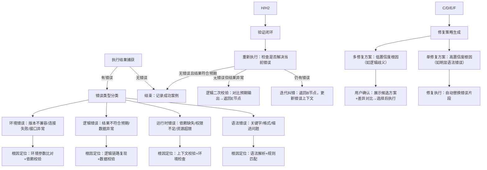

# https://www.doubao.com/chat/29958591962981122
在AI领域（尤其是代码生成、数据查询类AI，如SQL/Python辅助工具）设计**执行错误反思纠错分支**，核心是围绕「错误识别→根因定位→修复策略→验证闭环」构建模块化流程，同时针对SQL和Python的语法、运行时、逻辑差异做差异化分支设计。以下是具体的设计框架，分为「通用核心分支」和「SQL/Python专属分支」两部分：


### 一、通用核心分支（跨语言/场景的基础流程）
无论SQL还是Python，纠错的底层逻辑是一致的，需先搭建「从错误捕获到验证的闭环」，核心分支包括5个关键节点，每个节点带明确的判断分支和输出：



#### 关键分支说明：
1. **执行结果捕获分支**：
   - 主动捕获：通过执行器（如Python的`exec`/`subprocess`、SQL的`cursor.execute()`）捕获异常信息（如Python的`SyntaxError`、SQL的`MySQLSyntaxError`）；
   - 被动反馈：用户手动标记「结果错误」（如SQL查询返回空、Python输出与预期不符）。

2. **错误类型分类分支**：
   - 核心是「结构化错误解析」：将原始异常信息（如堆栈日志、数据库报错）拆分为「错误码+错误描述+出错位置」（如SQL错误`1064`对应语法错误，Python`IndexError`对应索引越界）；
   - 避免模糊分类：比如将「SQL表不存在」归为「运行时错误」而非「语法错误」，确保根因定位不跑偏。

3. **根因定位分支**：
   - 高置信度定位：依赖「错误-根因映射库」（如Python`IndentationError`→缩进不一致，SQL`1146`→表不存在）；
   - 低置信度定位：结合上下文（如用户需求、输入数据），比如Python循环未终止→可能是循环条件错误，或数据量超出预期。

4. **修复策略分支**：
   - 自动修复：仅用于「明确且无歧义的错误」（如SQL少写分号、Python少写冒号）；
   - 人工确认：用于「可能影响逻辑的修复」（如SQL字段名拼写修正——需确认是否为目标字段，Python变量名修改——需确认作用域）。

5. **验证闭环分支**：
   - 语法验证：无需执行，直接通过语法解析器校验（如`ast`模块检查Python语法）；
   - 运行验证：必须执行（如SQL查询小批量数据、Python跑测试用例）；
   - 结果验证：对比「用户预期输出」和「实际输出」（如用户要「Top10数据」，需检查结果条数是否为10）。


### 二、SQL专属纠错分支（针对SQL的特性设计）
SQL的错误场景集中在「语法格式」「数据对象（表/字段）」「查询逻辑」「权限/连接」，需在通用分支基础上增加差异化判断：

#### 1. SQL错误类型细分分支
```
B[错误类型分类] --> B11[SQL语法错误：关键字拼写（SELECT→SELEC）、括号不匹配、分号缺失、JOIN语法错误]
B --> B12[SQL对象错误：表不存在（FROM user→user表未创建）、字段不存在（SELECT name→表无name字段）、别名冲突（AS id→重复别名）]
B --> B13[SQL逻辑错误：WHERE条件错误（=→≠）、GROUP BY/HAVING不兼容（HAVING无GROUP BY）、聚合函数使用错误（SUM非数值字段）、 LIMIT参数错误（LIMIT -1）]
B --> B14[SQL运行时错误：权限不足（无查询权限）、连接超时、数据类型不匹配（WHERE id='abc'→id是int）、锁冲突]
```

#### 2. SQL根因定位专属分支
- 语法错误：结合「SQL方言（MySQL/PostgreSQL/Oracle）」规则库，比如Oracle要求`FROM DUAL`，MySQL不需要；
- 对象错误：对接数据库元数据（`INFORMATION_SCHEMA`），校验「表/字段是否存在」「字段类型是否匹配」（如用户写`SELECT age FROM student WHERE age='20'`，元数据显示`age`是int→根因为类型不匹配）；
- 逻辑错误：复现查询链路（如`JOIN`条件缺失→导致笛卡尔积，需检查`ON`子句；`GROUP BY`字段未包含非聚合字段→不符合SQL模式）。

#### 3. SQL修复策略专属分支
- 语法错误：自动修复（如补充分号、修正关键字拼写、补全`JOIN ON`条件）；
- 对象错误：提供「候选字段/表名」（如字段`name`不存在→查询元数据返回相似字段`username`，询问用户是否替换）；
- 逻辑错误：优化查询逻辑（如`LIMIT 100`→用户要Top10→改为`LIMIT 10`；`WHERE date='2025-11-19'`→无数据→提示是否调整日期格式或范围）；
- 运行时错误：提示环境配置（如权限不足→建议联系管理员；连接超时→检查数据库地址/端口）。

#### 示例：SQL纠错流程实例
用户输入SQL：`SELECT name, age FROM user WHERE age > 30 GROUP BY name`  
- 执行错误：MySQL报错`1055`（GROUP BY模式不允许非聚合字段未在GROUP BY中）；
- 根因定位：逻辑错误→HAVING与GROUP BY不兼容（age未在GROUP BY且非聚合字段）；
- 修复方案：
  1. 方案1：将age加入GROUP BY→`SELECT name, age FROM user WHERE age > 30 GROUP BY name, age`；
  2. 方案2：对age使用聚合函数→`SELECT name, MAX(age) FROM user WHERE age > 30 GROUP BY name`；
- 验证：用户选择方案2→重新执行→检查是否返回每个name的最大age→符合预期则结束。


### 三、Python专属纠错分支（针对Python的特性设计）
Python的错误场景集中在「语法缩进」「变量/函数引用」「数据类型」「依赖/版本」「逻辑逻辑（循环/条件）」，需突出「堆栈信息解析」和「运行时上下文校验」：

#### 1. Python错误类型细分分支
```
B[错误类型分类] --> B21[Python语法错误：缩进不一致、冒号缺失（if/for后无冒号）、括号不匹配、关键字拼写（def→deff）]
B --> B22[Python名称错误：变量未定义（print(x)→x未赋值）、函数未定义（func()→func未声明）、模块未导入（numpy.array→未import numpy）]
B --> B23[Python类型错误：字符串+数字（'a'+1）、列表索引为字符串（list['0']）、函数参数类型不匹配（def add(a:int)->int: return a+1→add('2')）]
B --> B24[Python逻辑错误：循环条件永真（while True: pass）、数组越界（list[10]→list长度为5）、除以零（1/0）、返回值缺失（def func(): pass→print(func())→None）]
B --> B25[Python环境错误：模块未安装（ImportError: No module named 'pandas'）、Python版本不兼容（f-string在Python2中报错）、依赖版本冲突]
```

#### 2. Python根因定位专属分支
- 语法错误：通过`ast`模块解析代码，定位缩进错误行、冒号缺失位置（如`if x>0`→无冒号→`ast.parse()`抛出`SyntaxError`，获取出错行号）；
- 名称错误：解析代码的变量作用域（如局部变量在全局引用、导入模块名拼写错误），结合「已导入模块列表」「已定义变量列表」校验；
- 类型错误：通过类型注解（如`typing`模块）或运行时类型检测（如`type(x)`），定位类型不匹配的变量/函数参数；
- 逻辑错误：解析堆栈信息（如`IndexError: list index out of range`→获取出错行的列表长度和索引值，判断是否越界），结合代码逻辑链路（如循环次数、条件判断结果）；
- 环境错误：检查`sys.path`（模块是否在路径中）、`pip list`（模块是否安装）、`sys.version`（Python版本是否符合要求）。

#### 3. Python修复策略专属分支
- 语法错误：自动修复（如补全冒号、统一缩进为4空格、修正关键字拼写）；
- 名称错误：提示「变量未定义→是否遗漏赋值」「模块未导入→是否需要添加import语句」（如`pd.DataFrame()`→提示`import pandas as pd`）；
- 类型错误：自动转换类型（如`'a'+str(1)`→修正为`'a'+str(1)`）、修正索引类型（`list['0']`→`list[0]`）；
- 逻辑错误：提示边界条件（如数组越界→建议先判断`len(list) > index`）、修正循环条件（如`while True`→建议添加退出条件`while x<10`）；
- 环境错误：生成环境配置命令（如`pip install pandas`、提示「f-string需Python3.6+→建议升级版本」）。

#### 示例：Python纠错流程实例
用户输入Python代码：
```python
def calculate_sum(numbers):
    total = 0
    for i in numbers
        total += i
    return total

print(calculate_sum([1,2,3]))
```
- 执行错误：`SyntaxError: invalid syntax`（for行无冒号）；
- 根因定位：语法错误→for循环后缺失冒号，行号为3；
- 修复方案：自动在`for i in numbers`后添加冒号→`for i in numbers:`；
- 验证：重新执行→输出6→符合预期→结束。


### 四、设计关键注意事项
1. **差异化适配**：SQL侧重「数据库元数据校验」「方言兼容性」，Python侧重「堆栈解析」「环境依赖校验」，避免一套逻辑套用；
2. **置信度控制**：高置信度错误（如明显语法错误）自动修复，低置信度错误（如逻辑歧义）必须用户确认，避免越修越错；
3. **上下文记忆**：迭代纠错时，记录上一轮的错误和修复动作，避免重复踩坑（如Python第一次修复缩进，第二次不再重复修改同一行）；
4. **用户交互分支**：提供「拒绝修复」「自定义修复」选项，允许用户干预（如AI建议的字段替换不是用户想要的，用户可手动输入正确字段）；
5. **日志与迭代**：记录所有错误案例、修复方案、用户反馈，持续优化「错误-根因-修复」映射库（如新增罕见SQL方言错误、Python第三方库专属错误）。


### 总结
纠错分支设计的核心是「先通用闭环，再专属适配」：通用分支解决「流程一致性」（捕获→分类→定位→修复→验证），SQL/Python专属分支解决「场景差异化」（针对各自的错误特性、语法规则、运行环境设计细分判断和修复逻辑）。最终目标是让AI不仅能「生成代码/查询」，还能像人类开发者一样「排查问题、迭代优化」，形成完整的能力闭环。


# pickle 
[pickle 错误过滤 globals](https://www.doubao.com/chat/31477795519235330)