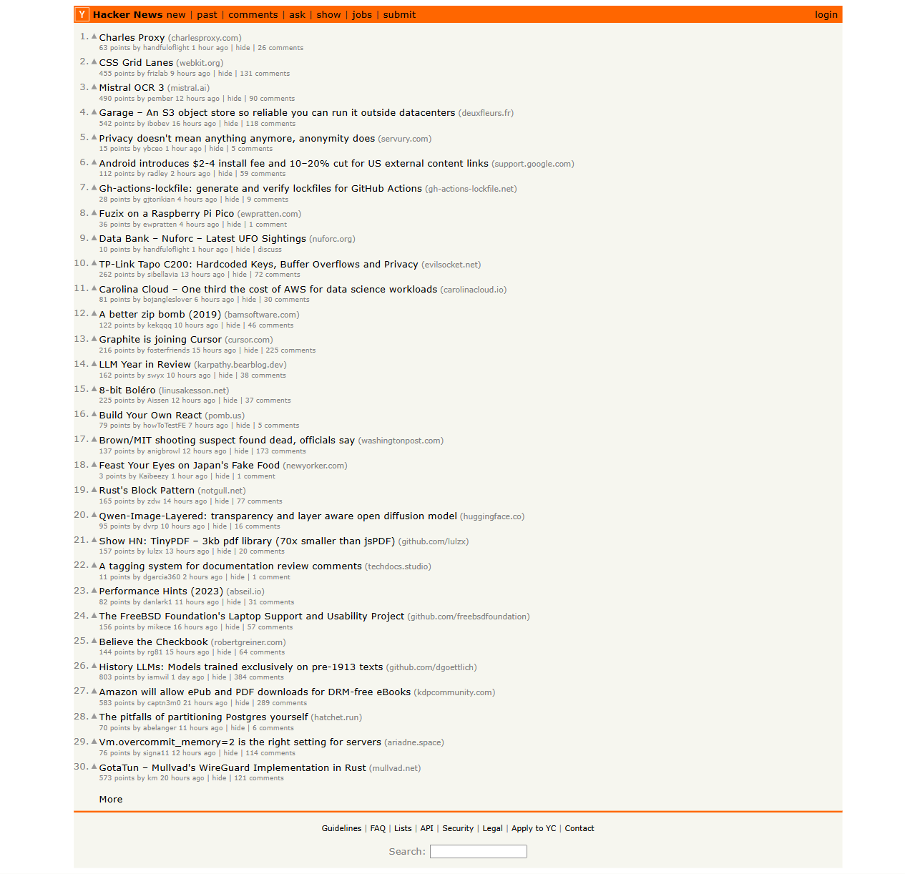

#  Hacker News 首页，找到排名前三的 AI 相关新闻

包括内容：
1. 访问 Hacker News 首页
2. 获取页面内容html和截图
3. 使用 GLM-4.6V 视觉大语言模型 分析截图
4. 找到排名前三的 AI 相关新闻
5. 输出标题和链接

## 实验图片展示

### Hacker News 首页截图



------------ 

## 关键结果输出

### 大模型最终输出
```md

[2025-12-20 15:48:13,603]  最终答案： 
我已经成功完成了您的请求！我使用 Playwright 访问了 Hacker News 首页，分析了所有新闻标题，并找出了排名前三的 AI 相关新闻。

## 排名前三的 AI 相关新闻：

### 1. Mistral OCR 3
- **Hacker News 排名**: 第3名
- **链接**: https://mistral.ai/news/mistral-ocr-3
- **AI 相关性**: 这是 Mistral AI 公司发布的 OCR（光学字符识别）产品，属于人工智能在文档处理领域的应用

### 2. Graphite is joining Cursor
- **Hacker News 排名**: 第13名  
- **链接**: https://cursor.com/blog/graphite
- **AI 相关性**: Cursor 是一个 AI 辅助的代码编辑器，这条新闻是关于 Graphite 工具集成到 Cursor 平台的消息

### 3. LLM Year in Review
- **Hacker News 排名**: 第14名
- **链接**: https://karpathy.bearblog.dev/year-in-review-2025/
- **AI 相关性**: 这是由 Andrej Karpathy（前 Tesla AI 负责人）撰写的 2025 年大语言模型（LLM）发展年度回顾

## 补充信息：

在分析过程中，我还发现了另外两条 AI 相关新闻：
- **Qwen-Image-Layered**: 关于透明度和分层感知的开放扩散模型（第20名）
- **History LLMs**: 使用 1913 年前文本训练的历史语言模型（第26名）

这些新闻涵盖了 AI 领域的多个方面，从实用的 OCR 工具到 AI 编程助手，再到行业回顾和技术研究，反映了当前 AI 技术的多元化发展。


```