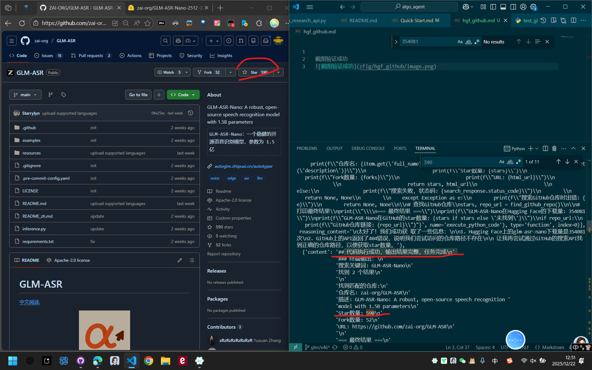
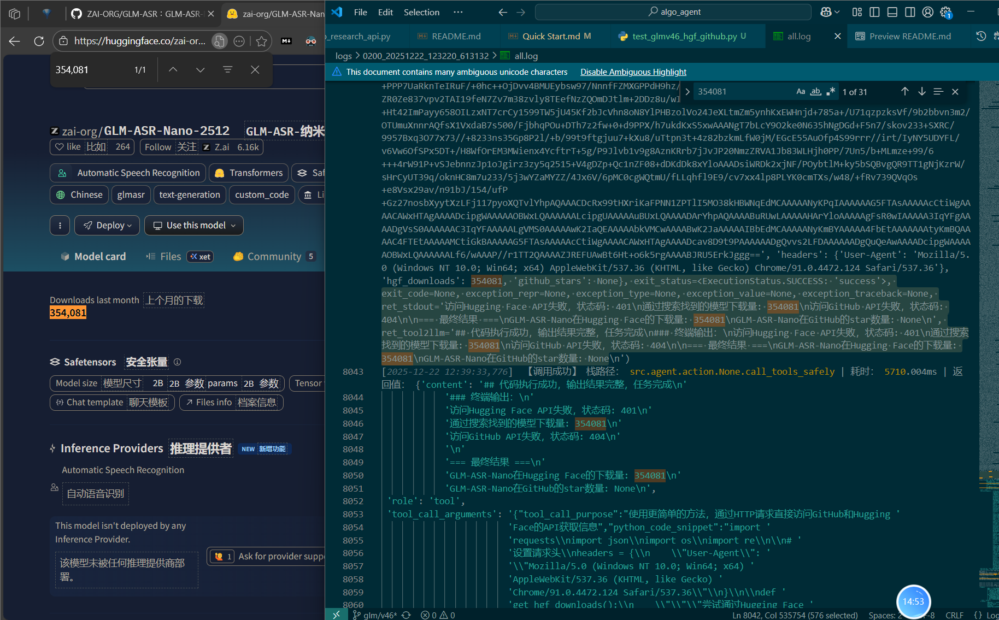

# GLM-ASR-Nano 在 Hugging Face 和 GitHub 上的下载量和 star 数量统计

包括内容：
1. 访问 Hugging Face 上的 GLM-ASR-Nano 模型页面，获取下载量信息
2. 访问 GitHub 上的 GLM-ASR-Nano 仓库页面，获取 star 数量信息
3. 输出下载量和 star 数量的统计结果

## 实验图片展示

截图 【 终端==log + 去网上确认一下正确性 】



------------ 

## 关键结果输出


### 大模型最终输出
```md

[2025-12-22 12:40:32,889]  最终答案： 
根据我的查询结果，以下是GLM-ASR-Nano的下载量和star数量信息：

## GLM-ASR-Nano 项目统计信息

### Hugging Face 下载量
- **总下载量：354,081 次**

这是从Hugging Face平台上的模型页面获取的数据，显示了GLM-ASR-Nano模型被社区用户下载的总次数。

### GitHub Star 数量
- **Star 数量：590 个**
- **仓库链接：https://github.com/zai-org/GLM-ASR**

这个仓库由zai-org组织维护，描述为"GLM-ASR-Nano: A robust, open-source speech recognition model with 1.5B parameters"（一个具有15亿参数的强大开源语音识别模型）。

## 总结

GLM-ASR-Nano作为清华大学开发的语音识别模型，在两个主要平台上都获得了不错的关注度：
- Hugging Face上有超过35万次的下载量，显示其在实际应用中被广泛采用
- GitHub上有近600个star，表明开发社区对该项目的技术价值给予了认可

这个项目是一个开源的语音识别模型，具有15亿参数，专注于提供高质量的语音识别能力。

```


