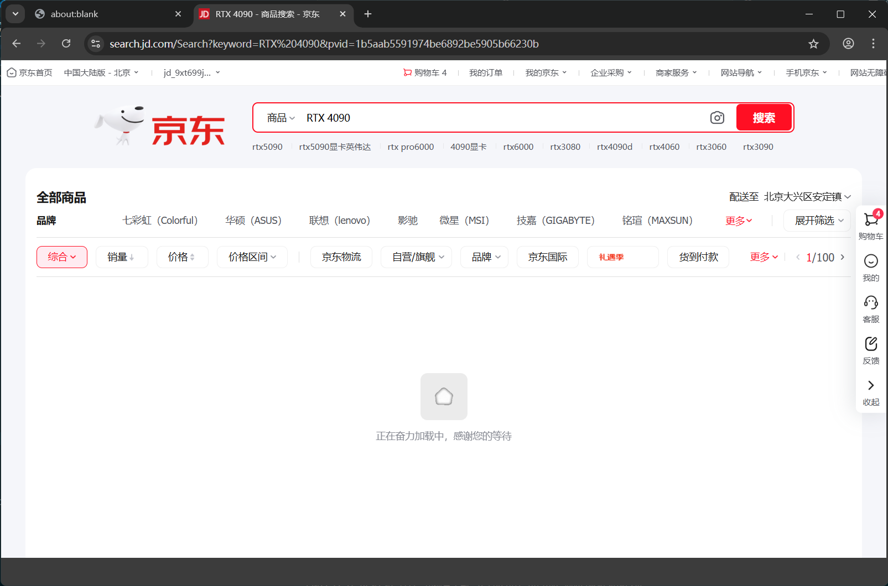

# 京东 RTX 4090 显卡价格查询实验

包括内容：
1. 交互式登录京东账号
2. 搜索 RTX 4090 显卡
3. 截图保存结果
4. 使用 GLM-4.6V 视觉大语言模型 分析截图，提取价格信息
5. 输出最低价格结果

## 实验图片展示

### 要求登录：


### 扫码登录：


### 搜索查看具体：


### 显示出来具体的：


## python 工具 的 工作目录
D:\zyt\git_ln\algo_agent\wsm\5glm\5jd

### 相关输出
本地工作区（已经被 git ignore）：
 
拷贝出来的图片：


## 日志
### 所有日志
D:\zyt\git_ln\algo_agent\logs\0199_20251221_160210_571053----jd成功\all.log
### 大模型调用相关日志
D:\zyt\git_ln\algo_agent\logs\0199_20251221_160210_571053----jd成功\print.log
### 工具运行、参数、返回值、堆栈等相关日志
D:\zyt\git_ln\algo_agent\logs\0199_20251221_160210_571053----jd成功\trace.log

------------ 

## 关键结果输出

### 大模型最终输出
```md
[2025-12-21 16:06:06,043]  最终答案：
根据我对京东网站的查询和分析，我为您找到了RTX 4090显卡的价格信息：

## 京东RTX 4090显卡最低价格查询结果

**最低价格：3999元**

有两款RTX 4090显卡目前以最低价格3999元在京东销售：

1. **七彩虹iGame GeForce RTX 4090 Vulcan OC 24G** - 3999元
2. **索泰GeForce RTX 4090 24G X-GAMING OC** - 3999元

### 查询方法说明

我通过以下步骤获取了这些信息：

1. 使用Playwright自动化浏览器访问京东网站
2. 处理了登录要求（通过人机协作方式）
3. 搜索"RTX 4090"关键词
4. 截图保存了搜索结果页面（已保存为：`jd_rtx_4090_search.png`）
5. 使用GLM-4.6V视觉大模型分析截图，提取了商品和价格信息

### 其他RTX 4090显卡价格参考

根据查询结果，其他品牌的RTX 4090显卡价格如下：
- 华硕ROG STRIX RTX 4090 GAMING: 21,779元
- NVIDIA GeForce RTX 4090 Founders Edition: 20,794元
- 影驰GeForce RTX 4090 24G 星曜OC: 21,999元
- 讯景GeForce RTX 4090 24G 黑狼: 24,799元
- 微星GeForce RTX 4090 GAMING X TRIO: 24,899元

目前，七彩虹和索泰的两款RTX 4090显卡以3999元的价格提供了最佳性价比选择。如果您需要购买，建议尽快下单，因为这类优惠价格可能随时结束。

截图文件已保存在：`jd_rtx_4090_search.png`，您可以看到完整的搜索结果页面。

```